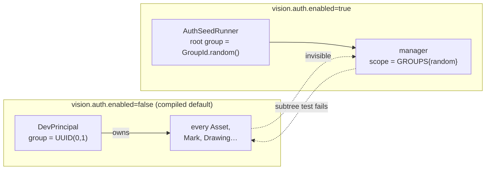
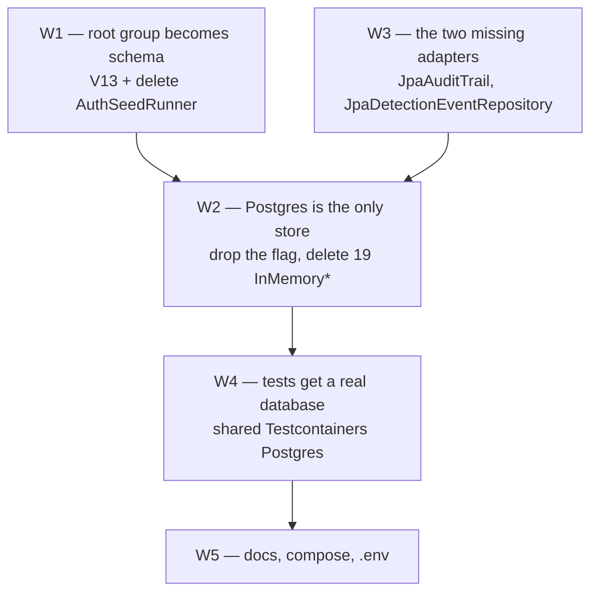

# POSTGRES-ONLY — context

Branch `fix/postgres-only-auth`. Written before any code, per CLAUDE.md ("create a file with a
context, then start working on it"). Every claim below is grounded in a file read on
2026-08-17 at master `b435838`; where a claim is inferred rather than measured, it says so.

## 1. The ask

> "let's fix the bug with authentication: Instead of in-memory databases — use postgres with
> flyway migrations. Get rid of in-memory part, and code-based database insertations."

Three things, and they are one thing: the authentication bug **is** a symptom of the in-memory
store and of code-based seeding.

## 2. What is actually broken

### 2.1 The identity seed invents a new org chart on every boot

`AuthSeedRunner` (`station/vision-app/.../bootstrap/AuthSeedRunner.java`) creates the root group
via `GroupService.create`, which mints `GroupId.random()`
(`contexts/vision-identity/.../DefaultGroupService.java:48`). Nothing pins that id.

`DevPrincipal` (`station/vision-app/.../devsupport/DevPrincipal.java`) — the principal every
request runs as while `vision.auth.enabled=false`, which is the compiled default — owns every
asset it creates with a **fixed** group, `UUID(0, 1)`.

Those two ids are never the same value.

So the moment an operator flips auth on, a MANAGER's `VisibilityScope.GROUPS` covers a subtree
that contains **none** of the assets created while auth was off. An ADMIN still sees everything
(their scope is UNBOUNDED and short-circuits the test), which is exactly why this survived: the
account most people test with is the one account the bug cannot affect.

*Confidence: **measured, not inferred.** Both constants were read. `VisibilityScope.includes`
(`core/vision-platform`) resolves a `GROUPS` scope as `groups.contains(ownership.groupId())` — a
plain set-membership test on the asset's owning group id, with no fallback — and
`DefaultScopeResolver:63` builds that set as the subtree of the user's MANAGER memberships, which
`UUID(0,1)` is never a member of. `DefaultScopeResolver:55` returns `unbounded()` for ADMIN,
confirming why the account most people test with cannot see the bug. What remains unobserved is
only the end-to-end run; W1's exit criterion closes that.*

### 2.2 Users do not survive a restart

`vision.persistence.enabled` defaults to **`false`**
(`VisionPersistenceProperties`, `station/vision-app/src/main/resources/application.yaml`).
`PersistenceWiringConfiguration` therefore wires `UserRepositoryPort`/`GroupRepositoryPort` to
`InMemoryUserRepository`/`InMemoryGroupRepository` unless an operator opts in.

A plain `java -jar` run with `vision.auth.enabled=true` — the documented way to turn auth on
outside Compose — stores its accounts in a `ConcurrentHashMap`. Every restart drops them, reseeds
three dev accounts, and mints **a new root group id**, so §2.1 recurs on every boot and any group
an operator created by hand is gone.

Only `docker-compose.yml` escapes this, by setting `VISION_PERSISTENCE_ENABLED=true` next to
`VISION_AUTH_ENABLED=true`. Two independent flags that must be set together for identity to work
at all, with nothing enforcing the pairing.

### 2.3 The audit trail is not an audit trail

`AuditTrailPort` is wired **unconditionally** to `InMemoryAuditTrail`
(`ApplicationServiceWiring:238`) — there is no Postgres option, on or off. The class says so
itself: an audit trail that evaporates on restart is not one.

This is the security-relevant half of the request. Authority checks landed on master yesterday
(`VisibilityScope#canManage`/`canAdminister`, `b435838`); the record of who exercised that
authority is in RAM.

### 2.4 Two ports have no Postgres implementation at all

17 `Jpa*` repositories exist against 19 `InMemory*` classes. The two without a counterpart:

| Port | In-memory impl | Postgres impl |
|---|---|---|
| `AuditTrailPort` | `InMemoryAuditTrail` | **none** |
| `DetectionEventRepositoryPort` | `InMemoryDetectionEventRepository` (500/stream ring) | **none** |

"Get rid of the in-memory part" therefore is not a deletion — it requires writing two adapters
and two migrations first. This is the one place where the ask costs genuinely new code.

### 2.5 Code-based insertion, inventoried

| # | Where | Inserts | Migration that already duplicates it |
|---|---|---|---|
| 1 | `AuthSeedRunner` (ApplicationRunner) | root group + admin/manager/pilot | none — this is the bug |
| 2 | `mapLayerBootstrapRunner` (`ApplicationServiceWiring:381`) | the COP layer | `V12__map_layers.sql` |
| 3 | `InMemoryCategoryRepository` constructor | 7 device categories | `V2__seed_categories.sql` |

#2 and #3 are *duplicated* logic — the same rows, written twice, in two languages, kept in step
by hand. #3 dies with the class. #2 is a live divergence risk today.

## 3. What is already right — do not rebuild it

- Flyway is wired and working: `V1`–`V12`, run by `PersistenceUnit.start` when the
  `EntityManagerFactory` is built. Adding `V13`+ is routine.
- `V2__seed_categories.sql` is the **precedent** for seeding as a migration, and its header
  already frames itself as the mirror of the in-memory constructor. This plan finishes what that
  file started.
- `storage/persistence` has Testcontainers-Postgres on the test classpath and one integration
  test (`PostgresDockerIntegrationTest`) that round-trips every port. The pattern for W4 exists.
- Compose already stands Postgres up with a healthcheck and `depends_on: service_healthy`.

## 4. Constraints inherited

- **C1** — Dependency rule (ArchUnit): `InMemory*` lives in `vision-app`, `Jpa*` in
  `storage/persistence`. Moving wiring is app-layer work; new adapters are adapter-layer work.
- **C2** — Schema convention (`V8` header, `storage/persistence/MODULE.md`): **no cross-entity
  foreign keys**, because the in-memory repos perform no referential checks and parity is the
  contract they are judged against. Removing the in-memory side removes that reason. Adding FKs
  is now *possible* — but it is a separate change with its own blast radius, and this plan does
  not take it. Flagged as an open question, not silently skipped.
- **C3** — Jackson 3 (`tools.jackson.*`); memberships/polygons/detections ride as `jsonb`.
- **C4** — CLAUDE.md rule 1: no hardcoded values that could vary. Dev credentials are
  configuration, not schema — hence the two-location Flyway split in §5.
- **C5** — 34 `@SpringBootTest` classes live in `vision-app` and every one of them currently
  boots with zero infrastructure. This is the real cost of the ask; see §5 W4.
- **C6** — CI (`.github/workflows/ci.yml`) runs plain `./mvnw -B verify` on `ubuntu-latest`,
  which **does** have a Docker daemon. Existing docker-dependent tests skip when absent; the same
  posture must hold for vision-app after W4 or a laptop without Docker can no longer run tests.

## 5. Shape of the fix

Waves, in dependency order. Each is independently buildable and independently revertable.

**W1 — the auth fix, standalone.** `V13__identity_baseline.sql` seeds the root group at the
**fixed** id `00000000-0000-0000-0000-000000000001` — the same value `DevPrincipal.GROUP_ID`
already uses — so the group a dev-mode asset is owned by is the group a manager is scoped to.
Dev accounts move to a **second Flyway location** (`db/seed/dev`), applied only when
`vision.persistence.seed-dev-users=true` (default false; Compose sets it true). That keeps
username-equals-password accounts out of any database that did not ask for them, which the
current unconditional `ApplicationRunner` cannot do. `AuthSeedRunner` and its bean are deleted.
`admin` takes `DevPrincipal.USER_ID` (`UUID(0,0)`) for the same continuity reason.

**W2 — remove the choice.** `vision.persistence.enabled` disappears rather than flipping to
true: a flag with one legal value is a lie. `PersistenceWiringConfiguration` collapses to
straight-line JPA wiring, 19 `InMemory*` classes and their unit tests are deleted, and
`mapLayerBootstrapRunner` goes with them (`V12` already seeds it).

**W3 — before deletion is possible.** `JpaAuditTrail` + `V14__audit_trail.sql`;
`JpaDetectionEventRepository` + `V15__detection_events.sql`. Both round-tripped in
`PostgresDockerIntegrationTest` like every other port. Ordering note: W3 gates W2, because §2.4's
two ports cannot be deleted before their replacements exist.

**W4 — the expensive wave.** One shared Testcontainers Postgres per JVM for `vision-app`'s 34
`@SpringBootTest` classes, migrated once and truncated between classes. Consequence stated
plainly: **vision-app's test suite will require Docker.** Per C6 it must skip cleanly without it,
never fail with a connection error.

**W5** — MODULE.md for `vision-app` and `storage/persistence`, `application.yaml`,
`docker-compose.yml`, `.env.example`, README.

## 6. Open questions

- **OQ1** — Foreign keys (C2). With the in-memory parity contract gone, the schema *can* enforce
  referential integrity. Worth a follow-up plan, or leave the schema as-is? *Gates nothing here.*
- **OQ2** — `DetectionEventRepositoryPort` is a live hot path (detection events update at frame
  rate, then close). W3 gives it a Postgres table; whether it should also keep a bounded
  write-behind cache is a **throughput** decision, not a persistence one. Recommendation:
  land the plain adapter first, measure, cache only if measurement demands it. *Gates nothing;
  named so it is not silently decided.*
- **OQ3** — `vision.auth.enabled` still defaults to false, so `DevPrincipalResolver` survives
  this plan. Should auth-on become the default too? Out of scope as asked, but it is the natural
  next step once identity is durable. *Operator's call.*

---

## 7. Progress log

### W1 — done, verified

`V13__identity_baseline.sql` pins the root group at `00000000-0000-0000-0000-000000000001`.
Dev accounts moved to `db/seed/dev/V90001__dev_accounts.sql`, applied only when
`vision.persistence.seed-dev-users=true` (new property, default false; Compose sets it true).
`AuthSeedRunner` and its test deleted. `PersistenceUnit.start` gained a 4-arg overload.

Two mechanism findings worth keeping, both measured rather than reasoned:

- The seed lives in a **separate Flyway location** at version **90001** — a reserved high band. A
  "next free slot" scheme (`V13.1`) was tried and failed: by the time an operator flips the flag on,
  `db/migration` has moved to `V14`/`V15`, so applying a *lower*-versioned migration than the highest
  already applied is refused unless `outOfOrder=true` — a global setting that would also let a
  genuinely misordered change slip through.
- Flyway's ignore pattern that actually fires when the location is later removed is `"*:future"`,
  **not** `"*:missing"`, because an orphaned migration at-or-above the highest resolvable version is
  classified `FUTURE_SUCCESS`. And calling `ignoreMigrationPatterns(...)` at all silently drops
  Flyway's own built-in `"*:future"` default, so both must be passed together.

### W1b — the upgrade path, done, verified

W1 was correct for a **fresh** database and broken for an upgraded one. Both defects found by
review, not by the test suite, and both reproduced against a real Postgres before being fixed.

**Defect 1 — startup-breaking.** `V90001` guarded with `ON CONFLICT (id) DO NOTHING`, but
`users.username` carries its own `UNIQUE` constraint and Postgres does not skip a conflict on an
index the statement never named. Every Compose deployment already holds `AuthSeedRunner`'s
`admin`/`manager`/`pilot` at random ids, and W1 had set `VISION_PERSISTENCE_SEED_DEV_USERS=true`,
so the next `docker compose up` would have failed the migration and **the app would not have
booted** — strictly worse than the bug being fixed. Now three `INSERT … SELECT … WHERE NOT EXISTS`
statements guarding on id **or** username. Re-verified: exit 0, and the operator's legacy password
hash survives untouched rather than being replaced by the dev one.

**Defect 2 — the fix didn't reach existing installs.** V13 adds the fixed group *alongside* the old
random root, both parentless, so a pre-existing MANAGER's membership still pointed at the old root
and their subtree still excluded `UUID(0,1)`. `V16__adopt_fixed_root.sql` adopts the fixed group as
a **child** of the pre-existing root when there is exactly one, renaming it `Dev-Mode Assets`.
Direction is load-bearing and not interchangeable: reparenting the old root *under* the fixed group
would leave the manager's scope walk starting from a node that still cannot reach it. No-op on 0
(fresh) or 2+ (ambiguous) other parentless groups. Non-destructive — one row's `parent_id`/`name`,
nothing else, nothing deleted.

`UpgradePathMigrationTest` proves the end-to-end claim with the **real** `DefaultScopeResolver` over
`JpaGroupRepository` — not a hand-simulated subtree walk — asserting a legacy manager now sees an
asset owned by `DevPrincipal`'s group.

### W3 — done, verified

`JpaAuditTrail` + `V14__audit_trail.sql`; `JpaDetectionEventRepository` + `V15__detection_events.sql`.
Detection events upsert by id (an event mutates over its open lifetime) and follow
`JpaDetectionRepository`'s existing prune-on-write retention rather than inventing a third
mechanism; the audit trail has **no** retention cap, deliberately. Neither is wired into `vision-app`
yet — that is the deletion wave's job.

Measured: `storage/persistence` **137/137**, `vision-app` **238/238**, Docker running, nothing
skipped. Both re-run independently rather than taken from an agent's report.

### W2b — done, verified

Wired `JpaAuditTrail`/`JpaDetectionEventRepository` (built, unwired since W3) into
`ApplicationServiceWiring#auditTrailPort`/`#detectionEventRepositoryPort`, preserving the
`LiveUpdateAuditTrail`/`LiveUpdateDetectionEventRepository` decorator wrapping exactly. Removed
`vision.persistence.enabled` entirely: `VisionPersistenceProperties` drops `enabled`;
`PersistenceWiringConfiguration` collapsed to straight-line JPA wiring (no `@ConditionalOnProperty`,
no `ObjectProvider`, no if/else) over all seventeen repository ports. Deleted the 19 now-dead
`InMemory*` classes (`devsupport/`) and their 10 dedicated test files — kept `DevPrincipal`/
`LoggingEventPublisher`/`NoopDetectionPort`/`NoopLiveUpdatePublisher`/`NoopReplayFrameExtractor`/
`NoopStreamPublisher` (no-op fallbacks for genuinely optional features, not persistence). Deleted
`mapLayerBootstrapRunner` after verifying its creation path is field-for-field identical to
`V12__map_layers.sql`'s seed row (id, name, kind, ownership, empty grants) and structurally
unreachable now that Postgres is unconditional — `V12` always runs before any `ApplicationRunner`.

This task's brief also folded in what this log's own "Remaining" section had called **W5**:
`application.yaml`, `docker-compose.yml` (env var + header comments), `.env.example` (already clean,
no change needed), README (already clean, no change needed), `CLAUDE.md`'s module-index row, and the
authoritative sections of `storage/persistence/MODULE.md`/`station/vision-app/MODULE.md` (dated
historical wave narrative in both left untouched, per this repo's MODULE.md convention).

Measured: `storage/persistence` **137/137** (unchanged — no source touched there this wave),
`vision-app` **190/190** (down from 238, reconciled exactly: −45 deleted `InMemory*Test` methods, −1
`PersistenceWiringConfigurationTest`'s now-moot disabled-branch test, −2
`SimulationResumeWiringConfigurationTest` combinations that no longer exist to cross). Docker running
throughout, nothing skipped, both counts re-run directly rather than taken on faith.

### Remaining

None — W1, W1b, W3, W2a, W2b (incorporating the former W5) are all done and verified. This plan's
own ask (§1) is fully delivered: Postgres is the only store, the identity seed is idempotent and
durable, the audit trail and detection-event history survive a restart, and no `InMemory*` reference
implementation remains to drift out of parity with it.
