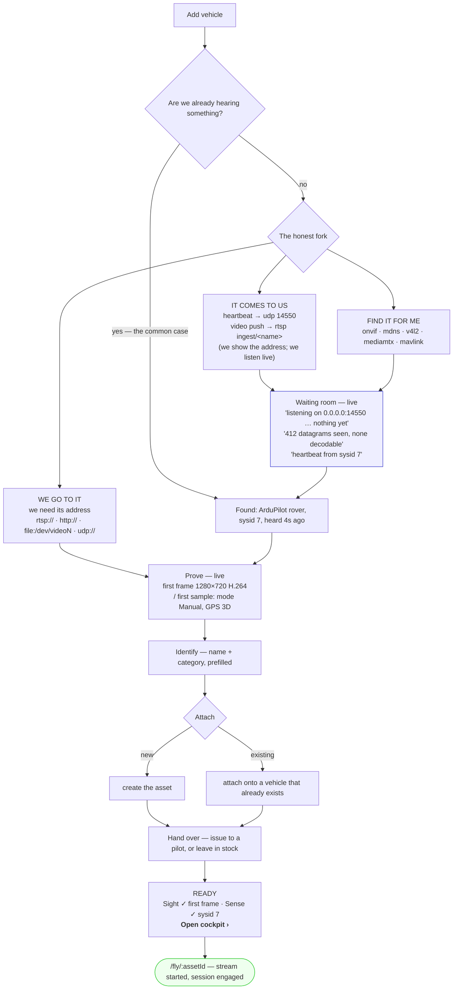

# SOURCE-ONBOARDING-2 — one door for "I have a thing, make it work here"

Status: **BUILT 2026-09-05** on branch `feat/source-onboarding-2` — backend waves A1–A3/B1/B2/C1 and
web waves W1–W6 all landed (§6 Close-out); not yet merged to master, not yet committed on the web
side (every web wave was instructed not to `git commit` — the diff sits in the working tree pending
review). Owner mandate 2026-09-04: *"think the WHOLE FLOW from the user's perspective before any
implementation."*

Same doctrine as [`FLY-FLOW-PLAN.md`](FLY-FLOW-PLAN.md) and
[`COMMAND-MAP-FLOW-PLAN.md`](COMMAND-MAP-FLOW-PLAN.md) — low effort, low overwhelm, controls at the
moment of intent, **never a fabricated state and never a dead-looking control** — applied to the one
surface those two plans assume has already happened: getting a machine into the system at all.

This plan **supersedes the open waves S2–S5 of**
[`SOURCE-ONBOARDING-CONTEXT.md`](SOURCE-ONBOARDING-CONTEXT.md) (three of the four have since shipped
under other plans' names; §2.1 gives the row-by-row verdict) and **composes with**
[`ZERO-CONFIG-ONBOARDING-CONTEXT.md`](ZERO-CONFIG-ONBOARDING-CONTEXT.md)'s merged Z1–Z5, whose lobby
and inbox are the machinery this flow finally puts in front of a person. It does not redo the lobby,
the inbox, the mediamtx push registry, the ONVIF media chain or the Improv provisioning page.

**Grounding**: a read-only sweep on 2026-09-04 over `station/vision-web/src/app/features/{onboarding,
provisioning,inventory,devices}`, `station/vision-api`'s controller/dto/live packages, `contexts/
vision-warehouse`'s discovery + asset packages, `contexts/vision-perception`'s probe/stream packages,
every adapter's `MODULE.md` plus its sources, and the root `application.yaml`. Every claim below
carries a file:line. Nothing here has been run.

---

## 0. The flow

### 0.1 The person

**Marta has a thing and no idea what we are.** She owns either an ArduPilot quad with an ESP32
telemetry bridge, or a €50 IP camera, or a rover, or a Betaflight FPV drone she was given. She is
standing in a field or a workshop, on a laptop, on a LAN, **with no internet**. She knows the thing
has a power switch. She does not know what MAVLink is, what sysid 1 means, what `rtsp_transport=tcp`
does, or that this platform has a UDP port.

Her whole job is one sentence: **make my thing appear here, and prove it works, and then let me use
it.** Everything between "Add" and a moving picture is friction she did not ask for.

### 0.2 The journey, end to end



Three properties of that picture are the whole plan:

1. **The first question is never a form.** The lobby has been bound to `:14550` since boot and the
   inbox sweeps every 30 s (`DiscoveryInboxRunner.java:83-89`, `application.yaml:565-582`), so for a
   vehicle that transmits, *the answer already exists before Marta clicks anything*. The door opens
   onto what we already hear; the manual ladder is the fallback, not the front.
2. **There are exactly two ways and a set of finders.** A thing either comes to us or we go to it.
   Everything else — ONVIF, mDNS, V4L2, mediamtx paths, MAVLink heartbeats — is an *address finder*
   that turns "we go to it" into "pick one". That was true in the prior spec and it is still true;
   the UI has just never said it out loud.
3. **The flow ends at a moving picture, not at a settings page.** Today it ends at
   `/assets/:id/readiness` (`onboarding-store.ts:926-929`) and Marta must then find `/fly`, pick the
   vehicle, press Start stream and press Take control — four navigations after "done".

### 0.3 Live feedback — what each beat proves, and from where

Every beat below must show a fact the system actually observed. Nothing here is a spinner.

| Beat | What Marta sees | Fact behind it | Exists today? |
|---|---|---|---|
| Listening (telemetry) | *"Listening on `0.0.0.0:14550`. Nothing yet."* | lobby hold + bind address | hold exists (`MavlinkGateway.java:261-275`), **not exposed** |
| Listening, something arriving but unusable | *"412 datagrams received on :14550, none decodable as MAVLink 2."* | raw datagram counter at the socket | **does not exist** — C2/W-A1 |
| Heard | *"Heartbeat from sysid 7 — ArduPilot rover, 3 s ago."* | unclaimed-vehicle registry → inbox candidate | exists, **poll-only, ≤30 s late** (`DiscoveryInboxController.java:51-54`) |
| Listening (video push) | *"Push to `rtsp://192.168.0.104:8554/ingest/<name>` — nothing on that path yet."* | mediamtx `ingest/` convention + `MediamtxPathScanner` | convention exists (`mediamtx.yml:104-111`), **address never shown to the user** |
| First frame | *"First frame 1280×720 H.264."* | `StreamPipeline#framesObserved` `0 → 1`, i.e. `StreamState STARTING → LIVE` (`StreamState.java:76-88`) | computed, **nothing emits on the transition** |
| First sample | *"Mode Manual · GPS 3D fix · battery 87 %."* | `POST /api/devices/probe` telemetry-only path (`DefaultProbeService.java:142+`) | exists, one-shot, still image |
| Registered | *"Rover-7 is in inventory."* | `createFromCandidate` | exists |

### 0.4 The honest fork, named

| | Marta does | We do | Where it already works |
|---|---|---|---|
| **It comes to us** | powers the thing on; at most types a Wi-Fi password over USB | listen on `:14550`, answer with a GCS heartbeat so the vehicle locks on; accept anonymous RTSP/WHIP/SRT publish under `ingest/` | lobby (Z2b), `mediamtx.yml:104-111`, `/provision-wifi` (Z5) |
| **We go to it** | gives us an address | dial it, prove it, register it | the wizard's register form + probe |
| **Find it for me** | presses one button | five scanners; results are candidates, never auto-registered | `onvif`, `mdns`, `v4l2`, `mediamtx`, `mavlink` |

**Nothing is ever auto-registered.** A heartbeat or a pushed stream mints a `DiscoveryCandidate` and
stops there; a human with `manageOrg` turns it into inventory. That rule is already law
(`DefaultDiscoveryInboxService.java:107-125`) and this plan does not soften it.

### 0.5 The failure paths, honestly

| # | Marta's situation | What she must be told | What exists today |
|---|---|---|---|
| **P1** | **Nothing arrives.** | *What we are doing*: bound to `0.0.0.0:14550`, GCS heartbeat transmitting, sweeping every 30 s, last sweep 12 s ago. *What we have seen*: 0 datagrams on the port, mediamtx `ingest/` empty, ONVIF/mDNS OK, mediamtx **unreachable**. *What to check, ranked*: is the thing on the same LAN as **192.168.0.104 (wlp2s0)** — not 172.18.0.1, that is a docker bridge. | **None of it.** "No drones heard on UDP 14550 — check the link recipes in `infra/edge/`" (`onboarding.html:447`) is the entire diagnosis, and it points at repo docs. |
| **P2** | **Wrong way picked** — she typed an RTSP URL for a MAVLink link, or listened for a camera. | The probe already tries video first and falls back to telemetry (`DefaultProbeService.java:123-138`, `:142+`). It must *say* which one answered, and offer the other way by name. | The probe does the right thing; the copy does not carry it back into the fork. |
| **P3** | **Half-works** — video arrives, telemetry never does (or the reverse). | Both halves are first-class and independently optional. Sight ✓ / Sense **never heard** must be visible *after* registration too, not only inside the wizard. | The wizard proves per row (`proveByRole`), then that knowledge is **thrown away**: nothing on `/assets/:id` or the cockpit says which half is dead. |
| **P4** | **Re-onboarding** — she added this camera last month, deleted the asset, and it is back. Or she dismissed it and changed her mind. Or its DHCP lease moved. | A previously-known thing must be reachable again in one gesture. | **Three dead ends.** A `DISMISSED` candidate stays dismissed forever on every re-report (`DiscoveryCandidate.java:138-140`) and there is **no un-dismiss endpoint**. A `REGISTERED` candidate whose asset was deleted still reads REGISTERED. A moved IP mints a *new* candidate — `identityKey = method\|address[\|sysid=n]` (`DiscoveryCandidate.java:92-99`) — with no link to the old one. |

### 0.6 Field reality: this must work on a LAN with no internet

| Constraint | Consequence for this plan |
|---|---|
| No internet, no cloud, no rendezvous | Everything above is local. Nothing added here calls out. Unchanged from ZERO-CONFIG §9. |
| Multicast is the fragile layer (client isolation, IGMP snooping) | mDNS/ONVIF are best-effort finders, never load-bearing. The robust paths are **device→unicast/broadcast to a well-known port** and **device→push to a well-known path**. Both already exist; this plan makes their addresses *visible*. |
| The station's own address is ambiguous | `GET /api/system/network` sorts by `interfaceName` then `address` (`LocalNetworkAddresses.java:50,68-69`), so `br-f262…` (a docker bridge the ESP32 can never reach) sorts **above** `wlp2s0`. This is the known interface-ranking defect, and it is the single most likely cause of a silent P1. |
| Browsed over `http://<lan-ip>:8080` | `window.isSecureContext` is **false**, so `WebSerialGateway#isSupported()` (`web-serial-gateway.ts:151`) returns false and `/provision-wifi` — the one genuinely zero-config path — is **inert in the field**. It degrades honestly, but it does not work where it is needed. See §5 residual R3. |

---

## 1. Users and jobs

| User | Job | Where they enter |
|---|---|---|
| **The owner-operator (Marta)** — the persona above, usually also the manager | "make my thing work here", once per thing | `/add-source`, or the Found-devices card on `/assets` |
| **The fleet manager** | onboard the tenth camera as cheaply as the first; keep inventory honest (serial, custody) | Inventory page bar, Links tab |
| **The pilot** | *not this flow.* A pilot receives an issued vehicle and flies it | — |

The pilot row is a decision, not an omission: `/add-source` is `orgGuard`-gated
(`onboarding.routes.ts:12-19`) and `managerOnly` in the rail (`nav-entries.ts:197-205`), consistent
with OPS-UX's authority≠visibility split. **The defect is that `/fly`'s empty state links a pilot at
a door they will be bounced from** (`drone-picker.html:53,78`). Fixed by removing the dangling link,
not by relaxing the guard (§3.5 D7).

---

## 2. Diagnosis

### 2.1 Staleness verdict on the prior spec

[`SOURCE-ONBOARDING-CONTEXT.md`](SOURCE-ONBOARDING-CONTEXT.md) §9's wave table, re-checked line by
line against `master`. **Three of its five waves are done under other plans' names, and
`docs/plans/README.md:112`'s "S2-S5 … remain open" is itself stale.**

| Wave | Doc says | Verdict on `master` today |
|---|---|---|
| **S1** `engage`/`disengage` | DONE 2026-08-26 (§12) | **Correct, and since extended.** ZERO-CONFIG Z1 made `engage` open a telemetry subscription per TELEMETRY device and gave it its first web caller (`cockpit-facade.ts:1058`). TELEMETRY-ONLY **B4 is closed**. |
| **S2** `DeviceOrigin` enum + persistence + API field + cockpit badge | open | **Backend DONE, badge NOT.** `DeviceOrigin{LIVE,SIMULATED}` (`core/vision-kernel/.../DeviceOrigin.java:16-23`), `Device.origin` (`Device.java:28-29`), `V25__device_origin.sql:10`, `DeviceResponse.origin` (`DeviceResponse.java:28,45`), `models.ts:45` — all shipped by ARCHITECTURE-AUDIT waves R1–R5c, not by S2. **Exactly one production reader exists**, and it is internal: `DefaultSimulationService.java:475`. The operator-facing half — "badge a synthetic feed honestly" — is dead (§2.2). |
| **S3** simulate onto an **existing** asset | open | **Still open, and now the *only* reason the legacy simulate path survives.** `POST /api/simulations` still creates a whole asset (`DefaultSimulationService#simulate`), which is why `fit-out-logic.ts:143-145` routes a Sight-`simulate` + Sense-`find` combination away from it. |
| **S4** fit-out table replaces the Connect step | open | **DONE**, shipped as WAREHOUSE-UX wave **W6** (`eafb807e`). `core/onboarding/fit-out-logic.ts` — two rows (Sense/Sight), `find…`/`simulate`/`—` each, `fitOutDeviceSpecs` emits N `DeviceSpec`s. Coupling **C2 is closed**. |
| **S5** delete the `simulated` category; `resumeAll` filters on origin | open | **Half done.** `resumeAll` filters on origin (`DefaultSimulationService.java:475`). The category still exists and is still what the UI branches on (§2.2). |

Also stale in that document: §6's session-verb paragraph (superseded by its own §12), §7's
"`onTelemetryDeviceDiscovered` … wiring job" row, and §2's whole "the part that is already built"
section — the method was **deleted**, not wired, by commit `e8686dde` (2026-08-26), with the reason
recorded as a tombstone at `UsageTracker.java:110-121` and `UsageOrigin.java:22-24`.

**What replaced `onTelemetryDeviceDiscovered` — two things, not one, and they must not be conflated:**

- for *"mark this asset in use with no stream"* → `UsageTracker#engage/disengage`, `POST`/`DELETE
  /api/assets/{id}/session` (`AssetSessionController.java:60-105`). An **operator verb**. Creates no
  device and no asset.
- for *"an inbound packet from an unknown vehicle produces a Device"* → the **discovery inbox sweep**,
  and it is now operator-gated end to end:
  `UdpListenLink → MavlinkGateway.onFrame` (`:398-407`) → `VehicleClaimPolicy.recordUnclaimed`
  (`:252-261`, LRU-bounded 32) → *(≤30 s)* `DiscoveryInboxRunner.sweepSafely` (`:91-109`) →
  `MavlinkHeartbeatScanner.toDiscoveredDevice` (`:250-266`) → `DiscoveryInboxService.report`
  (`:54`) → a persisted `NEW` candidate → **a human clicks Register** →
  `AssetService.createFromCandidate` (`DefaultAssetService.java:118-131`).

### 2.2 Dead, half-wired, or unconsumed artifacts

| # | Artifact | State | Evidence |
|---|---|---|---|
| **U1** | **`DeviceOrigin` is written everywhere and read once.** Writes: `DefaultDeviceService.java:68-69,99`, six sites in `DefaultSimulationService`, `DeviceOriginParsing.java:32-46`, four DTOs, `DeviceEntity.java:69-71`, `V25`. Reads that branch: **one** — `DefaultSimulationService.java:475`. The wire field is serialized on every `DeviceResponse` and **no Angular file reads it**: a precise sweep of `station/vision-web/src` finds `.origin` reads only for `UsageOrigin` (`cockpit-facade.ts:325`) and `URL.origin`. | The UI's "Simulated" chip still branches on the **asset category** — `devices-facade.ts:80,322` `mapSimulatedDevices(details.filter(isSimulatedAsset))` — the exact thing `DeviceOrigin` was introduced to replace (`models.ts:55-58` admits it). |
| **U2** | **`Device.withState` silently rewrites origin to `LIVE`.** `Device.java:116-118` calls the 5-arg convenience ctor, which defaults `origin = LIVE` (`Device.java:60-63`). Its only production caller **persists** the result: `DefaultDeviceService.java:128`. | Deactivating and reactivating a simulated device makes `findOwnRtspFeedDevice` (`:472-479`) stop recognizing it, so `resumeAll()` never resumes its feed after a restart. A real bug, found by reading, not by a test. |
| **U3** | **No SSE anywhere in the onboarding flow.** `OnboardingStore` injects `VisionApi`, `FleetStore`, `ToastService`, `Router`, `ActivatedRoute`, `AuthStore` (`onboarding-store.ts:158-163`) — never `LiveStore`. Every scan is a blocking POST behind a boolean. The app has a full SSE plane with eight topics (`LiveTopicKind.java`) that this page does not touch. | `onboarding.html:426,437` — "Listening…" for 5–10 s, then a table appears at once. No incremental result, no heartbeat counter. |
| **U4** | **Nothing emits on `framesObserved 0 → 1`.** The transition is computed (`StreamState.resolve`, `StreamState.java:76-88`) and carried on the wire (`ActiveStreamResponse.state`), but the `devices` snapshot is republished only on an audited mutation (`LiveUpdateAuditTrail.java:44`) or a `STREAM_STARTED/STOPPED`-class event (`LiveUpdateEventPublisher.java:37-39`). "First frame arrived" is observable **only by polling `GET /api/streams`**. | `LiveUpdateRegistry.java:441-443` — the scheduler runs `flushPending`/`heartbeatAll`/`evictUnusedAssetBuffers` and nothing else. |
| **U5** | **`/provision-wifi` is unreachable in practice.** Not in `nav-entries.ts` at all; one in-app link, a footnote paragraph inside the Connect step → Sense row → "Add a real drone" tile → `config` sub-step (`onboarding.html:623`). | The lowest-friction onboarding in the product is three levels deep inside the tile most users never open. |
| **U6** | **The push address is nowhere in the API or the UI.** `mediamtx.yml:104-111` opens `ingest/` to anonymous publish *by design*, `MediamtxPathScanner` turns ready `ingest/` paths into candidates — and no endpoint tells anyone the URL. A grep for `8554` across `station/vision-api/src/main` and `station/vision-web/src/app` returns **only a spec fixture**. | Half of "it comes to us" is undiscoverable. |
| **U7** | **`attach to existing asset` is a client-side two-step that can half-fail.** `discovery-inbox-store.ts:140-146` — `POST /api/devices` then `POST /api/assets/{id}/devices`. Its own doc comment admits a partial failure leaves an orphan device, and that the candidate's status flip *"is the backend sweep's job"*, i.e. up to 30 s late. There is no `attach` verb on the wire. | `DiscoveryInboxController.java` exposes only `list` / `register` / `dismiss`. |
| **U8** | **Four of five scanners never report source health.** `SourceStatus{OK,UNREACHABLE}` exists (`SourceStatus.java:14-25`) and only `MediamtxPathScanner.java:148` overrides `lastStatus()`. The default returns `OK` **before any scan has run** (`DeviceDiscoveryPort.java:74-76`, documented). | A mavlink bind conflict (`MavlinkHeartbeatScanner.java:194-203`), a jmdns hiccup and an unreachable ONVIF camera all read identically to "nothing found". |
| **U9** | **`MdnsScanner` computes the ESP32-CAM's real stream path and writes it into a note for a human to read** instead of applying it (`MdnsScanner.java:275`). | Named as an open item by CAMERA-FIRST §1.2/3; still open. |

### 2.3 Flow defects — the walk from Marta's seat

| # | Defect | Evidence |
|---|---|---|
| **D1** | **The zero-config funnel and the guided wizard are two separate products.** Found devices lives on `/assets` (`inventory.html:115`) and renders **nothing at all** when the inbox is empty (`found-devices.html:1`); the wizard lives on `/add-source` and **never consults the inbox**. A first-timer never learns the two-field path exists. | `onboarding-store.ts` calls `POST /api/discovery/scan` (`:361`, `:404`) — never `GET /api/discovery/inbox`. |
| **D2** | **Paperwork before proof.** Identify is step 1 and requires display name + category before Marta may even look at how to connect the thing (`onboarding-logic.ts:138-140`). Four to six inventory fields stand between "I plugged it in" and "does it work". A discovered device could have named itself. |  |
| **D3** | **The fork is not stated; it is implied by six buttons.** Five distinct kinds across two role cards (`onboarding.html:170-191`, `fit-out-logic.ts:16-43`). Nothing on screen says "there are two ways: it comes to us, or we go to it". | The `register` ("enter a stream address") tile is **Sight-only** — a MAVLink URI can only be typed by picking `mavlink` inside the *Sight* form, producing a device named `"<name> — Sight"` that the backend correctly infers as TELEMETRY. |
| **D4** | **Every wait is a spinner.** Scans, probes and vehicle observation are one blocking POST each (`onboarding.html:351,426,796,870`). The Prove step's payoff is a single decoded JPEG — a still, not a live picture. | See U3. |
| **D5** | **Betaflight is a wall, correctly, with no next step.** `drone-config-logic.ts:118-120` returns `no-go` below Betaflight 2025.12.0-beta and `onboarding.html:551` disables Continue. Honest, and a dead end for the single most likely random-drone firmware. |  |
| **D6** | **Success dead-ends politely.** Hand-over ends at `/assets/:id/readiness` (`onboarding-store.ts:926-929`); the pilot list it asks from is documented as always empty in dev (`onboarding-logic.ts:283-289`). The cockpit is four navigations away and its Start-stream / Take-control buttons are separate manual acts (`cockpit-facade.ts:1013`, `:1058`). |  |
| **D7** | **One 1161-line template and one 1127-line store hold the whole wizard.** `onboarding.html` is a six-way `@switch`; `onboarding-store.ts` holds every signal and every HTTP call. There is no shared stepper in `shared/ui/`; the page hand-rolls an `<ol class="stepper">` (`onboarding.html:6-17`) while a better one already exists as `features/controller/step-rail.ts` (33 lines, `input.required` × 3, one `output`). |  |

### 2.4 Silent failures the flow must stop hiding

These are adapter-level truths. They are why P1 is the hardest failure path in the product.

| # | Fact | Where |
|---|---|---|
| **S1** | **A MAVLink device pointed at a dead port never errors.** `open()` binds a listen socket and waits. No timeout, no `onError`, no log — the publisher stays open and empty forever. | `MavlinkTelemetrySource.java:138-163`; there is no read deadline in the open path |
| **S2** | **`MjpegVideoSource` and `V4l2VideoSource` have no logger at all.** A failed open is `closeExceptionally` and nothing else. `FfmpegGrabLoop.java:130` is the only video RX adapter that logs. |  |
| **S3** | **`SupervisedPublisher` never gives up** — 1 s → 30 s capped backoff, retried indefinitely, one outage event per outage. There is no "unrecoverable, stop trying" state anywhere in the stack. | `SupervisedPublisher.java:28-30,58-61` |
| **S4** | **MJPEG: a server that accepts TCP and never sends headers hangs forever.** Only the connect phase is bounded (5 s default); a request-wide timeout is deliberately never set, because it would kill a legitimately infinite stream. | `video-input/mjpeg/MODULE.md:35`, `MjpegVideoSource.java:141,160` |
| **S5** | **ONVIF is anonymous by construction** — `"no credentials, no WS-Security header, ever"`; a password-protected camera returns `suggestedStream = null` plus `details["note"] = "credentials required…"`. | `OnvifDeviceClient.java:30`, `OnvifWsDiscoveryScanner.java:99` |

**Consequence for the design:** the platform cannot promise "we will tell you when your link is
broken", because for the two most common cases (a silent UDP port, a silent MJPEG server) *nothing
is broken from the socket's point of view*. What it **can** promise, and this plan does, is a
truthful account of what has and has not arrived — which is what P1 needs and is strictly cheaper
than inventing failure detection.

---

## 3. The target model

### 3.1 One flow, six steps, three entrances

`WizardStep` (frozen; replaces `onboarding-logic.ts:63`'s six-value union):

```ts
export type WizardStep = 'source' | 'prove' | 'identify' | 'attach' | 'sysid' | 'handover';
```

```
visibleSteps(rows, needsProve):
  both rows '—'                    → ['source', 'identify', 'handover']      // equipment
  needsProve                       → ['source', 'prove', 'identify', 'attach', 'handover']
  otherwise                        → ['source', 'identify', 'attach', 'handover']
  ('sysid' is never in the rail — unchanged rule, onboarding-logic.ts:77-79)
```

**Connect moves before Identify.** A discovered thing names itself; a person should not have to.
The three entrances are *prefills of the same machine*, not three step lists:

| Entrance | Reached from | `source` arrives as |
|---|---|---|
| **candidate** (primary) | a Found-devices card, or the `source` step's own live list | one row filled and **already proven** (it was heard), the other `—`; `needsProve` false |
| **manual** | the fork's "we go to it" | empty rows; `needsProve` true for every `find` row |
| **equipment** | the fork's *"Nothing to connect — this is a battery, a prop, a case"* | both rows `—`; the Identify category picker filters to `connected:false` |

This removes the current circularity (equipment-ness is a category fact chosen in Identify, which
now runs second) by making "no link" an explicit, first-class answer on the fork.
`canAdvanceFromFitOut` is relaxed: **both rows `—` is legal and means equipment.**

### 3.2 Frozen wire contracts

Six changes. Every one is **additive** to the existing wire; the two behavior changes are named in
§3.5 and each carries a kill switch defaulting to on.

#### C1 — `POST /api/discovery/inbox/{id}/attach` (new)

The atomic server-side twin of `register`, replacing the web's two-call sequence (U7).

```
POST /api/discovery/inbox/{id}/attach          manageOrg
body:  { "assetId": "3fa85f64-5717-4562-b3fc-2c963f66afa6" }
200 →  DiscoveryCandidateResponse              (status "REGISTERED", registeredAssetId set)
404 →  unknown candidate, or asset not visible to the caller (never 403 — repo convention)
409 →  candidate has no suggestedStream; or the stream duplicates a registered device
       (message names the owning asset, exactly like createFromCandidate's throw)
422 →  candidate is already REGISTERED to a different asset
```

Service: `DiscoveryInboxService#attach(DiscoveryCandidateId, AssetId, VisibilityScope, UserId)` —
registers the device from `candidate.discovered().suggestedStream()`, calls the existing
`AssetService#assignDevice`, and flips the candidate, under the service's existing coarse lock. One
audit entry, no orphan device on failure.

#### C2 — `GET /api/discovery/status` (new)

The answer to P1. **This is the most important endpoint in the plan.**

```
GET /api/discovery/status                      manageOrg
200 → DiscoveryStatusResponse   (@JsonInclude(NON_NULL))
{
  "sweepSeconds": 30,
  "lastSweepAt": "2026-09-04T09:12:31Z",          // absent before the first sweep
  "telemetryIntake": {
    "bound": true,
    "bindAddress": "0.0.0.0:14550",
    "lobbyHeld": true,
    "datagramsReceived": 412,
    "bytesReceived": 51236,
    "lastDatagramAt": "2026-09-04T09:12:30Z",      // absent when none has ever arrived
    "framesDecoded": 0,
    "unclaimedSysids": [7],
    "claimedSysids": [1]
  },
  "videoIntake": {                                  // absent when mediamtx publish is unconfigured
    "pushPort": 8554,
    "pathPrefix": "ingest/",
    "readyPaths": ["ingest/smoke-cam"]
  },
  "sources": [
    { "id": "onvif",    "status": "OK",            "lastScanAt": "2026-09-04T09:12:31Z" },
    { "id": "mediamtx", "status": "UNREACHABLE",   "lastScanAt": "2026-09-04T09:12:31Z" },
    { "id": "mdns",     "status": "NEVER_SCANNED" }                    // lastScanAt absent
  ]
}
```

`datagramsReceived` vs `framesDecoded` is the whole diagnostic value: *bytes arriving but nothing
decoding* is a wrong-protocol/MAVLink-1/garbage answer, and it is exactly the case no existing
signal can express (S1). Counted **pre-parse, at the socket**, not from the dispatcher.

`SourceStatus` gains a third constant:

```java
enum SourceStatus { OK, UNREACHABLE, NEVER_SCANNED }
```
and `DeviceDiscoveryPort#lastStatus()`'s default becomes `NEVER_SCANNED` — closing the documented
lie that a source that has never run reports `OK` (U8). `SourceHealth` gains `Instant lastScanAt`
(nullable). **Wire consequence, must land in the same web wave:** `models.ts`'s
`DiscoverySource.status` union `'OK' | 'UNREACHABLE'` gains `'NEVER_SCANNED'`.

#### C3 — `GET /api/system/network` (extended)

```
200 → SystemNetworkResponse
{
  "addresses": [
    { "address": "192.168.0.104", "interfaceName": "wlp2s0",  "kind": "LAN" },
    { "address": "172.18.0.1",    "interfaceName": "br-f262", "kind": "VIRTUAL" }
  ],
  "mavlinkPort": 14550,
  "videoPushPort": 8554,                 // absent when mediamtx publish is unconfigured
  "videoPushPathPrefix": "ingest/"       // absent with it
}
```

- `kind ∈ {LAN, VIRTUAL, UNKNOWN}`. `VIRTUAL` = docker/bridge/veth/virbr/tun/tap by interface-name
  prefix; the classifier is a pure helper with a table, no heuristics beyond names.
- **Sort order changes** to `kind` (LAN first) → `interfaceName` → `address`. This is the fix for the
  docker-bridge-first defect and it changes which address the drone-config step pre-selects.
  Deliberate; §3.5 D5.
- The UI composes the push URL itself: `rtsp://<selected address>:<videoPushPort>/<prefix><name>`.
  We publish the **port and prefix**, never a fabricated host — the reachable host is the one Marta
  picks from `addresses`, and `vision.publish.mediamtx.rtsp-base`'s host is a docker-internal name
  (`VisionPublishProperties.java:151`) that a device on the LAN cannot use.

#### C4 — SSE topic `discovery` (new, always-on)

```java
LiveTopicKind.DISCOVERY("discovery")     // always-on, alongside fleet/event/devices/detection-events/map
```

```
LiveEnvelopeResponse { seq, assetId: null, type: "discovery", payload: DiscoveryEventPayload }

DiscoveryEventPayload {
  "action": "REPORTED" | "REGISTERED" | "DISMISSED" | "RESTORED",
  "candidate": DiscoveryCandidateResponse        // today's 13-field shape, verbatim
}
```

**Delta-only, never per sweep.** `DiscoveryInboxService#report` returns a new
`ReportOutcome(DiscoveryCandidate candidate, boolean changed)`; `changed` is true when the candidate
is a first sighting (`firstSeen.equals(lastSeen)`) or when `status` or `discovered` differ from the
pre-report value. `DiscoveryInboxRunner` publishes only on `changed`. A quiet lab produces **zero**
SSE traffic. `MapEventPayload`'s "entity/action inside one topic" precedent is followed rather than
minting four topic kinds.

#### C5 — `POST /api/discovery/inbox/{id}/restore` (new) + the auto-reopen rule

```
POST /api/discovery/inbox/{id}/restore         manageOrg
200 → DiscoveryCandidateResponse               (status "NEW", registeredAssetId cleared)
404 →  unknown candidate
```

Plus a service rule, which is the half that closes P4 without a click:

> **A `REGISTERED` candidate whose registered asset no longer exists, or whose duplicate device is
> gone, is re-opened as `NEW` on the next `report`.** Symmetric with the existing rule that a `NEW`
> candidate matching a registered device is recorded `REGISTERED`
> (`DefaultDiscoveryInboxService.java:85-89`).

A device whose IP moved still mints a second candidate — `identityKey` is address-derived by design.
That is left alone: merging identities across addresses needs a stable device id we do not have.
Named as residual R4.

#### C6 — first-frame push (`contexts/vision-perception` seam + `vision-app` wiring)

```java
// contexts/vision-perception — new, one method, the UsagePhaseObserver (O12) shape
public interface StreamStateObserver {
    void streamStateChanged(StreamId streamId, StreamState from, StreamState to);
}
```

`DefaultStreamService` fires it on every computed transition (it already computes the state at
`:519-520`); `vision-app` wires an observer that calls `LiveUpdateRegistry#publishDevicesSnapshot()`.
No new topic and **no new wire shape** — `ActiveStreamResponse.state` already carries
`STARTING → LIVE`, and the always-on `devices` envelope already carries `ActiveStreamResponse`. The
transition fires at most a handful of times per stream lifetime, so the cost is negligible.

*This is the cheapest alignment in the plan: the fact, the DTO, the topic and the client are all
already built; only the emitter is missing.*

### 3.3 Frozen web contracts

#### Intake state — one pure function, one vocabulary

```ts
// core/onboarding/intake-logic.ts  (framework-free, spec'd)
export type IntakeState =
  | { kind: 'idle' }
  | { kind: 'listening'; where: string;  seenNothing: boolean; hint?: string }
  | { kind: 'heard';     what: string;   ageMs: number }
  | { kind: 'proven';    what: string }
  | { kind: 'failed';    reason: string };

export function intakeState(row: FitOutRow, status: DiscoveryStatus,
                            candidates: readonly DiscoveryCandidate[]): IntakeState;
```

Rendering rules, law for every surface that shows it:

- `listening` **always names where** — `"Listening on 0.0.0.0:14550"`, `"Watching ingest/ on
  rtsp://192.168.0.104:8554"`. Never a bare spinner.
- `listening` with `datagramsReceived > 0 && framesDecoded === 0` renders the hint
  *"412 datagrams arrived on :14550 but none decoded as MAVLink 2 — check the protocol version and
  the port."* This single line is the product of C2 and is the answer to P2.
- `heard`/`proven` always carry the observed fact, never "OK".
- `failed` carries the adapter's own message, never a generic "Error".
- **No state is ever inferred from absence.** "Nothing yet" is `listening`, not `failed`; there is no
  timeout that converts one into the other (S1/S3 make that impossible to do honestly).

#### Per-role status after registration (P3) — derived, no new endpoint

```ts
// core/onboarding/fit-out-logic.ts (extended)
export type RoleStatus =
  | 'not-fitted' | 'never-seen' | 'live' | 'stalled' | 'stopped' | 'stale';

export function roleStatus(role: FitOutRole, devices, streams, telemetryAgeMs): RoleStatus;
```
Sight reads `ActiveStreamResponse.state` on `GET /api/streams`; Sense reads
`AssetAttention.telemetryAgeMs`, which is `undefined` exactly when nothing has ever been heard and is
*deliberately still reported after streaming stops* (`AssetAttention.java:45-50`). Both facts are
already fetched by the pages that will render this.

#### The terminal action

The Ready screen shows the two-half proof, then one primary action:

```
Sight  ✓  first frame 1280×720 H.264
Sense  ✓  heartbeat, sysid 7 — ArduPilot rover
                                              [ Open cockpit › ]
```

`Open cockpit ›` → `/fly/:assetId?autostart=1`. The cockpit consumes the param **once**: `start()`
if the asset has a VIDEO device, `engageSession()` if it has a TELEMETRY device, then
`router.navigate(..., { replaceUrl: true })` to strip it so a reload never re-fires. A denial
(grounding, ASSET-FLOWS S1) renders through the cockpit's existing honest-denial path; the wizard
does not pre-judge it. A half that is `not-fitted` shows `—`, never a green tick.

### 3.4 Reuse ledger — what this plan does *not* write

| Already exists | Used as |
|---|---|
| Standing lobby, GCS heartbeat reply, unclaimed registry | the "it comes to us" telemetry half, unchanged |
| `mediamtx.yml`'s open `ingest/` publish + `MediamtxPathScanner` | the "it comes to us" video half, unchanged |
| Five scanners + `DiscoveryService.scan` | the finders, unchanged |
| `DiscoveryCandidate`, `CandidateStatus`, `V31`, the inbox service and its dedupe | the candidate model, extended by two verbs |
| `createFromCandidate` + `findDuplicateDevice` | asset creation, unchanged |
| `CreateAssetRequest.devices[]` (already N), `POST /api/assets/{id}/devices` | attachment, unchanged |
| `fit-out-logic.ts` (S4, shipped) | the two-row model, kept; only its step position and gating change |
| `DefaultProbeService`'s video→telemetry fallback (TELEMETRY-ONLY W1) | Prove, unchanged in substance |
| `LiveStore` / `GET /api/live` / `LiveTopicKind` | one new topic constant, no new plumbing |
| `StreamState.resolve` / `ActiveStreamResponse.state` | first-frame truth, one new emitter |
| `features/controller/step-rail.ts` + `wizard-step.ts` | **lifted into `shared/ui/`**; the onboarding page stops hand-rolling a worse stepper |
| `DeviceOrigin` + `DeviceResponse.origin` + `models.ts` | finally *read* by the UI |
| `AssetAttention.telemetryAgeMs`, `humanAge` | the Sense half of P3 |
| `infra/sitl`, `MavlinkFeedTransmitter`, `adapter-simulation` | §5's verification, no new harness |

### 3.5 Decisions, with rationale

| # | Decision | Why |
|---|---|---|
| **D1** | **The inbox is the front door; the wizard is the ladder.** `/add-source` step 1 opens with what we already hear, and the Found-devices cards on `/assets` link into the same machine. | The lobby already answers before Marta asks (§0.2). Two products that solve the same problem is D1's defect; one machine with three entrances is the fix. |
| **D2** | **Connect before Identify.** | A discovered device names itself. Requiring paperwork first is D2, and it is also what forces the equipment circularity. |
| **D3** | **Both rows `—` is legal and means equipment.** | Removes the "what are you adding?" pre-step without re-creating the circularity. One fork, one answer set. |
| **D4** | **No new failure detection.** We report what arrived; we never invent "your link is broken". | S1–S4 make honest failure detection impossible at the socket for the two commonest cases. Reporting arrival counts is strictly cheaper *and* strictly more true. CLAUDE.md's no-fake-data rule. |
| **D5** | **`GET /api/system/network` sorts LAN first — a deliberate behavior change.** | Offering `172.18.0.1 (br-…)` above `192.168.0.104 (wlp2s0)` is the single most likely cause of a silent P1, and it has been a known open defect since TELEMETRY-ONLY §2. Guarded by a test asserting the order, not by a flag: there is no version of this that is right to keep. |
| **D6** | **`DeviceOrigin` becomes the operator-facing truth; the `simulated` category becomes cosmetic.** The UI branches on `device.origin === 'SIMULATED'`; `isSimulatedAsset` is deleted from the device path. | U1. A vehicle with a real autopilot and a synthetic camera is *half* real; a category flag cannot say that, and `resumeAll` already agrees (`DefaultSimulationService.java:475`). Actually deleting the category is deferred — see §5 N3. |
| **D7** | **Keep `orgGuard` on `/add-source`; fix the dangling pilot link.** | Registering inventory is a manager act (OPS-UX authority≠visibility). A link that guarantees a bounce is the defect, not the guard. |
| **D8** | **Every new emitter ships **on**, with a kill switch.** `vision.discovery.live.enabled` (default `true`) gates the `discovery` topic; `vision.live.stream-state-push.enabled` (default `true`) gates C6. The 30 s inbox poll is **kept** as the floor in both cases. | This repo has shipped inert features behind `false` defaults twice (O11 "shipped green but inert", the whole `vision.onboarding.*` family). A flag that ships off is not a guardrail, it is a way to not finish. The guardrail that matters here is different and stronger: **every wire change is additive**, so every existing test stays green without a flag at all. |
| **D9** | **The wizard ends by opening the cockpit, with both halves proven on screen first.** | D6. The flow's purpose is a working machine, not a database row. |

### 3.6 Which ANY-DRONE funnel steps this closes

[`ANY-DRONE-PLAN.md`](../../conclusions/ANY-DRONE-PLAN.md) §0 names four steps and five missing
columns. This plan's honest scorecard:

| ANY-DRONE step | After this plan |
|---|---|
| 1. Get MAVLink onto our UDP port | **Verification closed.** "412 datagrams, 0 decoded" is literally that plan's missing *"did it work? which line failed?"*, at the link layer. |
| 2. Get video to us | **Instructions + verification closed.** The push address becomes discoverable (C3) and a ready `ingest/` path becomes a live candidate. |
| 3. Configure the FC so it emits what we need | **Not closed.** That is DRONE-ONBOARDING O1–O8, built and shipping behind `vision.onboarding.probe.enabled=false` (`application.yaml:836-847`). Flipping it is an owner decision — §5 OQ1. |
| 4. Create the asset | **Closed.** Two fields from a candidate; the manual ladder survives underneath. |

---

## 4. Waves

Disjoint file scopes. Backend gates are `./mvnw -B -pl <module> test`, green ×1 with `Skipped: 0`
where the module has no docker-gated suite. Web gates are `npx tsc --noEmit` on **both** tsconfigs
plus `npm run test:ci` — **never bare `vitest`** (it fakes ~536 failures). Every wave updates the
`MODULE.md` of every module it touches, in the same task.

| # | Agent | Scope (disjoint) | Content | Gate | Depends |
|---|---|---|---|---|---|
| **A1** | `adapter-builder` | `drone-link/mavlink-core/**` (+ `API.md`) | `UdpListenLink` counts datagrams, bytes and `lastDatagramAt` **pre-parse**; exposed as a `LinkIntake` read on the link's public surface. No behavior change on the data path. | `-pl drone-link/mavlink-core test`, ≥ the existing 102 tests unweakened | — |
| **A2** | `adapter-builder` | `drone-link/mavlink/**` | `MavlinkTelemetrySource#intakeStatus(int port)` → `{bound, bindAddress, lobbyHeld, datagrams, bytes, lastDatagramAt, framesDecoded, unclaimedSysids, claimedSysids}`; `MavlinkHeartbeatScanner#lastStatus()` returns `UNREACHABLE` on a bind conflict instead of an empty list (U8). | `-pl drone-link/mavlink test`; a loopback test proving a non-MAVLink datagram increments `datagrams` and not `framesDecoded` | A1 |
| **A3** | `adapter-builder` | `device-discovery/onvif-mdns-v4l2/**` | `MdnsScanner`/`OnvifWsDiscoveryScanner`/`V4l2Scanner` override `lastStatus()` honestly (U8); `MdnsScanner` **applies** the ESP32-CAM `/stream` path it already computes instead of writing `details["note"]` (U9). | `-pl device-discovery/onvif-mdns-v4l2 test` | — (∥ A1/A2) |
| **B1** | `application-service` | `contexts/vision-warehouse/**` | `DiscoveryInboxService#attach` + `#restore`; `report` returns `ReportOutcome(candidate, changed)`; the REGISTERED→NEW auto-reopen rule (C5); `SourceStatus.NEVER_SCANNED` + `SourceHealth.lastScanAt` + the port default flip; **`Device.withState` preserves origin** (U2) with a named regression test. | `-pl contexts/vision-warehouse test`, ≥ the existing 364 tests unweakened | — (∥ A*) |
| **B2** | `application-service` | `contexts/vision-perception/**` | `StreamStateObserver` seam on `DefaultStreamService`, fired on every computed transition; a throwing observer must not break the pipeline (the O12 rule). | `-pl contexts/vision-perception test` | — (∥ A*, B1) |
| **C1** | `spring-integrator` | `station/vision-api/**`, `station/vision-app/**`, `station/vision-app/src/main/resources/application.yaml` | The five wire changes: C1 `attach`, C5 `restore`, C2 `GET /api/discovery/status`, C3 `system/network` fields + LAN ranking (`LocalNetworkAddresses`), C4 `LiveTopicKind.DISCOVERY` + `LiveUpdateRegistry#publishDiscoveryCandidate` + the runner's delta-publish, C6's observer wiring. Two new properties, both default `true`. | `-pl station/vision-api test` and `-pl station/vision-app test` (docker required), both **unweakened**; a test asserting LAN-before-VIRTUAL ordering | A2, A3, B1, B2 |
| **W1** | `web-ui` | `shared/ui/step-rail/**`, `shared/ui/wizard-step/**` (lifted from `features/controller/`), `core/onboarding/intake-logic.ts`, `core/onboarding/fit-out-logic.ts`, `core/discovery/**`, `core/api/{models,vision-api}.ts` | The shared stepper (controller keeps working, re-pointed); `intakeState` + `roleStatus` pure functions with specs; `DiscoveryInboxStore` projects the `discovery` SSE topic on top of its **kept** 30 s poll; `DiscoveryStatus` client; `DiscoverySource.status` gains `NEVER_SCANNED`. **No page rework.** | `tsc` ×2 + `test:ci` | C1 (contract; may start against this doc) |
| **W2** | `web-ui` | `features/onboarding/**` | The step machine: `source` first, the stated fork, both-rows-`—` equipment, the candidate entrance, live intake states per row. `onboarding.html` split into per-step 3-file components (the 1161-line template is retired). | `tsc` ×2 + `test:ci` | W1 |
| **W3** | `web-ui` | `features/onboarding/**`, `features/inventory/found-devices*`, `features/inventory/attach-candidate-dialog*` | The waiting room + P1 panel over `GET /api/discovery/status`; the push-address card (C3); `/provision-wifi` promoted to a first-class tile on the fork (U5); Found-devices switched to the atomic `attach` and gaining `Restore`. | `tsc` ×2 + `test:ci` | **W2** (same folder) |
| **W4** | `web-ui` | `features/inventory/**` (tables/panels), `features/devices/**`, `features/asset-detail/**` | D6: badge on `device.origin`, delete the `isSimulatedAsset` device branch; the per-role status readout (P3) on asset detail and the Links tab. | `tsc` ×2 + `test:ci` | W1 (∥ W2/W3) |
| **W5** | `web-ui` | `features/fly/**` | `?autostart=1` consumed once with `replaceUrl`; the cockpit's synthetic-half badge reads `device.origin`; the dangling pilot link in `drone-picker.html` removed (D7). | `tsc` ×2 + `test:ci` | W1 (∥ W2–W4) |
| **W6** | — | `*/MODULE.md`, `docs/plans/README.md`, this file | Close-out: wave table, accepted deviations, residuals, README row updates (including the **stale** S-row correction of §2.1). | — | all |

**Parallelism:** A1→A2 sequential; A3, B1, B2 all parallel with them and with each other. C1 is the
single join. W1 is the second join; W2→W3 sequential (same folder), W4 and W5 parallel with both.

**Ordering advice:** ship **A1+A2+C1's `GET /api/discovery/status` half first, alone**. It is the only
part that can be judged before any UI moves, it is what answers P1, and a `curl` against a running
station with nothing plugged in is a complete verification of it.

---

## 5. Verification, non-goals, residuals

### 5.1 What can be proven without hardware

| Leg | Harness | Proves |
|---|---|---|
| Heartbeat → candidate → live SSE → register → cockpit | `infra/sitl/up.sh 1 rover` (real ArduPilot SITL 4.7, distinct sysid, UDP to `host.docker.internal:14550`) | the whole telemetry half, against real firmware behavior (PreArm, EKF, failsafe) |
| Same, lighter | `POST /api/simulations` with `telemetryTransport=MAVLINK` → `MavlinkFeedTransmitter` on a loopback port (`MavlinkFeedTransmitter.java:156,167`) | the same path with no docker |
| Video push → `ingest/` candidate → first frame → `STARTING→LIVE` push | `ffmpeg -rtsp_transport tcp` into `rtsp://localhost:8554/ingest/smoke-cam` (Z-series smoke, §13 of ZERO-CONFIG) — **TCP is required**, UDP RTP into the container times out | the video half of "it comes to us", and C6 |
| "Nothing arrives" (P1) | boot with nothing plugged in; `curl /api/discovery/status` | `bound:true`, `datagramsReceived:0`, `mdns:NEVER_SCANNED` — the honest empty case |
| "Bytes but no frames" (P2) | `nc -u 127.0.0.1 14550 < /dev/urandom` for a second | `datagramsReceived > 0`, `framesDecoded: 0` — the case no existing signal can express |
| Synthetic halves, origin badge | `adapter-simulation`'s always-wired `sim` sources (`VideoSourceWiring.java:38`, `TelemetryWiring.java:40`) | D6's badge, and the U2 regression (deactivate → reactivate → `origin` still `SIMULATED`) |
| Re-onboarding (P4) | dismiss a SITL candidate, restore it; register it, delete the asset, wait one sweep | C5 both halves |

### 5.2 What genuinely needs hardware

- **A real password-protected IP camera** — ONVIF's credentialed half (S5) is out of scope here
  (CAMERA-FIRST C5), but *this flow's copy about it* ("credentials required — we cannot suggest a
  stream URL") can only be checked against a real camera.
- **An ESP32/ELRS bridge on a real LAN** — the broadcast-until-heard lock-on was smoke-tested with a
  pymavlink stand-in (ZERO-CONFIG §13); a real bridge across a real AP with client isolation is a
  different test.
- **A USB camera on the deploy host** — V4L2 enumeration.
- **A Betaflight quad** — only to confirm the `no-go` wall reads as intended (D5). Nothing is built
  for it.

### 5.3 Non-goals — named, not silently dropped

| # | Not in this plan | Where it belongs |
|---|---|---|
| **N1** | **ONVIF credentials, a credential store, vendor stream-path fallback.** | CAMERA-FIRST **C5** |
| **N2** | **Betaflight / INAV support beyond today's honest refusal.** | ANY-DRONE wave 4 (generated CLI diff + Verify) |
| **N3** | **Deleting the `simulated` category** (SOURCE-ONBOARDING S5's remaining half). D6 makes it cosmetic; removing it is a data migration plus `scripts/demo.sh` changes. | a follow-up, after D6 has shipped and nothing reads it |
| **N4** | **Simulating onto an existing asset** (S3). Still open; still the only reason the legacy whole-vehicle simulate path survives (`fit-out-logic.ts:143-145`). | a follow-up in `contexts/vision-simulation` |
| **N5** | **`Capability.CONTROL`.** Still derived from protocol + TELEMETRY. | deferred exactly as SOURCE-ONBOARDING §5b argued |
| **N6** | **Firmware** (broadcast-until-heard, Improv, video push) — lives in `~/Arduino/ardupoilot-start`. | ZERO-CONFIG **Z6** |
| **N7** | **Auto-registration without a click**, DHCP sniffing, an mDNS `_vision._tcp` advertisement, any cloud/relay. | refused, unchanged, ZERO-CONFIG §9 |
| **N8** | **Per-path mediamtx publish tokens.** `ingest/` stays open-publish by design; the quarantine step is the safeguard (`mediamtx.yml:63-69`). | before any shared deployment; ASSET-FLOWS S6's successor |
| **N9** | **Identity merging across a changed address.** | R4 below |
| **N10** | **A "give up" state for a permanently dead source** (S3). Real, and a different plan: it touches `SupervisedPublisher`, every adapter, and the event taxonomy. | its own effort |

### 5.4 Residuals and open questions for the owner

| # | Item | Default if unanswered |
|---|---|---|
| **R1** | No live/SITL screenshot verification of the new wizard in both themes — the standing residual of every FLY-FLOW-family plan. | the owner's smoke pass after W3 |
| **R2** | `vision.mavlink.stream-negotiation.streams` is documented in `application.yaml:1125-1131` and **has no bindable property** (`VisionMavlinkProperties` has no field). Adjacent to this flow, not caused by it. | leave; note in the close-out |
| **R3** | **`/provision-wifi` cannot run over plain `http://<lan-ip>:8080`** — Web Serial needs a secure context (`web-serial-gateway.ts:151`). Promoting it to a first-class tile (W3) will make an inert control prominent unless the tile is gated on `isSupported()` and says *why* when false. W3 must do exactly that. | gate the tile, state the reason, and record "serve the console over https or `localhost`" as the fix |
| **R4** | A device whose IP moves mints a second candidate; the old one ages out visually but never merges. | accept; revisit if MAC/uid identity ever lands with the firmware work |
| **OQ1** | **Flip `vision.onboarding.probe.enabled` to `true`?** It would make the readiness report — ANY-DRONE step 3 — real, and would give the wizard's Prove step a genuine message-inventory answer. It is RX + two read requests, no writes. | **keep `false` this cycle.** Flipping it deserves its own verification wave (it changes what every `/api/assets/{id}/probe` call does), and this plan is already large. |
| **OQ2** | Should the Found-devices cards move onto the fork's first step *and* stay on `/assets`, or only the former? | **both.** One machine, two entrances (D1); Inventory keeps its badge because that is where a manager lives. |
| **OQ3** | `datagramsReceived` is a counter with no reset. Per-boot, or resettable from the waiting room? | **per-boot, monotonic.** A resettable counter invites "did I reset it?" ambiguity; `lastDatagramAt` answers recency. |

---

## 6. Close-out (2026-09-05, backend merged onto this branch; web built on `feat/source-onboarding-2`, uncommitted)

Full per-wave detail — component trees, exact test counts, doc-comment reasoning — lives in each
touched module's own `MODULE.md` (`station/vision-web/MODULE.md`'s `onboarding/`, `devices/`,
`asset-detail/`, `fly/`, `inventory/` bullets plus the W1/W4/W2+W3 Status entries; the backend
modules' own `MODULE.md`s for A1–C1). This table is the plan's own summary, not a duplicate.

| Wave | Commit(s) | Status |
|---|---|---|
| A1 — pre-parse datagram counters | `586d070a` | Shipped, merged onto this branch. |
| A2 — `intakeStatus`/scanner `lastStatus` honesty | `556e95ac` | Shipped, merged onto this branch. |
| A3 — `V4l2Scanner` honesty + ESP32-CAM stream path applied (U9) | `c0d1666d` | Shipped, merged onto this branch. |
| B1 — discovery inbox attach/restore, honest health | `c96a7b87` | Shipped, merged onto this branch. |
| B2 — `StreamStateObserver` seam | `bc8a65a6` | Shipped, merged onto this branch. |
| C1 — the five wire changes (attach/restore/status, network kind, discovery SSE, stream-state push) | `2103bec4`, reconciled onto AUTH-ROLES' Authority axis at `83ac3246` | Shipped, merged onto this branch. |
| W1 — shared stepper, `intakeState`/`roleStatus`, `DiscoveryInboxStore` SSE fold, wire-shape widening | uncommitted (working tree) | Shipped. `shared/ui/step-rail.*` lifted from `features/controller/step-rail.*` (kept 3-file, kept its independent done/current classes); `core/onboarding/{intake,fit-out}-logic.ts`; `core/discovery/discovery-inbox-{logic,store}.ts` gained the `discovery` SSE topic fold plus atomic `attachCandidate`/`restore`; `core/live/live-store.ts` now nine topics. |
| W2+W3 — the step machine + honest fork + monolith retired | uncommitted (working tree) | Shipped. `onboarding.html` (1161 lines) retired into six 3-file step components behind a thin shell; the honest fork (D3: passive/manual/scan/equipment + provision-wifi); waiting room + P1 diagnostics + push-address card; candidate-entrance prefill; Attach step's new-vs-existing-asset fork; D9 two-half terminal proof + `Open cockpit ›` → `/fly/:assetId?autostart=1`; Found-devices/attach-candidate-dialog repointed to the atomic `attachCandidate` + a new Restore action. |
| W4 — `device.origin` badge + per-role status (Devices/Asset-detail) | uncommitted (working tree) | Shipped. D6: `simulate-logic.ts#isSimulatedAsset`/`SIMULATED_CATEGORY` deleted, `mapSimulatedDevices` now per-device off `origin`. P3: `roleStatus()` rendered on the Links tab detail panel and Asset Detail's cockpit-band/Hardware subview. |
| W5 — `?autostart=1` consumption + cockpit badge + D7 fix | uncommitted (working tree) | Shipped. One-shot effect (`autostartHandled` a plain field, not a signal) calls `start()`/`engageSession()` exactly as a manual click would, then strips the param via `replaceUrl`. Cockpit's own D6 badge (primary-feed pill + per-tile suffix). D7: the ungated `Add source ›` link in the picker's grouped empty leg now gated on `MANAGE_ORG`, matching the pre-existing gate on the flat picker's identical link. |
| W6 — close-out | (this pass) | This section, `MODULE.md` cross-checked intact, `docs/plans/README.md` row S corrected. |

**Disclosed deviations from the plan's literal text** (each already logged in `MODULE.md` at the
wave that produced it; consolidated here for one-stop review):

- **W1 — `features/controller/wizard-step.ts` was not lifted into `shared/ui/`.** The reuse ledger
  implied it was liftable the same way `step-rail.ts` was; a full read (463 lines) found it entirely
  built around RC channel/action-binding domain logic with no separable generic "step shell." Only
  `StepRail` was actually lifted; W2's six per-step components were authored fresh instead — which
  is what the plan's own W2 row already asked for ("`onboarding.html` split into per-step 3-file
  components"), so nothing was lost, just not sourced from a lift that didn't actually exist.
- **W2+W3 — `scan` mode auto-selects nothing for either fit-out row**, not Sight→`discover` as a
  literal first reading of the fork might suggest. Auto-selecting would have made the legacy
  whole-vehicle Simulate demo path unreachable for Sight; both rows instead render their own tile
  grid, narrowed only to exclude the `register` tile (`manual`'s own job).
- **W2+W3 — the rail's one-way-door-past-creation rule lives in `OnboardingStore#jumpToStep`**, not
  in `shared/ui/step-rail.ts` itself — that shared component stays permanently unrestricted per its
  own doc comment, since the controller-setup wizard that also consumes it has no such rule.
- **Process note, not a content deviation:** a mid-flight write-collision between one of the W2+W3
  agent's own read-only research forks and its primary rewrite was caught before any file damage —
  cross-corroborated by two independent forks plus a clean `git status`, resolved by an explicit
  ownership ruling (sole ownership of `onboarding-{store,facade}.ts`/`onboarding.{ts,html,css}`) —
  and the found-devices/attach-candidate-dialog diff that briefly looked unattributed during that
  exchange was confirmed to be genuine, correctly-wired W1-era work, not a second collision.

**Verified against the frozen contracts (§3):** the `WizardStep` union
(`'source'|'prove'|'identify'|'attach'|'sysid'|'handover'`), `visibleSteps(rows, needsProve)`, the
three wizard entrances (candidate/manual/equipment), and the six wire contracts C1–C6 all ship
exactly as specified — checked directly against `onboarding-logic.ts`, `core/onboarding/{intake,
fit-out}-logic.ts`, and `core/api/models.ts` during this close-out, not just taken on each wave's own
word.

**Non-goals (§5.3)** were not touched by any wave and remain open exactly as named there: N1
(ONVIF credentials → CAMERA-FIRST C5), N2 (Betaflight/INAV), N3 (deleting the `simulated` category —
D6 makes it cosmetic only, as designed), N4 (simulating onto an existing asset), N5
(`Capability.CONTROL`), N6 (firmware, ZERO-CONFIG Z6), N7 (auto-registration, refused), N8 (per-path
mediamtx tokens), N9 (identity merging across a changed address, R4 below), N10 (a "give up" state
for a permanently dead source).

**Residuals and open questions (§5.4), re-affirmed:**
- **R1** — no live/SITL/browser screenshot verification this cycle. Explicitly out of scope for the
  web waves this time: the running station's backend build predates this branch's own backend
  waves, so live verification against it would have proven nothing and risked misreading a stale-
  server artifact as a web defect. Stands as the owner's own smoke pass, now after W6 rather than
  after W3.
- **R2** — unrelated, untouched, unchanged.
- **R3** — **addressed.** `/provision-wifi` is a first-class fork tile, gated on
  `WebSerialGateway.isSupported()`, and states the reason (secure-context requirement) when false —
  never hidden, never a silently inert control.
- **R4** — accept, unchanged; still true after this work.
- **OQ1** — kept `false` this cycle, unchanged.
- **OQ2** — **both**, delivered: Found-devices stays on `/assets` (with its own new Restore action)
  *and* the wizard's `source` step gained the candidate-entrance prefill — one machine, two
  entrances, as decided.
- **OQ3** — per-boot, monotonic — backend-only, unaffected by the web waves, unchanged.

**Final verify chain (W6), re-run over the whole tree, not taken on any single wave's own word:**

- `npx tsc --noEmit -p tsconfig.app.json` / `-p tsconfig.spec.json` — clean, 0 errors both, over the
  full combined W1+W2+W3+W4+W5 diff together.
- `npm run test:ci` — **183/183 files, 3695/3695 tests**, foreground, full suite.
- `npx ng build --configuration production` (bare `ng` on this box's `PATH` resolves to an unrelated
  binary and panics — see `station/vision-web/MODULE.md`'s own Gotchas entry; `npx ng`/`npm run`
  avoid it) — completes for every chunk; the only non-zero exit is the pre-existing, already-
  documented initial-bundle **ERROR**-level budget gate (440 kB threshold): **470.36 kB**, essentially
  flat against AUTH-ROLES W3's own last-recorded **469.50 kB** (+0.86 kB, from this plan's small
  CSS/logic additions to already-loaded shared surfaces — confirmed unrelated to any single wave by
  each wave's own scoped `git stash` isolation check). The `onboarding` lazy chunk carries this
  plan's real cost of retiring a 1161-line template into six components plus genuinely new surface:
  **98.09 kB → 123.31 kB raw (+25.22 kB), 23.60 kB → 28.52 kB transfer (+4.92 kB)**.

**Left unverified:** no live/browser pass in either theme (R1, above) — every acceptance claim in
this close-out rests on the pure-logic test suite plus direct source-diff review, not on a running
station. The owner's own post-close-out smoke pass is the one item this document cannot mark green
from documentation review alone.
