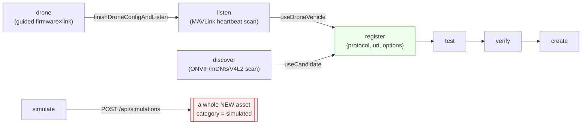
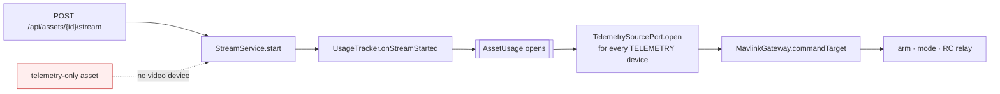
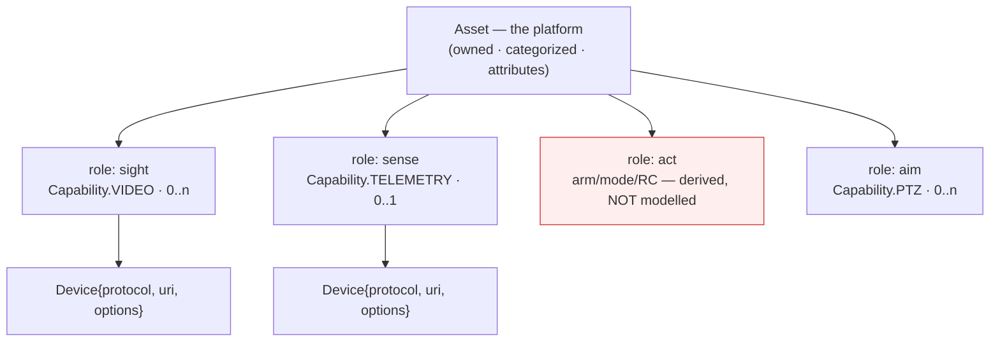

# Source onboarding — one generic way to add a vehicle, with simulatable halves

**Opened:** 2026-08-25 · **Status:** diagnosis + design; **S1 done as of wave R2, 2026-08-26** (shape changed from this doc's own S1 spec — see §12), S2-S5 nothing built · **Branch:** none yet

**Ask (verbatim):** *"I have an issue of telemetry and video. I can't add the video without telemetry
and vice versa. But sometimes it can be that the drone has no camera yet, or it has a camera and I
need to test it. Double-check, if it's possible to do: refactor the flow of adding drone from 5
different ways to some generic way with ability to simulate video/telemetry."*

**Verdict: yes, and it is smaller than it looks.** The five ways are not five flows — four of them
already converge on one shape. The genuine coupling is in two places, and one of the two is *already
built and has zero callers*. See §7 for the honest cost.

---

## 1. What the five ways actually are

`features/onboarding/onboarding-logic.ts#ConnectMethod` — `register | discover | simulate | listen |
drone`. Read the transitions rather than the tile count:



**There are two ways, not five.** `discover`, `listen` and `drone` are *address finders*: none of
them carries a protocol or URI of its own, and each one's "Use" button flips the method to
`register` with the fields prefilled (each method's own doc comment says exactly this). They all
terminate in the same three-field record — `ProbeConnectionDraft {protocol, uri, options}`.

So the real split is **one link, found four ways** versus **`simulate`, which is not a link at all**.
That asymmetry is the whole bug.

## 2. Coupling C1 — the only session verb is "start a video stream"

`POST /api/assets/{id}/stream` (`AssetStreamController:111`) is the only externally reachable way to
put an asset into a session. It resolves a device through `DefaultAssetStreamService#resolveSingleVideoDevice`,
which throws when the asset has no `Capability.VIDEO` device:

> `"Asset … has no active video-capable device; specify one explicitly"`

Everything downstream hangs off that one call:



No video → no stream → no `AssetUsage` → no telemetry subscription → `commandTarget` is `null` →
every command refuses with *"No MAVLink vehicle has ever been heard … make sure its telemetry stream
is open"* while the vehicle is transmitting. This is `TELEMETRY-ONLY-ONBOARDING-CONTEXT.md` §B4,
still open.

### The part that is already built

`UsageTracker#onTelemetryDeviceDiscovered(DeviceId)` (DRONE-ONBOARDING Wave O7) opens an
`AssetUsage` at phase `PREFLIGHT` for a telemetry device with no video stream. It is idempotent per
device, documented in `contexts/vision-perception/MODULE.md:182`, and covered by 7 tests.

**It has zero production callers.** Verified:

| Where | References |
|---|---|
| `UsageTrackerTest.java` | 7 |
| `contexts/vision-perception/MODULE.md` | 5 |
| `UsageTracker.java` itself | 4 |
| **anything that runs in production** | **0** |

The mechanism exists; nothing on the outside can reach it. Same shape as O11 — *"shipped green but
inert"*. Half of C1 is a wiring job, not a build.

## 3. Coupling C2 — the wizard binds a link, not a vehicle

`buildCreateAssetRequest` emits a `devices` array of **exactly one** element
(`onboarding-logic.ts:266`). One pass through the wizard = one asset with one device.

The backend does not impose this. `CreateAssetRequest.devices` is already `readonly
CreateAssetDeviceSpec[]` (`core/api/models.ts:906`) and `POST /api/assets/{id}/devices` already
attaches more later. **The one-device limit is a wizard-shaped limit, and it is the direct cause of
the user's sentence.** An operator who has a camera and an autopilot must run the wizard twice and
then join the halves by hand on the asset-detail page — a step DRONE-ONBOARDING §1.1 already counts
as step 18 of 20.

## 4. Coupling C3 — "simulated" is stamped on the wrong entity

`DefaultSimulationService#simulate` always creates a **new** asset under the fixed `simulated`
category (`DefaultSimulationService:81,285`), and the wizard's simulate path therefore cannot honour
the category the operator picked on the Profile step — a documented, deliberate gap today
(`buildPostSimulationAssetEdit`'s own doc comment).

This is the wrong place for the marker, and the codebase already disagrees with itself about it:

| Layer | Treats "simulated" as… |
|---|---|
| `adapter-simulation` | **a protocol.** `SimulatedVideoSource`/`SimulatedTelemetrySource` are ordinary `VideoSourcePort`/`TelemetrySourcePort` implementations claiming protocol `sim` — indistinguishable from RTSP or MAVLink to everything upstream |
| `vision-simulation` | **an asset category.** A separate entity class of thing, with its own creation endpoint and its own resume-on-boot scan |

The adapter layer is right. A simulated camera is a *camera you do not have yet*; it is not a
different drone. Every consumer of a `Device` already handles it correctly — the category is the
only thing insisting otherwise, and it is load-bearing in exactly two places, both inside
`DefaultSimulationService` (`simulate` writes it, `resumeAll:375` filters on it).

## 5. The domain model, restated

### What a drone / car / robot actually is

Strip the vehicle type away and every one of them is the same thing: **a platform that exposes a set
of links, each filling a role.**



A quadcopter fills sight+sense+act. A fixed camera fills sight only. The ESP32 rover fills sense+act
and, until a camera is bolted on, nothing else. **The model is already right** — `Asset` (1..n
`Device`, each with a `Set<Capability>`) expresses all of this. Nothing needs a new entity.

### The two things the model is missing

**(a) `Capability.CONTROL` does not exist.** `Capability` is `{VIDEO, TELEMETRY, PTZ, AUDIO}`.
"Can I drive this" is inferred: `MavlinkManualControlSender#supports` (`:119-121`) delegates
verbatim to `MavlinkTelemetrySource#supports`, which is `TELEMETRY` + protocol `mavlink`. So the act
role is real, is used, and is invisible to the model — which is why an operator can never be told
*"this asset can be watched but not driven"* without the UI re-deriving the rule from the protocol
string. This is the same class of defect as C3: a fact living one layer away from where it belongs.

**(b) A `Device` cannot say where its data comes from.** There is no way to ask a device "are you
real?" other than string-matching `protocol == "sim"` — which is exactly what `resumeAll` does, and
exactly what a cockpit would have to do to badge a synthetic feed honestly.

### The one concept worth adding

```
Device.origin : DeviceOrigin { LIVE, SIMULATED }
```

That is the whole model change. With it:

- C3 dissolves — the `simulated` category is deleted; a synthetic camera is a `SIMULATED`-origin
  device on your real rover, in your real category
- the cockpit can badge a synthetic half honestly instead of letting an operator mistake a
  scripted circular track for a GPS fix (CLAUDE.md's failsafe/honesty priority — this is the
  `sim` telemetry source's own scripted RTL drama, which *will* look like a real low-battery event)
- "no camera yet" and "camera on the bench" become the same operation with different rows filled

`Capability.CONTROL` is worth adding too but is **separable** and higher-risk — it touches
`CapabilityParsing`'s protocol defaults, which `TELEMETRY-ONLY-ONBOARDING` §B2 has already been
burned by once (an omitted capability silently made a created MAVLink device inert). Recommend
deferring it and keeping act derived until the rest lands.

## 6. The generic flow

One wizard. The Connect step stops being a five-way tile choice and becomes a **fit-out table**: one
row per role, each row filled by whichever finder is convenient.

```
  What is it?     [ ESP32 Rover ]  category [ robot ]

  What does it have?
  ┌──────────────┬───────────────────────────────────┬──────────┐
  │ Sense        │ mavlink · udp://0.0.0.0:14550     │ ✓ heard  │   ← listen / drone / manual
  │  telemetry   │   [ find… ]  [ simulate ]  [ — ]  │          │
  ├──────────────┼───────────────────────────────────┼──────────┤
  │ Sight        │ simulated · sim://esp32-rover     │ ✓ frames │   ← no camera fitted yet
  │  video       │   [ find… ]  [ simulate ]  [ — ]  │          │
  └──────────────┴───────────────────────────────────┴──────────┘
                                          at least one row filled
```

Three properties fall out:

1. **Neither half is mandatory, and neither blocks the other.** A row set to `—` is simply not
   created. Video-only, telemetry-only and both are all one code path.
2. **The finders survive unchanged.** `discover`, `listen` and `drone` become what they already
   are behind the doc comments — ways to fill the address box in one row — instead of wizard
   branches. No scanner, no picker, no snippet generator is rewritten.
3. **`simulate` becomes a row value, not a destination.** It emits a `DeviceSpec` with protocol
   `sim` and `origin=SIMULATED`, alongside the real rows, in the same single `POST /api/assets`
   whose `devices` array already accepts N.

The user's two cases, expressed in one table:

| Case | Sense row | Sight row |
|---|---|---|
| "the drone has no camera yet" | real mavlink link | **simulate** |
| "it has a camera and I need to test it" | **simulate** | real rtsp link |
| a fixed camera | `—` | real rtsp link |
| today's demo drone | simulate | simulate |

### The session verb

`POST /api/assets/{id}/stream` is renamed in meaning, not deleted:

```
POST   /api/assets/{id}/session      engage  — open the AssetUsage, start whatever this asset has
DELETE /api/assets/{id}/session      disengage
```

`engage` starts a video pipeline per `VIDEO` device (**zero is legal**) and calls
`UsageTracker#onTelemetryDeviceDiscovered` per `TELEMETRY` device. `/stream` stays as the
device-level verb it always was.

This also closes a gap O7 flagged against itself: *"a telemetry-only usage has no path in this
reactor to ever reach terminal `CLOSED`"* (`vision-perception/MODULE.md:259`). `disengage` is that
path — an explicit stop signal that O7 had no verb to hang on.

## 7. What exists vs what must be built

| Piece | State | Work |
|---|---|---|
| N devices in one create call | `CreateAssetRequest.devices` is already an array | none |
| Telemetry-only usage open | **DONE, wave R2 (2026-08-26) — differently than this row assumed.** `onTelemetryDeviceDiscovered` was **deleted**, not wired; see §12 | none, superseded |
| Protocol-aware probe (no frame needed) | shipped, TELEMETRY-ONLY W1/W2 | none |
| Capabilities defaulted per protocol | shipped, W3 | none |
| Synthetic video + telemetry sources | shipped, `adapter-simulation`, 30 tests | none |
| Attach a device to an existing asset | `POST /api/assets/{id}/devices` + asset-detail UI | none |
| `DeviceOrigin` on `Device` | — | new: kernel enum, JPA column + Flyway, `CreateAssetDeviceSpec` field |
| Simulated device on an **existing** asset | — | `SimulationService` can only create a whole asset |
| `engage`/`disengage` verb | **DONE, wave R2 (2026-08-26).** `AssetSessionController` + `UsageTracker#engage/disengage`; no `AssetSessionService` was created (one interface, one impl, one caller does not earn a port — see §12) | none, superseded |
| Fit-out table UI | — | rewrite of the Connect step; finders reused verbatim |
| Delete the `simulated` category | — | 2 sites, both in `DefaultSimulationService` |

**Nothing here requires a new module, a new entity, or a new context edge.** Every write path
already exists in a legal direction.

## 8. Infrastructure consequence — read before promising it

Simulated sources run **in-process inside `vision-app`** (`docker-compose.yml` has four services:
postgres, mediamtx, cv-service, vision-app). Two of the three simulation transports bind ephemeral
local ports:

- `TelemetryTransport.MAVLINK` allocates a **free loopback UDP port** per simulation, freshly
  randomized every JVM start — which is why `resumeAll` deliberately never treats it as a resume
  candidate
- `SimulationTransport.MJPEG` does the same with an ephemeral HTTP port, and is excluded for the
  same reason

Both facts are documented and correct *for a demo asset that is disposable*. They stop being
acceptable the moment a simulated device is a permanent half of a real vehicle: a rover whose
synthetic camera changes address on every deploy is worse than a rover with no camera, because it
looks configured and is not.

**So the honest scope boundary is:** the `sim`-protocol in-process transport (`DIRECT` video, `SIM`
telemetry) is safe to make permanent today — it has no address at all, it is a `Flow.Publisher` in
the same JVM. The `RTSP`/`MJPEG`/`MAVLINK` wired transports are **demo-grade** and should stay
demo-grade until they get a stable address, which means a `sim-source` service in
`docker-compose.yml` with fixed ports rather than loopback allocation. Do not let the fit-out table
offer a wired transport as a permanent fitting before that exists.

## 9. Suggested wave order

| Wave | Content | Risk | Independent? |
|---|---|---|---|
| **S1** | ~~`engage`/`disengage` + wire `onTelemetryDeviceDiscovered`~~ — **DONE, wave R2 (2026-08-26), shape changed; see §12** | medium — touches the session model | yes |
| **S2** | `DeviceOrigin` enum + persistence + API field; badge it in the cockpit | low | yes |
| **S3** | `SimulationService` can fit a simulated device onto an **existing** asset | low | needs S2 |
| **S4** | Fit-out table replaces the Connect step; finders reused | medium — pure frontend | needs S3 |
| **S5** | Delete the `simulated` category; `resumeAll` filters on origin | low | needs S2+S4 |
| later | `Capability.CONTROL`; `sim-source` compose service | — | gated, see §5b/§8 |

S1 is the one that fixes the user's actual sentence, and it is the only wave that can be judged
before any UI moves. Do it first and alone.

## 10. What I would not do

- **Do not invent a `Vehicle`/`Platform` entity.** `Asset` already is one. DRONE-ONBOARDING §2.1
  makes the same argument against a parallel `Flight` entity and it applies verbatim here.
- **Do not make simulation a mode of the asset.** It is a property of one device. An asset with a
  real autopilot and a synthetic camera is half-real, and any model that forces one flag onto the
  whole vehicle will lie about that.
- **Do not merge `discover`/`listen`/`drone`.** They find genuinely different things (ONVIF/mDNS/V4L2
  vs MAVLink heartbeats vs a guided config recipe). They are already unified where it counts — at
  the `{protocol, uri, options}` triple they all produce.
- **Do not delete `POST /api/assets/{id}/stream`.** Starting one named device's stream is a real,
  separate operation; `engage` is the asset-level verb above it.

## 11. Verified while writing this

Every claim above was checked against the tree at `feat/controller-setup-c15`, not recalled:

`ConnectMethod` union and its three pivot transitions · `buildCreateAssetRequest`'s single-element
`devices` array · `CreateAssetRequest.devices` already `[]` · `resolveSingleVideoDevice`'s throw ·
`onTelemetryDeviceDiscovered`'s 0 production callers · `Capability` has 4 constants, no `CONTROL` ·
`MavlinkManualControlSender#supports` delegating to the telemetry predicate · `SIMULATED_CATEGORY`
load-bearing at exactly 2 sites · `docker-compose.yml`'s 4 services · the MAVLINK/MJPEG ephemeral-port
resume exclusions.

**Not verified:** none of this has been run. §7's "work" column is a reading of the code, not an
estimate anyone has tested against a build.

---

## 12. Update — S1 shipped as part of ARCHITECTURE-AUDIT-2026-08-26 wave R2 (2026-08-26)

R2's task brief (independent of this document, written before this doc's §6/§7/§9 were read by that
wave) specified `engage`/`disengage` with **no video stream and no device traffic involved on
either verb**, and required a written decision on `onTelemetryDeviceDiscovered`'s fate — wire it, or
delete it. That is a materially different shape from this doc's §6 ("`engage` starts a video
pipeline per `VIDEO` device… and calls `onTelemetryDeviceDiscovered` per `TELEMETRY` device") and
§7/§9 (which assumed *wiring*, not deleting, the dead method). Recorded here so a reader of §6/§7/§9
does not take that text as still-current:

**What actually shipped** (`storage/persistence`, `station/vision-api`, `contexts/vision-warehouse`,
`contexts/vision-perception`, `core/vision-kernel`):

- `POST /api/assets/{id}/session` (engage) and `DELETE /api/assets/{id}/session` (disengage) —
  same paths this doc proposed in §6. `AssetSessionController`, thin, scoped via
  `assetService.details(scope, id)` (404 not 403 out-of-scope, matching this repo's convention).
- `engage`/`disengage` live directly on `UsageTracker` — **no new `AssetSessionService`
  interface**, contra §7's row. One implementation, one caller: doesn't earn a port
  (`java-clean-code` §1).
- `UsageOrigin{STREAM,TELEMETRY,OPERATOR}` kernel enum (mirrors `DeviceOrigin`), persisted on
  `AssetUsage` (V26 migration, backfills existing rows to `STREAM`).
- Three collisions settled and each has a named test: operator-engaged sessions survive
  `onStreamStopped`; a running STREAM-origin usage is **promoted** to OPERATOR on `engage` rather
  than rejected or duplicated; `disengage` closes the usage even while a stream is still running
  (and the stream itself is left running — only the usage closes).
- **`onTelemetryDeviceDiscovered` was deleted**, along with its 7 tests — not wired. Reasoning: it
  duplicated what `engage` now does explicitly and on-demand; keeping both would have been a second,
  disagreeing session-opening path (auto-open-on-first-telemetry-packet vs. explicit operator
  verb), which is exactly the kind of implicit magic this audit's own R2 finding was written
  against. `engage` is the one verb that opens a session with no stream involved now; nothing
  auto-opens one from a telemetry packet arriving. Full reasoning also recorded in
  `contexts/vision-perception/MODULE.md` and `docs/plans/active/DRONE-ONBOARDING-PLAN.md`'s O7 row.
- **Not built, deliberately out of this wave's file scope:** no UI. No `DeviceOrigin` enum
  (§7/S2). No fit-out table (S4). No `simulated`-category deletion (S5). §2-§5 and §8's
  infrastructure discussion are entirely unaffected and still apply as written.

**Net effect on this doc's own plan:** S1 is done, but S2 ("`DeviceOrigin` enum + persistence + API
field") no longer needs to route through a wired `onTelemetryDeviceDiscovered` — it can build
directly against `engage`. S3/S4/S5 are otherwise unaffected and remain open as specced.
