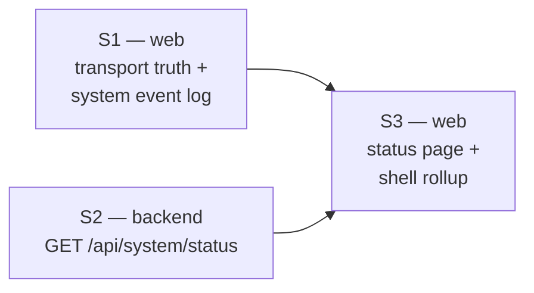

# SYSTEM-STATUS-PLAN — make the running system legible to its operator

Status: **active** (2026-08-15). Branch `feat/system-status`. Cycle type: **UI cycle** per
`docs/main/CYCLES-PLAN.md` — propose, estimate, implement. Personas: **drone operator**,
**referee/judge**, **crew** (UX-DESIGN §2).

Companions: `docs/main/UX-DESIGN.md` §7 (cross-cutting principles), `docs/main/MASTER-MATRIX.md` §2
(the HAVE list this plan makes visible), `.claude/skills/frontend-style/SKILL.md` (the style law).

---

## 1. The problem, stated as the doctrine it violates

The product's own design doctrine already requires what this plan builds:

> **UX-DESIGN §7.2 — Honest status over optimistic status.** "Show measured latency, real FPS, actual
> drop rate. This audience can tell when they're being lied to, and trust lost here is not recovered."

> **UX-DESIGN §7.1 — Never a blank screen.** "Every empty/error state names the cause and the next
> action."

`MASTER-MATRIX §2` lists ~20 shipped capabilities — geofencing, recording, COP layers, tracking, CV
training, command TX, RC relay, audit trail. **None of them has a surface that says whether it is
currently working.** Two concrete honesty failures, both verified in the tree:

### 1.1 Seven of eight event types arrive in the browser and are rendered nowhere

`LiveUpdateEventPublisher.publish` (`station/vision-app/.../events/LiveUpdateEventPublisher.java:53-59`)
calls `eventLiveUpdatePort.publishEvent(event)` **unconditionally** for every `Event`; the
`FLEET_LIFECYCLE_EVENTS` set gates only the *extra* fleet-changed nudge. `LiveUpdateRegistry.publishEvent`
(`station/vision-api/.../live/LiveUpdateRegistry.java:412`) broadcasts it with no filter. So all eight
`EventType`s reach the SSE `event` topic.

The client buffers them (`core/live/live-store.ts:364`, capped at 200) and then drops them:

| Consumer | File | Behaviour |
|---|---|---|
| notification bell | `shared/ui/notification-bell.ts:147-168` | `geofenceBreachToastMessage(event)` returns `undefined` for any non-breach → falls off the loop with no UI effect, *and* the id is added to `toastedBreachIds` so it can never be reprocessed |
| command facade | `features/command/command-facade.ts:120-122` | `activeGeofenceBreaches(...)` `continue`s on every non-breach |

**Net: `DETECTION`, `DEVICE_ONLINE`, `DEVICE_OFFLINE`, `STREAM_STARTED`, `STREAM_STOPPED`,
`PIPELINE_ERROR`, `TRAINING` are received and never rendered.** `GEOFENCE_BREACH` — a safety event —
survives only as a 5-second toast, which `core/toast.service.ts:19-26` itself argues against:
*"Anything an operator genuinely must not miss should therefore not rely on a toast outliving its
siblings: it belongs in durable chrome."*

Operator consequence: **a detection pipeline can fail continuously on a stream that still renders
video, and the UI stays silent.**

### 1.2 The status indicator that exists reports the wrong thing

The sidebar dot (`shared/ui/app-sidebar/app-sidebar.html:149-161`) and the global offline banner
(`app.html:6-11`) both read one signal — `FleetStore.reachable()`, i.e. *did the last `GET /api/devices`
succeed*. When SSE dies, `live-store.ts:384-396` logs to console, flips `connectionState()` to
`'closed'`, and silently falls back to 5-second polling. **Polling still succeeds, so the dot stays
green.** `LiveStore.connectionState()` exists and appears in zero templates (grep-verified).

The app has a two-transport architecture and tells the operator neither which transport is live nor
that one died.

### 1.3 Supporting evidence — state computed and thrown away

| State | Where | Consumers |
|---|---|---|
| CV service reachability — `available()`, `state()`, `outageFor()`, `reconnectAttempts()`, `describe()` | `cv/grpc/.../CvChannelSupervisor.java:156-183` | gate only; nothing reads it |
| MAVLink link health — `Health(connected, lastHeard, received, lost, dropRate)` | `drone-link/mavlink-core/.../LinkHealth.java:24` | **zero production call sites** (grep: tests only) |
| Publish outage per stream | `video-output/publish-hls/.../PublishBackoff.java:21` | log-only |
| Camera reconnect failure counts | `video-input/rtsp/.../FfmpegVideoSource.java:72` | internal |
| SSE viewer census, ring-buffer `everDropped` | `station/vision-api/.../live/LiveUpdateRegistry.java:209-210` | internal |
| Per-stream detection outage/backoff | `contexts/vision-perception/.../StreamPipeline.java:359-372` | private; gap self-documented at `AssetAttention:14-23` |

And two dead ends the operator can already click:
- `/debug`'s Health card probes `GET /actuator/health` — **actuator is not on the classpath at all**
  (`features/debug/debug-response.ts:29-46` documents this), so it permanently renders "not exposed".
- `/manage/health` is a `ComingSoon` placeholder (`features/hubs/hubs.routes.ts:93`). It is specced for
  *per-asset maintenance records*, not platform health — **this plan does not take that slot.**

---

## 2. What we build

Three waves. **S1 and S2 have disjoint module scopes and run in parallel**; S3 follows both.



### Non-goals (deliberate, recorded so they are not quietly added)

- **No per-stream detection health in S2.** Exposing `StreamPipeline`'s private outage state means
  threading through `DefaultStreamService`'s per-stream map — the thing `AssetAttention:14-23` says is
  hard — and `StreamPipeline` is already flagged for decomposition (MASTER-MATRIX K3, 927 lines).
  S1 surfaces `PIPELINE_ERROR` *events*, which is the operator-visible half. The structured per-stream
  health field is **S2b**, after K3.
- **No SSE `system` topic.** S3 polls the status endpoint on the existing shared `PollScheduler`.
  Pushing status changes is a follow-on once the shape is proven.
- **No new metrics stack.** No Micrometer, no Prometheus. Those are a separate decision.
- **No changes to `/manage/health`** — that slot belongs to maintenance records.

---

## 3. Wave S1 — transport truth + the system event log (web only)

**Scope:** `station/vision-web/**` only. **Must not touch** any Java module, and must not touch
`features/hubs/**` or create new routes (S3's territory).

**Estimate: S** (≤16 h). No backend change — every byte this wave renders is already arriving.

### 3.1 Render the live transport state

`LiveStore.connectionState(): Signal<'connecting'|'open'|'closed'>` is already computed and never
displayed. Surface it in two places:

1. **Sidebar footer** (`shared/ui/app-sidebar/`): the existing status line gains a second, quiet
   signal for the live transport. Style law §5 allows **one chip per row max** — so this is a `.dot`
   + plain text, not a second chip.
2. **A durable notice when degraded**: when `connectionState() === 'closed'` *and* `FleetStore.reachable()`
   is `true` — the exact silent-degradation case — render `<vision-notice variant="warn">` saying live
   updates dropped to polling, with the retry interval named. Reuse `<vision-notice>`; **do not**
   hand-roll another `.offline-banner` (`app.css` already has one bespoke banner that should have been
   the shared primitive — note it, do not fix it here).

Honest copy, per UX-DESIGN §7.1 — name the cause and the next action. "Live updates disconnected —
falling back to a 5-second refresh. Retrying every 60 s." Not "Connection issue".

### 3.2 A system event store that consumes what already arrives

New `core/system-events/system-events-store.ts` (`providedIn: 'root'`), reading `LiveStore.liveEvents()`.

- Map `LiveEvent` → a display row: severity, title, source asset/stream (when the payload names one),
  timestamp, detail.
- **Severity mapping** — `PIPELINE_ERROR` and `GEOFENCE_BREACH` are `danger`; `DEVICE_OFFLINE` is
  `warn`; `DEVICE_ONLINE`/`STREAM_STARTED`/`STREAM_STOPPED`/`TRAINING` are `neutral`. `DETECTION` is
  **excluded** — detections already have their own surface (`EventsStore` → bell, rail, alerts) and
  duplicating them would be noise, which is the failure mode UX-DESIGN §T2 names as fatal.
- Follow the Component → Facade → Store → Service convention (`MODULE.md:709`).

### 3.3 Give the events a durable home

- **Notification bell** (`shared/ui/notification-bell.ts`): keep the geofence toast (it is a
  safety-critical interrupt and should stay loud), but *additionally* record every mapped system event
  into the bell's durable list, so the operator can find it after the toast fades. This is the direct
  fix for the `toast.service.ts:19-26` warning.
- `<vision-event-row>` is typed to `DetectionEvent`. **Do not widen it destructively** — either add a
  sibling row component for system events or make the type a union, whichever keeps the detection call
  sites unchanged. State which you chose in MODULE.md.

### 3.4 Make a broken pipeline visible where operators already look

`core/fleet/attention-logic.ts:36-43` has 7 reason kinds and no pipeline/stream input. Add a
`pipeline-error` reason sourced from `liveEvents()`, exactly as `geofence-breach` already is
(`attention-logic.ts:180-185` documents that pattern). It then renders on Command's attention rail and
Reports' "Needs attention" for free.

**Ordering/decay:** a `PIPELINE_ERROR` is a point-in-time event, not a level. Decide and document a
decay rule (e.g. the reason clears when a `STREAM_STARTED` for that stream arrives, or after a stated
window). A reason that never clears is worse than no reason.

### 3.5 Done when

- `npm run test:ci` and `npx tsc --noEmit` green.
- Checked in **both themes** (style law §2, checklist item 3).
- `station/vision-web/MODULE.md` updated.
- No raw hex, no off-grid px, no `--hud-*` outside `.surface-dark` (checklist item 1).

---

## 4. Wave S2 — `GET /api/system/status` (backend only)

**Scope:** `core/vision-platform/**`, `cv/grpc/**`, `drone-link/mavlink/**`,
`video-output/publish-hls/**`, `station/vision-api/**`, `station/vision-app/**`.
**Must not touch** `station/vision-web/**` (S1/S3) or `contexts/vision-perception/**` (non-goal).

**Estimate: M** (≤80 h).

### 4.1 The port — one small seam in `vision-platform`

Contexts and adapters may depend on `vision-platform`; `vision-api` may not depend on adapters. So the
port lives in platform and every provider implements it:

```java
public interface SubsystemStatusPort {
    SubsystemStatus status();
}

public record SubsystemStatus(String id, String label, Health health,
                              String detail, Instant since, String hint) { }

public enum Health { OK, DEGRADED, DOWN, DISABLED, UNKNOWN }
```

- `id` is a stable slug (`cv-service`, `mavlink-link`, `video-publish`, `live-updates`) — the UI keys
  off it, so it is wire contract.
- `detail` is the honest human sentence. `CvChannelSupervisor#describe()` already produces exactly the
  right one — **make it public** rather than reformatting it elsewhere.
- `hint` is the next action ("Start cv-service, or set `vision.cv.enabled=false`"), per UX-DESIGN §7.1.
  Nullable when there is nothing useful to say.
- `DISABLED` means "switched off by config", and is **excluded from the overall rollup** — a
  deliberately disabled subsystem must never read as a fault.
- Validate in the compact constructor with manual `if (…) throw new IllegalArgumentException(…)`
  (house idiom).

### 4.2 The four providers

| id | Module | Source | Health mapping |
|---|---|---|---|
| `cv-service` | `cv/grpc` | `CvChannelSupervisor` | `available()` → OK; else DOWN, `detail` = `describe()`, `since` = outage start. Not wired (CV off) → `DISABLED` |
| `mavlink-link` | `drone-link/mavlink` | `LinkHealth.Health` — **its first production consumer** | `connected` → OK; stale `lastHeard` → DEGRADED with the age; never heard → DOWN. Include `dropRate` in `detail` |
| `video-publish` | `video-output/publish-hls` | `PublishBackoff` outage flag | any stream in outage → DEGRADED naming the stream(s) |
| `live-updates` | `station/vision-api` | `LiveUpdateRegistry` | connection count + whether any ring buffer `everDropped`. Always OK/DEGRADED — this is self-reporting |

Each provider is an adapter-side class implementing the platform port; **no adapter gains a dependency
on another adapter**. Wire the list in `vision-app` (`ObjectProvider<List<SubsystemStatusPort>>` or an
explicit `List<SubsystemStatusPort>` bean) — the same `@ConditionalOn…` gating style already used for
`CvWiring`. **Repeat the property expression rather than using `@ConditionalOnBean`**, for the
bean-definition-order reason recorded in CV-RECONNECT-PLAN §3.3.

### 4.3 The endpoint

`SystemStatusController` in `station/vision-api`, `GET /api/system/status`:

```
{ "overall": "DEGRADED",
  "checkedAt": "2026-08-15T21:00:00Z",
  "subsystems": [ { "id","label","health","detail","since","hint" }, … ] }
```

- `overall` = worst health across subsystems, **ignoring `DISABLED`**; empty list → `UNKNOWN`.
- **Readable by any authenticated user, not `managerOnly`.** An operator whose CV has died must be able
  to see why. It exposes no secrets — hostnames and states only. Record this as a deliberate call.
- A provider that throws must not fail the whole endpoint: catch per-provider and report that subsystem
  as `UNKNOWN` with the exception message as `detail`. **One sick provider must not blind the page.**
- MockMvc tests per house style.

### 4.4 Actuator — small, and it makes an existing UI honest

Add `spring-boot-starter-actuator` to `station/vision-app` with **`health` exposed and nothing else**
(`management.endpoints.web.exposure.include: health`), permitted in Spring Security. Two reasons, both
already-paid-for:
- `/debug`'s Health card is *already written* to probe it and currently renders "not exposed" forever.
- CLAUDE.md's deployment rule wants `docker-compose.yml` to reflect how this runs; a container
  healthcheck needs a liveness endpoint.

Do **not** expose `metrics`, `env`, `beans`, or `configprops`. Update `docker-compose.yml` with a
healthcheck against it.

### 4.5 Done when

`./mvnw -B -pl core/vision-platform,cv/grpc,drone-link/mavlink,video-output/publish-hls,station/vision-api,station/vision-app test -DskipWeb`
green, ArchUnit green, and every touched `MODULE.md` updated.

---

## 5. Wave S3 — the status page and an honest shell indicator (web only)

**Scope:** `station/vision-web/**`. Runs **after** S1 and S2 land. **Estimate: S–M** (≤40 h).

### 5.1 New page: System status

- Route **`/manage/system`**, in the `diagnostics` nav group beside `/debug`. **Not `managerOnly`** —
  matching §4.3's call. **Do not touch `/manage/health`.**
- Anatomy, following style law §6 and reusing the existing kit:
  - `<vision-page-bar>` header.
  - Overall verdict as `<vision-notice>` (`ok`/`warn`/`danger`).
  - Subsystem rows: one `.chip` per row max, `.dot` for secondary state, `detail` in body text, `hint`
    as the next-action line, `since` in `.mono`.
  - **Live transport card** — S1's `connectionState()`, made explicit: which transport is active.
  - **System event log** — S1's store, newest first, using `<vision-empty>` for the zero state.
- Poll `GET /api/system/status` on the shared `core/poll-scheduler.ts` (do not add a second timer).

### 5.2 Fix the shell indicator

The sidebar footer dot becomes a true rollup: worst of `FleetStore.reachable()`, `LiveStore.connectionState()`,
and `overall` from the status endpoint. Clicking it navigates to `/manage/system`. This is the direct
fix for §1.2 — the dot must stop being green while the system is degraded.

### 5.3 Repoint `/debug`'s Health card

Point it at `GET /api/system/status` (keeping `/actuator/health` as a secondary probe now that §4.4
makes it real). Its `describeHealthProbe()` verdict logic (`debug-response.ts:68-90`) is sound and
should be kept.

### 5.4 Done when

`npm run test:ci` + `npx tsc --noEmit` green, both themes checked, `station/vision-web/MODULE.md`
updated, nav entry added to `features/hubs/nav-entries.ts`.

---

## 6. Status

| Wave | Scope | Estimate | Status |
|---|---|---|---|
| S1 | `station/vision-web/**` | S | **done** — 116 files / 1961 tests, tsc clean (verified independently, not just reported) |
| S2 | platform + 3 adapters + api + app | M | **done** — 6 modules green together (verified independently); one defect found in review and fixed |
| S3 | `station/vision-web/**` | S–M | **done** — 118 files / 1989 tests, tsc clean; page correctly lazy (7.54 kB chunk) |
| S2b | per-stream detection health | M | deferred behind MASTER-MATRIX K3 |
| S4 | per-asset capability/readiness surface | M | proposed, not scheduled |

### S1 outcome — decisions taken, and one honest limit

- **§3.3 sibling vs union**: built a sibling `<vision-system-event-row>` rather than widening
  `<vision-event-row>`. That component's template reads `DetectionEvent`-only fields (`state`,
  `peakConfidence`) with no analog on the generic shape, so a union would have forced a runtime branch
  onto every existing detection call site for one new consumer. Correct call.
- **§3.4 decay**: three layers — an explicit `STREAM_STARTED` for the same `streamId` clears it;
  otherwise it decays after 15 min; and `AssetAttention.streamId` goes `undefined` when the asset stops
  streaming, clearing it for free. `STREAM_STOPPED` deliberately does *not* clear it (a stream that
  stopped *because* it was erroring should stay flagged).
- **Known limit, not a defect**: `liveEvents()` is capped at 200 entries
  (`core/live/live-store.ts:31`), so on a noisy system a `PIPELINE_ERROR` can be evicted before its
  15-minute window expires and the reason clears early. `activeGeofenceBreaches` has had the identical
  ceiling since it was written, so this is consistent with existing behaviour rather than new — but it
  means the reason is **best-effort, not authoritative**. This is precisely the gap S2b closes with
  real per-stream health; until then an event log is the honest ceiling.
- **Bundle cost**: the eager shell grew +7.25 kB raw / +2.89 kB transfer, worsening a pre-existing
  budget overage from +6.50 kB to **+13.75 kB over the 390 kB budget**. Unavoidable for this feature —
  the bell and sidebar footer are architecturally always-mounted — but it is a real regression and the
  budget should be revisited deliberately rather than raised silently.
- **Not verified**: no live both-themes screenshot (no dev server/backend in the agent's environment).
  Checked structurally instead — zero raw hex, zero `--hud-*`/`--scrim*` outside `.surface-dark`.
  **A human should eyeball the sidebar foot and the degraded banner in both themes before merge.**

### S2 outcome — one defect found in review, fixed

`SystemStatusController#safeStatus` exists precisely so one sick provider cannot blind the page. It
built its fallback from `e.getMessage() != null ? e.getMessage() : e.toString()` — but
`SubsystemStatus` rejects a **blank** `detail`, not merely a null one. A provider throwing with an
empty message therefore produced `detail = ""`, whose compact constructor threw
`IllegalArgumentException` *from inside the catch block*, propagating out of `status()` and 500-ing
the whole endpoint — the exact failure the catch was written to prevent.

Fixed by treating blank as absent and falling back to `Throwable#toString()` (blank-proof: it always
carries at least the class name). Guarded by `aProviderThrowingWithABlankMessageStillDoesNotFailTheEndpoint`,
**confirmed to fail against the pre-fix code** rather than merely passing against the new one.

Also worth recording from S2:

- **Wiring**: `SystemStatusController(List<SubsystemStatusPort>)` — Spring type-collects the list, so
  `vision-api` never names an adapter. `vision-app`'s `SystemStatusWiring` supplies the three
  adapter-side beans; `vision-api` supplies `live-updates` itself by component scan.
- **`mavlink-link` is unconditional** — no `DISABLED` twin, since `MavlinkTelemetrySource` is always
  wired. "No vehicle claimed" reports `UNKNOWN`, not `DISABLED`.
- **Rollup precedence** beyond the plan's "worst wins": `DOWN` outranks `UNKNOWN`, on the reasoning
  that a *confirmed* outage is more alarming than an *inconclusive* read.
- **Latent trap for whoever extends `Health`**: the rollup ranks via a `SEVERITY` map lookup
  (`Comparator.comparingInt(SEVERITY::get)`). Adding a constant without adding a map entry NPEs at
  runtime in the rollup. `DISABLED` is safe only because it is filtered first. If a fifth constant is
  ever added, move the rank onto the enum itself.
- **Stale-jar trap** (hit during S2, worth remembering): `-pl` builds resolve unlisted modules from
  `~/.m2`, so changing `vision-platform`/`cv-grpc`/`mavlink`/`publish-hls` sources and then running a
  scoped `vision-app` test fails with `NoClassDefFoundError` until those four are reinstalled.
  Install them with `-DskipTests` first.
- **Not tested directly**: the three adapter-side providers have no dedicated unit tests — each is a
  thin mapping over an already-tested collaborator, and the rollup they feed is covered against fakes.
  Defensible, but they are untested mappings.
- **Docker healthcheck not run live** — validated with `docker compose config --quiet` only, to avoid
  racing S1's concurrent edits to the build context. **Needs one real `docker compose up` before merge.**
