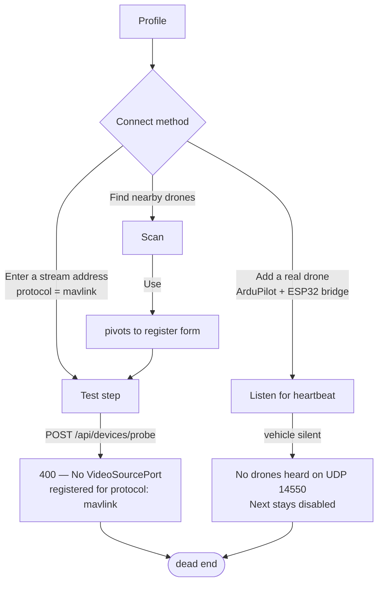
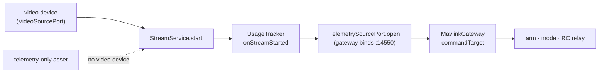

# Telemetry-only onboarding — context

**Branch:** `feat/telemetry-only-onboarding` · **Opened:** 2026-08-23 · **Status:** in progress

Adding a MAVLink vehicle (the ESP32 rover, an ELRS backpack, a companion computer) through the
`/add-source` wizard is **impossible today** — every path terminates on a gate that demands video.
This document is the frozen diagnosis and the wire contract the implementation waves work against.

---

## 1. Reproduction

Driven headlessly against the running dev stack (`ng serve` :4200 → `vision-app` :8080, Postgres +
mediamtx up). Profile step filled `ESP32 Rover` / category `robot`, then each Connect method in turn.

Both dead ends present identically to an operator: **nothing happens.**

## 2. Root causes

| # | Defect | Evidence | Blast radius |
|---|---|---|---|
| B1 | `probe()` resolves a `VideoSourcePort` unconditionally, so a telemetry-only protocol 400s before any check runs | `DefaultProbeService.java:96` | every telemetry-only device, every path |
| B2 | Omitted capabilities default to `VIDEO` regardless of protocol | `CapabilityParsing.java:38` | a created MAVLink device gets **no telemetry and no manual control** — `MavlinkTelemetrySource.supports()` requires `TELEMETRY` (`:118`), `UsageTracker` skips subscription without it (`:612`), `MavlinkManualControlSender.supports()` delegates to the same predicate (`:117`) |
| B3 | The Test step's whole vocabulary is video ("make sure it actually produces a frame") | `onboarding.html`, `ProbeDeviceResult` | an operator is told to get a frame that cannot exist |

B2 is the quiet one: it does not block creation, it makes the created device **silently inert**.
Nothing in the UI would say why.

### B4 — a telemetry-only asset can never be flown (found while verifying W5, NOT fixed)

Fixing B1–B3 gets the rover *added*. It does not get it *flown*, because the session model is
rooted in video end to end:

Every arrow is load-bearing. `DefaultAssetStreamService:78` refuses an asset with no active
video-capable device; naming the MAVLink device explicitly gets one step further and then fails
`No VideoSourcePort registered for protocol: mavlink`. Without a stream there is no `AssetUsage`;
without a usage `UsageTracker` never calls `TelemetrySourcePort.open`; without that call
`MavlinkTelemetrySource.gateways` has no entry, so `commandTarget` returns `null` and every command
path refuses with *"No MAVLink vehicle has ever been heard for device … make sure its telemetry
stream is open"* — while the vehicle is, in fact, transmitting.

**Measured workaround:** pair the MAVLink device with a `sim`/`sim://demo` video device on the same
asset. Starting the synthetic stream opens the usage, `UsageTracker` then subscribes every
`TELEMETRY`-capable device on the asset, and the rover becomes fully commandable — verified in §6.

**Recommended fix (not attempted here):** let a usage open without a video pipeline, so telemetry
subscription is gated on the asset being *engaged* rather than on a video stream existing. That is a
change to `vision-perception`'s session model, well outside the scope agreed for this branch, and it
is the same gap `docs/conclusions/ANY-DRONE-PLAN.md` describes as the adoption funnel.

### B5 — the readiness probe blames the wrong thing

`POST /api/assets/{id}/probe` on a telemetry-only asset returns 409 *"has no device this platform
can probe"*. The real reason is that `vision.onboarding.probe.enabled` defaults to `false`, so the
`VehicleConfigPort` bean is `NoopVehicleConfigPort` whose `supports()` always returns `false`
(`DefaultVehicleProfileService:97`, `:152`). `NoopVehicleConfigPort` already carries the honest
message — `"vehicle probing is disabled (vision.onboarding.probe.enabled)"` — but only
`probeCandidate` reaches it; the two `firstSupportedDevice(...).orElseThrow(...)` sites shadow it
with a message about the *asset*. Cosmetic, but it sends the operator to inspect a device that is
fine.

### Not fixed on this branch (recorded, deliberately out of scope)

- The "Add a real drone" config screen defaults **"this platform's address"** to the first
  interface it finds — observed offering `172.18.0.1 (br-f262b675367d)`, a docker bridge the ESP32
  can never reach, above `192.168.0.104 (wlp2s0)`. The operator must notice and switch. Ranking
  physical LAN interfaces first was explicitly deferred.
- "Use" on a heard vehicle round-trips through the manual register form rather than creating the
  asset directly, even though name/protocol/uri/sysid/capabilities are all already known.

## 3. Wire contract (frozen)

### `POST /api/devices/probe`

The response gains a second legal shape. `ok`, `telemetryDetected` and `warnings` are unchanged;
**`widthPx`/`heightPx`/`frameJpegBase64` become absent** on a telemetry-only probe.

| Case | Status | Body |
|---|---|---|
| A video source claims the protocol | 200 | today's shape, unchanged, frame fields present |
| No video source, but a telemetry source claims it, and a sample arrives | 200 | `{ok, telemetryDetected: true, warnings: ["No video on this link — telemetry only"]}`, **no frame fields** |
| No video source, a telemetry source claims it, no sample within the window | 422 | `ProbeFailedException` — actionable message naming the port |
| Neither claims the protocol | 400 | `UnsupportedProtocolException`, unchanged |

`ProbeResult.frame` becomes nullable **only when `telemetryDetected` is true** — the invariant
"a successful probe proves *something* arrived" is preserved, not dropped.

### `POST /api/assets` / `POST /api/devices`

Omitted `capabilities` are defaulted **from the protocol** instead of a flat `VIDEO`:

| Protocol | Default |
|---|---|
| `mavlink` | `TELEMETRY` |
| everything else | `VIDEO` (unchanged) |

An explicitly-supplied `capabilities` always wins — this is defaulting, not overriding, so every
existing caller is unaffected. **`sim` is deliberately left at `VIDEO`**: `DefaultSimulationService`
already builds its own devices with explicit capabilities, and the wizard's `synthetic` path
promises "no telemetry" in so many words — silently adding `TELEMETRY` there would make that copy a
lie and open a telemetry source nobody asked for.

## 4. ESP32 rover — the firmware side

`/home/vladte/Arduino/ardupoilot-start/` is well structured and its `README.md` protocol contract is
accurate (verified against this repo's sources). As found, the parts that put bytes on the wire were
stubs — `MavlinkV2Codec::encode` returned 0, `decodeByte` returned false, and every
`MavlinkUdpLink::send*` builder was a `TODO`. So the rover transmitted nothing and received nothing,
and no amount of app-side fixing could have made it appear.

W5 implements all three. What the firmware gained beyond the stubs' own contracts:

| Addition | Why |
|---|---|
| `mavlink::crcExtraFor` | MAVLink's checksum is seeded per message type, so a receiver with no seed cannot tell a valid frame from noise. Frames whose id has no seed are dropped unvalidated rather than passed to the control path. |
| `mavlink::INCOMPAT_SIGNED` handling | A signed frame carries 13 bytes past the checksum; half-consuming one desynchronises the parser on the *next* frame. Dropped whole. |
| `mavlink::payload_len` | Full v1 lengths, no v2 trailing-zero truncation — legal to omit, and these streams total under 2 kB/s. |
| `DriveLimits::topSpeedMps` + `IMotorDriver::estimatedSpeedMps` | `VFR_HUD.groundspeed` has no "unknown" sentinel, so it must carry a number. The actuator stage is the one module holding both the applied duty and the calibration, so it owns the estimate; `VehicleTelemetry.groundSpeedMps` carries it and the link stays a pure serialiser. |

`infra/rover-sim/` compiles the sketch's own `.cpp` files for the host, shimming only `Arduino.h`
and `WiFiUDP`, so the firmware runs and is regression-tested with no board attached.

## 5. Waves

| Wave | Scope | Files |
|---|---|---|
| W1 | Protocol-aware probe | `contexts/vision-perception/.../device/{ProbeService,ProbeResult,DefaultProbeService}.java` + tests |
| W2 | Probe response tolerates a frameless result | `station/vision-api/.../{DeviceProbeController,ProbeDeviceResponse}.java` + tests |
| W3 | Capabilities inferred from protocol | `station/vision-api/.../support/CapabilityParsing.java` + tests |
| W4 | Test step speaks the device's language | `station/vision-web/.../onboarding/**`, `core/api/models.ts` |
| W5 | ESP32 MAVLink codec + telemetry senders | `MavlinkV2Codec.{h,cpp}`, `MavlinkUdpLink.cpp`, `MavlinkProtocol.h`, `Config.{h,cpp}`, `IMotorDriver.h`, `HBridgeMotorDriver.{h,cpp}`, `Types.h`, `VehicleController.cpp` |
| W6 | Bench harness + docs | `infra/rover-sim/`, `infra/README.md`, firmware `README.md`, MODULE.md updates |

Waves W1–W3 are backend and independently buildable; W4 depends on W2's wire shape; W5 is
independent of all of them and verified against the app once W1–W4 land.

## 6. Verification (all run against a real build, not asserted)

Backend contract, `station/vision-app` packaged and run on `:8081` so the IDE instance on `:8080`
was left alone:

| Case | Result |
|---|---|
| `mavlink` probe, vehicle transmitting | `200 {"ok":true,"telemetryDetected":true,"warnings":["No video on this link — telemetry only"]}` — previously `400` |
| `mavlink` probe, vehicle silent | `422` naming the URI and stating that *this* host listens |
| protocol no adapter claims | `400` (unchanged) |
| `POST /api/assets`, `mavlink`, no `capabilities` | `["TELEMETRY"]` — previously `["VIDEO"]` |

Firmware wire format, via `make wire` — pymavlink builds the app's frames, the real parser consumes
them, and every transmitted byte goes back to pymavlink with `robust_parsing=False`: **29 checks,
all passing**, covering framing, sequence monotonicity, every `CRC_EXTRA` seed and every field
offset in the eight transmitted message types.

Whole flow, firmware running as a host process against `:8081`:

| Step | Result |
|---|---|
| `POST /api/discovery/scan` | `ArduPilot rover (sysid 1)`, `firmware=ardupilot`, `mavType=rover` |
| telemetry after session start | `firmware=ardupilot mode=Manual armed=false failsafe=true gpsFixType=0` |
| `GET /api/assets/{id}/flight-capabilities` | `commandable=true`, `armSupported=true`, all 11 Rover modes |
| `POST …/arm` | `202 ACCEPTED`; firmware logged `ARM requested`, then failsafed at 500 ms as designed |
| `POST …/mode {"mode":"Hold"}` | `202 ACCEPTED`; firmware logged `mode -> HOLD (custom_mode 4)` — the `COMMAND_ACK` builder round-tripped |
| `/ws/manual-control`, 179 stick frames | firmware applied `throttle=+0.40 steering=+0.60`, exactly the axes sent |

The session for that last block was opened on a paired `sim` video device — see B4.
