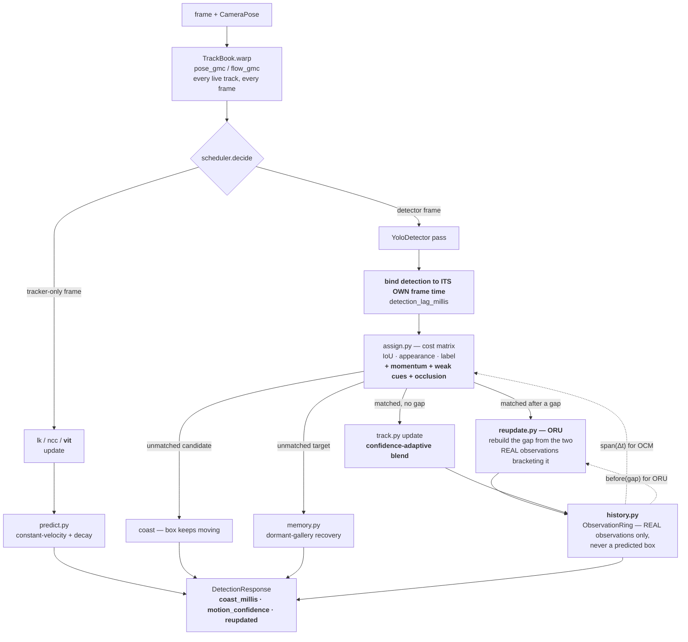
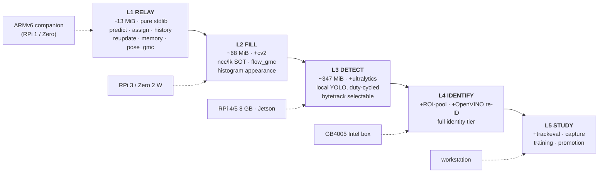

# TRACKING-V3-PLAN — a levelled pipeline: observation-centric identity from ARMv6 to workstation

**Branch:** `feat/tracking-v3` (worktree, based on `master`).
**Origin:** a literature sweep of the SORT-family state of the art (§8), read against what
`feat/tracking-v2` actually shipped.
**Predecessor:** `docs/plans/active/TRACKING-V2-PLAN.md` (waves C0–C5, delivered 2026-08-12,
704 tests). V3 does not replace it; it attacks what V2's own design left estimation-centric.
**Companion measurement:** `docs/conclusions/CV-RATE-BUDGET.md` (why *Hold* needs < 50 ms and a
prior, not a threshold) and `docs/conclusions/TRACKING-REVIEW.md` (why identity needed an owner).

> **The one-line goal.** A track that has not been seen for a while stops trusting its own
> extrapolation. When evidence finally returns, the gap is **re-derived from the two real
> observations that bracket it** — not papered over with whatever the estimator drifted to.
>
> **And the deployment goal.** That fix, and every other one here, is arithmetic on boxes — so it
> runs unchanged on a 13 MiB ARMv6 relay carried by the airframe and on the workstation that trained
> the model it is holding identity for. One pipeline, five levels (§5).

---

## 0. Governing constraint — still a cv-service plan, and now also an affordability plan

V2's constraint holds unchanged: **no Java source file is modified by any wave**, the proto grows
additively in scalars and new messages only, and Java-side follow-ups are specified in §2.1 for a
separately-approved task.

V3 adds a second constraint, because the deployment range widened from "laptop + GB4005" to
"laptop + GB4005 + a companion computer that may have no NEON at all":

- **Every accuracy win in waves V2–V6 is pure arithmetic on boxes** — no pixels, no model asset, no
  `cv2`, no `numpy`. It costs the same on an ARMv6 companion as on the Intel box.
- **Everything that needs pixels, a model asset or a network is confined behind an explicit
  capability level** (§5), and the lowest level must load none of it.

This is not a nicety. It is what keeps one cv-service package deployable to all three targets
(`pyproject.toml` invariant **P1**, `TRACKING-PLAN` §3.3).

---

## 1. What V2 already ships — do not rebuild these

The literature's top recommendations are, in large part, already in the tree. An implementer who
re-derives them wastes a wave.

| State-of-the-art practice | Already delivered as |
|---|---|
| Track-lifecycle tuning, birth confirmation, hysteresis | `params.py` — `max_age_frames`, `min_hits`, `track_max_age_millis`, `memory_ttl_millis` |
| ByteTrack's two-stage low-confidence association | `engines/bytetrack.py`, **and** re-derived in our own matcher: `assign.py` splits targets on `AssignGates.high_confidence` |
| Camera-motion compensation, image-based | `engines/flow_gmc.py` (sparse flow) |
| Camera-motion compensation, **telemetry-based** | `engines/pose_gmc.py`, pure trigonometry, no pixels |
| Per-frame state warping (not lazy) | `TrackBook.warp()` runs for **every** live track every frame — N stalled frames accumulate N single-frame warps |
| Confidence decay of a coasting track | `predict.py` — `_CONFIDENCE_DECAY_SECONDS = 6.0`, `_MAX_EXTRAPOLATION_SECONDS = 2.0` |
| Coasted-vs-detected visual signalling | `player.ts` draws `COASTING` tracks dashed |
| Cheap appearance tie-breaker | `engines/histogram.py` (decision D7) |
| LK re-seeding + forward–backward error check | `lk.py` — `_RESEED_FRACTION`, `_FB_ERROR_MAX_PIXELS = 2.0` |
| Dormant gallery / re-acquisition after `max_age` | `memory.py` — four required gates, score reported never assumed |
| Own gated cost matrix + stdlib Hungarian | `assign.py` (decision D6) |

**Status correction to V2 §5b.** That section records `CameraPose` as "consumed but never
populated". **It is populated now** — `DetectionFrameCodec:164` (push) and
`PulledDetectionSession:141` (pull) both call `toWireCameraPose(attitude)`, landed with the
MEDIA-SOT / CV-RATE-CONTROL work. Telemetry ego-motion compensation is live, which is the single
most valuable thing on that list for a moving camera and the cheapest to run.

---

## 2. Decisions taken

| # | Question | Decision | Why |
|---|---|---|---|
| **E1** | Introduce a real Kalman filter to replace constant-velocity extrapolation? | **No.** Keep `predict.py`'s constant-velocity model; spend the effort on *observation-centric* correction instead. | Invariant P3 bans `numpy` outside `engines/`, and a hand-rolled 8-state filter in pure Python is both slower and a new source of tuning constants. The literature's own ablation is decisive here: OC-SORT reports that plain **linear interpolation beat Gaussian Process Regression** for gap reconstruction — online data is too sparse for a richer local model to pay. Our residual after `pose_gmc` cancels ego-rotation is small (CV-RATE-BUDGET §2: ego-motion is ~8× the target term, and it is the part we can cancel exactly). |
| **E2** | How, then, do we get the NSA-Kalman benefit (`R = (1−c)·R_base`)? | **Translate it, don't import it.** Make `track.py`'s velocity blend and `assign.py`'s gates functions of detection confidence. | We do not own a covariance to scale. The *principle* — a low-confidence observation should barely move the estimate, and the gate should widen as the prediction ages — maps exactly onto the two constants we do own. This is also the mechanism `CV-RATE-BUDGET` §1 already argued for in prose and never wired: *"Hold does not want a threshold at all — it wants evidence conditioned on a prior."* |
| **E3** | Observation history on `Track`, or a separate structure? | **Separate, bounded: `history.py`.** | `Track` is a mutable record read by five call sites; growing it a list invites unbounded retention and accidental aliasing. A ring with an explicit capacity keeps the memory bound checkable and keeps ORU/OCM testable without constructing a whole `Track`. |
| **E4** | Adopt a maintained tracker wholesale (BoT-SORT / Deep OC-SORT / Hybrid-SORT / OAS)? | **No.** Port the *mechanisms* into `assign.py`/`reupdate.py`. | Every such package bundles components we deliberately do not want: full ECC image CMC (we have exact telemetry CMC for free), ReID as a hard dependency (kills L1 and L2), and `lap`/`scipy` (violates P3/D6). We already own the seams they would replace. |
| **E5** | PD-SORT's pseudo-depth (box scale as a depth proxy + DVIoU)? | **Non-goal.** | It assumes a roughly horizontal camera where box scale tracks depth monotonically. On a downward-looking drone, box scale is confounded by altitude change and gimbal pitch, so the proxy is not merely weak — it is actively wrong in the manoeuvre where it would matter. Recorded so nobody re-proposes it. |
| **E6** | UCMCTrack's ground-plane tracking (associate in world coordinates, not image coordinates)? | **Deferred to V4, deliberately reachable.** | It is the structurally best answer to ego-motion — a target that does not move in the world has zero velocity, whatever the camera does — and we already have `GeoProjection` from the visual-geo work. But it couples identity to geolocation accuracy and needs the S2 fixed-camera calibration path. Nothing in V3 blocks it. |
| **E7** | Appearance: keep the histogram, or add a learned descriptor? | **Keep histogram as the default; add an ROI-pooled descriptor and an optional OpenVINO re-ID, both level-gated.** | The generic MOT literature says CMC matters more than appearance on moving cameras (Deep OC-SORT: CMC +4.96 HOTA on DanceTrack). The **UAV-specific** literature says the opposite on real drone footage (AMOT on VisDrone/UAVDT: IDF1 61.4 vs OC-SORT 50.4). They genuinely disagree, and the UAV result is measured on our problem. D7's "later file drop" is therefore worth more than it was priced at — but only where it is affordable, hence the level gate (§5). |
| **E8** | What is the acceptance baseline? | **A harder harness, built and recorded *before* any product change.** | V2's final scoreboard is **0 IDSW and 100% recovery on all ten scenarios**. A saturated benchmark cannot show an improvement or a regression. Wave V0 exists solely to make the harness able to see the defects V2–V6 fix. |
| **E9** | Trust the published numbers? | **No — reproduce direction, not magnitude, on our own sequences.** | arXiv:2509.18451 measures this whole tracker family at **3–4× higher position error (ADE 31–114 px)** on small, fast, non-linearly-moving targets than on MOT benchmarks, because constant-velocity assumptions fail exactly there. That is our target profile (CV-RATE-BUDGET §2: 4.2 px/frame of target motion at 200 m). Leaderboard deltas are hypotheses here, not forecasts. |
| **E11** | ByteTrack or our own `cost` matcher as the default associator? | **`cost` at levels L1–L2; `bytetrack` selectable from L3 up, recommended only above ~25 simultaneous detections.** | **Measured, not assumed** (§5.1). At the target count a drone actually tracks, `cost` is **5.5× cheaper** (154 µs vs 840 µs at N=10) and costs **+3.5 MiB against ByteTrack's +17 MiB**, because `bytetrack` drags `numpy` in. Above N≈25–30 the ordering inverts — our O(n³) stdlib Hungarian loses to ByteTrack's vectorization (3323 µs vs 2585 µs at N=40). The irony worth stating: **ByteTrack's RAM is free exactly where it is not needed (L3+, where `numpy` is already resident for the detector) and expensive exactly where that matters (L1, the airframe).** |
| **E12** | Is a capability level a demand or a ceiling? | **A ceiling.** The session serves `min(requested, affordable)` and reports both. | A stream that asks for more than the host can afford must degrade and log once (**P5**), never fail. This is what lets one configuration ship to a companion computer, a Pi 4 and a workstation unchanged — and what lets the workstation shed levels under load instead of dropping streams. |
| **E10** | A DNN single-object tracker (NanoTrackV2 / VitTrack) to replace `lk`/`ncc`? | **Offer it, don't default to it.** | VitTrack's real draw is not accuracy — it is that its confidence **actually drops when the target is lost**, which `lk`/`ncc` confidence does not do reliably, and which `session.py`'s trigger (b) consumes. That makes the duty cycle honest. But it needs a model asset and OpenCV DNN, so it cannot be the onboard default. |

---

## 3. Frozen wire contract — the complete additive diff

**The rule that keeps Java untouched is unchanged (V2 §2, decision D5):** *scalar fields and new
messages only; never a new value in an existing enum,* because `DetectionFrameCodec` maps every wire
enum with an exhaustive Java switch expression.

Field numbers continue from what is in the tree today (`Detection` ends at 11, `DetectionResponse`
at 21, `TrackingConfig` at 10).

```proto
message TrackingConfig {
  // ... fields 1-10 unchanged ...
  int32  capability_level      = 11;  // NEW -- 0 = auto-probe; 1..5 = explicit CEILING (see §5)
  int32  history_size          = 12;  // NEW -- observation ring depth; <=0 = server default
  int32  momentum_span_frames  = 13;  // NEW -- OCM observation span; <=0 = server default (3)
  int32  reupdate_max_gap_millis = 14; // NEW -- longest gap ORU will reconstruct; <=0 = default
}

message Detection {
  // ... fields 1-11 unchanged ...
  int64 coast_millis      = 12;  // NEW -- since last DETECTOR confirmation; 0 = confirmed this pass
  float motion_confidence = 13;  // NEW -- decayed prediction confidence; 1.0 = fresh evidence
  bool  reupdated         = 14;  // NEW -- this track's gap was reconstructed by ORU
}

message DetectionResponse {
  // ... fields 1-21 unchanged ...
  int64 reupdate_millis       = 22;  // NEW -- ORU cost this frame; 0 = none ran
  int32 reupdated_tracks      = 23;  // NEW -- tracks backfilled this frame
  int64 detection_lag_millis  = 24;  // NEW -- measured capture -> association lag (0 = unknown)
  int32  capability_level_served = 25;  // NEW -- level that ACTUALLY ran (<= requested)
  string capability_level_reason = 26;  // NEW -- why it was capped ("" = served as requested)
}
```

Compatibility, as checkable claims — identical in form to V2's:

- Every addition is a scalar → `DetectionFrameCodec`'s switches stay exhaustive.
- Java never sets `TrackingConfig` 11–14 → they arrive as proto3 zero → `capability_level = 0`
  means auto-probe, and `params.resolve()`
  applies the `CV_TRACK_*` default, exactly as it already does for fields 2–6 and 8–10.
- **Acceptance:** `./mvnw -B -pl vision-proto compile` green with **zero Java source edits**, and a
  `TRACKING_MODE_OFF` stream still serializes byte-identically to the pre-T1 service (**P1**).

### 3.1 Java-side follow-ups, specified but NOT in this plan

Each is small, each is separately approvable, none blocks a wave:

- `DetectionFrameCodec` maps `coast_millis` / `motion_confidence` into the perception domain record
  so the SSE stream carries them; `player.ts` then modulates the dashed box's **opacity** by
  `motion_confidence` instead of drawing every coasted box identically. This is the operator-facing
  payoff of the whole plan — a box that visibly fades as its evidence ages.
- `detection_lag_millis` becomes a Fly-cockpit health readout beside the existing rate figures; it is
  the number `CV-RATE-BUDGET` §1 budgets at **< 50 ms** for *Hold* and that nothing measures today.
- Raising ASSOCIATE's sample rate above 10 fps stays refused (V2 decision D1) unless V0's harness
  proves rate is the binding constraint — now, for the first time, it can prove it.

---

## 4. Frozen Python contracts

Where V3 inserts into the per-frame flow — **bold** is new, everything else ships today:



The dotted edges are the whole idea: association and gap reconstruction read **evidence**, not the
estimator's own output. That loop does not exist today.

```
cv_service/tracking/
  history.py    NEW  bounded observation ring per track            pure stdlib
  reupdate.py   NEW  virtual-trajectory backfill (ORU)             pure stdlib
  predict.py    EXTENDED  confidence-aware gate widening           pure stdlib
  assign.py     EXTENDED  momentum + weak-cue + occlusion terms     pure stdlib
  track.py      EXTENDED  confidence-adaptive velocity blend        pure stdlib
  levels.py     NEW  capability ladder + host probe + degradation     pure stdlib
  params.py     EXTENDED  levels + new knobs; still the only <=0 sentinel resolver
  scheduler.py  EXTENDED  motion-magnitude-aware cadence
  session.py    REWIRED   still composition only
  engines/
    roi_pool.py NEW  descriptor pooled from the detector's own pass   cv2/numpy
    osnet_ov.py NEW  OpenVINO re-ID descriptor, "box" profile only    optional import
    vit.py      NEW  OpenCV-DNN SOT with an honest lost signal        cv2
tools/trackeval/  EXTENDED  harder scenarios + drift metrics + real-footage replay
```

**Invariant P3 is unchanged and still tested:** everything under `tracking/` outside `engines/`
imports no `cv2`/`numpy`/`ultralytics`. `history.py` and `reupdate.py` land on the pure-stdlib side
deliberately — they are the two files that carry V3's main accuracy win, and they must run on a
companion computer with no OpenCV at all.

### 4.1 `history.py` — the substrate both ORU and OCM need

`Track` today holds `box`, `velocity_x/y`, `last_seen`, `last_confirmed` — a *current state*, with
no record of the evidence that produced it. Every observation-centric mechanism in the literature
needs the opposite: the real observations themselves.

```
@dataclass(frozen=True)
class TimedObservation:
    timestamp: float          # `Observation` itself carries no clock reading
    observation: Observation

class ObservationRing:
    """Bounded per-track ring of REAL observations (SOURCE_DETECTOR only).

    Coasted/tracker-produced boxes are deliberately NOT recorded: the entire
    point of an observation-centric method is that it never feeds its own
    extrapolation back in as if it were evidence."""
    def record(self, observation, now) -> None
    def latest(self) -> TimedObservation | None
    def before(self, timestamp) -> TimedObservation | None   # last real obs before a gap
    def span(self, frames) -> tuple[TimedObservation, TimedObservation] | None   # OCM's Dt pair
```

**`TimedObservation` is a correction to this section, made during wave V2.** The signatures
above originally returned a bare `Observation` — which carries no timestamp, so §4.2's
interpolation `z̃(t) = z(t₁) + (t−t₁)/(t₂−t₁)·(z(t₂)−z(t₁))` had no `t₁`/`t₂` to compute with.
The ring pairs each observation with the instant its content was actually true (its **capture**
instant) — **corrected here 2026-08-14, wave V6's instrument repair.** This section originally
said "the clock reading it arrived at," which is indistinguishable from capture time for every
caller that existed through wave V3 (none of them knew of a detector lag to separate the two).
Wave V6 introduced the first caller that does (`late_correction`, §4.5): recording an offboard
detector's box under its arrival time instead of its capture time mixes two clocks in every later
`reupdate()` bracket built against it, which diverges rather than merely erring once the elapsed
time it divides by is dominated by the dropped lag. See `cv_service/tracking/history.py`'s own
`TimedObservation`/`ObservationRing.record` docstrings for the fix, and `tools/trackeval/
BASELINE.md`'s `latency` writeup for how the repair that found this defect traced it.

**Exclusion is stricter than "not predicted", also decided in V2.** `SOURCE_TRACKER`
observations arrive in two shapes: `predicted=True` (a coast on a stalled tracker) and
`predicted=False` (LK/NCC's own successful per-frame match). **Both are excluded.** The second
is the non-obvious one — it is a real pixel measurement, but it is the *visual tracker's own
local estimate*, not independent evidence, so admitting it would let ORU bracket a gap with
exactly the drift ORU exists to delete. FOLLOW's operator lock needs no special case: it is
already `SOURCE_DETECTOR`.

The exclusion of predicted boxes is the load-bearing rule. `Observation.predicted` already
distinguishes them, and `velocity_x/y` already respects that distinction — the ring extends the same
evidence-vs-extrapolation discipline to history.

### 4.1b CLOSED by wave V3 — which frame is a remembered observation expressed in?

Wave V2 surfaced a question this plan had not asked, and V3 cannot avoid it.

`TrackBook.warp()` moves every live track's `box` into the **current** frame's coordinates once
per frame. Ring entries are not warped — each stays in the camera frame it was captured in. So
interpolating between `z(t₁)` and `z(t₂)` mixes coordinate systems, and the error is exactly
proportional to how much the camera moved during the gap — which, per `CV-RATE-BUDGET` §2, is
the dominant term on a drone (~32 px/frame at 30°/s yaw against ~4 px/frame of target motion).
**ORU would be reconstructing the gap in the wrong space precisely when the gap matters most.**

Three candidates, to be decided by measurement in V3, not by preference:

| Option | Cost | Risk |
|---|---|---|
| Warp every ring entry every frame | capacity × live tracks per frame | pure arithmetic, but the ring stops being free |
| Record the cumulative `Transform` alongside each entry and compose on read (`Transform.compose` already exists) | one compose per ORU call | leading candidate — pays only when ORU actually runs |
| Accept the error, bound the gap | zero | only defensible if measured drift over `reupdate_max_gap_millis` is small; on a panning camera it will not be |

Whichever is chosen, the `nonlinear` and `pan_occlusion` scenarios are what settle it: the second
superposes ego-motion on the gap and is the one that will expose a wrong answer here.

**Decision: compose on read, and the measurement was not close.** Wave V3 added
`Track.history_transform`, composed forward once per live track per frame by `TrackBook.warp()`
(**O(1) per track, not O(capacity)**) and reset to `IDENTITY` exactly when the ring admits a new
real observation; `reupdate.py` warps the bracketing entry through it before interpolating.
Replaying `pan_occlusion`'s own construction (world-static target, 0.02 frame-widths/frame of pan,
a 25-frame gap) through the real `warp()`/`reupdate()` path gives **0.5 normalized — 160 px on a
320 px frame — of reconstruction error uncorrected, against 0.0 corrected.** That is exactly the
full pan displacement: uncorrected, ORU would have rebuilt the gap while ignoring every pixel the
camera moved. `nonlinear`, which has no ego-motion, is the control and both options agree there —
which is what says the measurement is measuring the right thing. Option 3 ("accept the error") is
therefore refuted, not merely rejected. No `Transform.inverse()` is needed: `history_transform`
only ever composes forward.

### 4.2 `reupdate.py` — ORU, the Observation-Centric Re-Update

When a track is re-anchored after a gap, do not accept the drifted estimate and carry on. Rebuild
the gap from the two real observations that bracket it, and re-run the update through it:

```
z̃(t) = z(t₁) + (t − t₁)/(t₂ − t₁) · (z(t₂) − z(t₁))     for t₁ < t < t₂
```

where `t₁` is the last real observation before the gap (`ObservationRing.before`) and `t₂` is the
detection that just re-anchored it. The track's position, velocity and descriptor are then
re-derived along that virtual trajectory, deleting the accumulated extrapolation error rather than
inheriting it.

```
@dataclass(frozen=True)
class Reupdate:
    steps: int              # virtual observations synthesised
    gap_millis: int
    drift_before: float     # |estimated box - virtual box| at re-anchor, normalized
    drift_after: float      # always 0 by construction; reported for the harness

def reupdate(track, ring, observation, now, *, max_gap_millis) -> Reupdate | None
    """None when there is no bracketing pair, or the gap exceeds max_gap_millis --
    a gap too long to reconstruct honestly is left to `memory.py`'s recovery path,
    which reports `identity_confidence` instead of pretending to a trajectory."""
```

**Why this and not a longer `max_age`:** extending `max_age` lets a *drifting* box live longer,
which raises the odds it snaps onto the wrong nearby object. ORU attacks the drift itself, so the
same `max_age` becomes safer rather than merely longer.

### 4.3 `assign.py` — three new cost terms, each independently disable-able

The cost function gains three additive terms. The existing three are untouched.

```
cost(c, t) = w_iou · (1 − IoU(c.box, t.box))
           + w_app · c.descriptor.distance(t.descriptor)
           + w_lab · (0 if labels compatible else 1)
           + w_mom · (1 − cos∠(v_obs(c), t.box.center − c.last_obs.center))   # OCM
           + w_cue · weak_cue_distance(c, t)                                   # Hybrid-SORT
           + w_occ · occlusion_penalty(c, all_candidates)                      # OAS
```

- **OCM (`w_mom`)** — the direction is computed from **two real observations `momentum_span_frames`
  apart** (`ObservationRing.span`), never from `track.velocity_*`. The whole point is that the
  filter's own velocity estimate is the noisy quantity; a wider observation gap measurably reduces
  the noise of the direction estimate.
- **Weak cues (`w_cue`)** — confidence delta, box-height ratio, and smoothed velocity direction, all
  already free in the detector's output. Training-free, plug-in.
- **Occlusion penalty (`w_occ`)** — a candidate heavily overlapped by another candidate is a
  candidate whose box is unreliable; offset its cost rather than letting a partially-hidden box win
  a match on geometry alone.

`AssignWeights` grows `momentum`, `cue`, `occlusion`; `AssignGates` grows `min_motion_confidence`
(reject a match to a prediction we no longer trust) and `gate_widening` (E2: the IoU gate relaxes as
`motion_confidence` decays, so an older prediction is allowed to be further off).

### 4.4 `track.py` — E2's confidence-adaptive blend

`_VELOCITY_BLEND` is a fixed constant today. It becomes a function of the observation's confidence:
a 0.9 detection updates velocity briskly; a 0.15 detection barely perturbs it. Same one-line
structure, same cost, and it is the closest honest analogue of NSA-Kalman available to a system
that owns no covariance.

### 4.5 `session.py` — late-detection back-correction

In pull mode the worker owns the clock and already reports `capture_skew_millis`; in push mode the
frame carries `timestamp_millis`. Either way, a detection describes the frame it was computed on,
not the frame that is current when it lands. Applying it "now" is a systematic lag bias.

The correction is mechanically ORU applied per-detection rather than only post-occlusion: bind the
detection to its own frame time, re-derive the track state at that historical point via
`reupdate.py`, and re-propagate forward over the short window in `history.py`. `detection_lag_millis`
reports the measured lag so the bias is visible instead of assumed.

---

## 5. Capability levels — one pipeline, five affordability tiers

The same trained artefacts and the same wire contract at every level. **A level changes who
computes, never what is computed and never which model is used** — so a model trained on the
workstation at L5 is the same file a Pi 4 runs at L3, and the same detections an ARMv6 companion
consumes at L1 from offboard.

### 5.1 What each tier actually costs — measured, not quoted

Measured on this repository's `cv-service/.venv`, AMD Ryzen 5 5600U (12 threads), Python 3.12,
`yolo26n`, 640×360 frames. Method: `resource.ru_maxrss` after each import chain; 300 timed calls
after warm-up, median and p95. Reproduce with the scripts referenced in `BASELINE.md`.

| Component | Median CPU | Resident memory | Pulls in |
|---|---|---|---|
| bare interpreter | — | **9.3 MiB** | — |
| `assign.py` — `cost` matcher | **49 µs** @5 · **154 µs** @10 · 643 µs @20 · 3323 µs @40 | **12.8 MiB** (+3.5) | nothing |
| `engines/bytetrack.py` | 537 µs @5 · **840 µs** @10 · 1386 µs @20 · **2585 µs** @40 | **26.5 MiB** (+17) | `numpy` |
| `cv2` (SOT · flow GMC · histogram) | — | **50.9 MiB** | `numpy` |
| `engines/ncc.py` update | **361 µs** / target | 68 MiB with cv2 | `cv2` |
| `engines/lk.py` update | 761 µs / target | 68 MiB with cv2 | `cv2` |
| `YoloDetector` (`yolo26n`, one pass) | **20.5 ms** | **347 MiB** | `ultralytics`, `torch` |
| `engines/pose_gmc.py` | ~0 (trigonometry) | +0 | nothing |

Three findings that set the ladder:

1. **The detector is not merely slower, it is a different order of memory.** 347 MiB against the
   13 MiB of a stdlib identity core is a 27× gap — and it is the gap, not the millisecond count,
   that decides whether a host can run it at all. A 256/512 MiB companion cannot, on RAM alone.
2. **`cost` beats `bytetrack` where a drone lives, and loses where a crowd lives.** The crossover
   is N ≈ 25–30 detections (decision E11).
3. **Ego-motion compensation from telemetry is genuinely free** and already live — it is the one
   accuracy win that costs nothing at every level.

### 5.2 The ladder



| Level | Name | Adds | Boxes come from | RSS | Runs on |
|---|---|---|---|---|---|
| **L1** | RELAY | `predict` · `assign` · `history` · `reupdate` · `memory` · `pose_gmc` | **offboard**, over the wire | ~13 MiB | anything, incl. ARMv6 with no NEON |
| **L2** | FILL | `cv2`, `ncc`/`lk` SOT, `flow_gmc`, `histogram` | offboard + local visual fill between passes | ~68 MiB | needs a real OpenCV build — ARMv7/aarch64, not ARMv6 |
| **L3** | DETECT | `ultralytics`, local duty-cycled YOLO, `bytetrack` becomes selectable | **locally** | ~347 MiB | ≥1 GB RAM realistically ≥2 GB |
| **L4** | IDENTIFY | `roi_pool`, optional OpenVINO re-ID, full appearance weighting | locally, with identity | +model | the Intel box / a workstation |
| **L5** | STUDY | `tools/trackeval`, capture, training, promotion | locally, and recorded | + dataset | workstation only — never an airframe |

**L1 is the level that makes a weak companion worth carrying.** It has no pixels and cannot produce
a box, so it is not "tracking without detection" — it is *holding identity while somebody else
detects*. That is exactly the job on a link that stutters: the detector runs on the workstation or
the GB4005 box, and the airframe keeps the track alive, coasting and re-updating through every gap
in the link with a 13 MiB footprint. Waves V2–V6 — ORU, momentum, adaptive motion, back-correction —
are **all available at L1**, because every one of them is arithmetic on boxes.

### 5.3 Negotiation, degradation and the one thing a level must not change

- `capability_level = 0` (the proto3 zero Java always sends) means **auto-probe**: `levels.py` asks
  what imports succeed and what memory is available, and picks the highest affordable level.
- A requested level is a **ceiling, not a demand** (E12). The session serves `min(requested,
  affordable)` and reports `capability_level_served` plus a `capability_level_reason`.
- Degradation is always downward and always logged once, never raised (**P5**). Missing OpenVINO →
  L4 serves as L3. Missing model asset → L3 serves as L2. Missing OpenCV → L2 serves as L1.
- **The wire contract is identical at every level.** Field meanings never change; only which fields
  are populated does. A client cannot tell what level served it except by reading
  `capability_level_served` — which is the point: an operator's UI, the map, and the recorder work
  the same against an ARMv6 relay and a workstation.
- The level is **hot** — it rides `TrackingConfig`, which `PullControl` already restates per message,
  so a loaded host can shed a level without dropping the stream.

---

## 6. Waves

Every wave ends with: its scoped `pytest` green, `cv-service/MODULE.md` updated in the same task, and
one commit. **Level** states the lowest capability level (§5) at which the wave's benefit is available
— which is also the answer to "does this run on the airframe".

| Wave | Scope | Level | Acceptance |
|---|---|---|---|
| **V0** | `tools/trackeval/` only — no product code | n/a | New scenarios `nonlinear`, `tiny_fast`, `pan_occlusion`, `latency`, `crossing_similar`; new metrics **ADE/FDE during coast** beside IDSW/FM/MT; a real-footage recorder + offline replay. **The wave passes when the shipped V2 configuration scores visibly imperfect on the new scenarios** — a harness that cannot see the defect cannot prove the fix. V2's ten existing scenarios must still score exactly as `BASELINE.md` records |
| **V1** | `levels.py` NEW · `params.py` · `registry.py` · `session.py` | builds the ladder | Five levels resolve; `capability_level = 0` auto-probes; a level is a ceiling and `capability_level_served` ≤ requested (**E12**); **L1 provably imports no `cv2`, `numpy`, `ultralytics` or model asset** — asserted by inspecting `sys.modules`, not by reading the source; every downgrade logged exactly once (**P5**); §5.1's cost table reproduced by a committed micro-benchmark |
| **V2** | `history.py` NEW · `track.py` | **L1** | Ring is bounded by construction; predicted boxes are never recorded; **zero behavioural delta** — the full V0 scoreboard reproduces the V2 baseline exactly |
| **V3** | `reupdate.py` NEW · `session.py` · `track.py` | **L1** | **Delivered.** `nonlinear` coast ADE **39.8 → 9.1 px (−77 %)**, PT→MT; 29 of 30 rows byte-identical; P7 reproduction proven with `CV_TRACK_REUPDATE_MAX_GAP_MILLIS=0`. **`long_occlusion` was struck from this criterion** — its motion is genuinely constant-velocity, so the pre-V3 estimate already converges to the right answer (≈0.0401 at re-anchor, measured, both before and after), and its 1.4 px sits at the position-jitter noise floor (`POSITION_JITTER=0.004` → 1.28 px). There was no drift there to remove; asking ORU to improve it was an error in this plan, not a shortfall in the wave |
| **V4** | `assign.py` · `params.py` | **L1** | `crossing_similar` stops **fragmenting** — V0 measured `IDSW=0 / FM=2` there, *not* the id-swap this row originally assumed, so the criterion is `FM → 0` with `IDSW` still 0 (`tools/trackeval/BASELINE.md` §2 records why); `tiny_fast`'s `IDSW=2` → 0; each of `w_mom`/`w_cue`/`w_occ` set to zero individually reproduces the V2 scoreboard (**P7**) |
| **V5** | `track.py` · `assign.py` · `predict.py` · `params.py` | **L1** | A sequence of deliberately low-confidence detections no longer whipsaws velocity; the widened gate recovers a track that V0 drops after a long coast |
| **V6** | `session.py` · `history.py` · `scheduler.py` | **L1** | `latency` scenario: with detections delivered N frames late, track position error is within X of the zero-latency run; `detection_lag_millis` populated and non-zero in pull mode. **This is the wave that makes L1 worth carrying** — an offboard detector is a late detector by definition |
| **V7** | `engines/roi_pool.py` NEW · `engines/osnet_ov.py` NEW · `registry.py` · `params.py` | **L4** | `crossing_similar` with visually similar targets keeps ids where the histogram cannot; L1/L2 provably load neither; absent OpenVINO degrades to ROI-pooled, absent that to histogram, each logged once (**P5**) |
| **V8** | `engines/vit.py` NEW · `registry.py` | **L3** | FOLLOW with `vit` reports a confidence that genuinely falls on target loss, and `session.py`'s trigger (b) fires on it earlier than `lk` does; default engine unchanged; absent model asset degrades to `lk` |

**Sequencing.** V0 → V1 → V2 are strictly first: V0 makes results measurable, V1 makes them
attributable to a level, V2 is the substrate for V3 and V4. V3–V6 share `session.py`/`assign.py` and
are sequential. **V7 and V8 touch disjoint files and can run in parallel with each other** once V1
exists, since both are measured by V0's harness and neither touches the identity core.

**Delivery order, if the airframe matters more than the leaderboard:** V0 · V1 · V2 · V3 · V6 gets a
levelled pipeline whose ARMv6-capable relay holds identity through link gaps and late detections —
the whole L1 story — before a single line that needs a GPU, a model asset, or OpenCV is written.

---

## 6b. Open, after the first five waves

Three findings the delivered waves surfaced and deliberately did not close. None blocks L1; all are
cheap, and the first is the only one with a measured cost attached.

| # | Finding | Where | Why it was left |
|---|---|---|---|
| **O1** | **FOLLOW does not benefit from late-detection correction.** `_run_cost_associate` writes the corrected box into the booked `Observation`, so every consumer sees it. `_follow_verify` calls `engine.init()` on the **raw** box before `_late_corrected_box` runs — so LK is anchored on the uncorrected patch and tracks it through every coast frame between verify passes. The correction patches the reported number, never the pixels being followed. | `session.py` | Diagnosed, not fixed: re-anchoring the SOT on a corrected box changes what FOLLOW *tracks*, not merely what it reports, and deserves its own wave and its own measurement. `latency`/FOLLOW is the scenario waiting for it |
| **O2** | **`ObservationRing.before()` assumes non-decreasing timestamps.** With a jittering lag estimate, `captured_at` can in principle arrive slightly out of order, so the reverse scan returns a valid but not-necessarily-closest bracket. | `history.py` | Pre-existing and unexercised — the regression scenarios use a fixed lag. But it is now a known soft spot in exactly the path L1 uses, and the measured ±15 ms jitter from `pull/clock.py` is real |
| **O3** | **The harness cannot see non-physical state.** A track whose velocity diverged to 1e16 and a track that is merely lost both score `ML=1`; every column in the table is blind to the difference. That is why the capture-time defect survived a wave. | `tools/trackeval/metrics.py` | A plausibility check — reject or flag a reconstructed velocity beyond any physically sensible bound — would have caught it in V6 rather than a wave later. Cheap, and the natural companion to coast ADE/FDE |

| **O4** | **ORU's guards apply to `cost` only.** Every guard this plan added — velocity, density, bracket shape — lives on `TrackBook`'s `Track`. `bytetrack` keeps its state inside a third-party engine, so ORU, ego-motion warping and history never reach it. Measured: all 21 `bytetrack` ORU pairs are byte-identical with ORU on or off. | `session.py` | Structural, and documented in `session.py`'s own reasoning. But it means the L3 DEFAULT associator is untouched by waves V2/V3/V6 — the opposite of the intended ladder, where the airframe should get the cheap version of what the workstation gets |
| **O5** | **The shape check's FOLLOW cost is unmeasurable.** Enabling Check A at `0.40` is a clear win across 21 real ASSOCIATE pairs (−97 IDSW, +0.7 pp recovery) and moves exactly one synthetic row against it: `pan`/FOLLOW `implaus_n` 0 → 8, with position, MT/PT/ML and coast error all untouched. Velocity made non-physical while every other column stays blind — the defect shape O3 exists for. | `reupdate.py` · `BASELINE.md` | Shipped ON by explicit decision, cost recorded rather than hidden. **MOT17 carries no pixels, so FOLLOW cannot be measured on real footage at all** — resolving this needs aerial footage with frames, which is now the deciding measurement for three separate open questions. `CV_TRACK_REUPDATE_MAX_SHAPE_LOG_RATIO=0` reverts |

---

## 7. Non-goals

Unchanged from V2 §5, plus, stated so they are not re-proposed:

- **No pseudo-depth / DVIoU** (decision E5 — the proxy is wrong for a downward-looking camera).
- **No ground-plane association** (E6 — right idea, belongs with S2 geolocation, deferred to V4 of
  this line of work).
- **No wholesale tracker adoption** (E4).
- **No real Kalman filter** (E1).
- **No cross-stream identity, no durable trajectory table, nothing that touches an airframe, and no
  Java source edits** — as V2.

---

## 8. Evidence base

Every wave traces to published work. Provenance note: these were collected in a literature sweep for
this plan and the **numbers are cited, not independently reproduced by us** — per decision E9 they
are hypotheses to test against our own footage, not forecasts.

| Wave | Mechanism | Source | Reported effect |
|---|---|---|---|
| V3 | ORU — observation-centric re-update | OC-SORT, arXiv:2203.14360 (CVPR'23) | MOT17-val 64.9 → 66.3 HOTA from ORU alone; linear interpolation beat GPR |
| V3 | **OCR — observation-centric recovery** (re-anchor against the last *real* observation when the prediction-based test fails) | OC-SORT, same paper, third module | Not planned for this wave — re-derived from first principles during implementation because **ORU is unreachable without it in FOLLOW**: `reupdate()` only fires after a successful re-anchor, and a prediction running the wrong way can never clear the IoU test that gates it. Offered as a *second candidate on failure* at the same threshold, never a widened gate, so it cannot spoil a match the primary already made |
| V4 | OCM — observation-centric momentum | OC-SORT, same | DanceTrack-val 48.5 → 52.1 HOTA; runs at **793 fps on one CPU core** |
| V4 | Weak cues (confidence, height, direction) | Hybrid-SORT, arXiv:2308.00783 (AAAI'24) | Training-free plug-in; largest gains on occlusion + non-linear motion |
| V4 | Occlusion-aware cost offset | OAS, arXiv:2603.06034 (CVPR'26) | +2.08 HOTA / +3.05 IDF1 averaged across four host trackers |
| V5 | Confidence-scaled measurement noise | NSA-Kalman via StrongSORT / BoT-SORT, arXiv:2206.14651 | Part of BoT-SORT's MOT17-val 67.88 → 69.17 HOTA ladder |
| V6 | Detector-slower-than-video is a sound trade | arXiv:2309.02666 (measurement study) | 50–67 % compute recovered at ≈0.5–2 % MOTA cost |
| V7 | Appearance matters *more* on real UAV footage | AMOT, arXiv:2508.01730 | VisDrone IDF1 61.4 vs OC-SORT 50.4, ByteTrack 37.0; UAVDT 74.7 vs 64.9 / 59.1 |
| V7 | Adaptive appearance weighting + EMA bank | Deep OC-SORT, arXiv:2302.11813 | MOT17 HOTA 63.2 → 64.9; AW the largest single ablation contributor |
| V8 | Edge-viable DNN SOT with a real lost signal | OpenCV Zoo VitTrack / TrackerNano | NanoTrackV2 ~30 fps on a Pi 4 CPU; VitTrack better LaSOT AUC and a confidence that actually drops |
| E0 | Why CMC is already our biggest win | Deep OC-SORT ablation | CMC +0.46/+0.75 HOTA on static-camera MOT17/20 but **+4.96 on DanceTrack** — value scales with camera motion |
| E9 | Why not to trust the deltas | arXiv:2509.18451 (2025) | This whole family shows **3–4× higher position error** on small fast non-linear targets |

**The one place the sources disagree, recorded honestly.** Deep OC-SORT's ablation says motion +
CMC dominates appearance on moving cameras; AMOT says appearance dominates on real UAV datasets
where ByteTrack and OC-SORT both trail badly. Decision E7 resolves this by *not* resolving it:
histogram stays the default everywhere, and the stronger descriptor is added only where it is
affordable — so V0's harness, on our own footage, gets to settle it.

---

## 9. Invariants every wave must preserve

V2's P1–P6 carry over verbatim:

- **P1** `TRACKING_MODE_OFF` stays byte-identical to the pre-T1 service.
- **P2** The tracker/motion/appearance paths never acquire `InferenceGate`.
- **P3** `tracking/` outside `engines/` imports no `cv2`/`numpy`/`ultralytics`.
- **P4** No cadence, threshold or count literal outside `params.py` and an engine's own constants.
- **P5** Every degradation is logged once and never raises.
- **P6** No Java source file is modified.

And V3 adds two:

- **P7 — Reversibility.** Every new cost term, gate and blend is disable-able, and with all V3
  weights zeroed the harness must reproduce the V2 scoreboard exactly. A plan whose changes cannot
  be individually switched off cannot attribute its own results.
- **P8 — L1 stays pure.** Level 1 must import no `cv2`, no `numpy`, no `ultralytics`, and load no
  model asset — asserted by inspecting `sys.modules` in a test, not by reading the source. Waves
  V2–V6 must remain **fully available at L1**. This is the invariant that keeps one package
  deployable from an ARMv6 companion to a workstation; it is free to hold and expensive to recover,
  and every accidental top-level import in `tracking/` silently ends the onboard story.
- **P9 — A level never changes meaning, only who computes.** The wire contract, field semantics and
  model artefacts are identical at every level. A stream may be served at a lower level than it
  asked for; it may never be served *different* answers to the same fields.
