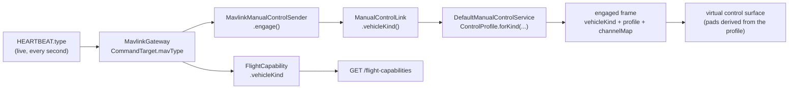

# VEHICLE-CONTROL-PROFILES — working context

Started 2026-08-23. Branch `feat/vehicle-control-profiles`, cut off `feat/telemetry-only-onboarding`
(the ESP32 rover this task is verified against only exists on that branch).

**Task, in the operator's words:** *"Can we control the esp32 from browser, and how do we set the
roll, pitch, arm etc. I need a proper setup for it. Remember that drone have throttle 0-100, and
car — 50-0 as reverse and 50-100 as forward. Create a proper setup for drone, rover etc."*

Companion docs: [OPERATOR-CONTROL-CONTEXT.md](OPERATOR-CONTROL-CONTEXT.md) (the audit this extends —
its D1/D6/G4/G6 are consumed, not re-litigated), [RC-CONTROL-PLAN.md](RC-CONTROL-PLAN.md),
[RC-CONTROL-PHASE1-PLAN.md](../done/RC-CONTROL-PHASE1-PLAN.md) (the frozen `/ws/manual-control`
contract this extends **additively**),
[TELEMETRY-ONLY-ONBOARDING-CONTEXT.md](TELEMETRY-ONLY-ONBOARDING-CONTEXT.md) (the rover's onboarding
path, and B4 — the reason a telemetry-only asset still needs a paired video device to be flown).

---

## 1. The two questions, answered against the code as it stands

### 1.1 "Can we control the esp32 from browser?"

**Only with a USB gamepad physically plugged into the laptop.** There is no on-screen control
surface anywhere in the app.

`RcInputService` (`vision-web core/rc/rc-input.service.ts`) is the *sole* input source, and it reads
`navigator.getGamepads()` and nothing else. `ManualControlClient` injects it directly, streams its
`axes()`/`buttons()` signals, and — decisively — carries a **gamepad-disconnect deadman**:

```ts
effect(() => { if (!this.rc.connected() && this.isSessionLive()) this.release(); });
```

With no gamepad, `connected()` is `false`, so even if the engage gate were bypassed the session
would release itself on the next tick. `engageDisabledReason()` states the same thing to the
operator's face: *"Plug your transmitter in first."*

So: **no gamepad, no control.** That is the honest answer to question 1 today.

### 1.2 "How do we set the roll, pitch, arm etc.?"

Two different transports, and they are not equally reachable:

| Input | Path | Reachable from browser today |
|---|---|---|
| roll / pitch / yaw / throttle | `/ws/manual-control` → `ChannelMap.apply` → `RC_CHANNELS_OVERRIDE` #70 @33 Hz | **gamepad only** |
| arm / disarm / mode / RTL | `POST /api/assets/{id}/flight-command/*` → `MAV_CMD_COMPONENT_ARM_DISARM` / `MAV_CMD_DO_SET_MODE` | **yes** — `flight-command-panel` in the Fly cockpit, already built, two-stage arm confirm |

Arm and mode are fine. Sticks are the gap.

### 1.3 The defect the operator's throttle remark actually names

`ChannelMap.defaultMap()` is **one frozen map, hardcoded into the session**, and it is
airframe-blind:

```java
private final ChannelMap channelMap = ChannelMap.defaultMap();   // DefaultManualControlSession
```

```java
axis(0, 1),  // Roll     min 1000  center 1500  max 2000
axis(1, 2),  // Pitch    min 1000  center 1500  max 2000
axis(2, 3),  // Throttle min 1000  center 1500  max 2000   <-- centred
axis(3, 4),  // Yaw      min 1000  center 1500  max 2000
```

Every axis, throttle included, rests at **1500 µs**. That is the operator's point stated in
microseconds:

- On a **rover** 1500 µs is *stop*, 1000 µs is *full reverse*, 2000 µs is *full forward* — the map is
  accidentally correct, and the ESP32 firmware's own `Config.h` says so in as many words: *"RC1 and
  RC3 line up with ArduPilot's Rover RCMAP defaults and are both centre-sprung at 1500 us, which is
  what a bidirectional rover needs."*
- On a **copter** 1500 µs is **~50 % throttle**. A released stick is not idle. Engaging manual
  control on an armed multirotor with this map commands half throttle the instant the first frame
  lands.

The same map is simultaneously right for a car and dangerous for a drone, because nothing in the
chain ever asks what the vehicle is. This is OPERATOR-CONTROL's **G4** ("`ChannelMap` has
calibration fields that nothing ever configures") meeting its **G6** ("no pre-engage safety
interlock — nothing checks throttle position").

### 1.4 What the platform already knows but throws away

The vehicle family is **already decoded, live, on every heartbeat** — and then used for exactly one
thing.

`MavlinkGateway.CommandTarget#mavType()` carries `HEARTBEAT.type`. `FlightModes` (adapter-mavlink)
already sorts it into copter / plane / rover families to pick a mode table:

```java
private static final Set<Integer> COPTER_MAV_TYPES = Set.of(QUADROTOR, HEXAROTOR, OCTOROTOR, TRICOPTER, COAXIAL, HELICOPTER);
private static final Set<Integer> PLANE_MAV_TYPES  = Set.of(FIXED_WING, ...every VTOL variant);
private static final Set<Integer> ROVER_MAV_TYPES  = Set.of(GROUND_ROVER, SURFACE_BOAT);
```

That classification reaches `FlightCapability.selectableModes` and stops. It never reaches the
channel map. **The fix is not new knowledge — it is routing knowledge that already exists to the one
place that needs it.**

Measured, on the ESP32 rover, last session: firmware reports `MAV_TYPE_GROUND_ROVER` (10) →
`FlightModes` selects `ARDUPILOT_ROVER` → `/flight-capabilities` returned 11 Rover mode names. The
classification demonstrably works end to end already.

---

## 2. Decisions

Numbered `P*` so they don't collide with OPERATOR-CONTROL's `D*`, which stay in force.

| # | Decision | Because |
|---|---|---|
| **P1** | **`VehicleKind { COPTER, PLANE, ROVER, UNKNOWN }`** in `vision-flight`'s domain. Ground rover and surface boat are one kind | They share a control shape *and* an ArduPilot mode table. Splitting them would create two identical profiles that can drift |
| **P2** | **`ControlProfile` = the vehicle-kind-shaped `ChannelMap`.** `ControlProfile.forKind(kind)` is total — every kind has one | The session must never be left choosing a map by accident, which is what `defaultMap()` is today |
| **P3** | **Throttle travel is a property of the profile, not of the platform.** Copter/plane throttle is `UNIDIRECTIONAL` (rest = `minMicros` = idle = 0 %); rover throttle is `CENTERED` (rest = `centerMicros` = stop = 50 %) | Exactly the operator's framing. The two are not a preference — they are different physical machines |
| **P4** | **`ControlBinding.travel()` is derived, not stored**: a binding whose rest point equals its minimum is unidirectional. No new field, no way for a stored flag to disagree with the microseconds | One source of truth. The existing `toMicros` math already produces both shapes correctly with no change — see §3.1 |
| **P5** | **`ControlBinding` gains exactly one field, `ControlFunction function`.** The label stops being invented in vision-api | `ManualControlWebSocketHandler#labelFor` hardcodes `case 1 -> "Roll"` — a drone assumption baked into the *presentation* layer, where a rover's CH1 is steering |
| **P6** | **A profile binds only the channels its airframe actually has.** A rover binds CH1+CH3; CH2/CH4 go out as `IGNORE`, never as a fabricated 1500 | `ChannelMap.apply` already fills unbound channels with `IGNORE`. Sending centred pitch/yaw to a car is noise that a reader would mistake for real intent |
| **P7** | **Aux channels are not bound by default in any profile** | OPERATOR-CONTROL **D6** / finding **S3**: ArduPilot's own docs say do not let a joystick own the mode or aux channels — bind buttons to *commands*. Today's `defaultMap()` binds buttons 0..3 → CH5..8 against that advice; the new profiles drop it, and arm/mode keep going through the REST command panel that already exists |
| **P8** | **`UNKNOWN` keeps today's four-axis centred map, and says so out loud.** It is not silently upgraded to a guess | There is no universally safe default: unidirectional throttle at rest is *idle* on a copter and *full reverse* on a rover. Refusing to guess is the honest move; the UI shows the caveat rather than the platform inventing an airframe |
| **P9** | **The kind is read live, from the link, never from stored config**: `ManualControlLink.vehicleKind()`, resolved by the adapter from the `HEARTBEAT.type` it is currently hearing | CLAUDE.md rule 9 — newest telemetry wins. A stored airframe field would go stale exactly when it matters (the operator re-flashes the FC) |
| **P10** | **On-screen control is a second input *source*, not a second client.** `RcInputSource` abstracts "where axes come from"; gamepad and virtual both implement it, `ManualControlClient` reads the selected one | The whole session machinery — watchdog, keepalive, latency, deadman, audit — is input-agnostic already. Duplicating it for touch would be the wrong seam |
| **P11** | **The virtual surface renders from `engaged.channelMap`, and starts at rest.** A copter's virtual throttle initialises to 0 %, a rover's to 50 % | Turns OPERATOR-CONTROL **G6** (no pre-engage throttle interlock) from a gap into a structural guarantee: with a virtual stick the platform *owns* the initial position, so "engaged at half throttle" cannot happen |
| **P12** | **Pad layout is derived from the profile, not hardcoded**: rover = one pad (steer × throttle), copter/plane = two (yaw × throttle, roll × pitch) | Same reason as P2 — a hardcoded two-pad layout is the drone assumption again, one layer up |
| **P13** | **Wire changes are additive only.** New fields on `engaged` and on each `channelMap` row; no field removed, no meaning changed | RC-CONTROL-PHASE1 §4 is a frozen contract. An older client keeps working; it just doesn't render the new surface |
| **P14** | **An explicit operator override of the vehicle kind is deferred, and recorded here as deferred** | It needs a persisted per-asset field and a settings surface. The live heartbeat is correct for every ArduPilot vehicle including the ESP32 rover, so the override buys nothing today and would be the first thing to go stale (P9) |

### 2.1 Deliberately out of scope

Named so a later reader can tell "not built" from "not thought about":

- **G13's channel 9–16 release sentinel** (`65534`, not `0`). Still latent — these profiles bind
  nothing past CH8, so it stays latent. Fixing it belongs with D8's full-width release.
- **Calibration (D4)**, **TX modes 1/3/4 (D5)**, **`RC_OPTIONS`/`SYSID_MYGCS` readiness (D13)**,
  **shared/switch-arbitrated control (D10)**, **per-asset kind override (P14)**.
- **Copter/plane stick *direction*.** The profiles get the *travel* right (which is what the
  operator asked for and what is dangerous when wrong). Whether pitch needs `reversed` on a given
  airframe is per-vehicle calibration — the `reversed` flag exists in the domain and is left at
  `false`. The rover, being the vehicle actually on the bench, is verified end to end.

---

## 3. Design

### 3.1 Why `ControlBinding.toMicros` needs no change (P4)

The existing axis formula already produces both travels; only the constructor arguments differ.

```
axisMicros(v):  v>=0 -> center + v*(max-center)
                v<0  -> center + v*(center-min)
```

| Profile | min | center | max | v = 0 (rest) | v = +1 | v = −1 |
|---|---|---|---|---|---|---|
| rover throttle (`CENTERED`) | 1000 | 1500 | 2000 | **1500 — stop** | 2000 full fwd | 1000 full rev |
| copter throttle (`UNIDIRECTIONAL`) | 1000 | **1000** | 2000 | **1000 — idle** | 2000 full | 1000 (clamped, still idle) |

The unidirectional case falls out of `center == min`: the negative branch multiplies by
`(center-min) == 0`, so any accidental negative input is pinned at idle instead of doing something
surprising. That is why `travel()` is derived from `centerMicros == minMicros` rather than stored —
the microseconds *are* the truth.

### 3.2 The profiles

| Kind | Code | CH1 | CH2 | CH3 | CH4 | Pads |
|---|---|---|---|---|---|---|
| `COPTER` | `AETR` | Roll, centred | Pitch, centred | **Throttle, unidirectional** | Yaw, centred | 2 |
| `PLANE` | `AETR` | Roll, centred | Pitch, centred | **Throttle, unidirectional** | Yaw, centred | 2 |
| `ROVER` | `S-T-` | Steering, centred | — `IGNORE` | **Throttle, centred** | — `IGNORE` | 1 |
| `UNKNOWN` | `AETR?` | Roll, centred | Pitch, centred | Throttle, **centred** | Yaw, centred | 2 |

Channel numbers match ArduPilot's `RCMAP_*` defaults for each family, so no FC-side re-mapping is
required. The short code follows OPERATOR-CONTROL finding **S7** (INAV names its axis order as a
pasteable string rather than an invisible convention).

### 3.3 The seam the vehicle kind travels along



The adapter classifies (it is the only layer that may know what `MAV_TYPE 10` means); the domain
decides the map; vision-api serialises; the browser renders. No layer guesses on another's behalf.

---

## 4. Waves

| Wave | Module | Content |
|---|---|---|
| **P1** | `contexts/vision-flight` | `VehicleKind`, `ControlFunction`, `ControlBinding.function`+`travel()`, `ControlProfile`, `ChannelMap` factories + tests |
| **P2** | `drone-link/mavlink` | `ManualControlLink.vehicleKind()`, `FlightModes.vehicleKind(mavType)`, `AdapterLink`, `FlightCapability.vehicleKind` |
| **P3** | `contexts/vision-flight` | `ManualControlSession.controlProfile()`, `DefaultManualControlService` resolves it from the link |
| **P4** | `station/vision-api` | additive wire fields; delete the hardcoded `labelFor` |
| **P5** | `station/vision-web` | `RcInputSource` seam, `VirtualRcInputService`, the on-screen control surface, engage-gate rewrite |
| **P6** | docs + harness | MODULE.md × 4, `infra/rover-sim` README + `drive_rover.py` (the app is no longer "drone-shaped"), this doc's §5. The ESP32 sketch itself lives outside this repo (`~/Arduino/ardupoilot-start`), so its own `Config.h` is the operator's to touch — nothing in the firmware needed changing anyway, since the fix is which µs the platform sends, not how the board reads them |

---

## 5. Verification

Measured results only. Every wave below landed; nothing is committed yet (branch
`feat/vehicle-control-profiles`).

| Wave | Command | Result |
|---|---|---|
| P1+P3 | `./mvnw -B -pl core/vision-kernel,core/vision-platform,contexts/vision-warehouse,contexts/vision-flight -am test` | green |
| P2 | `./mvnw -B -pl drone-link/mavlink -am test` | green |
| P4 | `./mvnw -B -pl station/vision-api -am test` | green |
| P5 | `npm run test:ci` (`station/vision-web`) | **135 files / 2466 tests, 0 failures** |
| P5 | `npx tsc -p tsconfig.app.json --noEmit` | clean |
| P5 | `npm run build` | succeeds; pre-existing initial-bundle + `tactical-map.css` budget warnings unchanged |

### What the µs table looks like in practice

Read straight off the profiles the code now produces, which is the whole point of §3.1:

| Vehicle | Rest µs on CH3 | Full µs | Reverse µs |
|---|---|---|---|
| Copter / plane | **1000** (idle) | 2000 | — (no reverse; a stray negative pins at 1000) |
| Rover | **1500** (stop) | 2000 (full forward) | 1000 (full reverse) |
| Unknown | 1500 | 2000 | 1000 |

The `UNKNOWN` row is the old behaviour, unchanged and now visible: it is ~50 % throttle on a
multirotor, which is exactly the defect this work removes everywhere the vehicle *is* known. The UI
says so rather than hiding it.

### Defects this work found in its own plan

1. **`ChannelMap#apply` sizes the frame to the highest bound channel, not to 18.** A rover profile
   binds CH1 and CH3, so the frame is *3* channels long and CH4 is absent rather than `IGNORE`. The
   original §3.2 wording assumed an `IGNORE` at CH4. Behaviour is correct — `mavlink-core`'s
   `RcChannels#channelOrIgnore` pads short frames on the wire — but the test had to assert on frame
   size instead. Recorded in `contexts/vision-flight/MODULE.md` Gotchas so the next reader does not
   re-derive it.
2. **P5's engage gate had a second airframe assumption in it.** `engageDisabledReason` blocked on
   `gamepadSupported`, i.e. a browser without the Gamepad API could not take control *at all* —
   which stopped being true the moment an on-screen surface existed. The Take-control section was
   also nested inside the gamepad-connected branch of the template and had to be lifted out.
3. **An input-source seam has a safety direction.** The first cut of `RcSource` fell back to the
   on-screen surface when a gamepad was unplugged. That reads as graceful and is the opposite: it
   turns a yanked USB cable into a silent handover to a stick resting at idle instead of the
   deadman release the operator is entitled to. Promotion is now one-way, and never happens over a
   live on-screen session either.

### Still operator-gated

Nothing here has been driven against a real vehicle. The rover harness
(`infra/rover-sim/`) exercises the whole path on a laptop — `drive_rover.py` now prints the profile
the server chose, so a `ROVER`/`Ground vehicle` line there is the end-to-end check — but a live
drive of the ESP32 rover, and any check on a multirotor, is the operator's own step.

