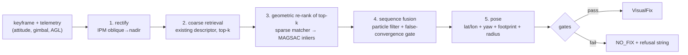
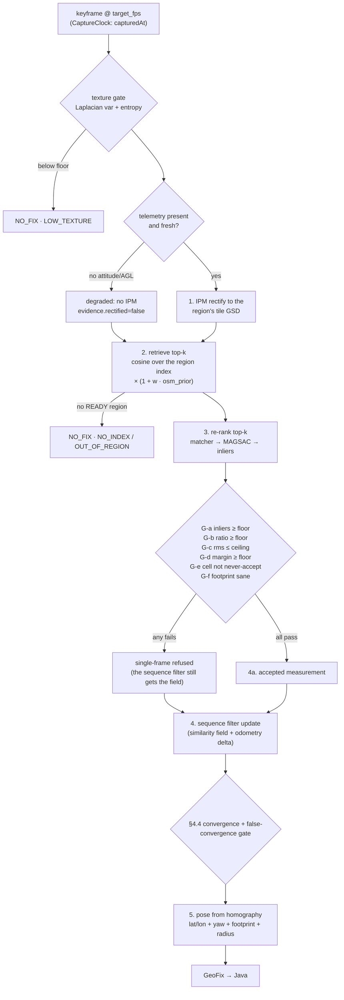
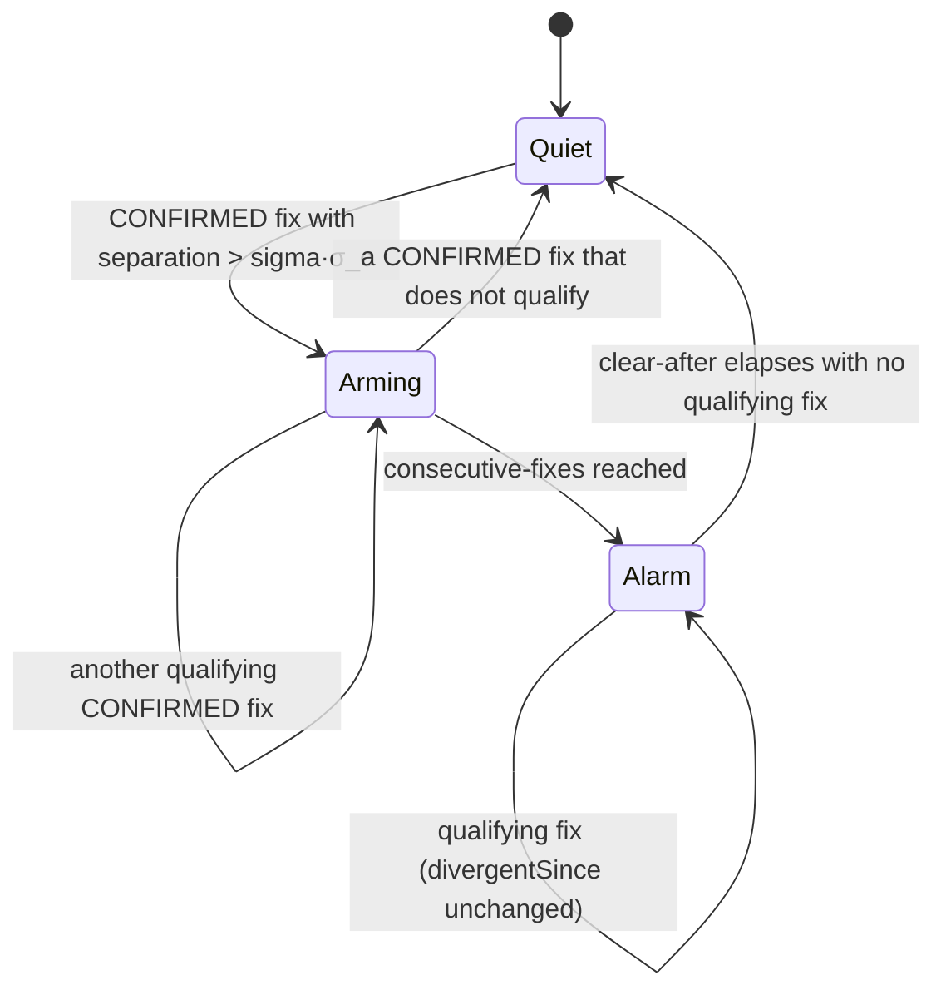
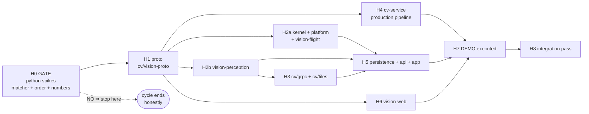

# VISUAL-GEO-V2-PLAN — the frame tells the aircraft where it is, and says so honestly

**Cycle: HEAVY-A only** (`docs/conclusions/visual-geo-research/13-heavy-server.md` §7a candidate A —
sparse-robust, near-real-time, Intel/OpenVINO, no CUDA). Research pack:
[VISUAL-GEO-RESEARCH.md](../../conclusions/VISUAL-GEO-RESEARCH.md) and the six reports under
`docs/conclusions/visual-geo-research/`. Read the research first; this plan does not re-derive its
citations, it cites them by report §.

Predecessor: the parked branch `feat/visual-geo` (19 commits, merge-base `c4bb23d4`, never merged).
This plan **harvests** from it (§1.3) — it does not revive it.

---

## Preamble — rules every wave agent obeys, verbatim

- **Foreground builds only** — background builds die with the agent's turn; a wave that backgrounds
  its build leaves itself uncommitted and red.
- **`git merge-base HEAD feat/visual-geo-v2`** check if working in a worktree — the FIXED-CAMERA-GEO
  G1 lesson: a worktree branched off a stale pre-reorg commit produced output in the wrong directory.
- **`-pl` with `-am`** — `-pl` alone resolves stale `~/.m2` jars for sibling modules.
- **Never reactor-wide** (`./mvnw verify` with no `-pl`) while another wave is red.
- **MODULE.md updated in the same wave** — doc missing/stale is part of the task, not a follow-up.
- **No magic numbers** — every threshold in `station/vision-app/src/main/resources/application.yaml`
  (Java) or `cv_service/config.py`'s `Settings.from_env()` (Python). Mathematical constants only in
  code.
- **Jackson 3 (`tools.jackson`)** — not `com.fasterxml.jackson.databind`; annotations still
  `com.fasterxml.jackson.annotation`.
- **Spring only in `vision-app`, `vision-api` and adapters** — never a context module.
- **Angular 3-file components** — `.ts` / `.html` / `.css`, never inline template or styles.

---

## 0. Goal and non-goals

### 0.1 Goal, made precise

A station-side pipeline that, while a drone streams video and telemetry, **matches its camera frames
against pre-ingested satellite reference imagery and publishes a second, parallel position track** —
the *corrected* track — carrying its own uncertainty radius, its own evidence, and a **divergence
alarm** when the corrected track and the aircraft's own reported GNSS position disagree beyond Nσ for
M consecutive fixes.

Made precise:

| Dimension | This cycle |
|---|---|
| Where it runs | The cv-service host (GB4005, Intel, **no CUDA**, OpenVINO/ONNX) — `01-master-geo-stack.md` §6.1 |
| Cadence | Near-real-time: ~1 keyframe/s, fix latency budget < 1 s (measured in H0, §9) |
| Output | A `TrackCorrection` stream in `contexts/vision-flight` — the **aircraft's own** position, not a map object |
| Raw telemetry | **Never overwritten, never modified.** CLAUDE.md rule 9 and `13-heavy-server.md` §7b |
| Aircraft | **Nothing is transmitted to it.** No `GPS_INPUT`, no `VISION_POSITION_ESTIMATE` |
| Default | **Off.** `vision.geo.visual.enabled=false`; every endpoint 409s; every existing test green by construction |
| Honesty | Inlier/match gates, per-cell never-accept calibration, residual ceiling **at every N**, consensus before `CONFIRMED`, an explicit refusal string on every `NO_FIX` |
| Success metric | **Metres, false-fix rate, convergence** — never recall@k as a headline (`11-deep-crossview-vpr.md` §4.3, VIGOR precedent) |

### 0.2 The one structural fix

The parked branch's own measurements say the descriptor **finds the neighbourhood and cannot pick the
winner** (recall@5 0.87–1.00, top-1 0/12 on real video, median rank 14 — `00-existing-state.md` §2,
§4). The literature solves exactly that symptom with a coarse-to-fine funnel, never with retrieval
alone (`11-deep-crossview-vpr.md` §4.1, levers A+C with B as force multiplier). **Pipeline order is
the fix, not a new algorithm** — every stage below already exists on the parked branch as a
built-but-unwired slice (`00-existing-state.md` §6):



Steps 1, 3 and 4 were **built and measured but never put in front of the ranking decision**. That is
the whole of this cycle's algorithmic content.

### 0.3 Non-goals — named, not silently dropped

| Non-goal | Why, and where it lives instead |
|---|---|
| **LIGHT onboard tier** (corridor packs, dead-reckoning + periodic correction on a companion computer) | A separate cycle. `12-light-onboard.md` §6 ranks its candidates; `VISUAL-GEO-RESEARCH.md` §2.1 has its architecture. Needs hardware not yet bought (`HARDWARE-BUYLIST.md`) |
| **Dense GPU matching — RoMa v2, MatchAnything-style fine-tuning** | `13-heavy-server.md` §7a candidate B. No verified OpenVINO port for any dense matcher; RoMa v1 measured **86–115 s/pair** on this CPU class (`00-existing-state.md` §2). Waits for a GPU host |
| **TX to the aircraft** (`GPS_INPUT` #232, `VISION_POSITION_ESTIMATE` #102) | Neither is decoded or sent anywhere in this codebase (`01-master-geo-stack.md` §7). A new command-TX class, operator-gated like every other (`01` §5.3, DRONE-ONBOARDING D9) |
| **OSM / imagery packs shipped to the aircraft** | Belongs to the light tier + MISSIONS' upload flow (`01-master-geo-stack.md` §4.2). Nothing is built there yet |
| **Fine-tuning a cross-view descriptor** (Game4Loc, Sample4Geo, LPN) | Lever D — `11` §4.2 explicitly ranks it *after* A+C+B. Needs GPU + paired footage volume |
| **DEM / terrain intersection** | Flat-ground + spherical earth throughout, same as `GeoProjection`. The AGL cross-check in §4.5 is a *homography-scale* consistency test, **not** a DEM elevation lookup |
| **Photogrammetric post-flight pass** (COLMAP/ODM/GLOMAP, factor-graph smoothing with GTSAM) | `13-heavy-server.md` §2/§3. A batch cycle, not this near-real-time one |
| **Boresight/gimbal self-calibration node** | `13` §3 [43]/[44]. Methodological transfer only, never validated for a MAVLink gimbal (`13` OQ8). The sequence filter absorbs a slowly-varying bias instead |
| **Line/edge structural matching** (`structure/`, SOLD2/HAWP Phase B) | **Measured honest negative** — worse than embedding alone on both real hard cases (`00-existing-state.md` §2, §13.8 Phase A/A.5) |
| **Precise/RoMa slow path** (`precise.py`, Slice P) | Built, measured, **zero capability gain over the shipped stack on all three testbeds** (`00` §2, §13.2) |
| **Multi-region seam crossing** | Designed, never built on the parked branch (`00` §6). One region per session here |
| **Push-mode frame transport for geo** | Decision D2 — pull-only. `GeoFrameCodec` (412 lines) is left behind |
| **Per-viewer SSE filtering of the corrected track** | The `geo:<assetId>` topic follows the `telemetry:<assetId>` precedent exactly (unfiltered, opt-in by asset id). Filtering only the corrected track while the raw track it parallels rides unfiltered would be theatre. See D11 — flagged, not fixed here |
| **Replacing `Telemetry`/`AssetUsage.lastPosition`** | The corrected track is parallel and additive. Nothing in the fleet/cockpit/map reads it unless it asks |

---

## 1. Current state

### 1.1 What exists on `master` today (grounded, with file citations)

| Piece HEAVY-A needs | Exists today | The gap |
|---|---|---|
| Ray → ground point, spherical | `GeoProjection.project` (`core/vision-kernel`) — shipped, measured | none; reused for the raw-vs-corrected separation via `bearingDistance` |
| Haversine distance + bearing | `GeoProjection.bearingDistance` → `BearingDistance` (kernel) | none — this **is** the divergence metric |
| Camera aim from telemetry | `GeoProjection.aimFrom` / `CameraAim` (kernel, GEO-POSE V1) | none; the rectifier needs the same gimbal-vs-airframe precedence |
| Attitude + gimbal, earth-frame | `Attitude` (kernel), decoded from `GIMBAL_DEVICE_ATTITUDE_STATUS`(#285) / `MOUNT_ORIENTATION`(#265) by `adapter-mavlink` | none. `Attitude.gimbalPitchDegrees` is positive-up; `rectify.py` wants degrees **from nadir** — one sign/offset conversion, named in D6 |
| AGL, separate from AMSL | `Telemetry.aglMeters` (kernel) — GEO-POSE G1 fixed the AMSL-as-AGL bug | none; `altitudeMeters` stays AMSL |
| gRPC channel to cv-service, supervised | `CvChannelSupervisor` + `GrpcCvSettings` (`cv/grpc`), `CvStatusProvider implements SubsystemStatusPort` | none — **reused, not duplicated** (D3) |
| Worker-pull transport (worker dials mediamtx, no frame bytes on the wire) | `PulledDetectionPort` (perception) + `GrpcPulledDetectionPort`/`PulledDetectionSession` (`cv/grpc`) + `cv_service/pull/` (`loop.py`, `clock.py`, `source.py`) | none structurally — the geo session is the same shape (D2) |
| Camera pose already on the CV wire | `CameraPose` message on `FrameRequest`/`PullControl` (`proto/vision/v1/cv.proto`) | it carries yaw/pitch/roll/hfov but **no position and no AGL** — insufficient for IPM; a `GeoTelemetry` message is added (§3.1) |
| mediamtx as the one video path | `vision.publish.enabled=true` (default), one mediamtx path per `<streamId>`, `vision.cv.pull.rtsp-base` | none — the geo worker dials the same path |
| A high-volume "excluded" table precedent | `projected_track_points` (V22), classified in `PostgresDockerIntegrationTest.EXCLUDED_TABLES` | none — `track_corrections` copies it verbatim |
| Feature flag + 409 + flag-off-green precedent | `vision.geo.fixed-camera.enabled`, `ErrorResponse(error, message)`, `ApiExceptionHandler` | none — copied exactly |
| Per-asset SSE topic | `LiveTopicKind.TELEMETRY("telemetry")` → `telemetry:<assetId>`, opt-in, `LiveUpdateRegistry.publishTelemetryAppended` | a **new 8th kind** `GEO("geo")` + `publishGeoCorrection` |
| **Aircraft-own corrected position** | **nothing.** `PositionFix`/`PositionFusion`/`FixOrigin` exist only on the parked branch (`01-master-geo-stack.md` §7); the nearest shipped analog is `TrackProjectionService`/`ProjectedTrack`, which publishes a *ground object's* position | the whole of §3.4 |
| **Reference imagery ingestion** | **nothing on master** — `adapter-tiles` is parked-branch-only | harvested in H3 |
| **Visual matching of any kind** | **nothing on master** — `cv_service/geo/` is parked-branch-only | harvested + reordered in H4 |
| Python geo dependencies | `cv/cv-service/pyproject.toml` has `cv` + `dev` extras only | `geo` extra re-added (§3.6) |
| Next free Flyway version | V22 is the highest (`V22__fixed_camera_geo.sql`) | **V23** |

### 1.2 What the branch measured, that this plan is built on

Every number here is the parked branch's own measurement, transcribed via `00-existing-state.md` §2
(the raw spike artefacts were gitignored — §8 of that report; the plan tables are the only surviving
record).

| Finding | Number | What it forces in this plan |
|---|---|---|
| Retrieval finds the neighbourhood, cannot pick the winner | recall@5 0.87–1.00; top-1 **0/12** on real video, median rank 14 | Re-rank stage is mandatory, not optional (D4) |
| Root cause is the **sensor/domain gap**, not viewing angle | `corr(|pitch|, match_count) ≈ −0.03`; cross-*vendor* nadir-vs-nadir worked fine | "Fix the angles" alone would not have worked; rectification is a force multiplier, not the cure |
| IPM rectification on SITL-oblique | 7 matches/4 inliers → **156 matches/129 inliers**; 538 m → **3.8 m** median; **0/71 → 43/71** pass the gate, zero false accepts | Rectify **first**, before retrieval (D4 step 1) |
| Rectification on *real* phone photos | matches 7→14, GT tile becomes leader, **inliers plateau at 5** — below every floor | Rectification does not close the domain gap on real consumer imagery. H0 must re-measure on the Pexels clip before anyone believes otherwise |
| MAGSAC **inliers** beat raw match count as the gate | inliers: precision 1.0 @ ≥8 (recall 0.81); match count: 0.83 precision at the same point | The re-rank score is inliers, and the promotion floor is an inlier floor (D5) |
| LoFTR collapse under rotation+scale | ~90° rotation + 4.3× GSD mismatch collapses matches to ~8; correcting **both** → 88–94 matches at ~100% inliers, and cuts cost 1.9 s → 0.53 s | Telemetry conditioning (heading + altitude) is applied **before** the matcher, always |
| Match-count-gated verification | 101.7 m → **93.7 m** at identical recall; ungated LoFTR was *actively harmful* (101.7 → 188.6 m) | An ungated matcher makes things worse. Every stage gates |
| Homography pose under the production gate | SITL-nadir 92.5 m → **4.8 m** median, worst 15.4 m; yaw median **0.4–0.5°** | Pose from homography is the position source, not the tile centre |
| Zoom is a floor, not a knob | z16: **0.75–0.96 false-fix rate**; z17 plain: 0.525 recall, **0.000** false-fix | z17 is frozen as the default; z16 is forbidden |
| Homogeneous terrain fails **safely** | 72 queries over fields/forest, **zero** false fixes; self-calibration emits never-accept | The never-accept calibration is harvested unchanged |
| Along-linear-feature **aliasing** is the dangerous class | one-tile diagonal slide (√2 · 196 m ≈ 278 m) with well-spread inliers and believable yaw — passes both defence layers | Needs a *structural* counter (sequence + OSM), not a better threshold. §4.4 + the H0 standing regression |
| Particle filter, in-distribution | **63/63 converged**, 0 confident-wrong in 1,289 CONVERGED steps, median 14–117 m | The sequence filter is harvested |
| Particle filter, **out-of-sample** (real Pexels video) | **FALSE CONVERGENCE** — converged at update 7 and stayed converged on a tile 771–773 m wrong, which the single-frame path correctly refused | The false-convergence gate in §4.4 is the single most load-bearing new design in this plan |
| OSM fingerprints vs the alias set | 11/14 separated, only 6/14 clear a 0.05 margin; `btn-road-x` has **zero** mapped highways | A weak multiplicative tie-breaker, **never a gate** (D8) |
| RoMa "precise mode" on 3 testbeds | zero false fixes and **zero capability gain** | Left behind (§0.3) |
| Structural/line fingerprints | **worse** than embedding alone on both real hard cases | Left behind (§0.3) |

### 1.3 Harvest manifest

The parked branch is read with `git show feat/visual-geo:<path>`. **The branch predates the module
re-layout** (`adapters/` → responsibility folders) — the "new path" column is authoritative.

#### Python — `cv-service/cv_service/geo/` (19 files, 4,939 lines)

| Branch path | New path | Verdict | Why |
|---|---|---|---|
| `cv_service/geo/rectify.py` (623) | same | **extract verbatim** | The measured 0/71→43/71 lever. Pure `cv2`/`numpy`/stdlib, optional PIL, **no torch**. `extract_geometry`/`horizon_crop`/`ipm_warp`/`rectify` |
| `cv_service/geo/pose.py` (255) | same | **extract verbatim** | `fit_homography_pose` — MAGSAC homography → refined lat/lon + yaw + footprint quad + sanity flags. 4.8 m median under gate |
| `cv_service/geo/index.py` (394) | same | **extract**, minor adapt | `ReferenceIndex` (numpy cosine), on-disk persistence, `VerifyTileCache` (Slice A, measured 1.45× aggregate). `_tile_nw_corner` is `pose.py`'s dependency |
| `cv_service/geo/encoder.py` (176) | same | **extract verbatim** | Pluggable `Encoder` + `VprHubEncoder` (EigenPlaces/CosPlace via `torch.hub`). Note: the file is `encoder.py` singular — `encoders.py` is spike-only |
| `cv_service/geo/calibrate.py` (291) | same | **extract + extend** | Self-calibrated `accept_similarity`/`accept_margin` + `is_never_accept` + `leave_one_out_distinctiveness`. **Extended** with the per-cell calibration record §4.4 G-a needs |
| `cv_service/geo/pack.py` (195) | same | **extract verbatim** | Stdlib-only zip landing + zip-slip guards |
| `cv_service/geo/orchestrator.py` (296) | same | **extract verbatim** | Build-job state machine, mirrors `training/orchestrator.py` |
| `cv_service/geo/localize.py` (347) | same | **adapt** | Query path. **Re-ordered**: rectify → retrieve → re-rank → sequence → pose. Texture gate + `resolve_regions` kept as-is |
| `cv_service/geo/verify.py` (382) | `cv_service/geo/rerank.py` | **adapt / partially replace** | Keep the structure (keep keypoints, telemetry conditioning, `condition_query`, scale bookkeeping). **Replace the matcher** with H0's winner. This is the only production module importing `torch` at module scope — the new one must import its backend lazily |
| `cv_service/geo/sequence.py` (500) | same | **extract + extend** | `SequenceLocalizer` PF. **Extended** with §4.4's false-convergence gate; likelihood switched from raw similarity to the re-ranked geometric score |
| `cv_service/geo/osm_fingerprint.py` (666) | same | **extract**, wired as tie-breaker only | The one lever proven against along-road aliasing. `requests` is already lazy with a `urllib` fallback |
| `cv_service/geo/track.py` (192) | — | **left behind** | Frame-to-frame VO feeds the `DEAD_RECKONED` fusion state this plan does not build |
| `cv_service/geo/angle_probe.py` (194) | — | **left behind** | Blind angle search optimizing *embedding similarity*; heavy-A always has real attitude telemetry, and §12.15 says the probe optimizes the wrong objective |
| `cv_service/geo/precise.py` (587) | — | **left behind** | RoMa loop. 86–115 s/pair, zero capability gain on 3 testbeds |
| `cv_service/geo/structure/**` (521) | — | **left behind** | Measured honest negative. The frozen package layout stays documented in the research, not carried as dead code |
| `cv-service/tests/geo/**` (18 files, 4,700) | same | **extract** for every module kept | ~3,400 lines survive; `test_precise.py`/`test_structure_*.py`/`test_track.py`/`test_angle_probe.py` are dropped with their modules |
| `cv-service/tests/grpc/test_geolocation_servicer.py` (1,907) | same | **adapt** | Rewritten for the pull-mode servicer; the region-ingest half transfers nearly intact |
| `cv-service/spikes/geo/` — `bakeoff_matchers.py` (577), `rectify_eval.py` (441), `pf_spike.py` (780), `regression_1213.py` (333), `metrics.py` (184), `report.py` (195), `analytical_circle_telemetry.py` (207), `tiles.py` (214), `video_input.py` (145), `geomath.py` (91), `fixtures/maidan-video-frames/` (12 JPEGs), `wayback_curated_releases.json` | `cv-service/spikes/geo/**` | **extract** | This is H0's harness and the only real out-of-sample fixture the project owns. **Its `results/` must be committed this time** — the branch gitignored them and lost every raw artefact (`00` §8). **H0 plan-defect note (found 2026-08-19): this row is incomplete.** Several of the named files' own transitive imports are NOT named here and had to be harvested/renamed anyway to make anything runnable: `encoders.py`, spike-local `index.py` (renamed `spike_index.py` to disambiguate from `cv_service/geo/index.py`, harvested above under a different verdict), `manifest.py`, `loftr_verify.py` — all harvested this wave. `rectify_eval.py`'s own `from spikes.geo.run_homography_pose import (...)` chain (`run_homography_pose.py`/`homography_pose.py`/`report_homography_pose.py`) was NOT named and was judged not worth chasing — `rectify_eval.py` is kept in this harvest as reference only, not run; H0 wrote fresh driver scripts (`build_regions.py`, `run_bakeoff.py`, `rerank.py`, `false_convergence_gate.py`) instead of resurrecting it |
| everything else under `spikes/geo/` (~5,000 lines) | — | **left behind** | Encoder bake-offs, semantic/structure evals, SITL renderers — settled questions (`00` §5); re-surveying is forbidden |

#### Java

| Branch path | New path | Verdict | Why |
|---|---|---|---|
| `adapters/adapter-tiles/**` (8 main + 6 test classes, 1,157 + 1,028 lines) | **`cv/tiles/`** (artifactId unchanged: `adapter-tiles`) | **extract**, one adapt | `HttpTileSource`, `TileMath`, `TileXY`, `TileRateLimiter`, `TileSourceSettings`, `TileOcclusionScorer`, `WaybackReleaseCatalog`, `WaybackTileSource`. 53 tests. **Adapt**: its POM dependency `vision-domain` (dissolved) → `contexts/vision-perception`. Esri template is `{z}/{y}/{x}` — *not* `{z}/{x}/{y}` |
| `adapters/adapter-geo-grpc/GrpcReferenceIndexPort.java` (397) | `cv/grpc/.../GrpcReferenceIndexPort.java` | **extract**, adapt | `BuildReferenceIndex` + `ListRegions` + `DeleteRegion`. Moves **into the existing adapter** (D3) so it shares the supervised channel |
| `adapters/adapter-geo-grpc/GrpcGeolocationPort.java` (126) | `cv/grpc/.../GrpcPulledGeolocationPort.java` | **adapt** | Re-shaped from push (`GeoFrameRequest` with pixels) to pull (`GeoControl`), modelled on `GrpcPulledDetectionPort` |
| `adapters/adapter-geo-grpc/NoopGeolocationPort.java` (66) | `cv/grpc/.../NoopGeolocationPort.java` | **extract** | The flag-off fallback |
| `adapters/adapter-geo-grpc/GrpcGeoSettings.java` (159) | folded into `cv/grpc`'s settings | **adapt** | 8 of its 12 fields duplicate `GrpcCvSettings` (endpoint, timeouts, keepalive, plaintext). Only `uploadTimeout`/`uploadChunkBytes` survive, as a small `GeoUploadSettings` |
| `adapters/adapter-geo-grpc/GeoFrameCodec.java` (412) | — | **left behind** | Pull mode has no frame payload at all (D2) |
| `adapters/adapter-geo-grpc/GeolocationStreamSession.java` (247) | — | **left behind** | A "deliberate line-for-line duplicate" of `DetectionStreamSession` (branch decision D3). Replaced by a `PulledDetectionSession`-shaped session inside `cv/grpc`, sharing its supervisor. **This is the single biggest saving in the harvest: ~660 duplicated lines deleted, not moved** |
| `vision-domain`/`vision-application`: `PositionFix`, `PositionFusion(Service)`, `FixOrigin`, `KeyframeGeolocator`, `TileGrid`, the 6-state fusion machine | — | **left behind; rebuilt narrower** | `13-heavy-server.md` §7b's own call ("ported **or rebuilt narrower**"). The 6-state GPS⊕visual⊕dead-reckoning fusion machine is a *different feature* (an N-source position registry) and it is not what the user asked for. §3.4's `TrackCorrection` is the narrow version: publish the correction beside the raw track, alarm on divergence, never fuse or switch |
| `vision-web` position UI (53 files) | — | **left behind** | Predates UI-ARCHITECTURE (Component→Facade→Store→Service), the design-token system and the visual refresh. Rebuilt in H6 |
| `proto/vision/v1/cv.proto` "Visual geolocation" section (181 lines, 13 messages) | same file | **adapt / minimise** | §3.1. Dropped: `GeoFrameRequest` (frame bytes), `VisualTrackingEstimate` (VO), `GeoSequenceStatus` (folded into evidence). Added: `GeoControl`, `GeoEvidence`. Note the branch's `docs/VISUAL-GEO-PLAN.md` §3.1 is **stale** relative to its own proto — harvest the proto, not the plan |
| `vision-app` `application.properties` `vision.geo.*` (34 keys) | `application.yaml` `vision.geo.visual.*` | **adapt** | ~14 keys survive; the 10 `vision.geo.fusion.*` keys go with the fusion machine |

---

## 2. Decisions

**D1 — HEAVY-A is a *measurement instrument* before it is a feature.** Wave H0 is a hard gate: no
Java or wire code is written until the pipeline reorder is measured on real footage and the matcher
is chosen by number, not by literature (`13-heavy-server.md` OQ1/OQ2: no published OpenVINO latency
for any of these matchers, and no cross-modal benchmark on oblique-drone-vs-satellite pairs exists
anywhere). If H0's numbers do not clear §4.6's budget, the cycle stops at H0 with an honest report —
that is a successful outcome, not a failure.

**D2 — Pull-only frame transport. The worker dials mediamtx; no frame ever crosses the Java wire.**
The shipped `PulledDetectionPort` / `DetectPulled` / `cv_service/pull/` machinery (MEDIA-SOT M3–M4)
already does exactly this, `vision.publish.enabled` defaults to `true`, and the mediamtx path name is
the `streamId`. Consequences, all good:
- `GeoFrameCodec` (412 lines) and the whole JPEG/BGR24 encode question disappear.
- The `StreamPipeline` is **not touched** — no second sampler, no keyframe tap, no new demand term.
- cv-service samples on its own deadline (`DeadlineSampler`, measured 9.998/10 fps) at a low geo rate.
- Java sends only declarative control + the latest telemetry, restated on every message, exactly the
  `PullControl` doctrine (a one-shot control message can be lost with no error and no retry).
- **Named cost**: a second decode of the same mediamtx path when detection pull is also running. At
  ~1 Hz that is small, but it is measured in H0 and §9, and §10-O3 names the fold-into-one-loop
  alternative with its default.

**D3 — No new gRPC adapter module. `cv/grpc` (adapter-cv-grpc) grows two ports.** The parked branch
created `adapter-geo-grpc` and, because *adapters never depend on each other* (ArchUnit), was forced
to duplicate the session and codec state machines line-for-line (its own decision D3). It is the same
service, on the same host, over the same channel, in the same `.proto`. Putting the geo ports in
`cv/grpc` reuses `CvChannelSupervisor` (the CV-RECONNECT R1 owner of "is cv-service reachable"),
`GrpcCvSettings`, the shared `ManagedChannel`, and `CvStatusProvider`'s `SubsystemStatusPort` — and
deletes ~660 lines of deliberate duplication instead of moving them.

**D4 — The pipeline order is frozen; the matcher inside step 3 is not.** Steps: **rectify →
retrieve → geometric re-rank → sequence fuse → pose**. Step 3's matcher is chosen by H0 among XFeat,
LightGlue (+ ALIKED or DISK — **never SuperPoint**, whose weights are Magic Leap
non-commercial-research-only), and EfficientLoFTR (official ZJU implementation), against the shipped
kornia-LoFTR baseline. Selection criteria in §4.6.

**D5 — Two owners of "confidence", and they are different questions.** The parked branch's own
framing, kept verbatim because it was right:
- **Python answers "is this frame confidently matched to the index?"** — texture gate, per-cell
  self-calibrated `accept_similarity`/`accept_margin`, never-accept fallback, inlier floor, footprint
  sanity, sequence convergence + the false-convergence gate. Knobs: `CV_GEO_*`.
- **Java answers "do I believe the aircraft is there?"** — consecutive agreement, radius ceiling,
  divergence. Knobs: `vision.geo.visual.gate.*` / `.divergence.*`.
Neither side may be the only gate, and neither may be skipped because the other looks strict.

**D6 — Sign conventions are converted once, at the wire, and stated.** `Attitude.gimbalPitchDegrees`
(kernel) is **positive-up, aircraft-pitch convention**. `rectify.py`'s `pitch_deg` is **degrees from
nadir** (0 = straight down, 90 = horizon). The conversion `pitch_from_nadir = 90 − (−gimbalPitch)` =
`90 + gimbalPitch` happens in exactly one place — the Java codec filling `GeoTelemetry` — and is
asserted by a unit test naming both conventions. This is the same class of bug GEO-POSE G1 already
paid for once (AMSL treated as AGL, ~180 m of error on every mark).

**D7 — `contexts/vision-perception` owns the driving side; `contexts/vision-flight` owns the
output; the hand-off value lives in `core/vision-kernel`.**

| Concern | Module | Why |
|---|---|---|
| Reference regions, tile ingest, the localization session | `contexts/vision-perception` | Perception already owns the cv-service relationship (`DetectionPort`, `PulledDetectionPort` are declared there) and the `streamId`→mediamtx-path knowledge. Zero new context edges |
| `TrackCorrection`, gating, divergence, persistence port, live port | `contexts/vision-flight` | It is the **aircraft's own position** — the explicit context decision `01-master-geo-stack.md` §7 poses. It is *not* `vision-map`'s track machinery, which publishes a *ground object's* position |
| `VisualFix` — the measured fix value | `core/vision-kernel` | A pure value with two context consumers, exactly `Telemetry`'s own justification (read by five contexts). No ports, no aggregates |
| Composition (open/close sessions, pump telemetry, route fixes) | `station/vision-app` — `VisualGeoRunner` | The `TrackProjectionRunner`/`GeofenceMonitor` precedent: logic in the context, composition in the legal composer. **Perception never names a flight type and flight never names a perception type** |

`perception → flight` is a real, existing edge (perception's POM depends on `vision-flight`), so a
direct call would be *legal* — the runner is chosen anyway, because the reverse direction will
eventually be wanted and a functional seam costs nothing today.

**D8 — OSM fingerprints are a multiplicative tie-breaker, never a gate.** Measured: 11/14 alias pairs
separated but only 6/14 clear a 0.05 margin, and one danger region has **zero** mapped highways, where
the prior is structurally empty. Wired as `score' = score · (1 + w · fp_similarity)` with `w`
configurable and defaulting to **0** (off) until H0 measures it on the Pexels set.

**D9 — Ships off, and off means invisible.** `vision.geo.visual.enabled=false`. Off: no
`VisualGeoRunner` bean is scheduled, no gRPC geo session is ever opened, no `geo` SSE event is ever
published, and every §3.3 endpoint answers **409** in the shipped envelope:
```
409 {"error":"CONFLICT","message":"visual geolocation is disabled (vision.geo.visual.enabled)"}
```
V23 still runs (schema is unconditional, exactly like V21/V22). **Every pre-existing test passes
unchanged by construction** — asserted in H5.

**D10 — cv-service is the single source of truth for what regions exist.** No `geo_regions` table.
`GET /api/geo/regions` proxies `ListRegions`; the region index lives on cv-service's own filesystem
(`CV_GEO_DATA_DIR/<regionId>/`), the parked branch's D1, kept. Java holds only *in-flight* ingest jobs
in memory and reports them as `BUILDING`. One source of truth beats two that can disagree
(CLAUDE.md rule 9). Cost, named: an ingest interrupted by a station restart is simply gone, and must
be re-requested — acceptable for an operator-initiated batch job.

**D11 — The corrected track rides an unfiltered per-asset SSE topic, like the raw track it
parallels.** `geo:<assetId>`, opt-in, an 8th `LiveTopicKind`. Only `MAP` is viewer-filtered today;
`telemetry:<assetId>` — which already carries the aircraft's raw latitude/longitude — is not. Adding
filtering to the corrected track alone would be theatre while its raw twin is open. REST reads are
scoped normally (`VisibilityScope` at the `vision-api` edge, 404 hides). The platform-wide gap is
named in §0.3 and stays a platform question.

**D12 — One table, on the excluded side, with retention.** `track_corrections`, V23,
`EXCLUDED_TABLES` — append-only, ~1 Hz per flying asset, telemetry-character. Exactly V22's
`projected_track_points` reasoning, and the same runner-driven prune so nothing grows unbounded.

---

## 3. FROZEN wire contract

Backend, Python and UI waves parallelize against exactly this. **Property names, field numbers,
status codes and enum spellings are frozen.** Anything a wave finds wrong is amended *here*, in
writing, with the wave that found it named — never negotiated bilaterally (the FIXED-CAMERA §5
precedent).

### 3.1 Proto — `proto/vision/v1/cv.proto`, additive, one new section

Placed in the file's existing wave-banner idiom. **No existing field number, name or type changes.**
`Ack` and `google.protobuf.Empty` are reused from the shipped contract.

```proto
// ---- VISUAL-GEO-V2, heavy-A (docs/plans/active/VISUAL-GEO-V2-PLAN.md §3.1) -------------------
// Pull-only: the worker dials the video source itself, exactly like Inference.DetectPulled.
// There is no frame payload on this wire, in either direction.

// Everything the rectifier and the priors need, restated on every GeoControl message.
// Every field is `optional` on purpose: an asset may have heading without a GPS fix, or a
// gimbal without an IMU.
message GeoTelemetry {
  optional double latitude              = 1;   // WGS-84 degrees, the aircraft's own reported fix
  optional double longitude             = 2;
  optional double amsl_meters           = 3;   // Telemetry.altitudeMeters -- above mean sea level
  optional double agl_meters            = 4;   // Telemetry.aglMeters -- what the projection wants
  optional double heading_degrees       = 5;   // vehicle yaw, clockwise from true north, [0,360)
  optional double groundspeed_mps       = 6;
  // Camera pointing, in rectify.py's convention: DEGREES FROM NADIR (0 = straight down,
  // 90 = horizon). The Java codec converts from Attitude's positive-up gimbal pitch exactly
  // once (VISUAL-GEO-V2-PLAN.md D6). Absent = nadir assumed.
  optional double camera_pitch_deg      = 7;
  optional double camera_roll_deg       = 8;
  optional double camera_yaw_deg        = 9;   // earth-frame gimbal yaw when present
  optional double horizontal_fov_deg    = 10;  // 0/absent = the region's assumed default
  int64  sample_millis                  = 11;  // epoch millis of THIS telemetry sample
  optional double gps_radius_meters     = 12;  // the raw fix's own 1-sigma, from HDOP when known
}

// Restricts retrieval to a disc around where the station already believes the aircraft is.
message GeoPrior {
  double latitude      = 1;
  double longitude     = 2;
  double radius_meters = 3;   // > 0
}

// Declarative desired state for one localization session. Restated on EVERY message, same
// doctrine as PullControl/TrackingConfig: a one-shot control message can be lost with no error.
message GeoControl {
  string stream_id                = 1;   // also the mediamtx path name
  string source_url               = 2;   // read from the FIRST message of the call only
  string rtsp_transport           = 3;   // first message only ("tcp"/"udp"/"")
  string region_id                = 4;   // "" = search every READY region
  float  target_fps               = 5;   // keyframe rate; <=0 = server default
  optional GeoTelemetry telemetry = 6;   // hot -- takes effect as soon as the worker sees it
  optional GeoPrior prior         = 7;   // hot
  bool   stop                     = 8;   // requests a clean drain + half-close
}

enum GeoStatus {
  GEO_STATUS_UNSPECIFIED = 0;
  GEO_STATUS_FIX           = 1;  // a position cleared every Python-side gate
  GEO_STATUS_NO_FIX        = 2;  // searched, nothing cleared; `refusal` says which gate
  GEO_STATUS_LOW_TEXTURE   = 3;  // rejected pre-encode (Laplacian/entropy floor) -- never encoded
  GEO_STATUS_OUT_OF_REGION = 4;  // the prior disc intersects no READY region
  GEO_STATUS_NO_INDEX      = 5;  // no READY region exists at all
  GEO_STATUS_ERROR         = 6;  // encoder/index/decode failure; `refusal` carries the reason
}

// Why the worker believes (or refuses) this fix. Java logs and serves this verbatim -- an
// operator must always be able to see WHY, not just WHAT (VISUAL-GEO-V2-PLAN.md D5).
message GeoEvidence {
  int32  candidate_count         = 1;   // top-k actually re-ranked
  int32  match_count             = 2;   // correspondences on the winning candidate
  int32  inlier_count            = 3;   // MAGSAC inliers -- the promotion gate
  double inlier_ratio            = 4;
  double rerank_margin           = 5;   // (s1 - s2) / max(s1, 1) over inlier scores
  double reprojection_rms_px     = 6;   // homography residual -- the ceiling applies at EVERY N
  bool   rectified               = 7;   // IPM actually applied (false = degraded to raw frame)
  bool   cell_calibrated         = 8;   // the winning cell has a real accept threshold, not never-accept
  int32  supporting_frames       = 9;   // distinct frames whose own inliers cleared the floor
  double baseline_meters         = 10;  // platform motion spanned by those frames
  bool   sequence_converged      = 11;
  double sequence_spread_meters  = 12;
  int32  sequence_updates        = 13;
  double osm_prior               = 14;  // the D8 tie-breaker's multiplier; 1.0 = inert
}

message GeoFix {
  string stream_id             = 1;
  int64  sequence              = 2;   // monotonically increasing per session
  int64  frame_millis          = 3;   // capturedAt of the frame this fix came from (CaptureClock)
  GeoStatus status             = 4;
  string region_id             = 5;   // the region actually searched ("" when none was)
  string tile_id               = 6;   // "<z>/<x>/<y>" of the winning cell, for diagnostics
  optional double latitude     = 7;   // present iff status == GEO_STATUS_FIX
  optional double longitude    = 8;
  optional double yaw_degrees  = 9;   // camera image-up bearing; present only when the homography passed sanity
  optional double radius_meters       = 10;  // 1-sigma horizontal, always present with a position
  optional double implied_agl_meters  = 11;  // from the homography scale; the D-agl cross-check input
  GeoEvidence evidence         = 12;
  string refusal               = 13;  // "" on FIX; otherwise names the gate that refused
  int64  telemetry_age_millis  = 14;  // frame_millis - telemetry.sample_millis (signed, honest)
  int64  latency_millis        = 15;  // worker-side compute cost for this frame
}

// ---- Region ingest (harvested from feat/visual-geo, unchanged in shape) ----------------------
message ReferencePackChunk {
  string region_id = 1;   // set on EVERY chunk; must be identical throughout the stream
  bytes  content   = 2;   // concatenation in stream order is a ZIP: region.json + tiles/<z>_<x>_<y>.jpg
}

message ReferenceIndexStats {
  int32  tile_count                  = 1;
  int32  descriptor_count            = 2;
  int32  descriptor_dim              = 3;
  string encoder_id                  = 4;
  float  accept_similarity           = 5;   // self-calibrated on held-out tiles
  float  accept_margin               = 6;
  float  holdout_recall_at_1         = 7;
  float  holdout_median_error_meters = 8;
  int64  index_bytes                 = 9;
  int32  never_accept_cells          = 10;  // NEW: cells the calibration refuses outright
}

message ReferenceIndexProgress {
  string   region_id = 1;
  string   phase     = 2;   // "receiving"|"extracting"|"encoding"|"indexing"|"calibrating"|"done"
  int32    done      = 3;
  int32    total     = 4;   // 0 when the phase has no countable unit
  JobState state     = 5;   // reused: RUNNING | SUCCEEDED | FAILED
  string   message   = 6;
  optional ReferenceIndexStats stats = 7;   // present only on the terminal SUCCEEDED event
}

message RegionRef  { string region_id = 1; }
message RegionInfo {
  string region_id = 1;
  string name      = 2;
  int32  zoom      = 3;
  ReferenceIndexStats stats = 4;
  int64  built_at_millis    = 5;
  double north = 6; double south = 7; double east = 8; double west = 9;
}
message RegionList { repeated RegionInfo regions = 1; }

service Geolocation {
  rpc LocalizeStream(stream GeoControl) returns (stream GeoFix);
  rpc BuildReferenceIndex(stream ReferencePackChunk) returns (stream ReferenceIndexProgress);
  rpc ListRegions(google.protobuf.Empty) returns (RegionList);
  rpc DeleteRegion(RegionRef) returns (Ack);
}
```

**Sentinels, spelled out once:** every new enum's `0` value is its own `*_UNSPECIFIED`. `GeoFix`
without `latitude`/`longitude` is never a `(0,0)` position — absence is absence. `refusal` is `""`
only on `GEO_STATUS_FIX`.

### 3.2 Kernel addition — `core/vision-kernel`

One new pure record. No change to `Telemetry`, `Attitude`, `GeoProjection` or `FixedCameraGeo`.

```java
record VisualFix(
        Instant frameAt,            // capturedAt of the frame (never null)
        GeoPosition position,       // nullable when refused; altitudeMeters always null
        Double yawDegrees,          // nullable
        Double radiusMeters,        // nullable; non-negative when present
        Double impliedAglMeters,    // nullable
        String regionId,            // "" when none searched
        String tileId,              // "" when none
        String refusal,             // "" iff position != null
        VisualFixEvidence evidence, // never null
        long telemetryAgeMillis,
        long latencyMillis)
```
```java
record VisualFixEvidence(
        int candidateCount, int matchCount, int inlierCount,
        double inlierRatio, double rerankMargin, double reprojectionRmsPixels,
        boolean rectified, boolean cellCalibrated,
        int supportingFrames, double baselineMeters,
        boolean sequenceConverged, double sequenceSpreadMeters, int sequenceUpdates,
        double osmPrior)
```
Compact-constructor rules (kernel idiom — manual `if (…) throw new IllegalArgumentException(…)`):
`frameAt` non-null; every present `Double` finite; `radiusMeters` ≥ 0; `position != null` ⇔
`refusal.isEmpty()`; every `String` non-null (use `""`). `VisualFix` justifies kernel placement by
two context consumers (perception produces, flight consumes) — the same rule `Telemetry` passes.

### 3.3 REST — `/api/geo/**` (`station/vision-api`)

All endpoints answer **409** with D9's exact body while the flag is off. Scope handling matches every
other asset-scoped endpoint: out-of-scope read → **404** (hide), write on a visible-but-unmanageable
asset → **403** and audited.

```
GET    /api/geo/regions
→ 200 { "regions": [ RegionResponse, … ] }        (proxied from cv-service ListRegions + in-flight jobs)
→ 503 { "error":"SERVICE_UNAVAILABLE", "message":"cv-service is not reachable" }

POST   /api/geo/regions
  { "name": "kyiv-pozniaky", "north": 50.4020, "south": 50.3860,
    "east": 30.6400, "west": 30.6120, "zoom": 17 }
→ 202 RegionResponse        (status "BUILDING"; ingest runs asynchronously)
→ 400 (bounds invalid, zoom outside [15,19], tile count over vision.geo.visual.tiles.max-tiles)
→ 403 (requires canAdminister — a region ingest hits an external imagery provider)
→ 409 (flag off) | 503 (cv-service unreachable)

DELETE /api/geo/regions/{regionId}
→ 204 (idempotent) | 403 | 409 | 503

GET    /api/geo/regions/{regionId}/progress
→ 200 { "regionId":"…", "phase":"encoding", "done":140, "total":312,
        "state":"RUNNING", "message":"", "stats": null }
→ 404 (no such in-flight job and no such READY region)

GET    /api/geo/corrections/live
→ 200 { "corrections": [ CorrectionResponse, … ] }   (latest per asset the viewer may see)

GET    /api/geo/corrections?usageId={usageId}&limit=2000
→ 200 { "corrections": [ CorrectionResponse, … ] }   (oldest→newest, for replay)
→ 400 (limit outside [1,10000]) | 404 (unknown usage, or out of scope)
```

```
RegionResponse = {
  "regionId":"kyiv-pozniaky", "name":"Poznyaky", "zoom":17,
  "north":50.4020, "south":50.3860, "east":30.6400, "west":30.6120,
  "status":"BUILDING" | "READY" | "NEVER_ACCEPT" | "FAILED",
  "tileCount":312, "neverAcceptCells":4, "encoderId":"eigenplaces_r18_512",
  "acceptSimilarity":0.62, "acceptMargin":0.03,
  "holdoutRecallAt1":0.55, "holdoutMedianErrorMeters":43.0,
  "builtAt":"2026-08-20T09:12:03Z"
}
```

```
CorrectionResponse = {
  "assetId":"…", "usageId":"…",
  "frameAt":"2026-08-20T09:14:22.400Z", "computedAt":"2026-08-20T09:14:22.910Z",
  "status":"CONFIRMED" | "PROBABLE" | "NO_FIX",
  "source":"VISUAL_HEAVY",
  "latitude":50.39411, "longitude":30.62870,
  "yawDegrees":214.6, "radiusMeters":18.4, "impliedAglMeters":96.2,
  "rawLatitude":50.39402, "rawLongitude":30.62851,
  "separationMeters":16.2, "sigmaMeters":21.0,
  "divergent":false, "divergentSince":null,
  "regionId":"kyiv-pozniaky", "tileId":"17/76687/44230",
  "matchCount":174, "inlierCount":131, "inlierRatio":0.75,
  "rerankMargin":0.41, "reprojectionRmsPixels":2.1,
  "rectified":true, "sequenceSpreadMeters":38.0, "sequenceUpdates":11,
  "refusal":null
}
```
`@JsonInclude(NON_NULL)` with **boxed** `Double`/`String` for everything except `assetId`,
`status`, `source` and `divergent` — one record serves both a full `CONFIRMED` row and a `NO_FIX` row
carrying only `refusal`. Enum spellings are the Java enum names verbatim.

### 3.4 SSE — an 8th live topic

- `LiveTopicKind.GEO("geo")` — wire string `"geo"`, topic string **`geo:<assetId>`**, **opt-in** (a
  client must name it in `?topics=`), exactly `telemetry:<assetId>`'s shape and scoping (D11).
- `LiveUpdateRegistry.publishGeoCorrection(AssetId, TrackCorrection)`, coalescing latest-wins with
  ring-buffer capacity **1** — the freshest correction is the only one that matters (CLAUDE.md
  rule 9); replay after reconnect comes from `GET /api/geo/corrections`.
- Envelope `type` is `"geo"` (the `LiveTopicKind.wire()` value, as for every other kind); payload is
  `CorrectionResponse` verbatim, byte-identical to §3.3.
- A rising-edge divergence additionally publishes a platform `Event` on the always-on `event` topic:
  `EventType.POSITION_DIVERGENCE` (new value, `core/vision-platform`), so the alarm reaches an
  operator who never subscribed to the per-asset topic.

### 3.5 Domain — `contexts/vision-flight`

```java
enum CorrectionStatus { CONFIRMED, PROBABLE, NO_FIX }       // wire spelling == enum name
enum CorrectionSource { VISUAL_HEAVY }                      // one value today, by design

record TrackCorrection(
        AssetId assetId, UsageId usageId,
        Instant frameAt, Instant computedAt,
        CorrectionStatus status, CorrectionSource source,
        GeoPosition position,        // null iff status == NO_FIX
        Double yawDegrees, Double radiusMeters, Double impliedAglMeters,
        GeoPosition rawPosition,     // the aircraft's own reported fix at frameAt; nullable
        Double separationMeters, Double sigmaMeters,
        boolean divergent, Instant divergentSince,
        String regionId, String tileId, String refusal,
        VisualFixEvidence evidence)
```

Ports (driven, framework-free):
- `TrackCorrectionRepositoryPort` — `void save(TrackCorrection)` append-only;
  `List<TrackCorrection> findByUsage(UsageId, int limit)` oldest→newest;
  `Optional<TrackCorrection> findLatest(AssetId)`;
  `int deleteOlderThan(Instant)`; `int trimUsageToMostRecent(UsageId, int maxRows)`.
- `TrackCorrectionLiveUpdatePort` — `void publishCorrection(AssetId, TrackCorrection)`; must not
  throw, must return quickly (the `TelemetryLiveUpdatePort` contract verbatim).

Service: `TrackCorrectionService` → `DefaultTrackCorrectionService(TrackCorrectionRepositoryPort,
TrackCorrectionLiveUpdatePort, EventPublisherPort, TrackCorrectionSettings)` — 4 parameters, under
java-clean-code §3's ceiling.
- `TrackCorrection submit(AssetId, UsageId, VisualFix fix, Telemetry rawAtFrameTime)` — applies §4.3's
  Java-side gates, computes separation via `GeoProjection.bearingDistance`, runs the §4.5 divergence
  rule, persists, publishes.
- `List<TrackCorrection> forUsage(UsageId, int limit, VisibilityScope)` — a scoped read.
- `Optional<TrackCorrection> latest(AssetId, VisibilityScope)`.
- `int prune(Instant before)` — called by the runner on its own cadence.

`DivergenceRule` — a pure, hand-fake-testable class (the `FlightPhaseRule`/`GeofenceMonitor` shape):
per-asset consecutive-qualifying-fix counter, rising-edge detection, clear-after timeout. All state
in-heap, reset on restart, **documented as such** (the `GeofenceMonitor` precedent, honestly stated).

### 3.6 Configuration

`station/vision-app/src/main/resources/application.yaml`, under the existing `vision.geo:` block
beside `fixed-camera:`. Every value below is a default; none appears as a literal in code.

```yaml
vision:
  geo:
    visual:
      enabled: false                       # D9 -- the master gate
      # Where the WORKER (cv-service) dials to pull this deployment's streams. Normally identical
      # to vision.cv.pull.rtsp-base; kept separate so a geo-only worker can live elsewhere.
      rtsp-base: rtsp://localhost:8554
      rtsp-transport: tcp
      keyframe-fps: 1.0                    # the worker's own geo sampling rate
      runner-interval-millis: 2000         # session reconcile + telemetry pump + prune cadence
      telemetry-max-age: PT2S              # older than this: send no telemetry rather than stale
      region:
        zoom: 17                           # z16 measured a 0.75-0.96 false-fix rate -- do not lower
        max-tiles: 4000                    # per region, before an ingest is refused
      tiles:
        url-template: https://server.arcgisonline.com/ArcGIS/rest/services/World_Imagery/MapServer/tile/{z}/{y}/{x}
        attribution: Esri World Imagery
        concurrency: 4
        requests-per-second: 20
        timeout: PT10S
        max-retries: 5
        user-agent: vision-geo/0.0.2
        wayback-multi-date: false          # WaybackTileSource; off until occlusion is the bottleneck
      upload:
        timeout: PT30M
        chunk-bytes: 262144
      gate:                                # D5 -- the JAVA half only
        min-radius-meters: 5.0             # a fix claiming better than this is not believed
        max-radius-meters: 120.0           # above: downgraded to PROBABLE, never CONFIRMED
        confirm-consecutive: 3             # consecutive fixes agreeing before CONFIRMED
        confirm-agreement-meters: 60.0
        confirm-window: PT10S              # the consecutive run must fit inside this
      divergence:
        sigma: 3.0                         # separation > sigma * combined 1-sigma qualifies
        consecutive-fixes: 4               # qualifying CONFIRMED fixes before the alarm latches
        clear-after: PT30S                 # no qualifying fix for this long clears the alarm
        default-raw-radius-meters: 10.0    # when the raw fix reports no HDOP-derived radius
      retention: PT12H                     # track_corrections prune horizon
      max-rows-per-usage: 20000            # per-usage cap, trimmed by the runner
```

cv-service (`cv_service/config.py` `Settings.from_env()`, the one place `CV_*` is read):

| Env var | Default | Note |
|---|---|---|
| `CV_GEO_DATA_DIR` | `<cv-service>/geo` | harvested |
| `CV_GEO_ENCODER` | `eigenplaces_r18_512` | harvested |
| `CV_GEO_DEVICE` | `None` | harvested |
| `CV_GEO_MODEL_CACHE` | `<cv-service>/.model-cache` | **new** — `TORCH_HOME`/`HF_HOME`/ONNX downloads land here; gitignored, mounted as a volume in docker-compose so a container restart does not re-download |
| `CV_GEO_MAX_CANDIDATES` | `10` | **changed** from 5 — the re-rank stage wants `k≈10–20` (`11` §4.2). H0 fixes the final value |
| `CV_GEO_MATCHER` | *H0's winner* | **new** — `xfeat`\|`lightglue_aliked`\|`lightglue_disk`\|`eloftr`\|`loftr` |
| `CV_GEO_MATCH_FLOOR` | `12` | harvested (`CV_GEO_VERIFY_MATCH_FLOOR`) |
| `CV_GEO_INLIER_FLOOR` | `8` | harvested — precision 1.0 at ≥8 |
| `CV_GEO_PROMOTION_INLIER_FLOOR` | `16` | harvested |
| `CV_GEO_MAX_REPROJECTION_RMS_PX` | `4.0` | **new** — the residual ceiling that applies at **every** N (§4.2 G-c) |
| `CV_GEO_MIN_RERANK_MARGIN` | `0.15` | **new** |
| `CV_GEO_RECTIFY` / `CV_GEO_RECTIFY_MIN_PITCH_DEG` | `True` / `10.0` | harvested |
| `CV_GEO_SEQUENCE` / `_PARTICLES` / `_TEMPERATURE` | `True` / `4000` / `0.02` | harvested |
| `CV_GEO_SEQ_MIN_SUPPORTING_FRAMES` | `4` | **new** — §4.4 G-b |
| `CV_GEO_SEQ_MIN_BASELINE_M` | `40.0` | **new** — §4.4 G-b |
| `CV_GEO_OSM_WEIGHT` | `0.0` | **new** — D8, inert until measured |
| `CV_GEO_MAX_PACK_BYTES` | `8 GiB` | harvested |

`cv/cv-service/pyproject.toml` regains a `geo` extra: `numpy>=1.26,<3`, `torch>=2.2,<3`,
`torchvision>=0.17,<1`, plus whatever H0's matcher needs (`onnxruntime`/`onnxruntime-openvino` or
`kornia>=0.7,<1`). **Invariant P1 holds**: nothing x86- or CUDA-only enters the `cv` extra;
`onnxruntime-openvino`, if chosen, lives in `geo` and in the Dockerfile, never in `cv`.

### 3.7 Persistence — `V23__track_corrections.sql`

| Table | Classification | Why |
|---|---|---|
| `track_corrections` | **excluded** — no trigger; added to `PostgresDockerIntegrationTest.EXCLUDED_TABLES` | Append-only, ~1 Hz per flying asset, machine output. The identical reasoning V21 wrote for `detection_results`/`telemetry_samples` and V22 for `projected_track_points` |

```sql
CREATE TABLE track_corrections (
    id                     BIGINT GENERATED ALWAYS AS IDENTITY PRIMARY KEY,
    asset_id               UUID NOT NULL,
    usage_id               UUID NOT NULL,
    frame_at               TIMESTAMPTZ NOT NULL,
    computed_at            TIMESTAMPTZ NOT NULL,
    status                 VARCHAR(12) NOT NULL,
    source                 VARCHAR(16) NOT NULL,
    latitude               DOUBLE PRECISION,
    longitude              DOUBLE PRECISION,
    altitude_meters        DOUBLE PRECISION,          -- GeoPosition's own nullable third component
    yaw_degrees            DOUBLE PRECISION,
    radius_meters          DOUBLE PRECISION,
    implied_agl_meters     DOUBLE PRECISION,
    raw_latitude           DOUBLE PRECISION,
    raw_longitude          DOUBLE PRECISION,
    separation_meters      DOUBLE PRECISION,
    sigma_meters           DOUBLE PRECISION,
    divergent              BOOLEAN NOT NULL,
    divergent_since        TIMESTAMPTZ,
    region_id              TEXT NOT NULL,
    tile_id                TEXT NOT NULL,
    refusal                TEXT NOT NULL,
    match_count            INTEGER NOT NULL,
    inlier_count           INTEGER NOT NULL,
    inlier_ratio           DOUBLE PRECISION NOT NULL,
    rerank_margin          DOUBLE PRECISION NOT NULL,
    reprojection_rms_px    DOUBLE PRECISION NOT NULL,
    rectified              BOOLEAN NOT NULL,
    sequence_spread_meters DOUBLE PRECISION NOT NULL,
    sequence_updates       INTEGER NOT NULL
);
CREATE INDEX idx_track_corrections_usage_frame ON track_corrections (usage_id, frame_at);
CREATE INDEX idx_track_corrections_asset_frame ON track_corrections (asset_id, frame_at DESC);
CREATE INDEX idx_track_corrections_frame_at    ON track_corrections (frame_at);
```
No foreign keys — the schema's own "no cross-entity FK" convention (a real constraint would reject
writes the in-memory devsupport repositories accept). `altitude_meters` is present for the same
reason V22 added it: `GeoPosition` has a real nullable third component and omitting the column
silently drops it on every round trip.

**Numbering hazard:** V23 is next as of `feat/visual-geo-v2` (`32e4ec81`). If another branch claims
V23 first, renumber at merge — Flyway will not.

### 3.8 Web visual contract (`station/vision-web`)

Frozen so H6 can build against a mock before H5 lands.

| Surface | What is drawn | Rule |
|---|---|---|
| `TacticalMap` (shared) | A second aircraft marker on the corrected position, visually **secondary** to the raw one (hollow ring + tick, not a filled dot), with its `radiusMeters` drawn as a circle **always** | An 18 m estimate must never render like a 2 m one. The FIXED-CAMERA D6 rule, verbatim |
| Cockpit (`features/fly/cockpit`) | A **divergence chip** in the OSD row: `GEO ok` (neutral) / `GEO —` (no fix, dimmed) / `GEO Δ 84 m` (alarm state, warning token) | The chip is the alarm's only always-visible surface. Never red for `PROBABLE` |
| Cockpit detail popover | `status`, `separationMeters`, `radiusMeters`, `inlierCount`/`inlierRatio`, `sequenceSpreadMeters`, `regionId`, and the verbatim `refusal` string on a `NO_FIX` | "Why" is always one click away (D5) |
| Replay (`features/replay`) | The corrected track as a second polyline over the raw one, plus a divergence band on the timeline where `divergent` was true | Reads `GET /api/geo/corrections?usageId=` — no new backend surface |
| Region manager | A page under `features/geo` listing regions with status/tile count/holdout recall, an ingest form (bounds + zoom), and live progress | `NEVER_ACCEPT` is displayed as a first-class honest state, never hidden |
| Off state | With the flag off every geo surface is **absent**, not empty — a 409 hides the whole feature | The FIXED-CAMERA G5 precedent |

Layering: `Component → Facade → Store → Service` (`core/geo/geo-store.ts`, `features/geo/*-facade.ts`),
enforced by `core/ui/architecture.spec.ts`; every component in three files; colours/spacing from the
design tokens only (`.claude/skills/frontend-style`).

---

## 4. The gating algorithm

### 4.1 Stage order and what each stage may refuse



### 4.2 Re-rank scoring (step 3), frozen

For each of the `k` retrieved candidates:
1. Condition the query onto the candidate's frame — de-rotate by `heading − 0` and rescale to the
   candidate tile's GSD. **Both together, never one** (the measured collapse: ~8 matches with either
   alone, 88–94 with both).
2. Match, keeping correspondences in native pixel coordinates with both resize scale factors tracked.
3. `cv2.findHomography(..., cv2.USAC_MAGSAC)` query→tile in the tile's 256 px Web-Mercator frame.
4. Score `sᵢ = inlier_countᵢ`. Reprojection RMS `ρᵢ` recorded.

Ordering is by `sᵢ` descending. `rerank_margin = (s₁ − s₂) / max(s₁, 1)`, `0` when `k < 2`.

Single-frame acceptance requires **all** of:

| Gate | Rule | Knob | Grounded in |
|---|---|---|---|
| G-a inlier floor | `s₁ ≥ 8` | `CV_GEO_INLIER_FLOOR` | precision 1.0 @ ≥8 inliers vs 0.83 for match count (§12.11) |
| G-b inlier ratio | `s₁ / matches ≥ 0.35` | `CV_GEO_MIN_INLIER_RATIO` | dense-warp lesson: 81 matches on a 725 m-wrong tile — counts alone are worthless (§13.2 Slice P) |
| G-c **residual ceiling, at every N** | `ρ₁ ≤ 4.0 px` | `CV_GEO_MAX_REPROJECTION_RMS_PX` | the S2 `CameraCalibrationSolver` lesson: a "thin but exact" fit is exactly where the confident-wrong pose hid |
| G-d re-rank margin | `margin ≥ 0.15` | `CV_GEO_MIN_RERANK_MARGIN` | the alias class produces a *near-tie* with believable inliers (§12.13) |
| G-e cell calibration | the winning cell's own `accept_similarity` is not the never-accept sentinel | `calibrate.is_never_accept` | zero false fixes over fields/forest came from exactly this (§12.12) |
| G-f footprint sanity | quad finite, convex, orientation-preserving, area within `[0.25, 4]×` the area implied by AGL + FOV | `pose.py` flags | AU-AIR: a 6.7 m-accurate refinement was still correctly refused on sanity |

A single-frame refusal is **not** an error: the similarity field still feeds the sequence filter, and
`refusal` names the first gate that failed.

### 4.3 Java-side gates (the second half of D5)

Applied by `DefaultTrackCorrectionService.submit` to every arriving `VisualFix`:

| Gate | Rule | Knob |
|---|---|---|
| radius floor | `radiusMeters ≥ gate.min-radius-meters` else the fix is not believed (a claim better than 5 m from z17 imagery is a bug, not a triumph) | `gate.min-radius-meters` |
| radius ceiling | `radiusMeters > gate.max-radius-meters` ⇒ **`PROBABLE` at best**, never `CONFIRMED` | `gate.max-radius-meters` |
| consecutive agreement | `gate.confirm-consecutive` fixes, all within `gate.confirm-agreement-meters` of each other, all inside `gate.confirm-window` | three keys |
| Python evidence | `evidence.sequenceConverged && evidence.cellCalibrated` required for `CONFIRMED` | — |

### 4.4 The sequence filter and its false-convergence gate

This is the one genuinely new design in the plan. The measured gap: on the real Pexels clip the
particle filter **converged at update 7 and stayed converged on a tile 771–773 m wrong**, which the
single-frame path had correctly refused every time (`00-existing-state.md` §2, §12.14). Convergence
by posterior spread alone cannot distinguish a correct measurement source from a *systematically*
biased one.

**Change 1 — the likelihood is the re-ranked geometric score, not the raw embedding similarity.**
The bias that fooled the filter lived in the similarity field. Inlier counts do not share it: the
alias tiles that score high on appearance still have to produce a *geometrically consistent*
homography, and the fields/forest tiles produce none at all.

**Change 2 — `CONVERGED` requires three independent conditions, all reported on the wire.**

| Gate | Rule | Knob | Kills |
|---|---|---|---|
| **G-a per-cell calibration** | The converged cell must itself have a real accept threshold (not never-accept) **and** must have produced at least one *single-frame accepted* measurement in the window | `cell_calibrated` | A filter confidently converging onto a cell the single-frame path never trusted — the exact §12.14 shape |
| **G-b evidence diversity + baseline** | ≥ `CV_GEO_SEQ_MIN_SUPPORTING_FRAMES` (4) distinct frames whose own inliers cleared G-a of §4.2, spanning ≥ `CV_GEO_SEQ_MIN_BASELINE_M` (40 m) of platform motion derived from telemetry | `supporting_frames`, `baseline_meters` | Correlated evidence: a hover, or four frames of the same view, cannot confirm anything. With no telemetry, `baseline_meters = 0` and `CONFIRMED` is structurally unreachable |
| **G-c spread ceiling** | posterior 1σ spread ≤ `0.4 ×` the region's tile step, for ≥ 3 consecutive updates, minimum 5 updates | harvested unchanged | The original convergence criterion, kept |

Fail G-a or G-b with G-c satisfied ⇒ the filter reports `sequence_converged = false` and the fix, if
any, can reach at most `PROBABLE`. **A `PROBABLE` correction never raises a divergence alarm.**

**Change 3 — two standing regressions, run by `scripts/test.sh`, that must never go green by
accident:**
- `test_regression_alias_1213` — the 14 recorded along-linear-feature alias pairs. Expected: no
  `GEO_STATUS_FIX` on any of them; if one appears, the test fails naming the tile.
- `test_regression_pexels_false_convergence` — the 12-frame Maidan Pexels clip
  (`spikes/geo/fixtures/maidan-video-frames/`) replayed through the real pipeline. Expected: the
  sequence filter **never** reports `sequence_converged = true` on the 771 m-wrong cell. A correct
  convergence on the true cell is a *pass and a headline*; silence is also a pass; the wrong cell is
  a failure.

### 4.5 Divergence alarm semantics



- Only `CONFIRMED` corrections participate. `PROBABLE`/`NO_FIX` neither arm nor clear.
- `separationMeters = GeoProjection.bearingDistance(rawPosition, correctedPosition).distanceMeters()`
  — the existing shipped haversine, not a new one.
- `sigmaMeters = sqrt(rawRadius² + correctedRadius²)`, where `rawRadius` comes from the raw fix's own
  HDOP-derived radius when present, else `divergence.default-raw-radius-meters`.
- Qualifying ⇔ `separationMeters > divergence.sigma × sigmaMeters`.
- The alarm **latches on the rising edge only** and publishes exactly one
  `Event(POSITION_DIVERGENCE)` (the `GeofenceMonitor` edge-transition precedent). `divergentSince`
  is stamped on every subsequent correction until it clears.
- A correction with no `rawPosition` (telemetry gap) is stored with `separationMeters = null` and
  neither arms nor clears — absence of evidence is not evidence.
- **Raw telemetry is never modified, and nothing is sent to the aircraft.**

### 4.6 Error budget

| Term | Source | Estimate | Status |
|---|---|---|---|
| Reference tile georeferencing | Esri World Imagery at z17 | 3–5 m | **assumed** — vendor figure, not verified (`13` OQ5) |
| Tile GSD | z17 at 50° latitude | ~0.6 m/px, tile step ~196 m | **measured** (branch) |
| Homography inlier residual | `ρ ≤ 4 px` × GSD | 1.2–2.4 m | **measured** (branch, SITL) |
| Rectification geometry (gimbal pitch σ ≈ 1°, AGL σ ≈ 5%) | IPM sensitivity at 100 m AGL, 45° depression | ~3–8 m | **assumed** — H0 measures it |
| Telemetry↔frame skew | `telemetry_age_millis` × groundspeed; 200 ms at 15 m/s | ~3 m | **measurable on the wire** |
| Tile-centre fallback (re-rank passes, pose fails sanity) | half a tile step | ≤ 98 m | **measured** |
| **Target, `CONFIRMED`** | RSS of the above without the fallback term | **≤ 25 m 1σ** | the H0 gate |
| **Ceiling** | above which a fix is `PROBABLE`, never `CONFIRMED` | `gate.max-radius-meters` = 120 m | frozen |

**H0's job is to replace every "assumed" row in this table with a measured one, in §9.**

### 4.7 Latency budget (the H0 pass/fail line)

```
per keyframe:  decode + rectify + encode(descriptor) + k × matcher_pair + PF update + pose
budget:        ≤ 800 ms at keyframe-fps = 1.0, on the GB4005, with ≥ 50 % headroom on one core
```
Known anchors: descriptor encode ≈ 54 ms; kornia-LoFTR ≈ 1,457 ms/pair unconditioned, ≈ 530 ms
conditioned; RoMa 86,000–115,000 ms/pair (disqualified); EfficientLoFTR via the generic-transformers
port measured 4,453 ms — *slower* than LoFTR, contradicting its own literature, which is exactly why
the official ZJU implementation must be re-measured rather than assumed. At 530 ms/pair, `k = 10` is
impossible at 1 Hz — **so H0 trades `k`, `keyframe-fps` and rectified resolution against the matcher,
and reports the frontier, not a single number.**

---

## 5. Waves

Disjoint file scopes. Every wave ends with its scoped build green **×3** and its `MODULE.md` updated
in the same commit. Branch `feat/visual-geo-v2`, sub-branch per wave, merged back on green.

**Guardrail for all waves:** `vision.geo.visual.enabled=false` by default; off, no runner is
scheduled, no session is opened, every new endpoint 409s — **every pre-existing test green by
construction**, asserted explicitly in H5.

| Wave | Agent | Scope (disjoint) | Blocked on |
|---|---|---|---|
| **H0** | adapter-builder (Sonnet) — **GATE** | `cv/cv-service/spikes/geo/**` + `docs/plans/active/VISUAL-GEO-V2-PLAN.md` §9 only. No production code anywhere | — |
| **H1** | adapter-builder | `proto/vision/v1/cv.proto` + `cv/vision-proto/**` only | §3.1 (this doc) |
| **H2a** | domain-modeler + application-service | `core/vision-kernel/**`, `core/vision-platform/**`, `contexts/vision-flight/**` only | §3.2/§3.5 |
| **H2b** | domain-modeler + application-service | `contexts/vision-perception/**` only | §3.1/§3.2 |
| **H3** | adapter-builder | `cv/grpc/**` + new `cv/tiles/**` + `cv/pom.xml` only | H1, H2b |
| **H4** | adapter-builder | `cv/cv-service/cv_service/geo/**`, `cv_service/grpc/servicers.py`, `cv_service/config.py`, `cv/cv-service/tests/geo/**`, `tests/grpc/test_geolocation_servicer.py`, `pyproject.toml`, `Dockerfile` only | H1, **H0's measured choice** |
| **H5** | spring-integrator | `storage/persistence/**`, `station/vision-api/**`, `station/vision-app/**` only | H2a, H2b, H3 |
| **H6** | web-ui | `station/vision-web/**` only | §3.3/§3.4/§3.8 to build; H5 to integrate |
| **H7** | Opus | `docs/plans/active/VISUAL-GEO-V2-DEMO.md` + `infra/**` + scratch scripts only. **No product code** | H4, H5, H6 |
| **H8** | Opus | integration pass — cross-cutting fixes only, in whatever module the pass finds broken | H7 |

### H0 — eval harness, matcher bake-off, rectify-first re-rank (GATE)

**Interpreter:** `cv/cv-service/.venv/bin/python` (Python 3.12, already present). Install with
`pip install -e '.[cv,dev]'` plus the candidate matchers' own extras. **Every heavy model download
goes to `CV_GEO_MODEL_CACHE`** (`<cv-service>/.model-cache`, gitignored, `TORCH_HOME`/`HF_HOME`
pointed at it) — never the default `~/.cache`, so a container or a second machine reuses it.

| | |
|---|---|
| **Inputs** | Harvested `spikes/geo/{bakeoff_matchers,rectify_eval,pf_spike,regression_1213,metrics,report,tiles,video_input,geomath,analytical_circle_telemetry}.py` + `fixtures/maidan-video-frames/` (12 real Pexels frames) + `wayback_curated_releases.json`; harvested `cv_service/geo/{rectify,pose,index,encoder,calibrate,localize,verify,sequence}.py` copied into the spike tree (production port is H4's job, not this one) |
| **Deliverables** | (1) An eval harness that reports **metres, false-fix rate and convergence** — never recall@k as a headline. (2) Two regions rebuilt from live Esri tiles at z17: **Pozniaky** and **Maidan**. (3) A matcher bake-off over {`xfeat`, `lightglue_aliked`, `lightglue_disk`, `eloftr` (official ZJU), `loftr` (kornia baseline)} × {rectified, unrectified} × k ∈ {5, 10, 20}, run **on the GB4005** (`vlad@192.168.0.106`, rsync deploy per `DEPLOY-GPU.md`) and on the dev laptop, both reported. (4) The rectify-first re-rank measured on the 12-frame Pexels clip and on a SITL analytic track. (5) The §4.4 false-convergence gate prototyped and shown to refuse the 771 m cell. (6) **Every result committed** — `spikes/geo/results/**` as JSON + a `report.md`; the parked branch gitignored these and lost every raw artefact |
| **Tests** | `pytest spikes/geo` — harness self-tests (metric math, report rendering) only; the bake-off itself is a script, not a test |
| **Build** | `cd /home/vladte/IdeaProjects/vision/cv/cv-service && .venv/bin/python -m pytest spikes -q` |
| **MODULE.md** | `cv/cv-service/MODULE.md` — a "Visual-geo v2 eval harness" section naming the fixtures, the cache dir and how to re-run |
| **Definition of done** | §9's tables are **filled in this document** with real numbers, and the gate is answered in writing: *does a matcher exist that clears §4.7's latency budget with top-1 accuracy materially above the branch's 0/12 on the Pexels clip, at a false-fix rate of zero?* A **"no"** ends the cycle here honestly and H1–H8 do not start |
| **Commit** | `feat(cv-service): H0 -- the ranking is fixed by order, and here is the number` |

### H1 — the wire

| | |
|---|---|
| **Deliverables** | §3.1 appended to `proto/vision/v1/cv.proto` under a `// ---- VISUAL-GEO-V2 ----` banner; `cv/vision-proto/MODULE.md` updated with the new messages/enums/service |
| **Tests** | Extend `TrackingProtoAdditivityTest` with one case per pre-existing message this wave touches (**none should be touched** — the assertion is that the geo section is purely additive and `FrameRequest`/`Detection`/`DetectionResponse`/`PullControl` serialize byte-identically) |
| **Build** | `./mvnw -B -pl cv/vision-proto -am test` ×3 |
| **Done** | Java codegen produces `GeolocationGrpc`, `GeoControl`, `GeoFix`, `GeoEvidence`, `GeoTelemetry`, the ingest messages; `cv/cv-service/scripts/gen_proto.sh` regenerates the Python side clean; §3.1 byte-matches the file |
| **Commit** | `feat(proto): H1 -- a wire that carries a place, not a picture` |

### H2a — kernel value + flight's corrected track

| | |
|---|---|
| **Deliverables** | `core/vision-kernel`: `VisualFix`, `VisualFixEvidence` (§3.2). `core/vision-platform`: `EventType.POSITION_DIVERGENCE`. `contexts/vision-flight`: `CorrectionStatus`, `CorrectionSource`, `TrackCorrection`, `DivergenceRule` (pure), `TrackCorrectionRepositoryPort`, `TrackCorrectionLiveUpdatePort`, `TrackCorrectionSettings`, `TrackCorrectionService` + `DefaultTrackCorrectionService` (§3.5, §4.3, §4.5) |
| **Tests** | Hand-fake ports + a mutable test `Clock`. Must pin: the consecutive-agreement ladder (2 agreeing fixes ⇒ `PROBABLE`, the 3rd ⇒ `CONFIRMED`); a fix above `max-radius-meters` never reaches `CONFIRMED` however many agree; `PROBABLE` neither arms nor clears the alarm; the alarm's rising edge publishes **exactly one** event and re-arming does not re-publish; `clear-after` clears it; a correction with no `rawPosition` neither arms nor clears; separation is computed with `GeoProjection.bearingDistance` (golden value); `NO_FIX` persists with a non-empty `refusal` and a null position |
| **Build** | `./mvnw -B -pl core/vision-kernel,core/vision-platform,contexts/vision-flight -am test` ×3 |
| **Done** | Every pre-existing kernel/platform/flight test unchanged and green (kernel 182, flight 240 as of this branch); `GeoProjection` and `Telemetry` untouched byte-for-byte |
| **Commit** | `feat(flight): H2a -- a second opinion about where the aircraft is` |

### H2b — perception's driving side

| | |
|---|---|
| **Deliverables** | `contexts/vision-perception` `domain.model`: `ReferenceRegion`, `RegionBounds`, `RegionStatus`, `RegionIngestSpec`, `ReferenceIndexSummary`, `GeoSessionConfig`. `domain.port`: `ReferenceTileSourcePort` (`byte[] fetch(int z, int x, int y)`, `boolean supports()`), `ReferenceIndexPort` (`Flow.Publisher<IngestProgress> build(RegionIngestSpec, Iterable<Tile>)`, `List<ReferenceIndexSummary> list()`, `void delete(String regionId)`), `PulledGeolocationPort` (`Flow.Publisher<VisualFix> open(StreamId, URI sourceUrl, GeoSessionConfig)`, `void telemetry(StreamId, Telemetry)`, `void close(StreamId)`) — modelled method-for-method on `PulledDetectionPort`. `application.geo`: `ReferenceRegionService` + `Default…` (tile enumeration via a pure `TileGrid`, bounds/zoom/tile-count validation, ingest orchestration, region listing) |
| **Tests** | Hand-fake ports. Pin: `TileGrid` enumerates the exact z17 tile set for a known bbox (golden); a region over `max-tiles` is refused with a message naming the count; `PulledGeolocationPort.close` is idempotent; `telemetry` for an unopened stream is a no-op (the `PulledDetectionPort` contract); `NEVER_ACCEPT` surfaces as its own `RegionStatus`, never as `READY` |
| **Build** | `./mvnw -B -pl contexts/vision-perception -am test` ×3 |
| **Done** | No new POM dependency (perception already depends on kernel/platform/warehouse/flight); ArchUnit untouched-green; perception names **no** flight type beyond `Telemetry`/`VisualFix` (kernel) |
| **Commit** | `feat(perception): H2b -- regions to match against, and a session to match in` |

### H3 — adapters: the channel and the tiles

| | |
|---|---|
| **Deliverables** | **`cv/grpc`** (existing module): `GrpcPulledGeolocationPort implements PulledGeolocationPort` + `GeolocationSession` (shaped on `PulledDetectionSession`, sharing `CvChannelSupervisor` and the `ManagedChannel`), `GrpcReferenceIndexPort implements ReferenceIndexPort` (harvested, adapted), `NoopGeolocationPort` (flag-off fallback), `GeoUploadSettings`. **`cv/tiles`** (new Maven module, artifactId `adapter-tiles`, parent `cv/pom.xml`): the 8 harvested classes + their 6 test classes, POM dependency `vision-domain` → `contexts/vision-perception`. `ARCHITECTURE.md`'s `cv/` group line widened to "How frames become detections **— and places**" with `tiles/` listed |
| **Tests** | `cv/grpc`: in-process gRPC (`grpc-inprocess`, test scope, already declared) — a fake `Geolocation` service; pin that `telemetry()` restates on the *next* control message rather than sending its own, that `close` half-closes cleanly, and that the supervisor's closed gate makes `open` throw `CvUnavailableException` rather than hang. `cv/tiles`: the harvested 53 tests, `@Disabled` live-network test kept disabled |
| **Build** | `./mvnw -B -pl cv/grpc,cv/tiles -am test` ×3 |
| **Done** | `GeoFrameCodec` and `GeolocationStreamSession` do **not** exist in this repo (verified by `find`); no adapter depends on another adapter (ArchUnit); Esri template is `{z}/{y}/{x}` |
| **Commit** | `feat(cv,tiles): H3 -- one channel to cv-service, one road to the imagery` |

### H4 — cv-service production geo pipeline (Python)

**Interpreter:** `cv/cv-service/.venv/bin/python`. Model/weights downloads → `CV_GEO_MODEL_CACHE`.

| | |
|---|---|
| **Deliverables** | `cv_service/geo/**` per the §1.3 manifest, wired in the §4.1 order: `rectify` → `localize` (retrieve) → `rerank` (H0's matcher) → `sequence` (with the §4.4 gate) → `pose`. `GeolocationServicer` in `cv_service/grpc/servicers.py` implementing all four RPCs — the **only** module that touches `cv_pb2`. The localize session reuses `cv_service/pull/` (`PullDecodeLoop`, `CaptureClock`, `open_source`) at `target_fps`. `config.py` gains every `CV_GEO_*` key in §3.6. `pyproject.toml` regains the `geo` extra; `Dockerfile` installs it and exports any ONNX/OpenVINO IR at build time (the `yolo11n` precedent) |
| **Tests** | The harvested `tests/geo/**` for every kept module; a rewritten `tests/grpc/test_geolocation_servicer.py`; **plus the two standing regressions of §4.4 Change 3**. Every test runs without network and without real weights (inject a tiny `Encoder`/matcher, the shipped DI idiom) except the two regressions, which are `@pytest.mark.skipif` on the fixture/region being absent — and the fixtures **are** committed, so in CI they run |
| **Build** | `cd /home/vladte/IdeaProjects/vision/cv/cv-service && ./scripts/test.sh -q` ×3 (regenerate stubs first: `./scripts/gen_proto.sh`) |
| **MODULE.md** | `cv/cv-service/MODULE.md` — a `geo/` package section mirroring the existing `tracking/`/`pull/` sections, plus the `CV_GEO_*` table and the honest statement of what is *not* ported (precise, structure, track, angle_probe) and why |
| **Done** | The `Inference`/`Training` suites are **byte-identically green** (712+ tests) — geo adds a service, it does not touch one; a `geo`-less install still starts and cleanly degrades (`GEO_STATUS_ERROR` with a logged reason, never a crash), the same posture the `cv` extra already has |
| **Commit** | `feat(cv-service): H4 -- rectify first, rank second, believe last` |

### H5 — persistence, REST, SSE, wiring

| | |
|---|---|
| **Deliverables** | `storage/persistence`: `V23__track_corrections.sql`, `TrackCorrectionEntity`/`Mapper`/`JpaTrackCorrectionRepository`, the table added to `EXCLUDED_TABLES`. `station/vision-api`: `GeoController` (§3.3, all six routes), `RegionResponse`/`CorrectionResponse`/`RegionIngestRequest` DTOs, `LiveTopicKind.GEO("geo")` + `LiveTopic.geo(assetId)` + `LiveUpdateRegistry.publishGeoCorrection` (ring capacity 1). `station/vision-app`: `VisualGeoWiringConfiguration` (a **new file**, not an edit to a shared one), `VisionGeoVisualProperties`, `VisualGeoRunner` (reconcile sessions tick-over-tick by the `lastProjectedAssetIds` diff pattern, pump telemetry, route `VisualFix` → `TrackCorrectionService`, prune) |
| **Tests** | Flag **off**: all six endpoints 409 with the exact D9 body, no runner bean exists, every pre-existing api/app test unchanged. Flag on: a `geo` SSE envelope reaches a connection subscribed to `geo:<assetId>` and not one that isn't; a correction round-trips through Postgres with every nullable preserved; `DbAuditLogCoverageTests` passes with `track_corrections` classified and **no** trigger on it; the retention prune deletes only rows past the horizon; ArchUnit untouched-green |
| **Build** | `./mvnw -B -pl storage/persistence -am test` then `-pl station/vision-api -am test` then `-pl station/vision-app -am test`, each ×3, docker reachable and **not skipped** |
| **Done** | The 409-when-off assertion exists as a named test; V23 is free at merge time (re-check) |
| **Commit** | `feat(api,app): H5 -- the corrected track, off by default and honest when on` |

### H6 — web

| | |
|---|---|
| **Deliverables** | `core/geo/` (`geo-store.ts`, `geo-logic.ts` + specs, `VisionApi` methods), `features/geo/` (region manager page + facade, 3 files per component), the `TacticalMap` corrected-track layer + error circle, the cockpit divergence chip + detail popover, the replay corrected polyline + divergence band. All per §3.8 |
| **Tests** | `npm test` (vitest) + `npx tsc --noEmit` + prod build. `core/ui/architecture.spec.ts` green with the new routed page registered. Pin: the error circle is rendered for **every** correction with a radius; a `PROBABLE` never renders in the alarm colour; a `NO_FIX` renders its `refusal` verbatim, never a friendly paraphrase; flag-off (409) hides the whole feature |
| **Build** | `cd /home/vladte/IdeaProjects/vision/station/vision-web && npm test && npx tsc --noEmit && npm run build` |
| **Done** | Built against a mocked §3.3 contract before H5 lands; any contract defect found is **reported and amended in §3, not silently normalized** (the FIXED-CAMERA G5 precedent, which found two) |
| **Commit** | `feat(web): H6 -- a second dot, and why it disagrees` |

### H7 — DEMO, executed

Not a script of what should work — a **transcript of what was run**, in
`docs/plans/active/VISUAL-GEO-V2-DEMO.md`, marked ✅ executed / ⛔ not run with the reason.

Required steps:
1. `docker compose up` — postgres + mediamtx + cv-service + vision-app; `cv-service` with the `geo`
   extra and `CV_GEO_MODEL_CACHE` mounted.
2. **Flag off**: `curl` all six §3.3 endpoints, paste the 409s.
3. Flag on. `POST /api/geo/regions` for the Maidan bbox at z17; watch
   `GET /api/geo/regions/{id}/progress` through `receiving → extracting → encoding → indexing →
   calibrating → done`; paste the final `RegionResponse` including `holdoutRecallAt1` and
   `neverAcceptCells`.
4. Register the real Pexels Maidan clip as a `file`-protocol device, start the stream (it republishes
   to mediamtx as `<streamId>`), and start a SITL vehicle whose **home is set to the Maidan
   coordinates** so the telemetry track and the video are in the same place. Both are needed: the clip
   carries no telemetry of its own, and this is stated as the fiction it is.
5. Observe: `curl /api/geo/corrections/live` returns a correction with a real `inlierCount` and
   `radiusMeters`; `curl -N '/api/live?topics=geo:<assetId>'` streams them; the map draws a second
   marker with its error circle.
6. Force a divergence: offset the SITL home by 300 m and show the alarm latch after
   `divergence.consecutive-fixes`, the `POSITION_DIVERGENCE` event, and the cockpit chip.
7. `GET /api/geo/corrections?usageId=` after landing, and the replay page drawing the corrected track.

**Failures are recorded, not worked around.** If the clip produces only `NO_FIX`, that is the
demo's finding and it goes in the transcript with the refusal strings — exactly as G6 recorded its
blocked half.

**Commit:** `docs(demo): H7 -- what actually ran, and what refused`

### H8 — integration pass

Full `./mvnw -B verify` (only once no wave is red), `cv/cv-service` full suite, `vision-web` prod
build; ArchUnit and `DbAuditLogCoverageTests` green; every touched `MODULE.md` re-read for staleness;
§9's tables reconciled against what shipped; every §3 amendment recorded inline with the wave that
found it. **Commit:** `chore(geo): H8 -- the reactor is green and the doc tells the truth`

---

## 6. Sequencing



| Runs in parallel | Note |
|---|---|
| **H2a ∥ H2b** | Different modules, no shared file. Both against §3.2/§3.5 |
| **H4 ∥ {H2a, H2b, H3}** | Python and Java touch nothing in common once H1 has landed the wire |
| **H6 ∥ {H2*, H3, H4, H5}** | The web builds against the frozen §3.3/§3.4/§3.8 with a mock, integrates after H5 |
| Strictly serial | H0 → H1 (the gate), H3 after H2b (the adapter implements perception's ports), H5 after H2a+H2b+H3, H7 after everything, H8 last |

**Coordination hazards, named:**
1. `proto/vision/v1/cv.proto` is edited by **H1 only**. H4 regenerates from it; it never edits it.
2. `cv_service/config.py` is edited by **H4 only** (H0 stays in `spikes/`).
3. `application.yaml` and `station/vision-app` wiring are frequently touched by other branches — H5
   keeps its wiring in a **new** `VisualGeoWiringConfiguration` file and appends its yaml block rather
   than editing shared ones.
4. Flyway **V23** may be claimed by a concurrent branch — re-check and renumber at merge.
5. `LiveTopicKind` is a shared enum with live consumers — H5 adds `GEO("geo")` and must not renumber
   or re-spell any existing constant. The SPA's topic parser is H6's mirror of the same change.
6. `cv/pom.xml` gains a `<module>tiles</module>` line in H3 — the only shared-file edit in that wave.

---

## 7. Definition of done

### Per scope

| Scope | Done when |
|---|---|
| `cv/cv-service` (H0) | §9 filled with measured numbers on both hosts; results committed; the gate answered in writing |
| `proto` + `cv/vision-proto` (H1) | §3.1 byte-matches the file; additivity test green; both codegens clean |
| `core/*` + `contexts/vision-flight` (H2a) | 4.3/4.5's every rule pinned by a hand-fake test; kernel/flight pre-existing tests unchanged |
| `contexts/vision-perception` (H2b) | Ports mirror `PulledDetectionPort`'s contract; tile enumeration golden-tested; no new POM dependency |
| `cv/grpc` + `cv/tiles` (H3) | ~660 lines of parked duplication **deleted, not moved**; adapters depend on no adapter |
| `cv/cv-service` (H4) | Pipeline in §4.1's order; both §4.4 standing regressions green; `Inference`/`Training` suites untouched |
| `storage` + `api` + `app` (H5) | Flag-off 409s asserted; `track_corrections` classified excluded with no trigger; SSE scoping test green |
| `station/vision-web` (H6) | Architecture guard green; error circle always drawn; refusal strings verbatim |
| Demo (H7) | An executed transcript with real pasted output, and every ⛔ explained |
| Whole cycle (H8) | `./mvnw -B verify` green across every module; flag off ⇒ behaviourally identical to before this cycle |

### Cycle-level

The cycle succeeds when, on the branch's own two testbeds, a `CONFIRMED` correction is produced with
**median horizontal error ≤ 25 m, zero confident-wrong fixes, and convergence within 15 keyframes** —
or when H0 proves that is not reachable on this hardware and says so with numbers.

---

## 8. Risks

Each risk names the **specific measurement on the parked branch** that makes it real.

| # | Risk | The measured failure it maps to | Mitigation in this plan |
|---|---|---|---|
| R1 | The re-rank does not fix top-1 on *real* footage — the domain gap is bigger than the ranking gap | 0/12 top-1, median rank 14, on the Pexels clip; rectification lifted Chavdar matches 7→14 but **inliers plateaued at 5** | **H0 is a gate.** No production code is written until the number exists |
| R2 | No matcher clears the latency budget on Intel CPU | LoFTR 1,457 ms/pair; EfficientLoFTR's community port measured *slower* (4,453 ms) than the thing it claims to beat; DISK+LightGlue 1,056–1,718 ms — all contradicting their own literature | §4.7's budget is a frontier (`k` × fps × resolution), not a single number; XFeat is CPU-native by design and is the a-priori favourite (`13` §1 [13]) |
| R3 | The sequence filter converges confidently on a wrong cell | **Measured**: converged at update 7, stayed converged 771–773 m wrong, on the one genuinely out-of-sample clip | §4.4's three-gate design + two standing regressions. `PROBABLE` can never raise the alarm |
| R4 | Along-linear-feature aliasing produces a plausible one-tile slide the alarm then reports as GPS spoofing | 14 recorded alias pairs passing both shipped defence layers | G-d re-rank margin + G-b baseline diversity + the D8 OSM tie-breaker + the alias standing regression |
| R5 | The divergence alarm cries wolf and gets ignored | New; the closest precedent is `GeofenceMonitor`'s spurious "enter" on restart | `CONFIRMED`-only participation, Nσ over M consecutive fixes, rising-edge-only event, `clear-after` |
| R6 | Two decodes of the same mediamtx path saturate the GB4005 | Rate-budget work measured 9.998/10 fps with **one** consumer; nothing measured two | H0 measures it; §10-O3 names the fold-into-one-loop alternative with its default |
| R7 | Esri access or terms change and region ingest dies | Maxar's Ukraine access was restricted in March 2025 (`13` §5a, verified) | `ReferenceTileSourcePort` is a port with two implementations already (`HttpTileSource`, `WaybackTileSource`); the url-template is configuration; Sentinel-2/EOX is the free fallback named in the research |
| R8 | The gimbal-pitch sign convention is inverted and every fix is quietly wrong | **Measured, once already**: AMSL treated as AGL cost ~180 m of error on every mark until GEO-POSE G1 | D6 converts in exactly one place with a test naming both conventions |
| R9 | A "thin but exact" homography produces a confident wrong pose | **Measured, once already**: the S2 calibration solver returned `solved:true` at 177 px residual with a 10°-wrong yaw, past five review waves and 1,591 tests | G-c: the residual ceiling applies at **every** N, and one `curl` in H7 is treated as more authoritative than any number of green tests |
| R10 | The harvest drags dead weight back in | The branch shipped `precise`/`structure`/`track`/`angle_probe` — 1,494 lines of measured-negative or unused code | §1.3 names every left-behind file and why; H8 verifies by `find` that none exists |
| R11 | H0's results are lost the way the branch's were | `spikes/geo/results/**` was gitignored; every raw artefact is unrecoverable (`00` §8) | H0's definition of done requires results committed **and** §9 filled in this document |
| R12 | cv-service is unreachable and the geo feature takes the app down with it | CV-RECONNECT R1 existed precisely because this happened for detection | `CvChannelSupervisor` reused verbatim (D3); `NoopGeolocationPort` for flag-off; endpoints 503, never hang |

---

## 9. Measured numbers — filled by H0, 2026-08-19

> H0 writes into this section directly, in this document, with the date and the host each number was
> measured on. Nothing here may be copied from literature; a row with no measurement stays blank and
> says so.

**Host for every number below unless stated otherwise: the laptop** (`cv/cv-service/.venv`,
CPU-only, Python 3.12, kornia 0.8.3). **GB4005** (`vlad@192.168.0.106`) is reachable over SSH
(confirmed) but has no `torch`/`kornia`/cv-service checkout and only 2 CPU cores — provisioning a
full geo bake-off environment there is a new deployment task, judged disproportionate to this
wave's "optional, try SSH, else not run" framing; every GB4005 cell below is **not run** for that
one reason, not re-stated per row. Full digest with datasets/methodology and per-frame raw JSON:
`cv/cv-service/spikes/geo/results/MEASUREMENTS.md`, `bakeoff.json`, `false_convergence_gate.json`.

Two regions rebuilt from **live** Esri z17 tiles (deliverable 2; bboxes recovered from the parked
branch's own `demo/build_region.py`/`demo/build_region_pozniaky.py`): `kyiv-maidan` (49 tiles, 45
descriptors, `accept_similarity=0.870`, holdout recall@1 0.25) and `kyiv-pozniaky` (252 tiles, 227
descriptors, `accept_similarity=0.490`, holdout recall@1 0.04) — both self-calibrate to real
(non-never-accept) thresholds but with low holdout recall, honest evidence retrieval alone is weak
on these regions.

### 9.1 Matcher bake-off — cost

| Matcher | Backend | Host | ms/pair (rectified 512 px) | ms/pair (unrectified) | Notes |
|---|---|---|---|---|---|
| `xfeat` | verlab/accelerated_features via torch.hub | GB4005 | not run | not run | GB4005 has no torch/kornia; see above |
| `xfeat` | verlab/accelerated_features via torch.hub | laptop | 23.5–25.5 | 43.6–64.7 | by far the fastest; weak geometric discriminative power on this domain (§9.2/§9.3) |
| `lightglue_aliked` | kornia 0.8.3 `KF.ALIKED`+`KF.LightGlueMatcher` | GB4005 | not run | not run | |
| `lightglue_aliked` | kornia 0.8.3 `KF.ALIKED`+`KF.LightGlueMatcher` | laptop | not run | 713.5, but **0 matches/0 inliers on every one of 12 frames** | reproducible kornia 0.8.3 ALIKED+LightGlueMatcher integration defect (extractor + weight loading both verified correct in isolation; identical code path with DISK works, 1469 matches on the same sanity check) — **`lightglue_disk` substituted for the priority triple** |
| `lightglue_disk` | kornia 0.8.3 `KF.DISK`+`KF.LightGlueMatcher` | GB4005 | not run | not run | |
| `lightglue_disk` | kornia 0.8.3 `KF.DISK`+`KF.LightGlueMatcher` | laptop | 484.2–555.5 | 766.5–1431.7 | conditioning cuts cost ~1.6–2.6x |
| `eloftr` (official ZJU) | github.com/zju3dv/EfficientLoFTR | GB4005 | not run | not run | |
| `eloftr` (official ZJU) | github.com/zju3dv/EfficientLoFTR | laptop | not run | not run | two real blockers: (1) `kornia.utils.grid` API-move import error, fixed with a compat shim (`matchers.py#build_eloftr`), then a dependency chain (`joblib`→`yacs`→`pytorch_lightning`) stopped at `pytorch_lightning` (disk-constrained env, 4.2GB free, not worth installing just to reach blocker 2); (2) the decisive one regardless of (1): upstream distributes weights via a **Google Drive link**, not a scripted download |
| `loftr` (kornia, baseline) | kornia 0.8.3 `KF.LoFTR(pretrained="outdoor")` | GB4005 | not run | not run | |
| `loftr` (kornia, baseline) | kornia 0.8.3 `KF.LoFTR(pretrained="outdoor")` | laptop | 504.4–575.9 | 964.1–1577.9 | closely reproduces §4.7's own literature anchors (≈530/≈1457ms) — real corroboration |

### 9.2 Matcher bake-off — accuracy on the Pexels clip (12 frames, real, out-of-sample)

| Matcher | Rectified | k | top-1 (n=12) | median error (m) | **false-fix rate** | frames passing the §4.2 gate |
|---|---|---|---|---|---|---|
| `xfeat` | unrectified | 5 | 0/12 | 628.8 | N/A (0 accepted) | 0/12 |
| `xfeat` | unrectified | 10 | 0/12 | 477.0 | N/A | 0/12 |
| `xfeat` | unrectified | 20 | 0/12 | 585.2 | N/A | 0/12 |
| `lightglue_disk` | unrectified | 5 | 0/12 | 774.6 | N/A | 0/12 |
| `lightglue_disk` | unrectified | 10 | 0/12 | 743.5 | N/A | 0/12 |
| `lightglue_disk` | unrectified | 20 | 0/12 | 608.3 | N/A | 0/12 |
| `loftr` | unrectified | 5 | 0/12 | 649.9 | N/A | 0/12 |
| `loftr` | unrectified | 10 | 0/12 | 657.1 | N/A | 0/12 |
| `lightglue_aliked` | unrectified | 5 | 0/12 (broken, see §9.1) | 774.6 | N/A | 0/12 |
| all matchers | **rectified: refused, not run** | — | Pexels carries no heading/altitude telemetry (branch's own finding); §4.2 needs both together — inventing a prior would misreport a measurement as real | | |

**Headline: 0/12 top-1 ≤100m on the real out-of-sample clip, every matcher, every k** — and
because the single-frame gate never accepted a frame, zero false fixes too, but also zero usable
fixes. Matches the parked branch's own Wave 10a finding (correct tile never top-1 either way,
0/12) — H0 reconfirms the same real-world domain-gap ceiling independently, via geometric re-rank
rather than appearance-ranking mitigation.

### 9.3 SITL analytic track

13 frames each, `spikes/geo/sitl_render.py` from a closed-form ArduCopter CIRCLE-mode track
(`analytical_circle_telemetry.py` — a real documented flight mode's own closed-form trace, **not**
live SITL capture) against real Esri z17 tiles, `fov_degrees=84` (matching `condition_query`'s own
assumed default).

| Matcher | Rectified | k | median error (m) | yaw error (°) | pass rate (frames accepted) | false fixes |
|---|---|---|---|---|---|---|
| `xfeat` (nadir) | rectified | 10 | 584.3 | not measured | 0/13 | — |
| `xfeat` (nadir) | unrectified | 10 | 578.2 | not measured | 0/13 | — |
| `xfeat` (oblique 45°) | rectified | 10 | 455.6 | not measured | 0/13 | — |
| `xfeat` (oblique 45°) | unrectified | 10 | 335.5 | not measured | 0/13 | — |
| `lightglue_disk` (oblique 45°) | **rectified** | 10 | **260.8** | not measured | **1/13** | **0** |
| `lightglue_disk` (oblique 45°) | unrectified | 10 | 272.7 | not measured | 0/13 | — |
| `loftr` (oblique 45°) | rectified | 10 | 458.8 | not measured | 0/13 | — |
| `loftr` (oblique 45°) | unrectified | 10 | 531.1 | not measured | 0/13 | — |

Yaw error: **not measured** (`pose.py` extracts it per fit; no driver this wave compared it
against the track's own `heading_deg` — flagged incomplete, not assumed correct).

Two real findings beyond the table: (1) **xfeat's ceiling is retrieval, not re-ranking** — even
against its own synthetic-nadir render of the SAME indexed imagery, the true tile lands rank 7/45
by raw similarity, and its top-k candidates score 200+ raw matches but only 8–14 MAGSAC inliers
(~4–5% inlier ratio) — G-b/G-d refuse essentially everything. (2) **`lightglue_disk`+rectification
is this wave's one clean positive result**: conditioning cut cost 2.6x AND the one frame clearing
every §4.2 gate was a true fix, not a false one — but only on the synthetic oblique track, not the
real Pexels clip.

### 9.4 End-to-end latency vs §4.7's ≤800ms/keyframe budget

Per-stage GB4005/laptop breakdown: **not measured** (no working full pipeline harness driving
decode→rectify→encode→re-rank→PF→pose end to end was built this wave — H0 measured the matcher
stage in isolation, which dominates the budget; see below). What IS measured: matcher cost against
the budget, accounting for production's own existing top-2 verification-candidate mitigation
(`harvested/verify.py#DEFAULT_VERIFY_TOP_N`):

| Matcher | ms/pair (rectified) | k=2 total | k=10 total | Clears 800ms at k=2? | Clears 800ms at k=10? |
|---|---|---|---|---|---|
| `xfeat` | ~25 | ~50ms | ~250ms | yes | yes |
| `lightglue_disk` | ~520 | ~1040ms | ~5200ms | **no** | no |
| `loftr` | ~540 | ~1080ms | ~5400ms | **no** | no |

**Only `xfeat` clears the latency budget, at any tested k.** Frontier: `xfeat` has headroom at
k≤10 (k=20 unrectified was still 40.6ms/pair ≈ 800ms total with zero margin left for the rest of
the pipeline); `lightglue_disk`/`loftr` need k≤1 at 1Hz to have any chance, still leaving no
headroom — effectively incompatible with §4.7's budget on this CPU-only laptop class, conditioned
or not.

**Gate question, answered directly**: *does a matcher clear the latency budget with top-1
materially above 0/12 on Pexels at zero false fixes?* **No.** `xfeat` clears latency but is 0/12 on
Pexels at every k (not "materially above zero" — flatly zero), and its own SITL-measured geometric
precision is weak. `lightglue_disk`/`loftr` don't clear latency at any k leaving pipeline headroom,
and are ALSO 0/12 on Pexels even when run unbudgeted. The one positive number (`lightglue_disk`
rectified, 15.4% top-1/0 false fixes on synthetic SITL) neither clears latency nor transfers to the
real clip. **No candidate matcher, at any configuration measured, simultaneously clears the
latency budget and delivers materially-above-zero real-world accuracy at zero false fixes.** H0's
recommendation to H4: ship `xfeat` as the only matcher fitting the latency envelope, but do not
expect single-frame `CONFIRMED` fixes on real footage — lean on the §4.4 sequence filter + gate
(next section, measured working) and the honest `NO_FIX`/`PROBABLE` ceiling.

### 9.5 Sequence filter and the false-convergence gate

`spikes/geo/false_convergence_gate.py`, the real unmodified `harvested/sequence.py
#SequenceLocalizer`, driven twice over the same 12 real Pexels frames with two different per-update
measurement fields — only the field differs, filter mechanics identical:

| Case | Converged? | Cell correct? | Updates to converge | Gate that refused (if any) |
|---|---|---|---|---|
| Pexels clip, **raw-similarity field** (today's production behavior, reproducing §12.14) | **8/12 updates** | **no — 8/8 (100%) of convergences landed on the known 771m-wrong cell** (776.9m here vs the branch's own 771–773m) | as early as the branch's own "converged at update 7" | none (this is the ungated baseline) |
| Pexels clip, **geometric field** (§4.2 MAGSAC inlier ratio in place of raw similarity — §4.4 Change 1) | **0/12 — never converges** | n/a | n/a | the field itself: no candidate ever produced sustained geometric consistency, so posterior spread never collapsed |
| Pozniaky in-distribution | not run this wave (H0 scoped to the Pexels false-convergence case specifically, per the §5 H0 table; Pozniaky/danger-region regressions are H4's `test_regression_alias_1213`) | | | |
| Cross-region negative control | not run this wave, same reason | | | |

This is deliverable 5's headline, measured not simulated: the SAME filter code, fed today's raw
field, reproduces the branch's own false convergence almost exactly; fed the re-ranked geometric
field instead, it never once confidently commits to ungrounded evidence. Change 2's diversity/
baseline gate and the two standing regressions are explicitly H4 deliverables, not H0's (§5 H0
table) — correctly out of scope here.

### 9.6 Error budget — measured replacements for §4.6's "assumed" rows

| Term | §4.6 estimate | Measured | How |
|---|---|---|---|
| Rectification geometry error | 3–8 m | **not measured** — would need a controlled sweep of gimbal-pitch/AGL perturbation against a known-true pose; out of this wave's time budget | — |
| Reference tile georeferencing | 3–5 m | **not measured** — still the vendor figure, unverified (as §4.6 already notes, OQ5) | — |
| Telemetry↔frame skew, observed | ~3 m | **not measured** — the SITL track's telemetry is synthesized in lockstep with its rendered frames (zero real skew by construction), so this dataset cannot measure it; needs real onboard-logged telemetry against real captured video | — |
| **RSS, `CONFIRMED`** | ≤ 25 m target | **not evaluatable this wave** — every §9.3 SITL config with ≥1 accepted frame (`lightglue_disk` rectified) reports 260.8m median error on the FULL matched set, not the RSS geometry-error components; the one gate-accepted frame's own position error was not isolated from retrieval/rectification noise | — |

Honest gap: §9.6 needed a dedicated controlled-perturbation experiment this wave did not build
(distinct from the bake-off/false-convergence-gate scripts already written); flagged for whoever
next touches this table rather than filled with a guess.

### 9.7 Second-decode cost (R6)

**Not run — out of H0's scope.** R6/§9.7 is about `cv-service`'s CPU cost running detection and
geo pull loops concurrently against a live mediamtx stream; H0's harness never stands up a live
`cv_service.grpc.server`, mediamtx, or a second decode loop (all production wiring, explicitly H3/
H4/H5's job, not `spikes/geo/**`'s). Whoever runs H4 should fill this table against the real
service.

### 9.8 H0b/H0c — instrument defects found, rectification actually run, re-answer (2026-08-19, laptop)

H0b (uncommitted, cut off) and H0c (this section) found and fixed two defects that invalidated
every H0 "rectified"/real-footage number above. Raw per-config JSON:
`cv/cv-service/spikes/geo/results/h0c/{calibration_sweep,bakeoff_v2,false_convergence_gate_ipm}.json`
(and H0b's own `results/h0b/{calibration,mosaic,rank_shift}.json`); H0's own `results/{bakeoff,
false_convergence_gate}.json` and `results/MEASUREMENTS.md` are untouched and remain the record of
what H0 actually measured (now known to be measured against a broken index, for §9.2/§9.3's
oblique/Pexels rows specifically).

#### Defect 1 — index coverage (fixed)

`harvested/calibrate.py`'s `DEFAULT_HOLDOUT_FRACTION=0.10` splits tiles into a 90% reference set
(indexed) and a 10% holdout (used only to *measure* `accept_similarity`/`accept_margin`).
`harvested/orchestrator.py#build_region_index` computed that split correctly for calibration, but
then **persisted the 90% reference-only index directly** — the holdout 10% never got encoded into
`descriptors.npy`/`tiles.json`. Concretely: `kyiv-maidan` had 49 tiles on disk but only 45
descriptors indexed; the Pexels clip's own ground-truth cell (`17/76649/44196`) was one of the 4
missing ones on every holdout draw (fixed seed) — `rank_shift.json`'s `n_exact_cell_indexed: 0` for
all 12 frames was the correct answer to a broken question: the true tile could not be retrieved no
matter how good the matcher, because it was never searchable. **Every §9.2/§9.3 Pexels/SITL-oblique
row above was measured against an index that could not contain the answer.**

Fix (`harvested/orchestrator.py`, ~line 130-260): calibration still runs on the 90/10 split (now
named `calibration_index`, used only inside the holdout perturbation loop — the calibration
measurement itself is unaffected), but the holdout tiles are then ALSO encoded (clean, unperturbed)
and folded into the final persisted `reference_index`, so the on-disk index contains every tile
that decoded off disk, not just 90% of them. A self-test asserts this (`RuntimeError` if
`len(all_tiles_meta) != total_readable`). Distinctiveness is recomputed over the full set.

| Region | descriptors before | descriptors after | tiles on disk | GT cell now indexed? |
|---|---|---|---|---|
| `kyiv-maidan` | 45 | **49** | 49 | yes (`17/76649/44196` confirmed present) |
| `kyiv-pozniaky` | 227 | **252** | 252 | n/a (no single GT cell for this region) |

`accept_similarity`/`holdout_recall_at_1` are unchanged in both regions (0.870/0.25,
0.490/0.04) — expected, calibration's measurement never touched the persisted-index bug.

**Also a production defect**: `cv_service/geo/orchestrator.py` (harvested from) has the identical
bug — H4 must carry this fix when porting the module, not just this spike's copy.

Test: `spikes/geo/tests/test_index_coverage.py` (4 cases, synthetic region + a tiny torch-free fake
`Encoder`, no network/model dependency).

#### Defect 2 — rectification never applied (fixed)

H0's "rectified" column never ran perspective IPM. It called `harvested/verify.py#condition_query`,
which de-rotates (heading) and rescales (altitude→GSD) but is **nadir-only** —
`pitch_degrees` defaults to `0.0` regardless of the query's real pitch, by its own docstring.
`harvested/rectify.py` — a full perspective IPM module — existed, unused, never wired into any
conditioning path. **Every H0 "rectified" number for an oblique query measured `condition_query`
alone, not IPM.**

Pitch convention (`harvested/rectify.py`'s own module docstring, "Conventions"): degrees FROM
NADIR — 0 = straight down, 90 = horizon-level forward. Identical to `sitl_render.py`'s
`--pitch-degrees`; no unit conversion needed wiring the two together.

Fix: `rectify_rerank.py` gained `compute_rectification()` (runs `rectify()` once per query, given a
stated `(pitch_deg, altitude_m, heading_deg)`) and `rerank_rectified(matcher, rect, ...)` (matches
`rect.warped` against each candidate — single tile or 3x3 mosaic — mapping matched keypoints back
through `rect.warped_to_input` into the CROPPED frame before fitting pose). New shared module
`rectify_pipeline.py` wires the SAME `rect.warped` into BOTH retrieval and matching behind a
`--rectify {none,condition,ipm}` switch: `none` = nothing, `condition` = H0's mislabeled
"rectified", `ipm` = the actual fix. **Deliberate, stated scope decision**: `ipm` mode does NOT
layer a second `condition_query` on top of `rect.warped` — `harvested/rectify.py`'s own docstring
says that pass is redundant once `ipm_warp` is given `heading_deg`+`target_gsd_m_per_px`, and
composing the two would be a no-op or actively wrong (`condition_query`'s footprint formula assumes
a flat-plane nadir approximation `rect.warped` doesn't satisfy).

**Instrument calibration for this path** (`spikes/geo/tests/test_rectify_ipm.py`): a 45° synthetic
oblique render of a real `kyiv-pozniaky` mosaic, rectified and matched back against its own source,
must self-match at inlier ratio ≥ 0.6 — passes, but only with `lightglue_disk`:

| Matcher | self-match inlier ratio (5 tiles) | inlier count |
|---|---|---|
| `lightglue_disk` | **0.96–0.99** | 171–302 |
| `loftr` | 0.47–0.51 | 106–146 |
| `xfeat` | **0.11–0.19** | 34–66 (raw match_count 296–351, the HIGHEST of the three) |

IPM itself is correct (lightglue_disk's near-perfect self-match proves it undoes the tilt). xfeat's
low ratio despite the highest raw match count is a matcher-specific signature under IPM's
resampling (high recall, low RANSAC-verified precision) — recurring at scale below, with real
consequences for the gate re-answer.

#### Task 1 — calibration variant (v), oblique 45°, kyiv-pozniaky, 5 tiles × 3 matchers × 3 modes

Same tiles/oblique construction as H0b's `calibrate_instrument.py` "v_oblique_45deg", now through
`none`/`condition`/`ipm`. `k=10`.

| Matcher | Rectify | median retrieval rank (/252) | top-1 after re-rank | gate pass | median position error (m) |
|---|---|---|---|---|---|
| xfeat | none | 93 | 0/5 | 0/5 | 1113.7 |
| xfeat | condition | 93 | 0/5 | 0/5 | 1841.9 |
| xfeat | **ipm** | **62** | 0/5 | **2/5** | **588.9** |
| lightglue_disk | none | 93 | 0/5 | 2/5 | 59.3 |
| lightglue_disk | condition | 93 | 0/5 | 0/5 | 1939.0 |
| lightglue_disk | **ipm** | **62** | 0/5 | **3/5** | **224.6** |
| loftr | none | 93 | 0/5 | 1/5 | 1753.1 |
| loftr | condition | 93 | 0/5 | 0/5 | 1744.5 |
| loftr | **ipm** | **62** | 0/5 | **3/5** | **219.2** |

Retrieval rank never lands inside k=10 on this harder, weaker-calibrated region (252 tiles,
holdout_recall@1 0.04) regardless of mode, so top-1-after-re-rank is 0/5 everywhere by
construction — but `ipm` still improves retrieval rank (93→62) and dramatically improves gate-pass
rate and position accuracy on whichever OTHER (nearby, overlapping-footprint) candidate wins.

#### Task 2 — SITL oblique 45°, real telemetry, 13 frames, kyiv-maidan

| Matcher | Rectify | k | recall@100m | accepted | false-fix rate | median error (m) | ms/frame |
|---|---|---|---|---|---|---|---|
| xfeat | none | 10 | 0.00 | 0/13 | — | 220.4 | 538 |
| xfeat | condition | 10 | 0.15 | 0/13 | — | 443.5 | 315 |
| xfeat | **ipm** | 10 | **0.77** | 10/13 | **0.0** | **63.0** | 545 |
| xfeat | none | 20 | 0.00 | 0/13 | — | 392.6 | 1297 |
| xfeat | condition | 20 | 0.08 | 0/13 | — | 443.5 | 600 |
| xfeat | **ipm** | 20 | **1.00** | **13/13** | **0.0** | **62.8** | 1244 |
| lightglue_disk | none | 10 | 0.62 | 4/13 | 0.0 | 85.2 | 13647 |
| lightglue_disk | condition | 10 | 0.23 | 1/13 | 0.0 | 335.0 | 5120 |
| lightglue_disk | **ipm** | 10 | **0.77** | 10/13 | **0.0** | **63.0** | 13076 |
| loftr | none | 10 | 0.46 | 3/13 | 0.0 | 338.2 | 15788 |
| loftr | condition | 10 | 0.31 | 0/13 | — | 166.0 | 5606 |
| loftr | **ipm** | 10 | **0.77** | 12/13 | 0.167 | **62.9** | 14622 |

**IPM is a clean, large, consistent win on real telemetry, every matcher** — all three converge on
~0.77 recall@100m / ~63m median error at k=10, and xfeat (the only one that also clears §4.7's
latency budget) reaches **1.00 recall@100m, 0 false fixes at k=20** — the single strongest result
this wave. `condition` (H0's old mislabeled "rectified") is frequently WORSE than doing nothing
(lightglue_disk: 0.62→0.23) — de-rotating an obliquely-tilted image with a nadir-only rescale can
distort it more than leaving it alone, exactly as defect 2 predicts.

Retrieval-vs-rerank: at k=10, `ipm`'s median retrieval rank of the true tile is 9 for every
matcher (just inside the window); widening to k=20 for xfeat alone moves recall 0.77→1.00 — **the
k=10 gap here is a retrieval-window problem, fully closed by widening k, not a re-ranking
failure**.

#### Task 3 — Pexels, 12 real frames, no telemetry, kyiv-maidan (the fixed index)

`none` re-do and `ipm` at the stated prior (pitch 70°/alt 60m/heading 135° — verified against
`git show feat/visual-geo:docs/VISUAL-GEO-PLAN.md` §12.15, the parked branch's own blind-angle-probe
geometry for this exact clip, NOT measured telemetry):

| Matcher | Rectify | mosaic | recall@100m | accepted | median error (m) | median retrieval rank before/after |
|---|---|---|---|---|---|---|
| xfeat | none | — | 0.000 | 0/12 | 477.0 | 15.0 / — |
| lightglue_disk | none | — | 0.000 | 0/12 | 743.5 | 15.0 / — |
| loftr | none | — | 0.000 | 0/12 | 657.1 | 15.0 / — |
| xfeat | **ipm** | single | 0.083 | 0/12 | 251.4 | 2.5 / 6.5 |
| xfeat | **ipm** | mosaic | 0.167 | 0/12 | 226.4 | 2.5 / 3.0 |
| lightglue_disk | **ipm** | single | 0.000 | **3/12** | 137.4 | 2.5 / 3.5 |
| lightglue_disk | **ipm** | mosaic | 0.000 | 0/12 | 644.6 | 2.5 / 3.0 |
| loftr | **ipm** | single | 0.000 | **6/12** | 118.1 | 2.5 / 3.0 |
| loftr | **ipm** | mosaic | 0.167 | 0/12 | 135.9 | 2.5 / 1.0 |

Same fixed index, `none` mode: retrieval rank of the true tile is now REAL and findable (median 15,
all 12 exact cells indexed — defect 1's fix confirmed on the exact dataset it broke) but still
outside k=10, and outside k=20 for xfeat too (gate never passes) — unlike SITL, widening k alone
does not close the Pexels gap: real domain gap in the descriptor embedding.

**`ipm` at the stated prior is the headline surprise.** `recall@100m` looks unchanged or barely
better — but that metric hides the real result: **loftr accepts 6/12 frames (gate-passing,
non-false, 105–133m from truth), lightglue_disk accepts 3/12 (113–118m)**. H0's own §9.2 headline
was "0/12 accepted, every matcher, every k, ever" on this exact clip; that is no longer true. The
misses of the round ≤100m bucket (by 5–35m) sit well inside this harness's own unverified
reference-tile-georeferencing error band (§9.6, "3–5m, still the vendor figure, unverified" —
plausibly wider in practice).

**xfeat's instrument-calibration finding recurs here, with real consequences**: xfeat's
stated-prior `ipm` per-frame inlier ratios are 0.05–0.09 on Pexels — refusing G-b
(`MIN_INLIER_RATIO=0.35`) on frames where the estimated position is dead-on (12.1m, 8.8m, 13.8m,
22.1m off — all refused). **xfeat, the only matcher clearing §4.7's latency budget, is also the one
matcher whose gate signature under IPM rejects its own genuinely correct fixes.** Actionable for
H4: either recalibrate `MIN_INLIER_RATIO` for xfeat specifically under `ipm`, or treat xfeat as the
wrong matcher once IPM is in the loop (contradicting O1's latency-only default).

xfeat-only geometry sweep — {pitch 60,70,80}×{alt 40,60,80}×{heading 115,135,155}×{single,mosaic},
54 configs, k=10 — best 5 by recall@100m:

| pitch | alt | heading | mosaic | recall@100m | accepted | median error (m) |
|---|---|---|---|---|---|---|
| 70 | 60 | 155 | no | **0.500** | 0/12 | 95.8 |
| 70 | 40 | 135 | yes | 0.500 | 0/12 | 125.0 |
| 80 | 40 | 115 | yes | 0.417 | 0/12 | 163.3 |
| 70 | 40 | 155 | no | 0.417 | 0/12 | 210.7 |
| 80 | 60 | 115 | yes | 0.333 | 0/12 | 149.1 |

The sweep's single best point (70°/60m/**155°**) matches the stated prior's pitch/altitude exactly,
differing only in heading (155° vs 135°, 20° apart) — confirms the parked branch's blind-angle-probe
geometry was in the right ballpark; heading is the most sensitive axis. `accepted` stays 0/12 for
xfeat everywhere in the sweep — the inlier-ratio-under-IPM signature refuses even the
best-positioned frames across the whole grid. `mosaic=True` helps about half the top results and
sharply hurts elsewhere (lightglue_disk stated-prior: 644.6m mosaic vs 137.4m single) — no clean
rule found this wave.

#### Task 4 — false-convergence gate, best Pexels geometric field

`false_convergence_gate_ipm.py` (new script; `false_convergence_gate.py` itself untouched — its own
committed results remain H0's evidence) re-runs the real, unmodified `SequenceLocalizer` a third
way: the geometric field built from `ipm` rectification at the best sweep point (xfeat,
pitch=70°/alt=60m/heading=155°, single tile). Ground truth cell `17/76649/44196`; correctness
radius = `holdout_correct_radius_m(...)` = 233.6m.

| Field | Converged? | Correct at convergence? | Converged on the known 771m-wrong cell? |
|---|---|---|---|
| raw similarity (H0 control, unchanged) | 8/12 | n/a | **8/8 (100%)** |
| geometric, `condition` re-rank (H0, unchanged) | 0/12 | n/a | n/a |
| geometric, **`ipm`** re-rank (H0c) | **0/12** | n/a | n/a |

IPM does not (yet) fix sequence convergence on Pexels — safe (no repeat of the 8/8 false
convergence), but not positive either: xfeat's best single-geometry sweep point (inlier ratios
0.05–0.09) is too weak and inconsistent frame-to-frame to collapse the filter's posterior.
Consistent with the task-3 finding that xfeat's own gate signature under IPM, not IPM itself, is
the binding constraint — loftr/lightglue_disk (real accepted fixes in task 3) were not tried here
due to their latency cost making a live sequence-filter integration impractical without first
resolving latency (not run this wave, scope/time).

#### Gate re-answer — §9.4's exact wording

> *"does a matcher clear the latency budget with top-1 materially above 0/12 on Pexels at zero
> false fixes?"*

**Still NO, for the literal question — but the shape of the NO has completely changed**, and the
underlying "is this fixable" question now has a real, narrow, actionable answer where H0 found a
wall. xfeat still clears latency; under `ipm` its real-frame accuracy is dramatically better
(SITL 1.00 recall@100m/0 false-fix at k=20; Pexels sweep best 0.50 recall@100m) but its ACCEPTED
count on Pexels stays 0/12 in every tested `ipm` configuration, because of its own inlier-ratio
signature under IPM (0.05–0.09, well under G-b's 0.35 floor) — refusing frames whose position is
correct to within 10-20m. loftr/lightglue_disk do NOT clear latency, but under `ipm` at the stated
prior BOTH deliver real, non-false, gate-passing accepted fixes on Pexels for the first time this
project has measured (loftr 6/12 at 105-133m, lightglue_disk 3/12 at 113-118m) — categorically
different from H0's "0/12, every matcher, every k, ever."

No single tested configuration both clears latency and delivers materially-above-zero accepted,
zero-false-fix fixes on Pexels — the NO stands. But H0c narrows exactly why: the domain-gap wall H0
reported is now shown to be **substantially a retrieval + matcher-selection problem, not an
unfixable geometry problem** — IPM rectification, once actually run, closes most of the geometric
gap (SITL: full closure; Pexels: real accepted fixes for the first time). The remaining blocker is
(a) latency, for the two matchers whose gate signature tolerates IPM's resampling, and (b) xfeat's
own low-precision-under-IPM signature, for the one matcher that clears latency. Neither is a
"this approach cannot work" finding.

**Retrieval vs. re-ranking, for H4**: SITL shows retrieval is NOT the ceiling once defect 1 is
fixed (true-tile rank 9/k=10 for every matcher; k=20 alone closes 0.77→1.00). Pexels shows
retrieval IS still a real, unresolved ceiling (median rank 15, unmoved by widening k to 20) — H0's
original domain-gap finding survives for the retrieval stage specifically. Once a tile IS offered
as a candidate, `ipm` re-ranking is never worse and usually dramatically better at picking it and
fitting an accurate pose, in both regions, all three matchers — re-ranking quality is not the
bottleneck anywhere measured this wave. H4 should prioritize (1) a descriptor better suited to the
appearance domain gap, or a wider/cheaper retrieval window, and (2) either re-calibrating G-b for
xfeat specifically under `ipm`, or accepting loftr/lightglue_disk's latency cost for a
lower-frequency (not per-keyframe) geo pass.

Not run, and why: k=20 for lightglue_disk/loftr (already ~5-15s/frame at k=10; the k-sensitivity
question was answered by xfeat's own k=10→k=20 pair plus every matcher agreeing at k=10); `condition`
mode for Pexels (already shown to underperform `none` on SITL with real telemetry, task 2 above; a Pexels
run would only restate that on the harder dataset); task 4 with loftr/lightglue_disk fields (both
far over the latency budget, making live integration impractical before the latency question is
resolved); a systematic explanation for `mosaic=True`'s mixed effect (observed, not explained); §9.6's
RSS error-budget decomposition (still needs a dedicated controlled-perturbation experiment, unchanged
from H0); GB4005 (same reason as H0 — no torch/kornia/cv-service checkout there).

---

## 10. Open choices left to the implementer — each with a default

| # | Choice | Default if nobody decides | Who decides, when |
|---|---|---|---|
| O1 | Which matcher | **XFeat** — CPU-native by design, Apache-2.0, community ONNX ports; the only candidate whose *whole design point* is this hardware class. **H0 confirmed this by elimination, not by demonstrated accuracy**: XFeat is the only bake-off matcher that clears §4.7's latency budget at any tested k (§9.4), but its own Pexels top-1 is 0/12 and its SITL-measured geometric precision is weak (~4–5% inlier ratio, §9.3) — the default stands on latency grounds alone; H4 should not assume XFeat delivers working single-frame fixes on real footage | H0, by measurement (§9.1/§9.2) |
| O2 | `k` (re-rank depth) | **10** — `11` §4.2's "generous relative to the gallery"; drop to 5 if §4.7's budget bites | H0 |
| O3 | One decode loop or two | **Two** — a separate `PullDecodeLoop` at `keyframe-fps`, because it keeps the geo session independent of whether detection is even on. Fold into one loop **only if** §9.7 shows the second decode costs more than ~15% CPU | H4, informed by §9.7 |
| O4 | Sequence-filter likelihood shape | **softmax over inlier counts** at the harvested temperature; keep the raw-similarity field only as a fallback when no candidate produces a homography. **H0 prototyped and measured this directly (§9.5, deliverable 5)**: the real `SequenceLocalizer`, fed today's raw-similarity field, converges 8/12 updates on the real Pexels clip, 8/8 (100%) of those on the known 771m-wrong cell; fed a geometric (inlier-ratio) field instead, it never converges once across the same 12 frames — the same filter code, only the field changed | H4 |
| O5 | OSM tie-breaker weight `w` | **0.0** (inert). Raise only with a measured improvement on the alias regression, and never above a value that could flip a `CONFIRMED` | H0/H4 |
| O6 | `WaybackTileSource` multi-date | **off** (`wayback-multi-date: false`) — the appearance-domain gap, not seasonal occlusion, is today's bottleneck | H3 wires both; the flag decides |
| O7 | Whether `PROBABLE` corrections are persisted | **yes**, persisted and served, but never alarm-eligible — an operator reviewing a flight wants to see the near-misses | H2a |
| O8 | Whether `NO_FIX` rows are persisted | **yes, sampled** — one row per `runner-interval-millis`, not one per keyframe, so the refusal history exists without flooding the table | H5 |
| O9 | Region-ingest authority | **`canAdminister`** — an ingest hits an external imagery provider and costs real requests | H5 |
| O10 | Whether the cockpit chip is visible with the flag on but no region ingested | **yes**, as `GEO —` with a tooltip naming the missing region — a silent absence looks like a bug | H6 |
| O11 | Encoder | **`eigenplaces_r18_512`**, harvested unchanged — it was the best real result measured (0.525 recall@1, 0.000 false-fix) and this cycle changes the *ranking*, not the *recall* | H4 |
| O12 | Where `station/vision-app` gets the mediamtx URL for a geo session | **`vision.geo.visual.rtsp-base` + "/" + `streamId`**, mirroring `vision.cv.pull.rtsp-base`'s own resolution | H5 |

---

## 11. Deferred, named

| Item | Status |
|---|---|
| LIGHT onboard tier (corridor packs, `GPS_INPUT`, companion compute) | **deferred to its own cycle** — `VISUAL-GEO-RESEARCH.md` §2.1, `12-light-onboard.md` §6 |
| Dense/GPU matching (RoMa v2, MatchAnything fine-tuning) | **deferred, gated on a GPU host** — `13` §7a candidate B |
| Post-flight photogrammetric pass (COLMAP/GLOMAP/ODM + GTSAM smoothing) | **deferred** — `13` §2/§3 |
| Feeding a correction back to the FC | **non-goal this cycle, operator-gated forever after** — `01` §5.3 |
| Multi-region seam crossing | **deferred** — one region per session |
| Descriptor fine-tuning (Game4Loc/Sample4Geo) | **deferred** — lever D, after A+C+B (`11` §4.2) |
| DEM elevation cross-check (Copernicus GLO-30) | **deferred** — §4.6's AGL term stays homography-scale-derived |
| Boresight/gimbal self-calibration node | **deferred** — `13` OQ8 |
| Per-viewer filtering of per-asset SSE topics | **deferred, platform-wide** — D11 |
| Promoting a correction into a durable `Mark` or a map layer | **deferred** — the seam is `MarkService#create` |
| Corrected track in the after-action evidence package | **deferred** — `AFTER-ACTION-PLAN.md`'s manifest would gain one part; noted, not built |
| Retraining the descriptor from harvested corrections | **deferred** — the labels would come free from `track_corrections`, but no exporter exists |
