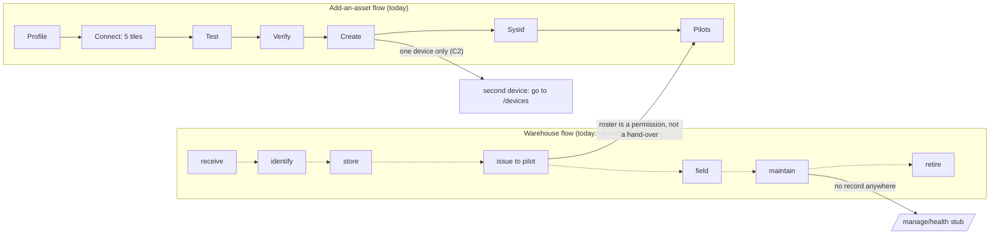
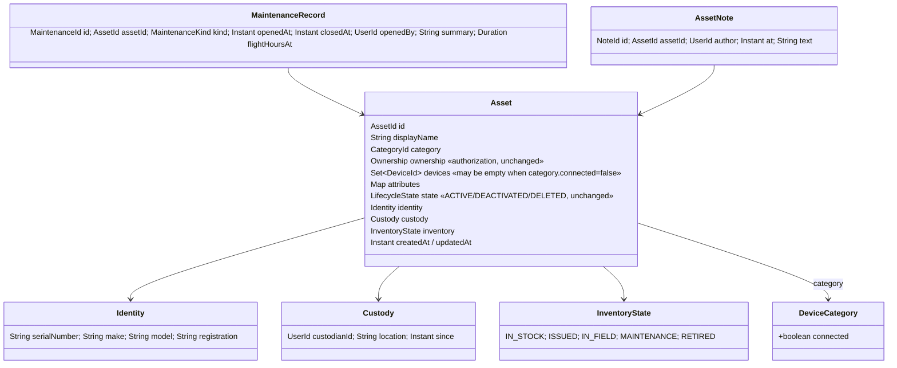
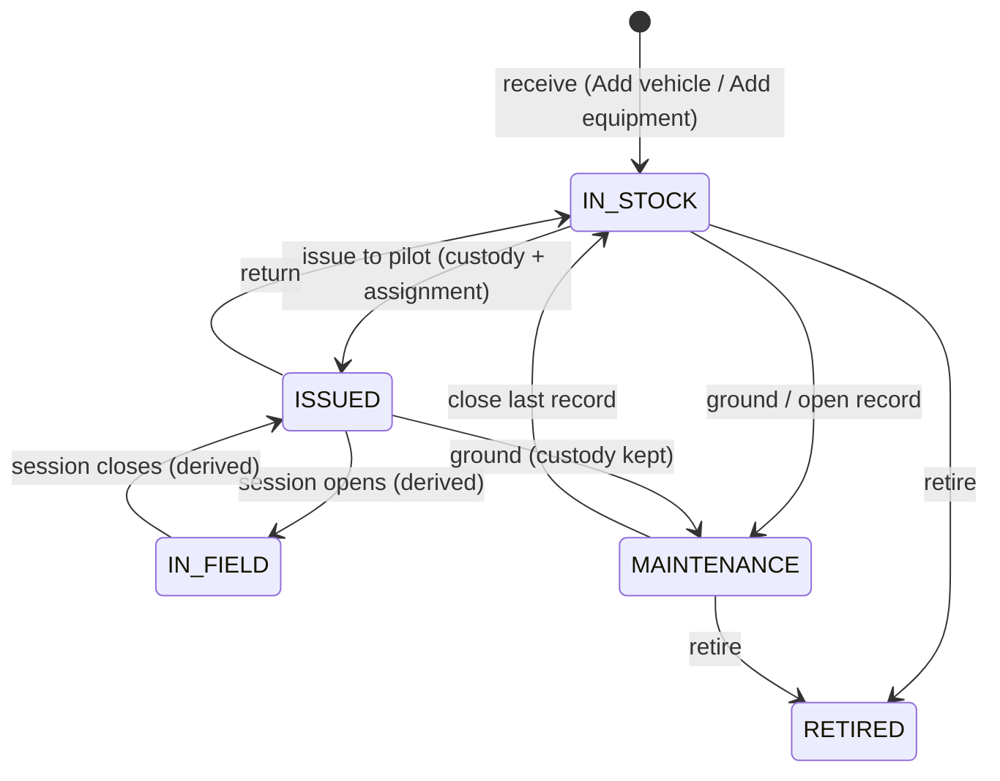

# WAREHOUSE-UX — what the fleet owns, and who walks in

Status: **W1–W10 built on `feat/warehouse-ux`, unmerged** (2026-08-30; cut from master `59b879a5`; head `3977ffc5`). Ledger, handoffs and deviations in [WAREHOUSE-UX-CONTEXT.md](WAREHOUSE-UX-CONTEXT.md). Rail count landed at **18 / 10** (manager / pilot), not the 15 §3.1 estimated — Add vehicle, Crew, Maintenance and the four SYSTEM entries were under-counted there. W8 added `GET /api/maintenance` + firmware/hours facts, W9 consumed them (one-call Maintenance page, Firmware/Hours columns, embedded Links/Categories), W10 swept the live-walkthrough findings (rail footer, copy, effective custody state, page-bar wrap). Open after this cycle: Reports' attention list was not re-homed, a `documents` table (E8). Read after [OPERATOR-UX-7-PLAN](OPERATOR-UX-7-PLAN.md) (page polish) and [SOURCE-ONBOARDING-CONTEXT](SOURCE-ONBOARDING-CONTEXT.md) (the add-a-vehicle wizard); this plan is the level above both — the *entity*, the *tables* and the *sidebar*.

**Ask (verbatim):** *"think about entities, missing fields, missing pages on UI and not full tables of assets … flows: warehouse one and adding the asset one … [the side panel] feels a bit overwhelming … think from enterprise, user, drone and operator's perspectives, what every one of this wants and how to make flow between them smoother."*

Grounding: three read-only sweeps on 2026-08-29 — the warehouse/identity domain records and Flyway ledger, every `vision-web` route and nav entry, and the IA / role / onboarding decisions already frozen in UI-REDESIGN, NAV-IA-REDESIGN, OPS-UX, CREW-CONTROL, DRONE-ONBOARDING and PLATFORM-AUDIT. Nothing below contradicts a frozen decision; where it changes one, §7 says so.

---

## 0. The one-sentence diagnosis

`vision-warehouse` is a **live-device registry** wearing an inventory's name: it knows an asset's UUID, display name, category slug, authorization owner, stream URI and a three-value `ACTIVE/DEACTIVATED/DELETED` state — and nothing a person who *owns* a fleet needs to know (serial, custodian, where it is stored, when it was serviced, whether it may fly). The sidebar is overwhelming for the same reason: with no inventory model underneath, every question about the fleet became its own page over the same rows (Assets, Devices, Categories, Reports, Roster — five projections of one `FleetStore`), and the four things that *would* be inventory (Firmware, Maintenance, Missions, Layouts) are "Upcoming" stubs.

Fix the entity and half the pages fold into one.

---

## 1. Findings

### 1.1 Entity — what a fleet owner cannot record today

| # | Concern | Today | Where |
|---|---|---|---|
| E1 | **Serial / make / model / registration** | absent; only a free-text `attributes` map and a *category hint* string `"model"` seeded by V2 | `Asset`, `assets` (unaltered since V1) |
| E2 | **Custodian** (who physically has it) vs **owner** (who may administer it) | only `Ownership(ownerId, groupId)` — an authorization tuple; `pilot_assignments` is a permission roster with an `assigned_at` column the domain never reads | `Asset.ownership`, V9 |
| E3 | **Storage location / site** | absent; the only position is telemetry-derived (`AssetSummary.lastKnownPosition`) — a drone in a box has no "where" | `AssetSummary`, `asset_usages` |
| E4 | **Inventory lifecycle** (in stock · issued · in field · maintenance · retired) | `LifecycleState{ACTIVE, DEACTIVATED, DELETED}` — a *soft-delete* enum, not a custody one; `AssetStatus{OFFLINE, STREAMING}` and `UsagePhase` are runtime | kernel `LifecycleState` |
| E5 | **Maintenance / service record** | absent — no entity, table, endpoint or page; MASTER-MATRIX B3 "table stakes", never started | — |
| E6 | **Firmware on the asset** | flight-side only (`vehicle_profiles.firmware_version`, keyed by device, append-only observation); warehouse cannot read it (dependency rule) | V17 |
| E7 | **Non-streaming items** (battery packs, props, radios, spare FCs) | unrepresentable — `Asset.devices` is **non-empty by invariant** and every `Device` carries a `StreamDescriptor`; batteries exist only as a live `batteryPercent` | `Asset` compact ctor |
| E8 | **Documents / photos / notes** | one image per asset (`asset_images`, replaced on upsert), no documents, no long-text notes, no author/timestamp | V5 |
| E9 | **Created / updated timestamps** | none on `assets`, `devices`, `categories`; age is recoverable only from `db_audit_log` | V1 |
| E10 | **Who flew it** | `AssetUsage` has no pilot — PLATFORM-AUDIT T4, README §3 row 6 | V3 |

### 1.2 Pages — the same rows, five times

| # | Cluster | Pages | What is duplicated |
|---|---|---|---|
| P1 | **Fleet as a table** | `/assets` · `/devices` · `/manage/categories` · `/manage/reports` · `/manage/roster` | one `FleetStore`, five projections; Devices is Assets one level down with **more** lifecycle verbs (7 vs 2); Categories and Reports are read-only and both carry a "coming" notice |
| P2 | **Creating an asset** | `/add-source` wizard · Devices "Promote to asset" · two empty-state quick-adds | four doors; the wizard is the only one that never leaves an orphan device — the other three exist to clean up after each other |
| P3 | **Readiness** | nav says *Pre-flight checklist*, page says *Fleet readiness*, plus `/assets/:id/readiness`, the cockpit checklist and the rc-monitor rows | one report, four surfaces, three names |
| P4 | **Settings** | `/settings/detection` in the Operate rail; `/settings` and `/org` only behind the identity chip | siblings split across two entry surfaces |
| P5 | **Stubs** | Missions · Saved layouts · Firmware · Maintenance | four `ComingSoon` routes in the rail; four more pages are unbadged-but-hollow (IA-TRUTH §5): Pre-flight, Alerts, Categories, Reports |

### 1.3 Sidebar — 25 entries, 12 manager-only, 4 stubs, 3 folded

A manager sees 25 entries in three groups; Manage alone has 14. A pilot sees 11. Manage mixes five unrelated jobs — inventory (Assets, Devices, Categories, Reports), people (Roster), pilot hardware (Controller), a CV studio (Training, Models), geo tooling (Geo regions), and diagnostics (Debug, System). Two of the "Advanced" three are routes a pilot can still type in (PLATFORM-AUDIT-UI D3 — no `orgGuard` on `/devices`, `/debug`, `/manage/categories`, `/manage/reports`, `/manage/training*`).

### 1.4 Flows — where each one breaks

- **Warehouse flow:** none of the seven verbs exists except *identify* (the wizard's Profile step) and *issue* (roster, as a permission). Receiving a battery is impossible (E7); retiring means `DELETED`.
- **Add flow:** good in the middle (steps 12–17 of DRONE-ONBOARDING §1.1 "stay"), wrong at the ends — it begins with a *link* not a *thing* (C2), and ends with a permission grant not a hand-over. A vehicle with a camera and an FC is still two visits (`/add-source`, then `/devices`).

---

## 2. Four perspectives — what each one wants

| Perspective | Wants | Gets today | Gap that this plan closes |
|---|---|---|---|
| **Enterprise** (org admin, the person who signs for the fleet) | an inventory it can audit: what we own, serial, where it is, who has it, when it was last serviced, flight hours per airframe, an export for the accountant / regulator | `fleet/summary` counts and a per-flight evidence ZIP | E1–E5, E9, an export (§4 W6), retire ≠ delete |
| **Manager / user** (runs the day) | one place to see the fleet, issue a vehicle to a pilot, take it back, ground it for service, add a new one in one sitting | five list pages, a permission roster, a wizard that stops at one device | P1, P2, custody verbs, fit-out table (S4) |
| **Operator / pilot** (flies) | *my* vehicles, is it GO, what is on it (battery, props, firmware), a rail that is not 25 entries, nothing that is not theirs | 11 entries incl. Controller and System, a readiness report in four places, no consumables | rail by role (§3), P3, E7 on the cockpit |
| **Drone** (the vehicle itself) | to be found once, identified by what it *is* (sysid + serial, not a URI), to carry its own passport (firmware, params, hours, service) and to say when it is unfit | passport exists (I7, O11–O13) but no UI shows it; firmware is a telemetry string; readiness is computed but cannot ground a vehicle | E6 via a read-model join, maintenance → readiness (§4 W5), wizard begins with the thing |

The common thread: **an asset is a thing, a device is a link to it.** Every gap above is a place where the code treats the link as the thing.

---

## 3. Proposals

### 3.1 Sidebar — five groups, ~14 entries, nothing unbuilt in the rail

```mermaid
flowchart TB
  subgraph OPERATE
    fly[Fly] --- wall[Wall] --- ready[Readiness]
  end
  subgraph MONITOR
    cmd[Command] --- act[Activity] --- rep[Replay] --- al[Alerts]
  end
  subgraph FLEET
    inv[Inventory<br/>tabs: Vehicles · Equipment · Links · Categories] --- add[Add vehicle] --- crew[Crew<br/>roster · org · invites] --- maint[Maintenance]
  end
  subgraph VISION
    tr[Training] --- mod[Models] --- geo[Geo regions]
  end
  subgraph SYSTEM["SYSTEM (footer, with identity chip)"]
    st[Status] --- au[Audit] --- dbg[Debug] --- set[Settings<br/>account · detection · controllers]
  end
```

Rules (extend NAV-IA-REDESIGN §2.1):

1. **An unbuilt area is not a nav entry.** The four `soon` entries leave the rail; their routes stay for deep links; `ComingSoon` stays as the page. This deletes the *Upcoming* disclosure entirely (rule 7 is withdrawn; F9 "unbuilt never outranks built" is satisfied trivially).
2. **Group by job, not by role.** *Manage* splits into **Fleet** (things and people), **Vision** (the CV studio + geo, a different pipeline with a different persona — the "ML tinkerer" of UX-DESIGN §1) and **System** (diagnostics, in the footer next to the identity chip where `/settings` and `/org` already live). *Advanced* disappears as a tier; System *is* the advanced tier.
3. **Inventory is one page with tabs**, not five: Vehicles (today's Assets) · Equipment (E7 passive items) · Links (today's Devices, unchanged internally) · Categories. Reports becomes the **Export** action on the Inventory page bar, not a page.
4. **Readiness has one name.** Nav *Pre-flight checklist* → *Readiness*; the page keeps its H1. (`/operate/preflight` stays as the route.)
5. **Controller moves to Settings.** It is the pilot's own hardware, not fleet configuration; the cockpit drawer already deep-links to it. `Detection defaults` also moves under Settings — it never belonged in Operate.
6. **Role gating is on the route, once.** Every `managerOnly` entry gains `canActivate: [orgGuard]` (PLATFORM-AUDIT-UI D2/D3 close here). A pilot's rail is then: Fly · Wall · Readiness · Command · Activity · Replay · Alerts · Inventory (read-only, their vehicles) · Status · Settings — 10 entries, none of them a manager's errand.

Count: 25 → 15 for a manager (Inventory, Add vehicle, Crew, Maintenance, Training, Models, Geo, Status, Audit, Debug, Settings + 3 Operate + 4 Monitor minus Detection defaults), 11 → 10 for a pilot, 0 stubs in either rail.

### 3.2 Entity — an inventory layer on `Asset`, custody separate from authorization

Decisions:

- **D1 — `InventoryState` is a new enum beside `LifecycleState`, not a replacement.** `LifecycleState` is soft-delete plumbing that 50+ call sites read; custody is orthogonal (a `DEACTIVATED` asset can be `IN_STOCK`). `RETIRED` replaces the habit of `DELETED`-as-retire: retired assets keep their history and stay in exports; `DELETED` remains "was a mistake".
- **D2 — `ISSUED` and `IN_FIELD` are derived, not written.** `ISSUED` ⇔ `custody.custodianId != null`; `IN_FIELD` ⇔ an open `AssetUsage`. Only `IN_STOCK`, `MAINTENANCE`, `RETIRED` are stored (`assets.inventory_state`). This keeps "newest data wins" (rule 9): a flying asset is in the field whatever the column says.
- **D3 — custody ≠ assignment.** `pilot_assignments` stays what it is (who *may* operate). `Custody` is who *has* it — one person, with a `since`. Issuing to a pilot does both in one command (`AssetCustodyService.issue(assetId, userId)`), returning does the reverse only for custody. This is the "hand-over" the add flow is missing.
- **D4 — `DeviceCategory.connected: boolean`** (seed: drones/cameras/rovers `true`; new `battery`, `spare`, `radio` categories `false`). The `Asset.devices` non-empty invariant becomes *non-empty iff category.connected*. Nothing else in the codebase changes meaning — every consumer that iterates devices already tolerates any count ≥ 1 and will tolerate 0 for a category it never sees on the Fly picker (triage already filters by `TELEMETRY` capability).
- **D5 — firmware stays flight-owned; the *table* joins it.** Warehouse must not read `vehicle_profiles`. The Inventory page's row reads it from the existing `GET /api/fleet/readiness` payload (which already carries `VehicleProfile`), assembled in `vision-api`'s read-model layer — the same trick `AssetAttention` uses for battery. No new dependency edge.
- **D6 — `MaintenanceRecord` is a warehouse aggregate; readiness consumes it.** An open record with `kind ∈ {GROUNDING, INSPECTION_DUE}` is a NO-GO blocker in `vision-flight`'s readiness evaluation, read through a new warehouse port `MaintenanceQuery.openBlockers(assetId)` — flight already depends on warehouse, so the edge exists. This is how a manager *grounds* a vehicle and the pilot sees it on the cockpit without a new channel.
- **D7 — one migration task, `V28__asset_inventory.sql`**: `assets` += `serial_number, make, model, registration, custodian_id, location, custody_since, inventory_state (default IN_STOCK), created_at (default now()), updated_at`; `categories` += `connected boolean default true`; new `maintenance_records`, `asset_notes`; `asset_usages` += `pilot_id` (closes README §3 row 6 in passing). This is the "dedicated task" the persistence MODULE.md freeze asks for. No FKs, per the module's standing convention.
- **D8 — `registration` moves out of `attributes`.** Today it is a well-known key the asset-detail Characteristics drawer edits; V28 migrates it (`UPDATE … SET registration = attributes->>'registration'`) and the drawer reads the column.

Not done, on purpose: quantity/stock counts (a fleet of 20 is not a stockroom of 2 000 props — one row per battery is fine and gives each its own hours), documents beyond one photo (E8; a `documents` table is a wave when someone has a PDF to attach), purchase price / PO (`attributes` is exactly right for accounting keys until an export needs them).

### 3.3 Tables — what the Inventory page shows

| Tab | Columns | Filters | Row verbs |
|---|---|---|---|
| **Vehicles** | Name · Category · Serial · **Readiness** (GO/NO-GO/—) · **Custodian** · Inventory state · Firmware (D5) · Hours · Last flown · Links (n) | search · category · inventory state · custodian · readiness · show retired | Issue to… · Return · Ground / Release · Retire · Open · Fly |
| **Equipment** | Name · Category · Serial · Custodian · Inventory state · Hours (batteries: cycles from `attributes.cycles` until a producer exists) · Notes | same minus readiness | Issue · Return · Ground · Retire |
| **Links** | today's `/devices` table verbatim, incl. cycle-7's endpoint-conflict line | today's | today's — and *Promote to asset* becomes *Add vehicle from this link* (opens the wizard at Identify with Connect prefilled, so P2's fourth door leads through the one flow) |
| **Categories** | Category · Connected · Total · In stock · Issued · In field · Maintenance · Retired | search | Create · Rename · Set connected (`POST/PUT /api/categories` — the write half UI-REDESIGN §Additions asked for) |

The detail pane gains **Identity** and **Custody** fact groups and a **Maintenance** drawer (open records, "Open a record", close). The asset-detail page's KPI band adds *Hours since service*. `activate/deactivate` stay hidden on assets (cycle-3 decision) — `Ground` is the verb managers were reaching for.

**Export** (page-bar action): `GET /api/inventory/export?format=csv` — one row per asset with every column above, honouring the caller's `VisibilityScope`; the first *report* that is a report.

### 3.4 Flows — the thing first, then the link, then the hand-over

**Warehouse flow** (each verb is one command in `AssetCustodyService` / `MaintenanceService`, each an audit entry):

**Add-a-vehicle flow** — the wizard re-ordered around the thing:

| Step | Was | Becomes |
|---|---|---|
| 1 Identify | Profile (name, registration, category, photo) | + serial, make/model; if `category.connected=false` the wizard ends after this step with **Receive** — a battery is three fields |
| 2 Connect | five tiles, one device | the **fit-out table** of SOURCE-ONBOARDING §6 (S4): one row per role (Sense / Sight), each row `find… · simulate · —`; finders reused verbatim. Closes C2 — the camera and the FC are one visit |
| 3 Prove | Test + Verify | unchanged in substance; runs per row; sysid collision stays advisory |
| 4 Register | Create (+ Sysid) | unchanged; one `POST /api/assets` with N devices (already supported) |
| 5 Hand over | Pilots (permission) | **Issue to** a custodian (D3) *or* leave in stock; assignment follows from issue. The end screen names the next verb: *Open readiness ›* for a connected vehicle, *Back to inventory* for equipment |

Entry points collapse to one: the page-bar `+ Add vehicle` and the Links tab's *Add vehicle from this link* both open this wizard; the two empty-state quick-adds are deleted (their only job was the demo's simulated source, which `scripts/demo.sh` creates over REST anyway).

---

## 4. Waves (disjoint files, one branch `feat/warehouse-ux`, sub-branches per wave)

| Wave | What | Agent | Files | Blocked on | Exit |
|---|---|---|---|---|---|
| **W1 rail** | §3.1 nav regroup, `soon` entries out, `orgGuard` on every `managerOnly` route, Controller + Detection under Settings, Readiness rename | web-ui | `features/hubs/nav-entries*`, `shared/ui/app-sidebar/**`, `app.routes.ts`, `features/*/*.routes.ts` (guards only) | — | `nav-entries.spec` counts 15/10; `npm run test:ci`; prod build |
| **W2 domain** | D1–D4, D8: `Identity`, `Custody`, `InventoryState`, `MaintenanceRecord`, `AssetNote`, `DeviceCategory.connected`, ports `MaintenanceQuery`, `AssetCustodyService`, `MaintenanceService`, `AssetEdit` widened, `FleetSummary` counts by inventory state | domain-modeler → application-service | `contexts/vision-warehouse/**` | — | `./mvnw -B -pl contexts/vision-warehouse test` |
| **W3 persistence + API** | D7 `V28__asset_inventory.sql`, JPA entities/mappers, `AssetUsage.pilotId`, controllers: `PATCH /api/assets/{id}` (identity), `POST /api/assets/{id}/custody` (issue/return), `POST|GET|DELETE /api/assets/{id}/maintenance`, `POST/PUT /api/categories`, `GET /api/inventory/export` | spring-integrator | `storage/persistence/**`, `station/vision-api/**` | W2 | `./mvnw -B -pl storage/persistence,station/vision-api,station/vision-app test` (Docker) |
| **W4 inventory page** | §3.3 tabs, columns, filters, verbs, detail pane groups, export action; `/assets` becomes `/fleet/inventory` with redirects from `/assets`, `/devices`, `/manage/categories`, `/manage/reports` | web-ui | `features/inventory/**` (new), redirects only in `app.routes.ts` | W1, W3 | `test:ci`; a manager grounds a vehicle and sees it NO-GO on `/operate/preflight` |
| **W5 readiness ← maintenance** | D6: readiness evaluation consumes `MaintenanceQuery.openBlockers`; cockpit + readiness page render the blocker with the record's summary | application-service (flight) + web-ui | `contexts/vision-flight/**readiness**`, `features/readiness/**`, `features/fly/**preflight**` | W2 | flight tests; grounded vehicle → NO-GO with reason |
| **W6 wizard** | §3.4: Identify step with serial/make/model + equipment short-circuit, fit-out table (= SOURCE-ONBOARDING S4), Hand-over step, single entry point, quick-adds deleted | web-ui | `features/onboarding/**` | W3 (custody endpoint) | a camera + FC vehicle registered in one visit; a battery in three fields |
| **W7 maintenance page + crew** | `/fleet/maintenance` (open records across the fleet, hours-since-service, due soon) replacing the `/manage/health` stub; `/fleet/crew` = roster + org + (when CREW-CONTROL lands) invites, in tabs | web-ui | `features/maintenance/**` (new), `features/roster/**`, `features/org-settings/**` | W3 | `/manage/health` route redirects to a real page |

Every web wave: `npx tsc --noEmit -p tsconfig.app.json` and `-p tsconfig.spec.json`, `npm run test:ci`, prod build, `station/vision-web/MODULE.md`; every Java wave: the `-pl` build above green and the module's `MODULE.md` updated. Own files only, commit by path, **do not stash** — agents share one tree. Effort: W1 S · W2 M · W3 M · W4 M · W5 S · W6 M · W7 M — roughly the size of OPERATOR-UX-3…6 together; ship W1 alone first (a day, immediately visible), then W2+W3 as one sub-branch, then the rest in parallel.

---

## 5. What I would not do

- **Not a fourth `Role`, not an "inventory clerk".** Custody verbs ride `canManage(ownership)` exactly like `setState` (OPS-UX §1). A store-keeper is a MANAGER of the store's group.
- **Not a stockroom.** No quantities, no bins, no barcode workflow — one row per thing with a serial. If a customer shows up with 2 000 props, that is a different product.
- **Not merging Links into Vehicles.** A device is still a link with its own lifecycle; the Links tab is `/devices` verbatim. What changes is its *place*, not its shape.
- **Not touching `LifecycleState`.** Fifty call sites, a soft-delete convention that works, and an ArchUnit-checked kernel. `InventoryState` sits beside it.
- **Not a Firmware page.** D5 puts the version in the table; *updating* firmware is DRONE-ONBOARDING O9/O10 territory and operator-gated there.
- **Not Missions / Saved layouts.** Both leave the rail under rule 1; MISSIONS stays in README §4 "reconcile in writing", layouts is a `SettingsStore` afternoon when someone asks.

## 6. Open questions for the owner

| # | Question | Default if unanswered |
|---|---|---|
| OQ1 | Does a `MAINTENANCE` state **block** flight or only warn? (Same question DRONE-ONBOARDING §10 Q3 never got answered for NO-GO.) | Block — a grounded vehicle refuses `engage`; the manager can *Release* in one click. |
| OQ2 | Is custody per person or per group (a squad checks out a rover)? | Per person; `Custody.custodianId` is a `UserId`. A group would be a second field later, not a union type. |
| OQ3 | Batteries as first-class assets now, or wait for a cycle-count producer? | Now — three fields and a custodian are already worth it; cycles arrive as an `attributes` key until telemetry provides them. |
| OQ4 | Rename the URL `/assets` → `/fleet/inventory`, or keep the old paths as the canonical ones? | Rename, with redirects kept forever (NAV-IA precedent: `/warehouse`, `/map`). |
| OQ5 | Should W1 (the rail) ship before the entity work, i.e. an Inventory *tab bar* over today's five pages as an interim? | Yes — W1 is pure IA and fixes the "overwhelming" complaint in a day; the tabs point at today's pages until W4 replaces them. |

## 7. For the record — frozen decisions this plan changes

- NAV-IA-REDESIGN §2.1 rule 7 (`soon` under an *Upcoming* disclosure) → withdrawn; unbuilt areas leave the rail (§3.1 rule 1).
- UI-REDESIGN's three-mode Operate/Monitor/Manage → five groups; Operate/Monitor keep their meaning, Manage becomes Fleet + Vision + System.
- The `Asset.devices` non-empty invariant → conditional on `category.connected` (D4).
- `storage/persistence` "no V27+ without a dedicated task" → this is that task (D7).
- SOURCE-ONBOARDING S4 (fit-out table) is scheduled here as W6, not in its own branch; S2/S3/S5 are unaffected and still belong to that context.
