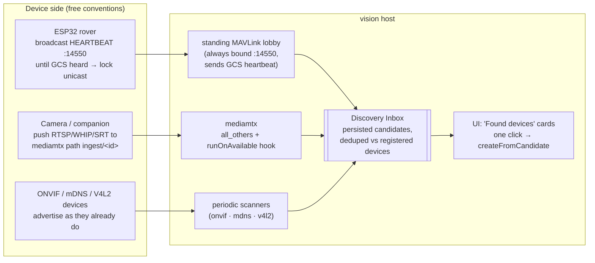

# Zero-config onboarding — devices announce, streams push, commands need only telemetry

**Opened:** 2026-08-30 · **Status:** research + proposal; nothing built · **Branch:** none yet

**Ask (condensed):** *"Look at the MAVLink flow and commands, and at adding assets. Today it is
overwhelming: for the ESP32 I must flash the vision host's URL into the firmware, join both to one
Wi-Fi, then in vision type the video URL and the telemetry endpoint and add the device by hand.
ArduPilot, USB cameras and other sources are the same. Make it easier — auto-scan, configuration,
maybe a proxy/domain service. It must be free, remove unnecessary user actions, and scale."*

**Verdict up front:** every hard part of this already exists in the tree or in a free de-facto
standard. The fix is not a new subsystem — it is (a) one firmware convention change, (b) turning
three existing dead-ends into live paths (`createFromCandidate`, `engage`, the mediamtx catch-all),
and (c) one genuinely new but small piece: a persistent **discovery inbox**. No cloud, no paid
service, no new protocol invented.

---

## 1. Today's flow, measured

From the tree at `42587d45` (fit-out wizard merged). Full step-by-step trace in the analysis that
produced this doc; counts only here:

| Device class | Off-app steps | In-app steps | Worst manual actions |
|---|---:|---:|---|
| ESP32 rover + camera | 5 | ~14 | vision host **IP hardcoded in `Config.cpp`** (reflash when DHCP moves the laptop); camera URL typed by hand; interface picker defaults to a docker bridge the ESP32 can't reach; must start a *video* stream before any command works |
| ArduPilot SITL | 1 | ~8 | Sight row must be set to `simulate` or the asset is never commandable (B4); "Use" on a heard vehicle round-trips through the manual form |
| USB camera | 0 | ~6 | the only smooth path; still ends in a form |

### Root causes (all five, no more)

| # | Cause | Where it lives |
|---|---|---|
| R1 | **The device must be told the server's address** — `link.peerHost "// CHANGE ME"` in firmware; camera URLs typed into the wizard | `~/Arduino/ardupoilot-start/Config.cpp`; wizard register step |
| R2 | **Discovery is a scan button feeding a form.** Four scanners produce rich `DiscoveredDevice`s (name, protocol, uri, sysid, firmware); the sole consumer is a JSON response the operator *retypes*. `DefaultAssetService#createFromCandidate` (with its duplicate check) exists and the wizard never calls it | `DiscoveryController`; `onboarding-store.ts` |
| R3 | **Streams are pull-by-typed-URL.** Vision must know each camera's address, though mediamtx already accepts anonymous push on every path (`all_others`) and can report/announce active paths | `mediamtx.yml`; `StreamDescriptor` |
| R4 | **Commands are coupled to video** (TELEMETRY-ONLY §B4, still open). `subscribeTelemetry` has one call site, gated on a video stream starting; R2's `engage` verb opens a usage with *no device traffic* and has **zero web callers** | `UsageTracker.java:267,531`; `AssetSessionController` |
| R5 | **Nothing listens when nobody is looking.** The MAVLink gateway binds only when a stream opens or a scan runs; a rover heartbeating at the host while no one clicks "scan" is heard by no one | `MavlinkTelemetrySource#open`; `MavlinkHeartbeatScanner` self-bind mode |

---

## 2. What the ecosystem does (research, 2026-08-30)

Sourced summary; the full sourced report is in the task transcript, key findings only:

- **MAVLink has a zero-config convention and it is not mDNS.** The GCS passively binds UDP `14550`;
  the *vehicle* announces itself with heartbeats. PX4's Wi-Fi/Ethernet link **broadcasts to
  `255.255.255.255:14550` until it receives the first GCS heartbeat, then locks unicast onto that
  GCS** (`MAV_BROADCAST`). DroneBridge-for-ESP32 unicasts to every associated Wi-Fi client. QGC
  auto-creates a vehicle per new sysid on the shared port. No `_mavlink._udp` mDNS convention exists
  anywhere in QGC/MAVSDK/mavlink-router — heartbeat-to-14550 *is* the standard. We already implement
  the receive half: shared gateway per bind, sysid demux, a bounded unclaimed-vehicle registry.
- **ESPHome/Home Assistant is the best-in-class free onboarding, and its trick is inversion:** the
  device is *never told* the server address. Provisioning shrinks to "get on Wi-Fi" (via **Improv
  Wi-Fi** — an open ESPHome/Nabu-Casa standard drivable from a Chrome browser over Web Serial/Web
  Bluetooth, no phone app); the device then only *advertises* (mDNS `_esphomelib._tcp`); the server
  browses and raises a "new device found — configure?" card, paired by MAC so IP changes never
  matter. Fallback ladder: mDNS → DHCP-sniffing → manual IP; every layer optional.
- **mediamtx is already a push registry.** Any client can publish RTSP/RTMP/WHIP/SRT to an arbitrary
  path (our `all_others` config accepts this today); the path *name* is the registry key;
  `runOnAvailable`/`runOnUnavailable` hooks fire a command with `MTX_PATH` when a stream
  appears/vanishes; `GET /v3/paths/list` (`:9997`) lists live paths with a `ready` flag.
  `sourceOnDemand` makes server-discovered cameras lazy pulls that cost nothing until viewed.
- **JmDNS** (Apache-2.0) is alive and maintained (activity July 2026) for both browsing *and*
  advertising from Java. Known gotcha: one instance per NIC.
- **Multicast is the fragile layer** on consumer Wi-Fi (client isolation, IGMP snooping, VLANs). The
  robustness ranking that emerges: device→unicast/broadcast beacon to a well-known port beats mDNS
  beats server-side multicast probing. Hence PX4's choice, and hence ours below.

---

## 3. The proposal — four principles

### P1 — The device never learns an address by typing

- **MAVLink-capable devices** adopt the PX4 convention: broadcast heartbeats to `:14550` until the
  first inbound GCS frame, then lock unicast to that source address. `peerHost` leaves `Config.cpp`
  forever; DHCP moves stop mattering. The uncommitted `link_test.cpp` in `infra/rover-sim/` already
  names this exact failure ("a vehicle that only ever transmits to a compile-time IP goes
  permanently mute the moment the ground station's DHCP lease moves"). Vision's side of the
  handshake: the lobby gateway must **send** GCS heartbeats (identity 255/190 already exists in
  mavlink-core) — today vision "never initiates", which is the one line that must change.
- **Video-capable devices that also speak MAVLink** reuse the same lock-on: push video to the host
  they lock onto (fixed well-known mediamtx ports). One discovery, both halves.
- **Everything else** keeps its native announcement (ONVIF Hello/Probe, mDNS `_rtsp._tcp`,
  `/dev/videoN` enumeration) — our scanners already speak all three.
- **Optional, later:** vision advertises `_vision._tcp` via JmDNS as a *secondary* channel for
  devices that cannot do the MAVLink lock-on and cannot be pushed to. Not load-bearing — multicast
  is the fragile layer (§2), so nothing may *depend* on it.

### P2 — Discovery is an inbox, not a scan button

One `DiscoveryInboxService` (vision-warehouse application layer) fed by four producers:

| Producer | Trigger | Identity key |
|---|---|---|
| standing MAVLink lobby | heartbeat from unclaimed sysid | `(bind, sysid)` + firmware/mavType |
| mediamtx hook → `POST /api/ingest/announce` | stream becomes ready on an unreferenced path | path name (convention `ingest/<kind>-<mac>`) |
| periodic ONVIF/mDNS/V4L2 sweep | timer (existing scanners, unchanged) | address / service name |
| manual scan | today's button (kept) | as today |

Candidates are **persisted** (survive restarts), deduped against registered `Device`s by the same
`(protocol, uri, sysid)` test `createFromCandidate` already implements, and expire when silent.
The UI stops being "go scan, then retype" and becomes Home Assistant's card: a badge on Manage/
Inventory, *"New vehicle heard on :14550 — sysid 1, ArduPilot rover — Add?"* One click calls
`createFromCandidate`; the wizard's Identify/Hand-over steps become the *confirmation screen* of
that card, with every connection field already filled and proven (the probe ran before the card was
shown). The wizard's manual path survives untouched as the last-resort ladder rung.

**Pairing the two halves of one vehicle** (rover pushes video *and* heartbeats): v1 is explicit —
the card for either half offers "attach to existing asset" alongside "create new". Auto-pairing by
shared identity (MAC embedded in both the mediamtx path name and the MAVLink hostname/`AUTOPILOT_VERSION`
uid) is a v2 refinement, not a prerequisite.

### P3 — Streams push; the path name is the identity

For devices that can push (companions, OBS, ffmpeg on a Pi, future ESP32 firmware with SRT/WHIP):
the operator never learns or types a stream URL. The device pushes to
`rtsp://<locked-host>:8554/ingest/<kind>-<mac>`; the `runOnAvailable` hook announces it; the inbox
shows it; the registered `Device` stores the *mediamtx path*, not the device address — which also
means the cockpit's existing mediamtx-as-source-of-truth viewing path (MEDIA-SOT) needs zero change.
Pull-only cameras (ONVIF/RTSP/MJPEG) stay pull, but registered as `sourceOnDemand` paths and — the
one missing scanner feature — `OnvifWsDiscoveryScanner` finally implements `GetStreamUri` so its
candidates carry a URL instead of `suggestedStream = null`.

### P4 — Command needs telemetry, not video (close B4 at last)

`engage` gains what R2 deliberately left out: it opens a telemetry subscription per `TELEMETRY`
device (and nothing else — no video implied), and the Fly cockpit calls
`POST /api/assets/{id}/session` so the verb finally has a caller. The reachability rule
("you cannot command what you cannot hear") stays exactly as it is — it just stops being satisfiable
only via a video stream. This is the single highest-value wave in this document and is independent
of every other one.

---

## 4. The after-flows

| Device | Steps after this proposal |
|---|---|
| ESP32 rover | flash the **generic** firmware once (no per-site edits) → plug USB into the laptop → vision's web console provisions Wi-Fi over Improv/Web Serial (browser, no app) → rover broadcasts, locks on, pushes video → **one card, one click, done** |
| ArduPilot SITL / any UDP vehicle | start SITL pointed at the host (unchanged) → card appears from the standing lobby → one click |
| USB camera | plug in → periodic V4L2 sweep raises the card → one click |
| ONVIF/IP camera | joins the LAN → sweep raises the card *with a playable URL* → one click |
| Anything exotic | today's manual wizard, unchanged, as the bottom ladder rung |

The user's "proxy/domain service" instinct is answered without a new service: **mediamtx is the
stream proxy** (already deployed, already permissive) and **the lobby + inbox are the domain
registry**. Nothing new runs; nothing costs money; nothing needs the cloud.

---

## 5. What exists vs what must be built

| Piece | State | Work |
|---|---|---|
| Shared `:14550` gateway, sysid demux, unclaimed registry (bounded 32) | shipped (FLEET-RADIO) | none |
| `MavlinkHeartbeatScanner` self-bind mode | shipped | promote to a *standing* lobby (bind at boot when no device holds the port; yield to/piggyback on device gateways — the two-mode logic already exists) |
| GCS identity 255/190, heartbeat send capability | shipped in mavlink-core sessions | lobby must actually transmit heartbeats (vision currently never initiates) |
| `createFromCandidate` + duplicate check | shipped, **0 callers** | wire it: inbox card → this method |
| `engage`/`disengage` endpoint | shipped, **0 web callers, no device traffic** | P4: open telemetry subscriptions; cockpit calls it |
| mediamtx `all_others` publish + API `:9997` | deployed today | add `runOnAvailable`/`runOnUnavailable` hooks → new `POST /api/ingest/announce`; path-naming convention |
| ONVIF/mDNS/V4L2 scanners | shipped | run on a timer; ONVIF `GetStreamUri`; fix stale MODULE.md |
| `DiscoveredDeviceResponse` drops `suggestedStream.options()` | known defect | fix while touching the wire shape |
| Discovery inbox (entity, service, persistence, SSE, cards UI) | — | **the one genuinely new piece** (warehouse + api + web) |
| Improv Wi-Fi provisioning page (Web Serial) | — | vision-web only; the firmware side is standard Improv-serial (free SDKs) |
| Firmware: broadcast-until-heard + Improv + video push | — | lives in `~/Arduino/ardupoilot-start`, outside this repo; `infra/rover-sim/link_test.cpp` (uncommitted) is already its test harness |
| Interface-ranking bug (docker bridge first) | known defect | shrinks in importance (P1 removes most uses) but fix anyway |

## 6. Security — the flip side of open doors

Auto-discovery widens two unauthenticated surfaces, so the design is **"announce freely, register
only by operator's click"**:

- Nothing ever auto-*registers*. A heartbeat or a pushed stream produces an inbox card; a human with
  `manageOrg` clicks it. (Same stance HA takes.)
- mediamtx publish is anonymous today (`mediamtx.yml`'s own comments document the trade). Acceptable
  on a LAN lab; before any shared deployment, per-path publish tokens (query-string creds mediamtx
  supports natively) go on the ladder — noted, not scheduled.
- The lobby transmits only heartbeats; it never commands. Command paths keep every existing
  interlock (scope gate, firmware gate, disarmed-only writes, consent tiers) untouched.

## 7. MAVLink command flow — the assessment half of the ask

The TX architecture is **sound and does not need rework**: UI → REST/WS → `FlightCommandPort` /
`ManualControlPort` → adapter → `COMMAND_LONG`/`RC_CHANNELS_OVERRIDE`, with real interlocks
(visibility gate + audit, ArduPilot-only firmware gate, kind-aware `emergencyStop`, disarmed-only +
consent-tiered parameter writes, watchdog, 16-channel truth). What is actually wrong, ranked:

| # | Defect | Fix lives in |
|---|---|---|
| 1 | **B4** — commands unreachable without a video stream | **wave Z1 below** (P4) |
| 2 | **F9** — one RC session app-wide (`DefaultManualControlService` holds a single `activeSession`); a fleet ceiling of one driven vehicle | FLEET-RADIO §1, unscheduled; schedule after Z1 |
| 3 | The whole probe/remediate/parameter loop ships behind `vision.onboarding.probe.enabled=false`, so the wizard's sysid-collision step silently no-ops | flip-the-flag decision (OQ2 of DRONE-ONBOARDING) — a *decision*, not a build |
| 4 | Friction asymmetry: a bound transmitter switch arms with one flick, a UI button needs a confirm dialog — same endpoint | small UX wave, schedule with Z-series |
| 5 | Missions/waypoints: 0% built, 8 waves specced, **contested** (plans README: MOAT says QGC does it free; build mission *tasking* + `.plan` import, not execution) | reconcile in writing before anyone starts — unchanged advice |

## 8. Wave sketch (sizes honest, scopes disjoint)

| Wave | Content | Size | Depends on |
|---|---|---|---|
| **Z1** | P4: `engage` opens telemetry subscriptions; cockpit calls session verbs; delete the "pair it with a fake camera" workaround from the SITL flow | M | — |
| **Z2** | Standing MAVLink lobby (bind at boot, transmit GCS heartbeat, feed candidates) + **Discovery Inbox** (entity, persistence, dedupe via `createFromCandidate`, SSE) + Found-device cards UI | L | — (better after Z1) |
| **Z3** | mediamtx push registry: hooks → `/api/ingest/announce`, path convention, inbox producer; device stores the mediamtx path | M | Z2 |
| **Z4** | Scanner completion: periodic sweeps, ONVIF `GetStreamUri`, `options()` wire fix, stale MODULE.md, interface ranking | M | Z2 |
| **Z5** | Improv Wi-Fi provisioning page (Web Serial) in vision-web | M | — |
| **Z6** | Firmware (outside repo): broadcast-until-heard, Improv serial, video push; verified by `infra/rover-sim` `link`/`commands` harnesses | M | Z2 (to see the result) |

Z1 alone fixes the worst daily pain (SITL + rover commandability). Z2+Z3 deliver the "it just
appears" experience. SOURCE-ONBOARDING's open S2–S5 (DeviceOrigin badge-through, simulate-onto-
existing-asset, delete the `simulated` category) compose with, and are not replaced by, this plan.

## 9. What I would not do

- **No mDNS convention for MAVLink** — the ecosystem's answer is heartbeats; inventing
  `_mavlink._udp` makes us the only speaker of a private dialect.
- **No cloud/rendezvous/proxy service** — LAN-first, everything above is free and local; a relay for
  cross-network ops is a different (VPN-shaped) problem.
- **No auto-registration without a click** — an open lab port must never silently mint inventory.
- **No DHCP-sniffing in v1** — HA's strongest fallback, but it needs privileged pcap; revisit only
  if mDNS+broadcast+push genuinely miss a device class we care about.
- **No new context, no new entity beyond the inbox candidate** — `Asset`/`Device`/`StreamDescriptor`
  already express everything; the inbox is upstream of them, not beside them.

## 10. Open questions for the owner

| # | Question | Default if unanswered |
|---|---|---|
| OQ-A | Is firmware work in `~/Arduino/ardupoilot-start` in scope for the same effort (Z6), or does vision ship Z1–Z5 and wait? | ship Z1–Z5; firmware follows |
| OQ-B | Flip `vision.onboarding.probe.enabled` to true by default (making probe/readiness/sysid-fix real), or keep opt-in? | keep opt-in one more cycle; revisit after Z2 |
| OQ-C | Does the ESP32 rover get a camera that pushes (SRT/WHIP from a companion), or stays the camera a separate pull device? | separate pull device; pairing via the inbox's "attach to existing" |
