# O1 — ASSET-FLOWS synthesis: deduplicated candidate catalog

Merges `R1-lifecycle-inventory.md` (code truth), `R2-pilot-journey.md` (UI journey),
`R3-existing-proposals.md` (docs mining), `R4-industry-practice.md` (industry patterns) into one
candidate list for Fable to rank. **Not ranked here** — ordering constraints and mutually-exclusive
alternatives are flagged, the priority call is Fable's.

Type legend: **DEF** defect-fix · **SF** small feature · **SR** spec-ready (a frozen plan exists,
cost is implementation) · **NP** new plan needed · **DEC** decision needed.
Size against this codebase: **XS** ≤1 wave · **S** 1–2 waves · **M** small plan (3–5 waves) ·
**L** full plan · **XL** multi-plan.

Prior decisions respected: CAMERA-FIRST is **declined** — only its two salvaged defects appear
(S6, A3). Missions is a live 4-way contradiction — it appears in §3 as a decision, never as a build
candidate. Every crew-gated item says so.

---

## §1 Safety gaps (CLAUDE.md priority 9 — failsafe and up-to-date data)

These are the candidates where the system today lets a pilot do something it already knows is wrong,
or shows two answers to the same safety question. Each merges findings R1/R2/R3 found independently.

| id | Candidate | Type | Pilot value | Size | Evidence |
|---|---|---|---|---|---|
| **S1** | **Grounding does not gate the command path.** `AssetCustodyService#ground` and an open flight-blocking `MaintenanceRecord` both refuse `engage` — but neither touches `DefaultFlightCommandService.arm/disarm/mode/RTH`, nor `UsageTracker`'s stream-origin session-open. And the UI half is worse: **grep finds zero references to grounding/maintenance in `features/fly/**`, `cockpit.html`, or either readiness page** — a manager grounds a vehicle and the pilot's cockpit never says a word. Start stream and Arm stay fully available. | DEF (backend gate) + SF (UI surface) | A vehicle a manager has taken out of service cannot be armed, and the pilot is told why | S–M | R1 gap #10 + §5 "Inert"; R2 §4 **D2** + §7 rank 1; R3 §1 Inventory rows 5–6 (both "open safety gap", both explicit W5 non-goals); R4 #3 (QGC *enforces* the checklist at arm, not just displays it) |
| **S2** | **No per-flight command exclusivity — two users can command one aircraft.** `DefaultManualControlService` enforces one RC session app-wide; `DefaultFlightCommandService` enforces nothing. Any number of signed-in users who open `/fly/:assetId` without `?watch=1` get simultaneous full Arm/Mode/RTL authority, with **no UI awareness of each other**. | SR — **attach to `CREW-CONTROL-PLAN.md` (CC-1..CC-6)**, do not invent a new shape | One aircraft, one commander, at a named moment; a second operator sees who holds it | L | R1 gap #3 + §3.5; R2 §5 + §7 rank 7; R3 §4 item 1, §1 Authority row 1; R4 #12 (handoff is a confirmed checkpoint, never a silent swap) |
| **S3** | **Two disagreeing battery/urgency verdicts, and the cockpit ignores the fleet one.** Cockpit OSD: critical ≤20%, low ≤45%. Fleet `attention-logic`: critical <10%, warning <20%. At 15% the pilot sees red and the manager sees amber, simultaneously. Same root cause as R2's separate finding that the ranked fleet **attention verdict is never read anywhere in `features/fly/**`** — the cockpit runs its own parallel thresholds. Thresholds are also hardcoded in TS (CLAUDE.md rule 1 violation). | DEF | Cockpit and Command agree on urgency, at the moment urgency matters | S | R2 §4 **D1** + §4 attention-verdict row + §7 rank 2; R4 #7 (thresholds are config, not code); CLAUDE.md rule 1 |
| **S4** | **No battery-low and no link-lost notification exists.** The bell's system-event taxonomy has seven kinds; neither is among them. A lost MAVLink heartbeat only tints a chip on a screen someone has to already be looking at. **Half of this is nearly free**: FLEET-RADIO R4 (merged) already emits a typed link-failure event carrying `PeerId` — nothing consumes it as a notification. | DEF (link half, wiring) + SF (battery half) | Someone is told when the aircraft is in trouble, without watching the right tab | S | R2 §4 **D3**; R3 §1 Platform "silent MAVLink link failure — done" (the producer exists); R3 §1 Platform "Alert rules + acknowledge" (this is that move's minimum viable slice) |
| **S5** | **A readiness verdict can say GO with no GPS fix.** `ReadinessService#evaluate` is configuration-only and never reads live telemetry/GPS/battery/armable state — flight's own MODULE.md calls it "an intentional gap". The fleet readiness pages therefore answer a *different question* than the cockpit's pre-arm checklist, and answer it advisorily. | NP (needs a live-telemetry collaborator + named, configured threshold sources) | GO means GO; NO-GO names the live reason | M | R1 gap #2; R2 §4 checklist row (fleet pages "ask a different question… advisory, never blocking"); R4 #3 (decomposed live blocking-reason list, each line clearing independently) |
| **S6** | **mediamtx has no auth on ingest or playback.** Anyone who can reach the host can publish into or pull any path. Independently flagged by **four docs across three weeks** and never once scheduled. | DEF/SF | The video plane stops being open to anyone on the network | S–M | R3 §2 item 4 (PLATFORM-AUDIT-FINDINGS + ZERO-CONFIG §6 + CAMERA-FIRST §C2 + ANALOGS §6); R3 §3 salvage (1) — the one camera-first item that survives the decline |

**S1, S2, S3 are the three the brief named.** S4–S6 are the same class: known-wrong, already
written down, never scheduled.

---

## §2 Candidate catalog

### 2.1 Onboarding

| id | Candidate | Type | Pilot value | Size | Deps | Evidence |
|---|---|---|---|---|---|---|
| A1 | **Pilots cannot onboard their own vehicle.** `/add-source` and `/provision-wifi` are hard `managerOnly` + `orgGuard`, no exception. A pilot whose hardware doesn't speak the announce protocol must find a manager. | DEC then SF | Self-serve for the pilot's own drone | XS once decided | §3-D4 | R2 §1 **F1** + §7 rank 3 |
| A2 | **Finish the simulate-flow unification (S3–S5).** `POST /api/simulations` still forks a whole new `category=simulated` Asset that can never merge with the real one. The blocker is gone — `DeviceOrigin{LIVE,SIMULATED}` shipped in ARCHITECTURE-AUDIT R4 and is unused for this. | SR (`SOURCE-ONBOARDING-CONTEXT.md` §1,§7,§12) | Test/train against the real asset without a phantom twin in the fleet | M | none | R1 gap #1 + §2.3 (coupling C3); R3 §2 item 7, §4 item 3 |
| A3 | **Discovery inbox can't tell "mediamtx is down" from "nothing plugged in."** Both return `List.of()`; only a WARN log distinguishes them. | DEF | An empty Found-devices list stops being ambiguous | XS | none | R1 gap #8; R3 §3 salvage (2) — second surviving camera-first defect |
| A4 | **Manual Connect step demands protocol literacy** — exact scheme/port, and free-text `mode=listener` for SRT, with no live URI builder. | SF | The escape-hatch path stops needing a cheat sheet | S | — | R2 §1 **F2** + §7 rank 9 (explicitly low) |
| A5 | **The deepest onboarding signal ships off.** `vision.onboarding.probe.enabled=false` gates PROBE, readiness capture, flight passport and config-drift entirely. A pilot flying today gets none of it. | DEC (OQ2) + verification wave | Passport + "a parameter changed since your last flight" for every pilot | S (flip+verify) / M (if defects surface) | §3-D3 | R1 gap #5 + §2.4, §4; R3 §1 Onboarding rows 4–5 |
| A6 | "Works with" compatibility matrix; ONVIF Profile S (auth'd + PTZ); PX4 support | idea (no plan) | — | L each | — | R3 §1 Onboarding rows 7–9; R4 §1 (repo is ArduPilot-centric) |

### 2.2 Readiness / pre-flight

| id | Candidate | Type | Pilot value | Size | Deps | Evidence |
|---|---|---|---|---|---|---|
| B1 | **Live-telemetry readiness** — see **S5**. Listed here because its build lands in this group. | NP | — | M | — | R1 gap #2; R4 #3 |
| B2 | **Readiness pages are a navigational dead end.** `/assets/:id/readiness` has zero `routerLink`s — not to `/fly`, not back. The cockpit likewise has no link to asset-detail. The one page whose whole job is "decide before flying" cannot forward you to flying. | DEF | Two-way navigation at exactly the pre-flight moment | XS | none | R2 §2 **F3** (rank 4), **F4** (rank 8) |
| B3 | **Asset-owned checklist + per-asset readiness rollup.** Today's checklist is cockpit-session state; industry practice puts it on the *asset*, persists partial progress across restarts, and aggregates every config area into one green/red summary. Also absorbs FLEET-RADIO **F15** (readiness rows that vary by vehicle kind — rover ≠ copter). | NP | One glance = flyable or not; resume an interrupted inspection; a rover isn't judged by copter rows | M | after B1 (else the rollup aggregates a verdict that ignores telemetry) | R4 #1 + #4, top-8 ranks 1 & 3; R2 §2 step 5; R3 §1 Flight-ops row F15 |
| B4 | **`GET /api/me/assignments` has zero callers.** The backend already answers "which drones are mine"; the drone picker groups by `isSimulated` instead, so an assigned pilot sees the same flat list as everyone else. **Cheapest fix in the entire survey.** | DEF | The picker answers "which drone is mine" | XS | none | R2 §6 + §7 rank 6 |

### 2.3 In-flight control

| id | Candidate | Type | Pilot value | Size | Deps | Evidence |
|---|---|---|---|---|---|---|
| C1 | **Sent-vs-received command monitor.** No way to see whether Arm/RTL actually *reached* the vehicle or was merely dispatched. The 2026-08-26 audit called this "the biggest missing capability." | NP (audit note only, no plan) | The pilot knows a command landed, not just that a button was pressed | M | none | R3 §1 Authority row D7; R4 §1 (QGC's decomposed live status widget is the display idiom) |
| C2 | **Multi-operator RC ceiling (T3.c / F9).** Move `DefaultManualControlService` off one-session-app-wide to one-per-`(operator,asset)`. | SR | Two pilots fly two different aircraft at once | M | **hard: after S2.** FLEET-RADIO F9 states lifting the ceiling without arbitration *makes contention worse* | R3 §1 Authority rows T3.c + F9, §2 item 3(b) |
| C3 | **Shared / switch-arbitrated control (OPERATOR-CONTROL, D9/D10).** A physical switch or UI toggle hands live sticks between two co-present operators on the *same* asset. A **third, distinct** problem from S2 and C2 — reaffirmed across 3 docs, never given its own plan. | NP | Instructor/student and two-crew stick handoff | L | after S2 | R3 §1 Authority row "Shared/switch-arbitrated", §2 item 3(c); R4 #11 (ATAK Observer Control = a *bounded subset* grant, the cheaper cousin) |
| C4 | **Merge the finished controller-binding rebuild.** C1–C12 are **built and green on `feat/controller-setup-c15`, unmerged.** Two FLEET-RADIO web halves (R2 kind-picker, R3 channel 18→16) are blocked purely on this landing. | DEF/hygiene | Work already paid for reaches the pilot; unblocks 2 deferred items | S (verify + merge) | none | R3 §1 Flight-ops rows 1, 7–8 |
| C5 | **`supports()` claims true for firmware that can't do the verb** (Betaflight false positive) — the command panel offers a button that cannot work. | DEF | Buttons that appear, work | S | none | R3 §1 Flight-ops row D3 |
| C6 | **Geofence AMSL-vs-AGL reference is ambiguous/wrong for some vehicle kinds** (F18). Distinct from the already-fixed marks-side AMSL bug. | DEC then DEF | A geofence at the altitude the pilot meant | S | §3-D5 | R3 §1 Flight-ops row F18 |
| C7 | **FC parameter writes exist but are reachable from exactly one hidden step.** `POST /api/assets/{id}/parameters` is only called by the wizard's sysid-collision branch; there is no general parameter surface. Overlaps onboarding's operator-gated Tier-A `PARAM_SET` (O9/O10). | DEC + SF | Tune without the wizard — but this is a *write to the aircraft*, so it stays gated | S | §3-D3 | R2 §6; R3 §1 Onboarding row O9/O10 |
| C8 | Arm/Disarm/Mode live one drawer-click away, not on load. R2 itself rates this arguably-correct given Arm's deliberate two-stage friction. | (note only) | — | XS | — | R2 §2 **F5**, rank 11 |
| C9 | Fleet command fan-out (RTL-all, per-vehicle outcomes) T3.a/b; `goto(AssetId, GeoPosition)` T3.d | SR | Direct one aircraft to a map point; recall the fleet | M each | after S2 for authority | R3 §1 Flight-ops rows T3, T3.d |

### 2.4 Post-flight

| id | Candidate | Type | Pilot value | Size | Deps | Evidence |
|---|---|---|---|---|---|---|
| D1 | **`AssetUsage` has no pilot field — "who flew it" is unrecorded.** The canonical 10-field shape has no pilot. Every replay, timeline and evidence package is anonymous. R3 explicitly corrects an earlier in-session belief that WAREHOUSE-UX had closed this — it did not. | DEF/SF | A flight record that names its pilot | S | none; **CREW-CONTROL (S2) would later extend it with PIC/OBSERVER — build the plain field first, it is not blocked** | R1 gap #4; R3 §2 item 6; R4 #16 (multi-pilot usage records — crew-gated, later) |
| D2 | **Post-flight "what went wrong" summary.** A plain-language flagged-event table over the replay/timeline data already captured — the section PX4 pilots read first, ahead of any plot. Explicitly *not* Flight-Review-style plotting (no FFT/estimator instrumentation in scope). | NP | An interpreted list instead of a scrub bar and a guess | M | none | R4 #8 + top-8 rank 8; R2 §3 (evidence package already exists and is the best leg of the journey) |
| D3 | **"Replay last flight" only ever reaches the single latest usage** — an older session from the same cockpit visit needs a detour to the library. | SF | Reach any recent flight from where you flew it | XS | none | R2 §3 **F6**, rank 10 |
| D4 | **Marks are not bound to a flight.** The data model doesn't scope marks to a usage window; only the manifest's query does, so a mark seconds outside the window silently misses its own flight's evidence package. The manifest already admits this in its caveat text. | DEF | The evidence package contains the marks the pilot made | S–M | none | R2 §3 marks note |
| D5 | Evidence follow-ups: signing/hashing, account-free share link, KML/KMZ/GeoJSON/GPX I/O, CoT egress + 2525/APP-6 symbology, time-bounded + raw-unthinned export | SR (all) | Interop and tamper-evidence | M each | share-link **after S6**; CoT **after `feat/track-identity` merges** (built, unmerged) | R3 §1 Post-flight rows; R3 §1 note on track-identity |

### 2.5 Maintenance & inventory

| id | Candidate | Type | Pilot value | Size | Deps | Evidence |
|---|---|---|---|---|---|---|
| E1 | **Usage-driven maintenance schedule.** Turn the maintenance page from a log into a *queue*: compute due-dates from accumulated flight hours/cycles, sort the fleet by what's due. **The hook already exists** — `MaintenanceRecord` carries `flightSecondsAt` and `AssetUsage` already accumulates session data. Needs an interval rule (configured, not hardcoded) and a rollup. No new telemetry. | NP (small) | Maintenance is a list to clear, not a fact to remember | M | none | R4 #5 + top-8 rank 4 (Auterion); R1 §5 (`flightSecondsAt`, `MaintenanceKind`, `blocksFlight()` all live) |
| E2 | **Field issue report from the flight UI → maintenance queue.** *Merges two findings*: R4's industry pattern (pilot reports a problem in 10 s without leaving the flight app) and R1's dead domain port — **`AssetNote`/`AssetNoteRepositoryPort` already exist in the domain with no service, no endpoint, no UI.** The write half is half-built already. | SF | Report a snag in seconds; the maintainer sees it in the same queue | S–M | none | R4 #6 + top-8 rank 5; R1 gap #6; R3 §1 Inventory row "Crew notes UI" |
| E3 | **Battery/consumable health as a computed retirement flag** (cycle ceiling / capacity floor, thresholds configured per CLAUDE.md rule 1). Warehouse already supports device-less assets precisely so a "battery" category is legitimate (WAREHOUSE-UX D4). | NP | "Retire this battery" instead of inferring it from a voltage | M | none | R4 #7 + top-8 rank 6; R1 §1 (`DeviceCategory#connected()`, device-less assets) |
| E4 | **Anomaly → maintenance ticket bridging.** A geofence breach / pipeline error / detected fault auto-opens a work item carrying asset id, code and location. Closes detect→act without re-typing. | NP | The loop from "something broke" to "someone owns it" | M | **after E2** (needs the intake) and benefits from E1 (needs the queue) | R4 #15 + top-8 rank 7 (Foxglove/robot fleet ops) |
| E5 | **Documents/attachments per asset** (E8) — manuals, registration, insurance, history. Today: one photo, replace-on-upsert, no history. | SR | Paperwork lives with the aircraft | S–M | none | R1 gap #14; R3 §1 Inventory row 2 |
| E6 | **Firmware is join-only.** Correct by the dependency rule (warehouse may never import flight), but firmware is therefore absent everywhere warehouse's own read models are consumed directly — only `vision-api`'s `AssetRowFacts` has it. | SF | Firmware visible wherever the asset is | S | none | R1 gap #15 |
| E7 | Category delete verb; true SQL aggregate for fleet stats (replacing in-memory rollup) | DEF / idea | hygiene | XS / S | — | R3 §1 Inventory rows 4, 7 |
| E8 | Fleet log/blackbox ingest, fleet-wide param-drift audit, firmware dashboard, multi-site gateways | idea (future-tagged) | — | XL | — | R3 §1 Inventory row 8; R4 §1 (logs are *pulled* post-flight, a deliberate separate action) |

### 2.6 Platform hygiene

| id | Candidate | Type | Size | Note |
|---|---|---|---|---|
| P1 | **13 endpoints still without an authority/visibility decision** after OPS-UX + LIVE-SCOPE | DEC + DEF | M | Needs product decisions per endpoint, not one sweep. R3 §1 Authority row |
| P2 | **No DB retention at all** for telemetry/detections; partitioning specced, `db_audit_log` amplification named | DEC (policy) + NP | M | R3 §1 Inventory last row + Platform; blocks nothing, degrades everything over time |
| P3 | **Asset-unit leases (DOMAIN-SEPARATION W3, D7)** — detailed design, **zero code**. R1 flags it as *design-ahead, not shippable now*. | (do not schedule this cycle) | XL | R1 gap #9 + §3.4; R3 §1 Platform |
| P4 | NATS broker W2 / learning extraction W4 / sim node W5 | SR | XL each | R3 §1 Platform; "no NATS anywhere in the tree" |
| P5 | OpenAPI + machine tokens; webhook + MQTT v5 egress; alert rules + ack; PMTiles offline basemap | SR | M each | R3 §1 Platform. **Alert-rules overlaps S4** — treat S4 as its minimum viable slice |
| P6 | 56-class N-1-arg constructor debt | hygiene | S each | CLAUDE.md §10 already bans the pattern going forward; remediate opportunistically inside other waves |
| P7 | **MODULE.md / memory corrections** | doc | XS | See §4 |

---

## §3 Decisions needed from the user

| # | Decision | Why it can't be made by an agent | Blocks |
|---|---|---|---|
| **D1** | **Missions — 4-way contradiction.** `MISSIONS-PLAN.md` specs full XL waypoint execution (M1–M8); `MOAT.md` §6 says stop considering waypoint planning at all; `MASTER-MATRIX.md` rates full execution **NO** and recommends lighter *tasking* (~80h) instead; `FLEET-MIGRATION-PLAN.md` §T4 calls pulling `MissionService` forward "the largest product win." `docs/plans/README.md` already flags the doc "Contested — reconcile in writing before anyone starts." **Represented here as a decision, not a build candidate.** Options are **mutually exclusive**: (a) full M1–M8, (b) tasking-only, (c) retire the idea. | Four authored docs disagree on product scope, not on implementation | Retires or unblocks MISSIONS-PLAN, FLEET-MIGRATION T4, and MAVLINK-CORE W6 (param/mission protocol) **all at once** — and W6 also feeds onboarding's Tier-A param work |
| **D2** | **Which control-authority model, in which order.** Three *distinct, non-mergeable* proposals: (a) `ControlClaim` single-holder arbitration (CREW-CONTROL, spec-frozen), (b) per-`(operator,asset)` RC sessions (T3.c), (c) shared/switch-arbitrated sticks on one asset (D9/D10). **Ordering is not free: FLEET-RADIO F9 says (b) without (a) makes contention worse.** A cheaper interim exists — an advisory "someone else is commanding this" indicator — but it is **not** a substitute for the S2 safety fix. | Product shape of crew, plus a build-order constraint with a stated safety rationale | S2, C2, C3, C9; R4 patterns #11/#12/#16 are all crew-gated behind it |
| **D3** | **Flip `vision.onboarding.probe.enabled` on by default?** (OQ2, unresolved). Off means no flight passport and no config-drift warning for anyone. Related: **O9/O10 are operator-gated by design** (Tier-A `PARAM_SET` writes to real hardware) and need an explicit go, as does **RC-CONTROL Phase 2** on a live airframe. | Writes to real flight controllers; the owner's own gate | A5, C7 |
| **D4** | **May a PILOT onboard their own vehicle?** Today: hard no, no exception. This is an authority-model question (who *owns* the resulting asset, and does OPS-UX's frozen `canManage` split bend for it?), not a route-guard tweak. | Changes the frozen OPS-UX authority table | A1 |
| **D5** | **Geofence altitude reference: AMSL or AGL, per vehicle kind?** F18 is filed as needing a decision, not just a fix. | Semantics, not code | C6 |
| **D6** | **Battery thresholds: what numbers, and where do they live?** CLAUDE.md rule 1 forces a choice — DB + cache if runtime-changeable, properties if not. Needed to land S3 as one source of truth rather than a third hardcoded copy. | Policy + a configuration-placement rule | S3, E3 |
| **D7** | **Retention policy** — how long do telemetry/detections/audit rows live? | Operational/compliance policy | P2 |

---

## §4 Stale-record corrections (queue these doc fixes)

R1 verified each of these against code on 2026-09-01; R3 independently confirms items 1, 4, 5, 7.

| Record | Says | Truth | Source |
|---|---|---|---|
| memory `platform-audit` + `ASSET-FLOWS-CONTEXT.md` §State known | "live-ops surface unscoped" | **Closed.** `LIVE-SCOPE-PLAN.md` shipped `StreamAccess` (`filterVisible`/`requireVisible` on all 8 `StreamController` handlers, invisible target 404s) and `LiveAssetAccess` for the SSE-topic half | R1 gap #11, §3.3; R3 §2 item 5 |
| `contexts/vision-flight/MODULE.md` Gotchas | Missing `MaintenanceQuery` bean → broken `vision-app` build | **Stale.** Both `OnboardingWiringConfiguration` and `ApplicationServiceWiring` thread it correctly; the grounding→readiness gate is wired end to end | R1 gap #13, §5 |
| `ASSET-FLOWS-CONTEXT.md` §State known | "asset-unit leases in DOMAIN-SEPARATION" (reads as built) | **Specced only.** W3 work, explicitly deferred out of the merged W1 module split; zero lease code exists | R1 §3.4, gap #9; R3 §1 Platform |
| memory `source-onboarding` | "`onTelemetryDeviceDiscovered` built with 0 callers" | **Deleted outright** in ARCHITECTURE-AUDIT R2, superseded by `engage`/`disengage`; the name survives only in comments | R1 gap #12 |
| `SOURCE-ONBOARDING-CONTEXT.md` (S2) | `DeviceOrigin` listed as an open proposal | **Shipped** (ARCHITECTURE-AUDIT R4). What's open is the *consumption* — S3–S5. Propose the consumption, not another enum | R3 §2 item 7; R1 §2.3 |
| earlier in-session belief (pre-compaction) | WAREHOUSE-UX D7 added `asset_usages.pilot_id` | **False.** The canonical 10-field `AssetUsage` still has no pilot field | R3 §2 item 6; R1 gap #4 |
| `ARCHITECTURE-AUDIT-2026-08-26.md` §Verdict | "silent MAVLink link failure" open | **Closed** by FLEET-RADIO R4 — `LinkHealth` carries `PeerId` + a typed link-failure event (which S4 should now consume) | R3 §1 Platform |
| (avoid re-flagging) | per-asset maintenance N+1 fetch | **Closed** by W8/W9 — one fleet-wide `GET /api/maintenance` call replaced the per-asset loop | R1 gap #7 |
| memory `ops-ux` vs R3 | ops-ux memory says the Wave E dev-group bug was fixed by postgres-only; R3 lists Wave E items 2–4 as unclaimed | **Unresolved conflict — verify before citing either.** Low confidence both ways | R3 §1 Authority row "Dev-group reconciliation" |

Also worth recording: `contexts/vision-flight/MODULE.md`'s note that pre-onboarding flight commands
authorize on `scope.includes(ownership)` while onboarding-stage services require `canManage` is
**deliberate and matches OPS-UX-PLAN §1's own table** — it is not drift, and should not be
"fixed" by a future wave.

---

## §5 Dependency graph

```mermaid
flowchart TD
    subgraph safety["§1 safety — no upstream deps"]
        S1["S1 grounding gates commands<br/>(backend + cockpit surface)"]
        S3["S3 one battery/attention<br/>severity source"]
        S4["S4 battery-low + link-lost<br/>notifications"]
        S6["S6 mediamtx auth"]
    end
    D6{{"D6 threshold values<br/>+ where they live"}} --> S3
    D6 --> E3
    LINKEVT["FLEET-RADIO R4 typed<br/>link-failure event (merged)"] --> S4
    S4 -.->|"minimum viable slice of"| P5["P5 alert rules + ack"]

    D2{{"D2 which control model,<br/>which order"}} --> S2["S2 CREW-CONTROL<br/>ControlClaim (CC-1..CC-6)"]
    S2 --> C2["C2 per-(operator,asset)<br/>RC sessions (T3.c/F9)"]
    S2 --> C3["C3 shared/switch<br/>arbitration (D9/D10)"]
    S2 --> C9["C9 fleet fan-out /<br/>goto"]
    S2 -.->|"extends, does not block"| D1U["D1 pilot on AssetUsage"]
    S2 -.->|unblocks| CREWPAT["R4 #11/#12/#16<br/>crew-gated patterns"]

    S5["S5 live-telemetry readiness"] --> B3["B3 asset-owned checklist<br/>+ readiness rollup (abs. F15)"]
    S1 -.->|"same surface —<br/>sequence, don't parallelise"| S5

    E2["E2 field issue report<br/>(reuses dead AssetNote port)"] --> E4["E4 anomaly → ticket"]
    E1["E1 usage-driven<br/>maintenance queue"] --> E4
    S1 -.->|"grounding becomes<br/>actionable output of"| E1

    S6 --> D5S["D5 account-free share link"]
    TRACKID["feat/track-identity<br/>(built, unmerged)"] --> D5C["D5 CoT egress + 2525"]
    C4["C4 merge feat/controller-setup-c15"] --> FRWEB["FLEET-RADIO R2/R3 web halves"]

    D1M{{"D1 missions:<br/>XL / tasking / retire"}} -.->|"retires or unblocks"| MISS["MISSIONS-PLAN · FLEET-MIGRATION T4 ·<br/>MAVLINK-CORE W6"]
    MISS -.-> C7["C7 general FC parameter surface"]
    D3{{"D3 probe.enabled +<br/>O9/O10 + RC Phase 2 go"}} --> A5["A5 passport/drift for all"]
    D3 --> C7
    D4{{"D4 pilot self-onboard"}} --> A1["A1 open /add-source to pilots"]
    D5G{{"D5 geofence AMSL/AGL"}} --> C6["C6 geofence altitude fix"]

    NODEP["no deps, any time:<br/>B2 · B4 · A2 · A3 · D3replay · D4marks · E5 · E6 · C5"]
    P3["P3 asset-unit leases —<br/>design-ahead, do not schedule"]
    style P3 fill:#fee,stroke:#c33
    style NODEP fill:#efe,stroke:#3a3
```

**Hard ordering constraints**

1. **S2 before C2.** FLEET-RADIO F9 states in writing that lifting the app-wide RC ceiling without
   claim arbitration *makes contention worse*. This is the only ordering constraint with a stated
   safety rationale.
2. **E2 before E4.** Anomaly→ticket needs an intake to write into.
3. **S6 before any account-free share link.** Publishing a read-only link over an unauthenticated
   media plane widens the S6 hole rather than using it.
4. **S5 before B3's rollup.** A rollup that aggregates a verdict which ignores live telemetry
   inherits the dishonesty and makes it look authoritative.
5. **S1 and S5 touch the same cockpit/readiness surface** — sequence them, don't run parallel waves
   into the same files.
6. **`feat/track-identity` must merge before CoT egress**; **C4 must merge before** the two
   FLEET-RADIO web halves.

**Mutually exclusive alternatives (pick one, don't build both)**

- **Missions:** full M1–M8 execution · tasking-only (MASTER-MATRIX M1) · retire (MOAT §6). §3-D1.
- **Control:** the three models in §3-D2 are *sequential*, not alternatives — but the cheap advisory
  "someone else is commanding this" indicator **is** an alternative to shipping CC-1..CC-6 now, and
  it does **not** close the S2 safety gap. Do not let it be scored as if it did.
- **Simulate:** route `POST /api/simulations` onto a real asset's device via `DeviceOrigin` (A2)
  · keep the `simulated`-category fork. Exclusive.
- **Battery thresholds:** DB + cache (runtime-changeable) · `application.properties` (fixed).
  CLAUDE.md rule 1 permits either; §3-D6 picks.
- **Readiness:** extend `ReadinessService` with a live-telemetry collaborator (S5) · replace it with
  an asset-owned checklist artifact as the new primary (B3). Sequence S5→B3; building both as
  competing primaries would give the pilot two readiness answers, which is the S3 mistake again.

**Deliberately not proposed:** the camera-first rework (declined 2026-09-01), a 4th `Role` constant
for crew (declined — "crew is not a role"; extend `AssignmentRole{PIC,OBSERVER}` instead),
`AssetUsage` as control-claim holder (rejected in writing by CREW-CONTROL-PLAN §9), asset-unit
leases as a build item this cycle (P3, design-ahead), and any re-flag of the live-ops scoping,
MaintenanceQuery wiring, N+1 maintenance fetch, or silent-MAVLink-failure findings — all four are
closed (§4).
