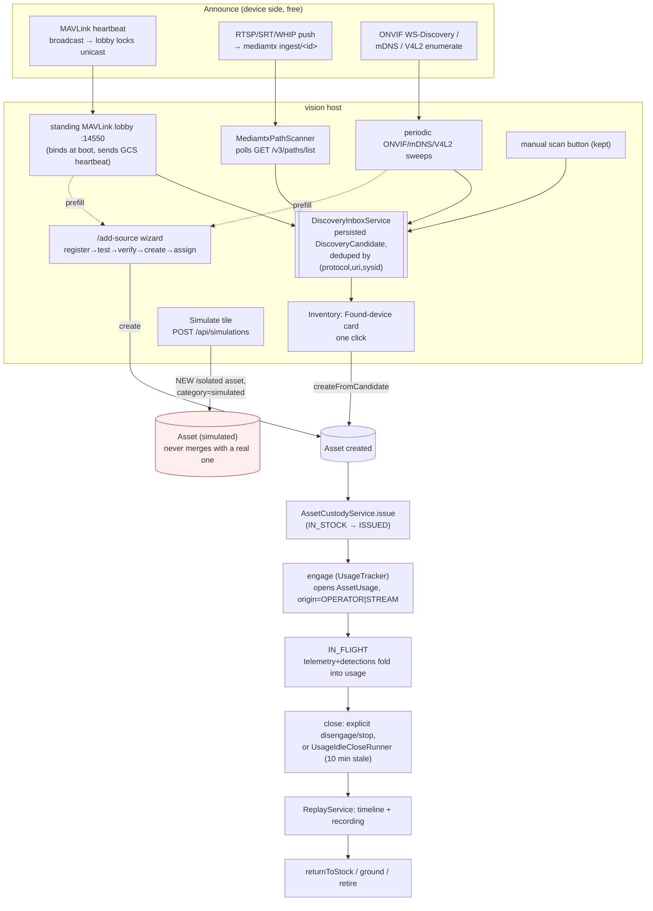

# R1 — asset lifecycle: code truth

Research wave for ASSET-FLOWS (`docs/plans/active/ASSET-FLOWS-CONTEXT.md`). Read-only. Every claim
cites `file:line` or a `MODULE.md`/plan-doc section. Sources: `contexts/vision-{warehouse,flight,
identity,events}/MODULE.md`, `device-discovery/onvif-mdns-v4l2/MODULE.md`, plus
`docs/plans/active/{WAREHOUSE-UX-PLAN,WAREHOUSE-UX-CONTEXT,ZERO-CONFIG-ONBOARDING-CONTEXT,
DRONE-ONBOARDING-PLAN,SOURCE-ONBOARDING-CONTEXT,DOMAIN-SEPARATION-{PLAN,W1},PLATFORM-AUDIT-FINDINGS,
CREW-CONTROL-PLAN}.md`, `docs/plans/done/{OPS-UX-PLAN,LIVE-SCOPE-PLAN}.md`.

**Correction to the R-wave brief up front:** two "state known at start" facts in
`ASSET-FLOWS-CONTEXT.md` are stale. (1) `onTelemetryDeviceDiscovered` was not left with "0 callers" —
it was **deleted outright** in ARCHITECTURE-AUDIT-2026-08-26 wave R2, superseded by explicit
`engage`/`disengage` verbs (`SOURCE-ONBOARDING-CONTEXT.md` §12; `core/vision-kernel/.../
UsageOrigin.java:23`; `contexts/vision-perception/.../UsageTracker.java:105-107`). (2) "Asset-unit
leases in DOMAIN-SEPARATION" are **specced, not built** — they are a future W3 ("worker role +
leases"), explicitly deferred out of the merged W1 module-split wave
(`docs/plans/active/DOMAIN-SEPARATION-W1.md:485`; lease design in
`docs/plans/active/DOMAIN-SEPARATION-PLAN.md:33,154,324`). See §3.4 and gap #9.

---

## §1. The asset model

**`Asset`** (`vision-warehouse`, the pure leaf of the context DAG) — canonical 12-field record:
`id, displayName, category, ownership, devices, attributes, state, identity, custody,
inventoryState, createdAt, updatedAt` (`contexts/vision-warehouse/MODULE.md` §domain.model). Two
owned sub-entities: **`Identity(serialNumber, make, model, registration)`** — all nullable, added
WAREHOUSE-UX W2; **`Custody(custodianId, location, since)`** — `custodianId==null` means "in stock".

**Inventory state is split stored-vs-derived by design.** `Asset#inventoryState()` only ever
persists `IN_STOCK | MAINTENANCE | RETIRED`; `ISSUED`/`IN_FIELD` are **never stored** —
`InventoryStates.effective(asset, hasOpenUsage)` derives them on every read: `IN_FIELD` wins if a
usage is open (flying is the "more current fact", CLAUDE.md §9), else `ISSUED` if a custodian is
set, else the stored value (`contexts/vision-warehouse/MODULE.md` §domain.model "InventoryStates").
Custody moves through `AssetCustodyService`: `issue → returnToStock → ground → release → retire`.

**`Device`** is deliberately "low-level plumbing": `(id, name, capabilities, stream, state,
origin)`. `DeviceOrigin{LIVE,...}` distinguishes a real device from a simulated one (see §2.3). An
asset may hold **zero** devices (WAREHOUSE-UX D4) — the old "≥1 device" invariant moved off `Asset`'s
compact ctor onto `DefaultAssetService#create`, gated on `DeviceCategory#connected()`; a "battery"
or "controller" category is legitimately device-less.

**`AssetUsage`** — the flight-session record, **one 10-arg constructor, no overloads**: `(id,
assetId, startedAt, endedAt, startPosition, lastPosition, sampleCount, streamId, phase, origin)`.
Constructed/persisted **exclusively** by `DefaultUsageSessionService` — nothing else may
`new AssetUsage(...)` (`contexts/vision-warehouse/MODULE.md` Gotchas). `origin ∈ {STREAM, OPERATOR,
TELEMETRY}` (kernel `UsageOrigin`) records which verb opened the session — stream-start, the
explicit `engage` verb, or (historically) a since-deleted telemetry-only path. `phase` is
warehouse's own `UsagePhase` enum, deliberately **not** flight's `FlightPhase` — warehouse must
never import flight; perception's `UsageTracker` runs `FlightPhaseRule` and translates onto
`UsagePhase` by name.

**Categories** (`DeviceCategory`) are data, not code (`CLAUDE.md` "Ids" rule). `connected: boolean`
(WAREHOUSE-UX D4) is the one behavioral flag: a connected category requires ≥1 device at creation.

**Attributes** are a free-text `Map<String,String>` — no schema beyond `Identity`'s four typed
fields (WAREHOUSE-UX-PLAN E1: "only a free-text `attributes` map and a category-hint string").

**Ownership vs custody** are two different tuples on the same `Asset`: `Ownership(ownerId, groupId)`
is *who may administer* (authorization, resolved against `VisibilityScope`); `Custody(custodianId,
...)` is *who physically has it* (WAREHOUSE-UX E2). Before W2 there was no custody — only ownership.

---

## §2. Entry flows — how an asset enters the system

**2.1 Converged path: discovery inbox** (Z1–Z5, merged to master `7356275a`). One
`DiscoveryInboxService` (warehouse) is fed by **four independent producers**, all converging on one
persisted `DiscoveryCandidate` deduped by `(protocol, uri, sysid)` (`ZERO-CONFIG-ONBOARDING-
CONTEXT.md` §11; `contexts/vision-warehouse/MODULE.md` §application.discovery): the standing
MAVLink lobby (binds `:14550` at boot, replies with a GCS heartbeat, Z2b), `MediamtxPathScanner`
(polls `GET /v3/paths/list` — no webhook, mediamtx's official image is scratch/no-shell, Z3),
periodic ONVIF/mDNS/V4L2 sweeps (Z4, ONVIF now resolves a real `GetStreamUri`), and the
pre-existing manual scan button. One click calls `AssetService#createFromCandidate` — its **first
production caller** (before Z2a it had only test callers). A 2026-09-01 live smoke exercised the
whole loop: fake-vehicle heartbeat → inbox card in the next 30s sweep → register →
`POST /api/assets/{id}/session` (engage, **no video stream involved**) → arm accepted
(`ZERO-CONFIG-ONBOARDING-CONTEXT.md` §13) — closing the previously-open **B4** defect ("commands
unreachable without a video stream").

**2.2 Manual wizard** (`/add-source`). Its `ConnectMethod` union is `register | discover | simulate
| listen | drone`, but **`discover`/`listen`/`drone` are not separate flows** — none carries its own
protocol/URI; each "Use" button just flips the method to `register` prefilled. Real split is "one
link, found four ways" vs `simulate` (`SOURCE-ONBOARDING-CONTEXT.md` §1). Steps 12–17 (`profile →
connect → listen/test → create → assign`) are considered good and unchanged
(`DRONE-ONBOARDING-PLAN.md` §1.1); this is now the fallback ladder rung under the discovery inbox.

**2.3 Simulation — a parallel, non-converging path.** `simulate` does not feed the same pipeline —
`POST /api/simulations` creates a **whole new `Asset`** stamped `category=simulated`, never
attachable to a real asset (`SOURCE-ONBOARDING-CONTEXT.md` §1, flagged red). This is coupling **C3**
("'simulated' is stamped on the wrong entity") — still open, no wave has built S3–S5. `DeviceOrigin`
now exists and is the natural fix vector (mark a device simulated, not fork the asset) but is unused
for this.

**2.4 Drone onboarding pipeline (O-waves)** — a different axis: PROBE → NEGOTIATE(readiness) →
REMEDIATE → VERIFY, producing `VehicleProfile`/`ReadinessReport`/`FlightPassport`, running after an
asset/device exists (O1–O8, O11–O14 merged 2026-08-19 behind `vision.onboarding.*.enabled=false`;
**O9/O10 still operator-gated**). The whole probe/remediate/parameter loop still runs behind
`vision.onboarding.probe.enabled=false` by default — flipping it is a named open decision (OQ2,
`ZERO-CONFIG-ONBOARDING-CONTEXT.md` §7 row 3), unresolved.

**2.5 Discovery scanners** (`device-discovery/onvif-mdns-v4l2`) — fully implemented, feed the inbox:
"fully implemented, all 58 tests green" (`device-discovery/onvif-mdns-v4l2/MODULE.md` §Status). One
flagged gap: the scanner "never distinguishes 'mediamtx is down' from 'no ingest paths right now'" —
both return `List.of()`, distinguishable only by WARN log level (same MODULE §Gotchas).

**2.6 Convergence verdict.** Four of five nominal "ways to add a vehicle" already converge on one
`AssetSpec`/`createFromCandidate` shape; only `simulate` forks into an isolated, never-mergeable
asset. The discovery inbox is the biggest recent structural change — it turns three previously dead
ends (`createFromCandidate`, `engage`, mediamtx's `all_others` catch-all) into one live path.

---

## §3. Assignment / authority — enforced vs specced

**3.1 Visibility (who may see).** `VisibilityScope.Kind` — three values, resolved by identity's
`ScopeResolver` from a `User`'s memberships: `UNBOUNDED` (any ADMIN membership) sees everything;
`GROUPS(subtree)` (any MANAGER membership) sees that subtree; `ASSIGNED_ASSETS` (PILOT-only or
unassigned) sees `AssignmentRepositoryPort#assetsForPilot` (`contexts/vision-identity/MODULE.md`
§application.scope).

**3.2 Authority (who may act) — the frozen OPS-UX split, merged.** `docs/plans/done/OPS-UX-PLAN.md`
§1 froze **authority is derived, not stored**: `VisibilityScope` gained `canAdminister()`
(`UNBOUNDED` only) and `canManage(Ownership)` (`UNBOUNDED`, or `GROUPS` whose subtree contains the
asset's group). Shipped: `AssetCustodyService`/`MaintenanceService` gate on `canManage(ownership)`
before mutating; identity's `AssignmentService#assign/unassign` gates on `granterScope.canManage`
— a PILOT may not grant even their own assignment. **One documented split kept deliberately, not an
inconsistency**: pre-onboarding flight commands (`DefaultFlightCommandService`,
`DefaultManualControlService`'s pre-onboarding gates) authorize on `scope.includes(ownership)` —
visibility, not `canManage` — because "operating an assigned aircraft is exactly what a pilot's
authority *is*" (`OPS-UX-PLAN.md` §1). Onboarding-stage services (`DefaultVehicleProfileService
#probe`, `DefaultRemediationService`) instead require `canManage`/`canAdminister` — flagged in
`contexts/vision-flight/MODULE.md` Gotchas as "the plan's own table, not drift."

**3.3 The live-ops surface — closed gap, memory is stale.** `PLATFORM-AUDIT-FINDINGS.md` (2026-08-21)
flagged `StreamController` (all 8 endpoints, no `VisibilityScope` check — "a PILOT scoped to two
assets could list, read, snapshot and reconfigure any stream in the fleet") and SSE `/api/live`
(filtered only by `MapVisibility`, not `telemetry:`/`detections:` topics). **This was fixed** by
`docs/plans/done/LIVE-SCOPE-PLAN.md`: `StreamController` gained a `StreamAccess` collaborator —
`filterVisible`/`requireVisible` on every handler, invisible target 404s like unknown-id
(`station/vision-api/.../StreamController.java:76-88`, its own "Authority" javadoc). A sibling
`LiveAssetAccess` class covers the SSE-topic half. Corrects `ASSET-FLOWS-CONTEXT.md`'s inherited
claim ("live-ops surface unscoped") — true as of the 2026-08-21 audit, false today.

**3.4 Asset-unit leases — specced only, not built.** `DOMAIN-SEPARATION-PLAN.md` (the fleet-scale
design, distinct from the merged W1 module split) names **D7: "the lease unit is the Asset, not the
stream"** — one worker owns all of an asset's devices together, because RC watchdog + telemetry→OSD
are in-process control loops a network hop must not split (`DOMAIN-SEPARATION-PLAN.md:33`). The
lease table, reconciliation, and worker-role activation are explicitly **W3** work, deferred out of
the merged W1 wave (`DOMAIN-SEPARATION-W1.md:485`). Nothing today implements a lease registry, a
worker pod, or lease-based gRPC dial — 100% design (`DOMAIN-SEPARATION-PLAN.md` §Lease registry, F1
sequence, lines 154-233).

**3.5 Crew — a page name, not an authority model.** WAREHOUSE-UX's "Crew" nav entry
(`/manage/roster` → `CrewPage`, tabs `roster|org`) is the pre-existing user/group roster UI
relabeled (`WAREHOUSE-UX-CONTEXT.md` §W7 status). It is **not** `CREW-CONTROL-PLAN.md`'s
crew-authority model (per-flight `AssignmentRole{PIC,OBSERVER}`, TTL control claims, handoff) — that
remains "authoritative spec... no code". Platform audit's "today two pilots can command one
aircraft" (item 10) is still true: `DefaultFlightCommandService` has no single-holder exclusivity
(unlike `DefaultManualControlService`, which enforces one session app-wide).

---

## §4. Flight linkage and post-flight

**Opening a session.** Two verbs converge on one `AssetUsage`: starting a video stream
(`UsageTracker#onStreamStarted`, `origin=STREAM`), and the explicit `engage` verb
(`POST /api/assets/{id}/session`, `origin=OPERATOR`, added in ARCHITECTURE-AUDIT R2) — opens a
telemetry subscription with **no video pipeline**, closing the old "must stream to command anything"
coupling (B4). Three named-test collision rules: an operator-engaged session survives
`onStreamStopped`; a running STREAM-origin usage is **promoted** to OPERATOR on `engage`; `disengage`
closes the usage even while the stream keeps running (`SOURCE-ONBOARDING-CONTEXT.md` §12).

**During flight.** `UsageSessionService#fold` (warehouse) advances `AssetUsage` in memory
(`startPosition` pinned on first sample, `lastPosition`/`sampleCount` advancing, `phase` replacing);
flight's `TelemetryService#record` persists the raw sample append-only, **after** the fold.
`FlightPhaseRule` computes `PREFLIGHT → IN_FLIGHT → LINK_LOST → POSTFLIGHT → ABANDONED → CLOSED`;
warehouse's `UsagePhase` mirrors those six names as a separate enum. `GeofenceMonitor#evaluate`
rides the same stream via a `BiConsumer<AssetId,Telemetry>` seam `vision-app` wires in — perception
never names the flight-context type — raising `GEOFENCE_BREACH` only on edge transitions, in-heap
state that resets on restart.

**Ending a session.** Explicit close (`disengage`, stream stop) is intended, but nothing closed a
usage on a *crashed process or lost link alone* until `UsageIdleCloseService`
(`OPERATOR-UX-5-PLAN.md` finding U1) — `UsageIdleCloseRunner` (confirmed wired:
`UsageWiringConfiguration.usageIdleCloseRunner(...)`,
`station/vision-app/.../config/wiring/UsageWiringConfiguration.java:48`) sweeps on a schedule (and
once at boot), closing any open usage whose last observed telemetry exceeds a threshold (default 10
min), stamping `endedAt` as the **observed** instant, never `Instant.now()` (CLAUDE.md §9).

**What a pilot gets after the flight.** `vision-events`' `ReplayService` — `timeline(usageId, from,
to, maxPoints)` returns `UsageTimeline(usage, from, to, telemetry, detections)`, both series
thinned/clamped; `recordingFor` resolves `UsageRecording(url, start, durationSeconds)` for the
flight's video if one exists. `vision-events` is a pure downstream sink — "reads every context,
nothing reads it back" — via **five deliberately-exempted** direct repository-port reads (bulk,
time-windowed historical queries), named individually in
`ContextArchitectureTest#REPOSITORY_PORT_EXEMPTIONS` as accepted design, not a gap.

**Flight passport / config drift** (flight's `VehicleProfileService`): `passport(assetId, usageId,
scope)` pairs a flight's `PREFLIGHT`/`POSTFLIGHT` snapshots; `driftFromPreviousFlight` diffs the
*previous* flight's `POSTFLIGHT` against the *current* flight's `PREFLIGHT` (the only pair a real
parameter change can occur between, given the disarmed-only write interlock). Built and
unit-tested, but gated behind the same `vision.onboarding.probe.enabled` flag as §2.4 — a pilot
only gets this if capture was ever invoked.

---

## §5. Maintenance / crew — what WAREHOUSE-UX W1–W10 actually shipped

Status: **W1–W10 merged to master 2026-08-30 (`0d02018c`)**.

**Data model (live, persisted):** `MaintenanceRecord(id, assetId, kind, openedAt, closedAt,
openedBy, summary, flightSecondsAt)`; `MaintenanceKind{GROUNDING, INSPECTION_DUE, REPAIR, NOTE}` —
only `GROUNDING`/`INSPECTION_DUE` `blocksFlight()`. `AssetCustodyService.ground/release` open/close
records and flip `inventoryState` in the same call. `MaintenanceService#fleetWide` (W8) backs
`GET /api/maintenance?state=open|closed|all`, joining `Asset` displayName/category in-context —
landed *after* the UI wave, so W7's `MaintenancePage` originally called
`GET /api/assets/{id}/maintenance` once per grounded asset; W8/W9 replaced that with one fleet-wide
call (`WAREHOUSE-UX-CONTEXT.md` §W7 status).

**Live, not inert:** `/fleet/maintenance` (KPI tiles, "Ground a vehicle" form, open-records table
with Close/Release, last-20 closed history). `MaintenanceQuery#openBlockers` feeds
`DefaultReadinessService#evaluate`: an open, flight-blocking record forces `NO_GO`, overriding even
`UNKNOWN` (WAREHOUSE-UX W5). `DefaultManualControlService#engage` also refuses
(`REFUSED:maintenance-grounded`) on a grounded asset, reusing the same `ReadinessReport`. **This
gate is real and wired end to end** — `contexts/vision-flight/MODULE.md`'s own recorded Gotcha
(missing `MaintenanceQuery` bean, broken `vision-app` build) is **stale**: both
`OnboardingWiringConfiguration.java` and `ApplicationServiceWiring.java` now correctly thread
`MaintenanceQuery` (verified directly, 2026-09-01).

**Inert / declared-but-unwired:**
- **Crew notes**: `AssetNoteRepositoryPort`/`AssetNote` exist in the domain, but **no application
  service, no controller endpoint** — explicitly not built in W7 (`WAREHOUSE-UX-CONTEXT.md` §W7
  status).
- **Grounding gates manual control but not the MAVLink command path** — `AssetCustodyService
  #ground` blocks `engage` but not `DefaultFlightCommandService.arm/disarm` (explicit W5 non-goal).
- **Firmware-on-the-row** is joined at `vision-api` only (`AssetRowFacts`) — warehouse must never
  depend on flight's `VehicleProfileRepositoryPort`.
- **Documents (E8)** — no `documents` table; still open per `WAREHOUSE-UX-PLAN.md` header.
- **Reports' attention list** was not re-homed into the new IA.

---

## §6. Gap list

Numbered, each with evidence. Status noted where a gap has since closed (so O1/Fable don't re-propose it).

1. **Simulation forks a parallel, non-mergeable asset (open).** `POST /api/simulations` creates a
   brand-new `Asset` with `category=simulated`, never attachable to the real asset it's meant to
   test — coupling C3 (`SOURCE-ONBOARDING-CONTEXT.md` §1, §12: "S3/S4/S5... remain open"). `DeviceOrigin`
   exists and is the natural fix vector, unused for this.

2. **The readiness table is configuration-only; the telemetry-derived half doesn't exist (open).**
   `ReadinessService#evaluate` never looks at live video/telemetry/GPS/battery/armable state — "an
   intentional gap... needs a live-telemetry collaborator and named threshold sources"
   (`contexts/vision-flight/MODULE.md` Gotchas). A verdict can say `GO` with no GPS fix right now.

3. **No per-flight command exclusivity (open).** `DefaultManualControlService` enforces one RC
   session app-wide (a real ceiling, FLEET-RADIO F9), but `DefaultFlightCommandService`
   (arm/disarm/mode/RTH) has **none** — two scoped users can each command the same aircraft
   (`PLATFORM-AUDIT-FINDINGS.md` item 10, still true; `CREW-CONTROL-PLAN.md` — the fix — is
   spec-only).

4. **`AssetUsage` has no pilot field — "who flew it" is unrecorded (open).**
   `WAREHOUSE-UX-PLAN.md` E10 / `PLATFORM-AUDIT-FINDINGS.md` item 6. Confirmed still absent from the
   10-field canonical shape. A completed flight's replay/timeline has no durable link to the pilot.

5. **Onboarding's deepest signal is opt-in and off by default (open).**
   `vision.onboarding.probe.enabled=false` gates PROBE/readiness-capture/config-drift entirely
   (OQ2, unresolved). A pilot flying today gets no flight passport, no drift warning, unless
   explicitly flipped.

6. **Crew notes: domain done, nothing above it (open, cheap).** `AssetNoteRepositoryPort` exists
   with no service, no endpoint, no UI.

7. **Per-asset maintenance N+1 fetch — closed by W8/W9.** `MaintenancePage` originally looped
   `GET /api/assets/{id}/maintenance`; replaced by one fleet-wide call. Listed only so it isn't
   re-flagged.

8. **Discovery inbox can't distinguish "mediamtx down" from "nothing plugged in" without reading
   logs (open, minor).** Both collapse to an empty candidate list, distinguished only by WARN log
   level (`device-discovery/onvif-mdns-v4l2/MODULE.md` §Gotchas).

9. **Asset-unit leases (fleet-scale worker ownership) are entirely unbuilt (open, large).** Design
   is detailed (`DOMAIN-SEPARATION-PLAN.md` §Lease registry, D7, F1) but zero code exists; blocks
   true multi-worker scale-out. Correction to the R-wave brief's premise (§3.4), not a new find —
   flagged so O1/Fable treat it as design-ahead, not shippable-now.

10. **Grounding doesn't gate the MAVLink command path, only manual control (open).**
    `AssetCustodyService#ground` blocks `engage` but not `arm/disarm` — a real safety-relevant
    inconsistency between two command surfaces that both exist today (explicit W5 non-goal).

11. **Live-ops surface scoping — closed, memory/audit is stale.** `PLATFORM-AUDIT-FINDINGS.md`
    (2026-08-21) flagged `StreamController`/SSE as unscoped; `docs/plans/done/LIVE-SCOPE-PLAN.md`
    fixed both (`StreamAccess`/`LiveAssetAccess`, verified live today). No action needed.

12. **`onTelemetryDeviceDiscovered` — closed, memory is stale.** Deleted outright in
    ARCHITECTURE-AUDIT-2026-08-26 R2, superseded by `engage`/`disengage`. Confirmed by grep — the
    name survives only in explanatory comments. No action needed.

13. **`vision-app` wiring for `MaintenanceQuery` — closed, `contexts/vision-flight/MODULE.md` is
    stale.** That MODULE.md's own Gotchas still describe a broken build; both wiring classes now
    correctly thread `MaintenanceQuery` (verified 2026-09-01). Flag for a future MODULE.md refresh,
    out of this wave's scope to edit.

14. **Documents/attachments per asset (open, small scope, real want).** No `documents` table; one
    photo only (replace-on-upsert, no history); no manuals/registration/insurance docs. WAREHOUSE-UX
    E8, still open.

15. **Firmware is join-only, not a warehouse fact (architecturally correct, UX incomplete).** Lives
    on flight's `VehicleProfileRepositoryPort`, joined onto the asset row only at `vision-api`
    (`AssetRowFacts`) because warehouse may never depend on flight. Correct by the dependency rule,
    but firmware is absent anywhere warehouse's own read models are consumed directly.
