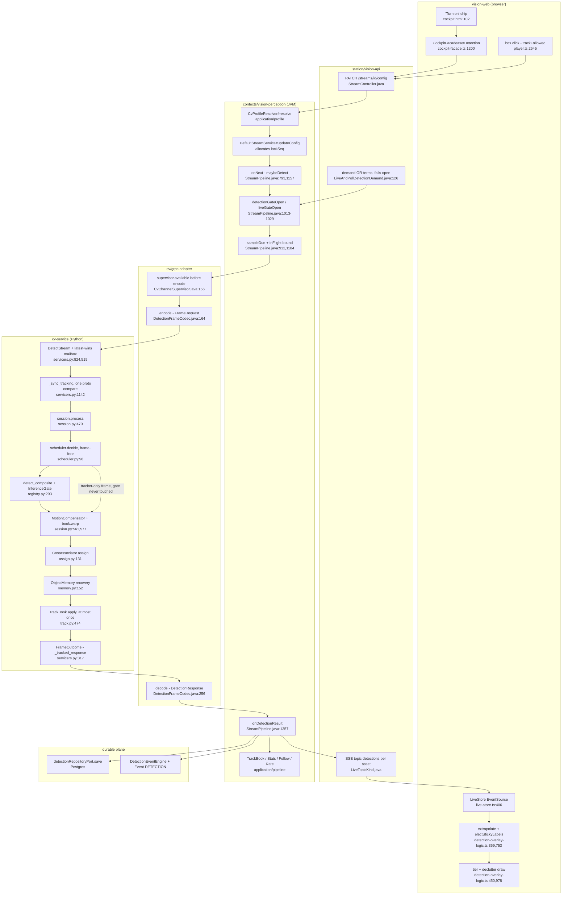

# O1 — Synthesis: what the CV flow actually is today

Reconciles `R1`–`R5` (`docs/plans/active/cv-orchestration/`) for the architect who will write
`CV-ORCHESTRATION-PLAN.md`. This document proposes nothing. It records evidence, names contradictions,
and marks what nobody verified.

## 0. How to read this

The five reports cover disjoint scopes. **R1** walked `station/vision-web` from the `/fly` picker to a
followed box: every control, every declutter tier, every wire field the browser reads or discards.
**R2** walked the Java control plane (`contexts/vision-perception`, `station/vision-api`,
`station/vision-app`, `cv/grpc`) from profile resolution through the frame gates to
`onDetectionResult`'s fan-out, and catalogued per-stream JVM state. **R3** inventoried all 41 components
of the Python `cv-service` frame path — state scope, plug points — and diffed them against the
2026-08-11 `TRACKING-ORCHESTRATION` charter. **R4** built the field-by-field matrix from `cv.proto`
through codec, domain records, JSON DTOs and TypeScript mirrors, and re-stated the prior scaling
decisions (CV-SCALE, TRACKING-V3, DOMAIN-SEPARATION, CV-PULL-SPIKE, ALWAYS-ON §3). **R5** is external:
ROS 2 `vision_msgs`, DeepStream, the SORT family, Frigate, Lattice, STANAG 4676 / MISB 0903 and the
blackboard / keyed-stream / actor patterns — no claim in it was checked against this codebase.

**Evidence rule applied here.** A claim tagged VERIFIED with `file:line` beats any `MODULE.md`, plan or
charter sentence, without exception — in every collision below, the code won. Where two reports
disagreed I took the one that read the file: R1 read both `DetectionState.java` and `models.ts` and
asserted the 4-vs-3 drift, while R4 flagged it as unconfirmed and asked for a re-check (R4:236-241,
R4:275-277) — R1 wins; where R4's exhaustive grep contradicted R2's narrower read (one dropped response
field versus three), R4 wins for the same reason. A claim tagged DOC, INFERRED or UNVERIFIED in its
source report stays tagged here and is repeated in §10. Line citations are copied from the reports;
none were invented.

## 1. One flow, end to end

Two crossings are not in this diagram because they are not in the flow: fixed-camera geolocation
(`TrackProjectionRunner.java:182`) and visual geolocation (`VisualGeoRunner.java:240`) **poll**
`StreamService` on their own ticks rather than hooking `onDetectionResult` (R2:196-205).

## 2. Responsibility ledger — who owns what today

| Responsibility | Owner(s) today | Duplicates / shadows | State, and where | On the wire? |
|---|---|---|---|---|
| Frame sampling | push: `StreamPipeline#sampleDue` deadline sampler `StreamPipeline.java:912`, rate from `inferenceFps`=10 (R2:16); pull: `DeadlineSampler` `pull/loop.py:85-146`, `target_fps` hot at `:277-279` | two independent samplers, one per transport; `DetectionRateController` adapts fps a third time (`DetectionRateController.java:198-201`, R1:245); `followFps` is a *fourth* rate, Java-only, no wire field (R4:45-47) | deadline/debt counters per stream, both JVM heap and Python process | partial — pull reports `achieved_fps`/`missed_deadlines`; push drops are invisible (R3:258) |
| Inference admission | Java: `inFlightInferences` AtomicInteger vs `maxInFlightInferences`=2, `StreamPipeline.java:355,1184`; Python: process-global `InferenceGate` semaphore `min(2, cpu//2)`, `server.py:184`, `config.py:746-764` | **two uncoordinated admission tiers**; three physical `acquire()` sites (`registry.py:293`, `servicers.py:1190`, `:1253`) (R3:242); no fleet-wide budget at all (R2:335-341) | per-stream counter (JVM) + per-process semaphore (Python) | no — Java counts `droppedInFlight` into `DetectionRate`; Python queueing invisible |
| Detector | `YoloDetector` `inference/detector.py:146-284`; routed via `ModelRegistry.resolve` per call `registry.py:1327` and `detect_composite` `registry.py:257-309`; birth/sustain split by `_detect_floor_for` `servicers.py:1133-1140` and `_reportable` `servicers.py:295-314` | ROI rescue is a **second detector pass per frame, on by default** `_run_roi_detector` `servicers.py:1199-1263`, `config.py:360` (R3:242) | model cache per process, `ModelRegistry` `registry.py:117-118` | yes — `inference_millis`, `model_id/version`; `detector_roi`(13) dropped at codec (R4:100) |
| Ego-motion | `FlowMotionCompensator` `engines/flow_gmc.py:105-204`, `PoseMotionCompensator` `engines/pose_gmc.py:72-146`, called at `session.py:561-564`, applied by `TrackBook.warp` `track.py:421-472` | none in Python; nothing Java-side knows it happened | prev frame / prev pose per stream; per-track `history_transform` | **no, effectively** — `motion_engine_id`(15)/`motion_millis`(14) on proto, never read by the codec (R4:101-102); the affine `Transform` never serializes (R4:143) |
| Prediction / extrapolation | **three implementations.** (1) `tracking/predict.py:66-91` constant-velocity, clamp 2.0 s, consumed only by coast/gating; (2) Java `DetectionExtrapolator` fed at `StreamPipeline.java:281,447,1372`, re-derives velocity at `DetectionExtrapolator.java:274-279`, `.at()` has zero callers; (3) web `extrapolateOne` `detection-overlay-logic.ts:318-336`, gate `0.15` `:211`, horizon `800 ms` `:201` | all three re-derive the same velocity; the wire's own `velocity_x/y` (`cv.proto:183-184`) is read by none of the three drawing paths (R1:244-256) | Python `Track.velocity_x/y` EMA `track.py:559-943`; Java last two `DetectionResult`s; web previous batch | velocity yes; **predicted next box nowhere** (R4:137) |
| Association | `CostAssociator` + stdlib Hungarian `assign.py:131-236,266-345`, default engine `cost` `config.py:90`; alternate `ByteTrackEngine` `engines/bytetrack.py:95-188` | `bytetrack` is a dead end — no warp, ORU, history, appearance or memory reach it (R3:260) | cost weights/gates per stream; ByteTrack's `BaseTrack._count` is **process-global**, guarded `bytetrack.py:136-140` | no — the per-term `iou`/`appearance`/`label` breakdown is computed and discarded every frame (R4:147); only `tracker_engine_id` survives |
| Single-object follow | `LkFlowEngine` `engines/lk.py:73-213`, `NccEngine` `engines/ncc.py:47-102`, orchestrated by `session.py:1262-1776` (verify / re-anchor / coast / extras) | lifecycle is **Java's**: `FollowTracker` derives REQUESTING/HOLDING/COASTING/LOST/RELEASED from `lockedTrackId`+`TrackState` — cv-service has no `FollowState` concept (R4:148); web HUD re-renders it `follow-hud/follow-logic.ts:49-82` | `_followed`/`_extras` per stream `session.py:1437-1619`; Java `FollowTracker` 30 s dormant memory (R2:227) | partial — only `locked_track_id`(11) |
| Memory / re-ID | `ObjectMemory` + `DormantIdentity` `memory.py:59-134,152-360`, gates at `:272-306`, cap 32 `:353-360` | Java `FollowTracker`'s own 30 s recovery memory mirrors cv-service L4 (R2:227); a failover loses both | dormant gallery per stream, `memory.py:124-134` | narrow — `identity_confidence`(10)/`dormant_millis`(11) decode onto every `TrackRef` but reach JSON only for the FOLLOW-locked track (R4:224-227); `DORMANT` is not a wire state (R4:140) |
| Label identity | cv-service L1 election `track.py:946-1028`, window 10 / margin 1.5 / streak 3; the wire's `Detection.label` **is** the elected label (R4:70) | web re-implements the same election, `electStickyLabels` `detection-overlay-logic.ts:753-825`, three hand-copied constants `:716,720,727` (R1:304-308); web also parses the model prefix out of the label instead of reading `modelId` `:539-542` | per-track vote ring, re-seeded on `bump_epoch` `track.py:359-405` | elected label only — the vote tally / top-k distribution never leaves `track.py` (R4:139) |
| Lifecycle (birth/death) | `Track` + `TrackBook` `track.py:133-244,284-543`; `apply()` called **at most** once per frame, zero on OFF and on FOLLOW re-anchor-fail (`session.py:1421-1425`, R3:244) | Java `TrackBook` is a second book — "books what arrived, associates nothing" (charter §2.3), LOST terminal | per-stream in both processes | partial — `track_state`(5), `track_age_frames`(9); `hits`/`misses`/`last_confirmed` never reach the wire (R4:145,149) |
| Lock arbitration | `LockArbiter` `lock.py:100-137`, accepts iff `lock_seq > applied_seq` `:107-111`; `lockSeq` allocated by `DefaultStreamService`'s monotonic counter, clients never send it (R1:198-204) | two web doors to lock and two to release, deliberately sharing one PATCH builder each (R1:296-300) | applied_seq, bound id, generation, per stream | yes, restated every frame; `TargetLock.box`(5) never set by design (R4:219-222) |
| Degradation | cv-service `_degrade_to` FOLLOW→ASSOCIATE→OFF `session.py:1924-1984`, plus a capability-ceiling downgrade `:1852-1884` with no charter row (R3:246); Java `CvChannelSupervisor` sticky-closed gate `CvChannelSupervisor.java:34-52,156` | two unrelated degradation ladders (engine capability vs channel availability) | Python: deduped warning state per session; Java: sticky flag + backoff | yes — `tracker_engine_id`, `capability_level_served/_reason`; web shows a downgrade notice `cv-control-panel.html:116-125` |
| Geolocation of a tracked object | **entirely Java-side**: `TrackProjectionRunner.java:182` polls `StreamService#tracks`, projects box-bottom-centre + camera pose into `ProjectedTrack` (`contexts/vision-map`), served by `GET /api/map/tracks` (R4:144) | vocabulary collision: `geo:assetId` SSE / `TrackCorrection` is the **aircraft's** position, not the object's (R4:242-248); cv-service's `Geolocation` RPC is 100 % aircraft | per-asset camera pose; projection is stateless | no cv-service field at all |
| Render tiering | web only — `detectionTiers` `detection-overlay-logic.ts:978-1034`, `tiersForDeclutterLevel` `:450-459`, default `'priority'` `:35`; constants `NOTABLE_TOP_K=5` `:901`, `SUB_SCALE_PX=12` `:924`, `MOVING_DISPLACEMENT_THRESHOLD=0.02`/`TRAIL_WINDOW_MS=2000` `:912,643` | wall has its own wall-wide declutter cycle `wall.html:26-29` | `SettingsStore.declutterLevel`, client-only, **never PATCHed** (R1:40) | no |
| Demand | `LiveAndPollDetectionDemand.detectionWanted` `LiveAndPollDetectionDemand.java:126-140` — three OR-terms (SSE subscriber, calibrated camera pose, `/detections` poll within TTL), **fails open** `:131-138`; consumed by `detectionGateOpen`/`liveGateOpen` `StreamPipeline.java:1013-1029` | `DetectionPolicyCache` (process-wide `ALWAYS` snapshot, 15 s refresh) widens the durable gate only; a wall tile is demand the instant it is visible+up `wall-tile.ts:150-156`; `/command` binds no detections at all `asset-panel.html:158` | policy snapshot per JVM; demand flag per stream | no — and pushing `detection_enabled` down the pull wire is a recorded **anti-goal** (R4:193-196) |
| Persistence | `detectionRepositoryPort.save(filtered)` — step 7 of `onDetectionResult`, only when detections are non-empty, gated on the **inference** gate not the live gate (`StreamPipeline.java:1357-1389`) | none | Postgres | n/a |
| Events | `DetectionEventEngine.accept(filtered)` step 5 (inference-gated, not live-gated); `Event.of(..., DETECTION)` step 7; SSE `detection-events` + `event` topics (R2:292-298) | `EventRuleConfig` is Java-only, never sent to cv-service (R2:19) | debounce windows per stream | no |
| Telemetry windows | `TrackingStatsWindow` (cap 4000), `PipelineLatencyWindow`, `DetectionRateWindow`, `DetectionRateController` — all per-stream JVM heap (R2:225-231), exposed only by `GET /api/streams/{id}/tracks` | cv-service deliberately keeps no stats window (charter §5.4, R3:210) | JVM heap, lost on failover | poll-only — **no SSE topic for `tracks`** (R2:300-302); no Micrometer anywhere (R2:253) |

## 3. The wire, folded

Five hops per fact: computed in cv-service · on `cv.proto` · decoded in Java · present in JSON · rendered
in web. `drop` = wire carries it, the codec never reads it. `dead` = never set to a non-default value.
`unread` = reaches the browser and is discarded.

| Facet | Fact | cv-svc | proto | Java | JSON | web |
|---|---|---|---|---|---|---|
| identity | `track_id`=4 | yes | yes | yes `TrackRef.trackId` | yes | yes |
| identity | `track_state`=5 (TENTATIVE/CONFIRMED/COASTING/LOST) | yes | yes | yes | yes | yes |
| identity | elected label (`Detection.label`=1) | yes `track.elected_label` | yes | yes | yes | yes, **and re-elected locally** |
| identity | label vote tally / top-k distribution | yes `track.py:946-1028` | no | — | — | — |
| identity | `DORMANT` as a state | yes `memory.py` | **no** | — | — | — |
| identity | `track_age_frames`=9 | yes | yes | yes | `/tracks` only (R4:78) | unread |
| identity | `hits` / `misses` | yes `track.py` | no | — | — | — |
| identity | `last_confirmed` (time since last detector hit) | yes | no | — | — | — |
| kinematics | `velocity_x/y`=7,8 | yes | yes | yes | yes | **unread by the draw path** (R1:184-192) |
| kinematics | predicted next box | yes `predict.py:66-91` | no | — | — | re-derived locally |
| kinematics | ego-motion affine `Transform` | yes `base.py:234-303` | no | — | — | — |
| kinematics | `motion_engine_id`=15 / `motion_millis`=14 | yes | yes | **drop** (R4:101-102) | — | — |
| kinematics | stationary / motionless counter | no | no | — | — | — |
| belief | `confidence`=2 (this frame) | yes | yes | yes | yes | yes |
| belief | tracker confidence, separate from detector | no | no | — | — | — |
| belief | `identity_confidence`=10 | yes | yes | yes, every `TrackRef` | **locked track only** (R4:79) | follow HUD only |
| belief | per-term association cost (iou/app/label) | computed then discarded `assign.py:153-177` | no | — | — | — |
| belief | appearance `Descriptor` | yes `track.py:1031-1054` | no | — | — | — |
| provenance | `source`=6 (DETECTOR/TRACKER) | yes | yes | yes | yes | unread |
| provenance | `reupdated`=14 (ORU backfill) | yes | yes | yes | yes | unread |
| provenance | `detector_ran`=9 / `detector_reason`=12 | yes | yes | yes | yes | expert flow strip only (R1:211) |
| provenance | `tracker_engine_id`=10 | yes | yes | yes | yes | expert only |
| provenance | `detector_roi`=13 (was this a crop pass?) | yes | yes | **drop** | — | — |
| provenance | which component asserted this fact | no | no | — | — | — |
| provenance | `model_id`/`model_version`=4,5 | yes, response-level | yes | yes | **fanned out per detection** (R4:91) | ignored; label prefix parsed instead |
| memory | `dormant_millis`=11 | yes | yes | yes | locked track only | follow HUD only |
| memory | which gallery entry matched, candidate count | log line only `memory.py:250` | no | — | — | — |
| memory | `memory_ttl_millis`=10 (request side) | resolved `params.py:496-499` | yes | **dead** — no domain field (R4:40) | — | — |
| lock | `lock_seq`=1 | applied `lock.py:107-111` | yes | yes, server-allocated | not on `TargetLockRequest` | absent (R1:198) |
| lock | `track_id` / `release` | yes | yes | yes | yes | yes |
| lock | `point_x`/`point_y`=3,4 | yes | yes | yes | yes | **zero frontend caller** (R1:274-278) |
| lock | `box`=5 | yes | yes | **dead** by design (R4:219) | — | — |
| lock | `locked_track_id`=11 | yes | yes | yes | yes | yes |
| lock | FollowState lifecycle | **no concept** | no | derived `FollowTracker.java` | yes | yes |
| timing | `sequence`=2 / `timestamp_millis`=3 | yes | yes | yes | yes | `capturedAt` used, `frameSequence` unread |
| timing | `inference_millis`=7 | yes | yes | yes | yes | unread |
| timing | `tracker_millis`=8 | yes, **mis-named** — spans decode+GMC+assign+ROI (R3:259) | yes | yes | yes | unread |
| timing | `reupdate_millis`=22 / `reupdated_tracks`=23 | yes | yes | yes | yes | unread |
| timing | `detection_lag_millis`=24 | yes | yes | yes | yes | yes (setup modal) |
| timing | `decode_millis`=16, `source_fps`=17, `missed_deadlines`=20 | pull only | yes | yes `PullTelemetry` | aggregated / split | `submittedFps` only |
| timing | `achieved_fps`=18, `dropped_frames`=19 | pull only | yes | yes | **absorbed into other counters** (R4:105-106) | unread |
| timing | `capture_skew_millis`=21 | pull only | yes | yes | **no JSON home** (R4:108) | — |
| timing | push-mode mailbox drops | counted `concurrency.py:58,65` | **no** | — | — | — |
| health | `capability_level_served`=25 / `_reason`=26 | yes | yes | yes | yes | yes |
| health | `stream_id`=1 | yes | yes | **never read** (R4:88) | — | — |
| health | cv-service self-report (queue depth, model load, CPU/GPU) | no | **no Health RPC at all** (R4:126-130) | `ConnectivityState` only | `system` rollup | fleet banner only |
| health | `DetectionState` | n/a — Java-derived | n/a | 4 values | 4 | **3 values** (R1:216-227) |

## 4. Contradictions

1. **`vision-perception/MODULE.md` vs `onDetectionResult`.** The module doc describes a trailing
   `if (!liveGateOpen()) return;` after the durable block; the code reads both gates **once, together,
   at the top** (`StreamPipeline.java:1357-1389`, javadoc `:1348-1352`). **Code wins** — its own
   reasoning names the race the doc version would reopen. Matters because the redesign's live/durable
   split inherits this ordering rule verbatim (R2:306-315).
2. **`cv-service/MODULE.md` vs `config.py` defaults.** Doc: associator default `bytetrack`, ROI rescue
   "ships off". Code: `DEFAULT_TRACK_ASSOCIATE_ENGINE = "cost"` (`config.py:90`) and
   `DEFAULT_TRACK_ROI_ENABLED = True` (`config.py:360`) — with the comment block at `:343-351` still
   arguing for `False` two lines above the `True`. **Code wins.** Matters because it means every default
   ASSOCIATE stream may spend **two** detector passes per frame, which changes the whole cost model
   (R3:256).
3. **Charter §3.1 "THE ONLY GATE ACQUISITION" vs three acquire sites.** `registry.py:293`,
   `servicers.py:1190`, `:1253`, all routed through `_run_detector`, and ROI makes a second pass the
   default. **Code wins**; the invariant as written is false, the weaker true one is "the tracker-only
   path never touches the gate" (R3:242,250). Matters for any per-frame budget arithmetic.
4. **Charter §2.1 "`session.py` is composition only, ~80 lines" vs 2 362 lines.**
   `StreamTrackingSession` (`session.py:303-2286`) owns degradation, capability capping, memory
   resolution, ROI rescue, extras and late correction. **Code wins, charter is stale.** This is the
   charter's own named failure mode, realised (R3:239).
5. **Charter §2.2 "an engine never sees `TrackingParams`" vs `CostAssociator.retune`.** Engines are fed
   weight/gate slices on every config change (`assign.py:131-236`). **Code wins**; the surviving, true
   form of the rule is narrower — engines never see cadence or locks (R3:245). Matters because the
   redesign will want to state the seam precisely rather than restate a rule already broken.
6. **Charter §3.1 "no ego-motion, no warp" vs every frame doing both.** `_estimate_motion`
   (`session.py:561-564`) plus `TrackBook.warp` (`:577`) run for FOLLOW and ASSOCIATE-cost, decoding the
   frame. **Code wins**; charter predates V2 C3 (R3:243).
7. **"`book.apply` exactly once per frame" (charter, `MODULE.md`, class docstring) vs at most once.**
   Zero calls on OFF/no-engine and on FOLLOW re-anchor-fail-with-nothing-held (`session.py:1421-1425`).
   **Code wins** (R3:244). Matters: a "one write per frame" aggregator assumption would be wrong.
8. **The TS header comment says `DetectionExtrapolator` was deleted; `StreamPipeline` still feeds it.**
   `detection-overlay-logic.ts:182-183` vs `StreamPipeline.java:281,447,1372`. **Code wins** — the class
   is alive, ingesting every batch, with `.at()` at zero call sites. Two independent re-implementations
   of one velocity calculation now exist around a still-running third (R1:244-256, R2:343-346).
9. **The brief's "many many many clicks" vs the verified 3-click path.** Start stream → "Turn on" chip →
   click the box, with `ASSOCIATE` already the server default (`TrackingConfig.defaults()`); no model,
   class or mode choice is required (R1:146-162). **R1 wins, on a click-by-click read.** This is the
   single most important correction for the redesign: the problem is information architecture — required
   and optional controls share one modal — not click count. The one honest exception is the conditional
   4th click in contradiction 10.
10. **"Nothing is clickable" has three indistinguishable causes.** The default `'priority'` declutter
    level hides T2 (`tiersForDeclutterLevel`, `detection-overlay-logic.ts:450-459`); "detector found
    nothing", "your object is tier-2" and "your cursor is on nothing" look identical on screen
    (R1:154-157). Nothing in the UI says which.
11. **Java `DetectionState` has 4 values, TypeScript has 3.** `DetectionState.java:21-42` vs
    `models.ts:805`. Every frontend switch falls through `default` for `RUNNING_UNWATCHED` and shows
    *"On — status not reported by this server yet."* for a state the server reports on purpose. **R1
    wins over R4's hedge** (R1:216-227; R4:236-241 asked for exactly this re-check). Currently masked
    only because no UI can set `cv.detection-policy=ALWAYS` (R1:104-115) — two gaps cancelling.
12. **`ALWAYS-ON-FLOW-PLAN` says `cv.detection-policy` is "editable through the existing PATCH" as if
    that settles the UX; nothing labelled points at it.** The only path is the advanced-mode raw
    attribute editor (`asset-detail.html:683-717`) and requires knowing the key string (R1:104-115).
13. **The task brief's own model vs the code, three times.** `InferenceGate` is not a Java class (it is
    two inline checks, `StreamPipeline.java:355,1184`); there is no `GET /api/cv/status` (only the
    `system` rollup fed by `CvStatusProvider`); the client never manages `lockSeq` (R2:88-90, R2:257-260,
    R1:198-204). Any redesign written against those assumptions starts wrong.
14. **`TRACKING-REVIEW` §4's inversion is confirmed, with two exceptions.** "Engines are evidence, the
    core owns identity" is real in code: `cost` is the default associator, `ObjectMemory` and the two
    `MotionCompensator`s ship, `TrackBook` mints every id and the book never publishes engine keys
    (R3:29,30,37,38,165,179). The exceptions: **`bytetrack` still owns identity inside its own path** and
    receives no warp/ORU/history/appearance (R3:260), and **prediction was never promoted to a seam** —
    `predict.py:66-91` is a free function with no `Predictor` protocol, so a Kalman or exogenous prior is
    an orchestrator edit, not a plug-in (R3:191-192).

## 5. Verified defects (deduplicated)

Severity: **B** blocks-redesign · **M** must-fix-in-redesign · **S** standalone-fix · **C** cosmetic.
Requirement: R1 one-act · R2 orchestration · R3 scalable · R4 debuggable · R5 mirror.

| # | Defect | Evidence | Sev | Req |
|---|---|---|---|---|
| 1 | No fleet-wide inference budget; `maxInFlightInferences`=2 is per-stream, un-PATCHable, excluded from the profile fold | R2:17,335-341; R4:191-196 | B | R3 |
| 2 | Two cv-service replicas silently reset identity on any reconnect — new `SessionRegistry`, ids restart at 1, gallery empty, lock re-establishes against a non-existent id | R3:217 | B | R3 |
| 3 | ROI rescue makes a second detector pass per frame the default, breaking the duty-cycle cost story | R3:242,256; `config.py:360` | B | R3 |
| 4 | `motion_engine_id`(15), `motion_millis`(14), `detector_roi`(13) all dropped at the codec — ego-motion is invisible end to end | R4:101-102,201-208; R2:317-323 | M | R4 |
| 5 | Java `DetectionState` 4 values vs TS 3 — `RUNNING_UNWATCHED` renders as "not reported by this server yet" | R1:216-227; R4:236-241 | M | R4 |
| 6 | `tracker_millis` is not tracker time — it spans decode + ego-motion + assign + any ROI pass | R3:259 | M | R4 |
| 7 | Push-mode frame drops never reach the wire (`LatestOnlyMailbox.dropped` counted, never reported) | R3:258; `concurrency.py:58,65` | M | R4 |
| 8 | Gated-off **pull** stream still costs the Python worker full inference; the JVM only refuses to use the result | R2:92-98 | M | R3 |
| 9 | No Micrometer/structured metrics anywhere in the Java control plane; every window is REST-poll only | R2:329-333 | M | R4 |
| 10 | No cv-service health fact on any wire — no Health RPC, health inferred from `ConnectivityState`; `DetectionState` reports gating never health, so a stalled service still reads `RUNNING` | R4:126-130; R1:213; R2:134-137 | M | R4 |
| 11 | `identity_confidence`/`dormant_millis` decode onto every track but reach JSON only for the FOLLOW-locked one | R4:79-80,223-227 | M | R5 |
| 12 | Client re-derives velocity/extrapolation while the wire's `velocity_x/y` sits unread, and a still-running server extrapolator re-derives it a third time | R1:229-256; R2:343-346 | M | R5 |
| 13 | Client re-implements label election with three hand-copied server constants | R1:262-266; `detection-overlay-logic.ts:716,720,727` | M | R5 |
| 14 | Wire cannot express "memory off" or "threshold 0" — `<=0`/`0.0` both mean *server default* | R3:265; `cv.proto:114` | M | R4 |
| 15 | Default declutter tier can silently hide the exact object the operator is trying to click | R1:154-157,285-287 | M | R1 |
| 16 | `CvProfile` replaces `requestedConfig` wholesale — "an explicit per-call override wins" is not honoured by `start` | R2:52 | M | R2 |
| 17 | `TrackingConfig`'s request trio (`motion_engine_id`/`appearance_engine_id`/`memory_ttl_millis`) has no domain home at all — not selectable even in principle | R4:38-40,214-218 | M | R2 |
| 18 | FOLLOW re-anchors LK on the **raw** box then corrects only the reported box — pixels followed ≠ number reported | R3:264; `session.py:1284,1314` | M | R3 |
| 19 | A missing descriptor passes the memory appearance gate — small boxes recovered on label+motion alone | R3:262; `memory.py:287-292` | M | R5 |
| 20 | `ObservationRing.before()` assumes monotone timestamps; measured ±15 ms clock jitter can hand ORU the wrong bracket | R3:263 | M | R3 |
| 21 | ~two-thirds of the wire's telemetry reaches the browser and is discarded unread (all 8 `PipelineLatency`, 10/12 `DetectionRate`, 8/12 `StreamTrack`) | R1:184-196,291-295 | M | R4 |
| 22 | `DetectionExtrapolator` ingests every batch for a reader that no longer exists; its TS port claims it was deleted | R2:343-346; R1:288-290 | S | R2 |
| 23 | `DetectionResponse.stream_id` never read — a cv-service bug mislabelling it would go undetected | R4:88,209-213 | S | R4 |
| 24 | `tracks` is poll-only; no SSE topic publishes `TrackBook`/stats/follow deltas | R2:300-302 | S | R4 |
| 25 | Click-to-follow is a no-op on an untracked box although `TargetLockRequest.pointX/pointY` exists with zero frontend callers | R1:274-278; `player.ts:2645-2661` | S | R1 |
| 26 | `cv.detection-policy=ALWAYS` has no operator-facing control anywhere | R1:104-115,282-284 | S | R1 |
| 27 | `cv-service/MODULE.md` wrong on two shipped defaults; `MODULE.md:159` also wrong that recovery is `cost`-only | R3:256-257 | S | R4 |
| 28 | `vision-perception/MODULE.md` wrong on `onDetectionResult`'s gate re-check | R2:306-315 | S | R4 |
| 29 | Two dormant matches in one frame race on `claim()` (plain `pop`); scoring is per-target, not global | R3:261; `memory.py:245-255` | S | R5 |
| 30 | `bytetrack` remains advertised in the roster while being a dead end in the evidence graph | R3:260 | S | R2 |
| 31 | `ModelInfo.stage` collapsed and `metrics` dropped entirely at `GrpcModelRegistryPort` | R4:121-126 | S | R4 |
| 32 | `capture_skew_millis` decoded into `PullTelemetry` with no JSON home | R4:108,233-235 | C | R4 |
| 33 | Per-detection `modelId`/`modelVersion` in JSON is a one-to-many fan-out of one response-level wire field — a shape promise the wire cannot satisfy | R4:249-253 | C | R4 |
| 34 | `TargetLock.box` never set (deliberate — the PATCH surface never accepted a box) | R4:219-222 | C | R4 |

## 6. Constraints the redesign must honour

Each is confirmed load-bearing by a report, not merely written down somewhere.

1. **TRACKING-ORCHESTRATION DTO rules** (group don't widen; absent-means-untracked one spelling per
   layer; no consumer-shaped field in the pipeline; additive-only growth; per-frame payload budget;
   canonical-ctor-on-reconstruction) — charter §6, still obeyed: JSON nests `track`/`tracking`, proto
   stays flat by deliberate decision (R3:248 records the charter's tier list is merely *undersold*, not
   violated).
2. **Flow-visibility tiers** (wire · API · UI flow strip · logs, each derived from data already on the
   wire, never a second telemetry channel) — charter §7; the UI strip exists today at
   `cv-control-panel-logic.ts:961-979` (R1:211).
3. **The two surviving cv-service invariants**: the gate is never touched on the tracker-only path, and
   `decide()` is frame-free (`scheduler.py:96-135`) — both re-verified (R3:250).
4. **`onDetectionResult` writes live read models before the durable save**, deliberately, because the
   opposite order cost a detector pass and produced a test "flake" that was an ordering bug
   (`StreamPipeline.java:1362-1368`) (R2:191-194).
5. **Demand fails open** — an unknown demand state is reported as *wanted*, never *not wanted*
   (`LiveAndPollDetectionDemand.java:131-138`) (R2:116).
6. **ALWAYS-ON anti-goal**: do not push `detection_enabled` down the pull wire; in pull mode the worker
   is already always-on and the JVM discards unwanted results (R4:193-196).
7. **CV-SCALE verdict: keep gRPC.** Moving the CV transport to WebSockets was considered and rejected
   (R4:159).
8. **DOMAIN-SEPARATION**: the lease unit is the **Asset**, not the stream (D7); U0/U1 traffic stays on
   direct dial; only U2/U3 may reach the broker (R4:176-179). And per `EVENT-TOPOLOGY-PROPOSAL.md §8`
   (lines 198-203, read directly, not via a report): video frames and per-sample telemetry must **never**
   ride the broker — "by the time a queue delivers it, its value is negative."
9. **TRACKING-V3 decision E1: no real Kalman filter**, and memory/identity stay per-stream — cross-stream
   identity is not in the shipped design (R3:191; R4:162-166; R5:350-356 asks whether that should change).
10. **`trackeval` `BASELINE.md` is the saved `--all` table and is diffed by
    `tests/trackeval/test_baseline_consistency.py` on every pytest run** — any tracking change has a
    standing regression gate (R3:209).
11. **Stream→process affinity is required before a second cv-service replica exists**; nothing in Python
    shares state and nothing needs to if affinity holds (R3:216-219).
12. **CLAUDE.md rule 10** (a new collaborator means updating call sites or bundling into a settings
    record, never another constructor overload) is currently *honoured* by the largest class in the flow:
    `StreamPipeline` has one canonical 9-parameter constructor whose last argument is
    `StreamPipelineCollaborators` (`StreamPipeline.java:414`) (R2:264-270).
13. **The codec's defensive decode rule**: an `UNSPECIFIED`/unrecognised `track_state` or `source` nulls
    the whole `TrackRef` rather than guessing; `capability_level_served == 0` decodes to `null`, not a
    validation throw (R4:74-75,112). (The stronger claim that a new enum value is a *compile* error is
    not evidenced in any report — see §10.)

## 7. Scaling facts

| Component | State scope | Measured cost | Breaks with two instances? | Evidence |
|---|---|---|---|---|
| `YoloDetector` / `ModelRegistry` | per process (one detector per `model_id`) | yolo26n 36-58 ms laptop, 197-200 ms GB4005 Celeron (CV-PULL-SPIKE); `MODULE.md` says ≈230 ms CPU / 135-150 ms OpenVINO on GB4005 — **the two DOC numbers disagree** | no — but model promotion reaches another process only on restart | R4:184-186; R3:36,177 |
| `InferenceGate` | per process, `min(2, cpu//2)` | admission only | **yes** — fleet concurrency silently doubles, uncoordinated | R3:27,218 |
| `StreamTrackingSession` (tracks, lock, memory, engines) | per stream, in one process | `lk` 0.49 ms, `ncc` 0.23 ms, `bytetrack` ≈0.75 ms/10 dets, histogram sub-ms (all DOC) | **yes** — ids restart, gallery empties, `applied_seq`=0 on reconnect | R3:56-61,217 |
| `SessionRegistry` | per process, cap 64, 15 s grace | O(1) acquire | **yes** — no external backing store | R3:39,176 |
| `ObjectMemory` gallery | per stream, cap 32 | O(1) remember | yes, lost with the session | R3:52 |
| `ByteTrack` id counter | **process-global** (`BaseTrack._count`), guarded | — | no leak (book never publishes engine keys) | R3:179 |
| `StreamPipeline` + `TrackBook`/windows/`FollowTracker` | per stream, JVM heap, inside one `ConcurrentHashMap` | stats window capped 4000 samples | **yes** — a viewer hitting another vision-app instance sees an empty book; needs sticky per-device routing | R2:225-234 |
| `inFlightInferences` | per stream, per JVM, fixed at 2 | local backpressure only | must **not** be shared — it is not a global budget | R2:17,232 |
| `DetectionPolicyCache` | process-wide, 15 s refresh | independent poll per instance | no — safe to run N copies | R2:233 |
| `CvTarget` list | per JVM | — | ordered **failover** (`pick_first`), not load balancing; one session pins to one target | R2:236-240 |
| Whole-service ceiling | — | **one cv-service saturates at ~3-4 streams @10 fps (yolo26n); ~0.3 streams for `orion12l`** | — | R4:191-193 |

## 8. What the operator can see today about "why"

| Debug question | Where the answer is today |
|---|---|
| Why are there no boxes? | `DetectionState` on `GET …/tracks` and the fly hero line (`cv-control-panel-logic.ts:892-921`) — but it reports **gating, never health**, so a stalled cv-service still reads `RUNNING` (R1:209-213; R2:134-137) |
| Why is *this* box not drawn? | **NOWHERE.** The declutter tier silently hides T2 at the default level; no on-screen explanation (R1:154-157) |
| Why did the id change? | **NOWHERE live.** ID switches are only computable offline by `tools/trackeval` (R3:209); `identity_confidence`/`dormant_millis` exist on the wire but reach JSON for the locked track only (R4:79-80) |
| Why did the detector not run this frame? | `detector_reason` (field 12) → `FrameTracking.detectorReason` → **expert-disclosure flow strip only** (`formatFlowStrip`, `cv-control-panel-logic.ts:961-979`); meaningful only when `detectorRan` (R1:211; R4:99) |
| Why did this track die? | **NOWHERE.** `hits`/`misses`/`last_confirmed` never leave `track.py`; the wire's last word on a track is `LOST` (R4:145,149) |
| Why did follow lose the target? | Follow HUD state + "last seen Ns ago" (`follow-logic.ts:49-82`) — no kinematics, and the lifecycle is Java-derived because cv-service has no `FollowState` at all (R1:214; R4:148) |
| Is inference running with nobody watching? | Java says `RUNNING_UNWATCHED`; **TypeScript cannot render it** and shows "status not reported by this server yet"; no per-stream chip on `/wall` or `/command` (R1:209,216-227; R2:130-133) |
| What did ego-motion do? | **NOWHERE.** `motion_engine_id`/`motion_millis` dropped at the codec; the affine transform never serialises (R4:101-102,143) |
| How much did each stage cost? | Partial and misleading: `inference_millis` is honest, `tracker_millis` silently absorbs decode + GMC + assign + any ROI pass (R3:259); no per-stage breakdown, no Micrometer anywhere (R2:253,329-333) |
| How many frames were dropped? | Pull mode only (`dropped_frames`, `missed_deadlines`); push-mode mailbox drops are counted and never reported (R3:206,258) |
| Which gallery entry matched on recovery? | A log line on the inference box (`memory.py:250`) — nothing on the wire (R4:141) |
| Is cv-service healthy (not just reachable)? | **NOWHERE.** No Health RPC in `cv.proto`; health is gRPC `ConnectivityState` only, folded into the fleet-wide `/manage/system` banner and capped at `warn` (R4:126-130; R1:213; R2:250) |

## 9. Open questions, consolidated

**(a) Wire / contract**
1. Wire the `detector_roi`/`motion_millis`/`motion_engine_id` triple onto `TrackingTelemetry`, or keep
   ego-motion invisible to Java? [R4:257; R2:359]
2. Surface `identity_confidence`/`dormant_millis` per track, not only for the FOLLOW-locked one? [R4:261]
3. Should "predicted next box" be a first-class wire field so neither web nor a server extrapolator re-derives it? [R1:326-330]
4. Should the label *distribution* (top-k) ride the wire so election becomes the aggregator's job? R5 suggests it. [R5:339-343; R1:331-333]
5. `DetectionSource` third value for ORU boxes, or keep `reupdated` orthogonal? [R4:273]
6. Expose ego-motion `Transform` / appearance `Descriptor` / per-term association cost, or keep them server-internal? [R4:266-271]
7. Add a wire value meaning *memory disabled for this stream* (today `<=0` means server default)? [R3:277]
8. `TargetLock.box` on the PATCH surface, or is "server picks a box around the point" final? [R4:264]
9. `ModelInfo.metrics` passthrough now, or defer again? [R4:278]
10. Push-mode `dropped_frames` on the response, or leave Java's timeout as the only signal? [R3:275]
11. Make `DetectionState` a generated/shared type so Java and TS cannot drift again? [R1:320]
12. R5 suggests three boxes (detector / tracker / predicted) instead of one, plus a provenance string per evidence contribution. [R5:270-287]

**(b) cv-service structure**
13. Is "one gate acquisition per frame" still the design given ROI ships on — and should ROI frames leave the duty ratio? [R3:272]
14. Split `session.py` (2 362 lines) into `follow.py`/`associate.py`/`resolve.py` before V7/V8 add two engines? [R3:273]
15. Define a fifth `Predictor`/`MotionModel` protocol, or is E1 ("no real Kalman") final? R5 notes IMM makes model choice evidence-driven. [R3:278; R5:163-173]
16. Retire `bytetrack`, or keep it as the L3 reference baseline outside the evidence graph? [R3:279]
17. Make the memory gallery always-on with the env switch kept only for P7 measurement? [R3:277]
18. Re-issue the charter as v2 (four protocols, capability ladder, ORU, memory, 16 files), or let `MODULE.md` be the map? [R3:274]
19. R5 asks whether association and track-state ownership split into two processes, or stay one atomic worker. [R5:333-338]
20. Whose `time_since_update` is authoritative for "track death" once contributors run at different cadences? [R5:346-349]

**(c) Java control plane**
21. Shared inference token bucket across instances, or "one cv-service per vision-app, no shared budget"? [R2:350]
22. Is sticky per-device routing the intended scaling shape, or should NATS carry track/follow state cross-instance? [R2:353]
23. A dedicated `GET /api/cv/status`, and/or a `tracks` SSE topic to replace the poll? [R2:357]
24. Is the still-running, zero-consumer `DetectionExtrapolator` safe to delete outright? [R1:324]

**(d) Web / operator surface**
25. Separate required from optional CV controls structurally — the mandatory path is already 3 clicks, so the fix may be pure IA. [R1:312-315]
26. Wire point-based click-to-follow for untracked boxes, since `tracking.mode=OFF` is reachable and would make the click inert? [R1:316-318]
27. Where does `cv.detection-policy=ALWAYS` belong — asset-detail, the asset-scope binding, or ops-only? [R1:321-323]
28. Retire the client-side label-election stopgap once server L1 is confirmed live everywhere? [R1:331-333]
29. R5 records that DJI/Skydio/Frigate/Axis/Lattice expose outcome or region, never a pipeline stage — is that the target surface? [R5:246-258,317-322]

**(e) Scaling / deployment**
30. Is stream→process affinity a stated deployment requirement, or should `SessionRegistry` grow an external store? [R3:276]
31. Coalesced record per frame, or emit-on-any-update with Java coalescing — decides whether staleness logic lives in Python or Java. [R5:326-332]
32. Is cross-camera re-identification in scope, or is memory per-stream now and built so a later fusion stage can consume it? [R5:350-356]
33. R5 suggests the primary process boundary be GPU-bound stateless detection vs CPU-bound stateful tracking, affinity only on the latter. [R5:307-311]

**(f) Doc drift**
34. Fix `vision-perception/MODULE.md` on the gate re-check — in this initiative or separately? [R2:361]
35. Fix `cv-service/MODULE.md` on the two shipped defaults and the "recovery is cost-only" claim. [R3:256-257]
36. R4's request to re-check the TS `DetectionState` count is **answered**, not open: R1 verified the drift is real. [R4:275; R1:216-227]

## 10. What was NOT verified

Re-check these before any of them becomes load-bearing.

1. **Model class roster.** That the default `yolo26n.pt` closed-set model includes a `car` class is
   INFERRED from standard COCO taxonomy, never read from a live roster — and the whole 3-click minimal
   path in R1 §6 depends on it (R1:62,151).
2. **Timing numbers are all DOC, and two of them disagree.** yolo26n on the GB4005: 197-200 ms
   (CV-PULL-SPIKE, R4:186) versus ≈230 ms CPU / 135-150 ms OpenVINO (`MODULE.md`, R3:36). `lk` 0.49 ms,
   `ncc` 0.23 ms, `bytetrack` ≈0.75 ms, histogram sub-ms are all module-doc claims re-measured by nobody
   in this wave (R3:56-61). The "~3-4 streams per cv-service" ceiling is likewise a plan number (R4:191).
3. **Profile-fold behaviour.** That `CvProfile#toPipelineConfig` excludes `maxInFlightInferences`, and the
   asset→category→organization→platform order, are DOC from `vision-perception/MODULE.md` (R2:17,50); so
   is the "wholesale replace" gap (defect 16), the `DetectionPolicy` enum's fail-closed parse (R2:60), the
   ~20 s `CvChannelSupervisor` recovery (R2:107), the `CvTarget` `pick_first` semantics (R2:236-240), and
   the four seeded `CvProfile` rows in `V29__cv_profiles.sql`, which were never opened (R2:56).
4. **`DetectionExtrapolator.at()` having no production caller** is DOC (R2:231); R1 verified only that the
   class is still *instantiated and fed* (R1:250-253). The deletion decision needs a real grep.
5. **Three approximate line references** in R4 — `DetectionFrameCodec.java:~300`, `~268-292`, Python
   `session.py:~604` — are estimates (R4:24,112,205); and **R4 Part C's plan statuses** come from
   `docs/plans/README.md`'s status table, not from re-reading the code (R4:152).
6. **"A new enum value is a compile error in the Java codec."** No report evidences this. What R4 *did*
   verify is the opposite-direction rule: an unrecognised enum value nulls the component defensively
   rather than failing (R4:74-75,112). UNVERIFIED as stated in the brief.
7. **cv-service deployment facts**: the `active_model.json` promotion marker, "promotion reaches a
   separate inference process only on restart", and the Docker healthcheck being a bare TCP connect are
   all DOC (R3:34,177,208).
8. **`track_max_age_millis` semantics** (wall-clock LOST independent of `max_age_frames`) is DOC from the
   module doc, not re-derived from the state machine (R3:157).
9. **All of R5 is external.** Every DeepStream / Lattice / ROS 2 / MISB / SORT claim is web-sourced and
   none of its "what transfers" recommendations was checked against this codebase's constraints. Treat
   R5 as a menu of precedents, not as evidence about `vision`.
10. **GIL release during torch/cv2 inference** is addressed nowhere in cv-service code or comments — R3
    looked and found only process-role mentions (R3:11). Whether the semaphore's `min(2, cpu//2)` default
    is actually the right bound is therefore unmeasured.
11. **No report re-read `vision-perception/MODULE.md` with line numbers** for contradiction 1 — the doc
    side of that collision is cited as prose, not `file:line` (R2:306-315).
