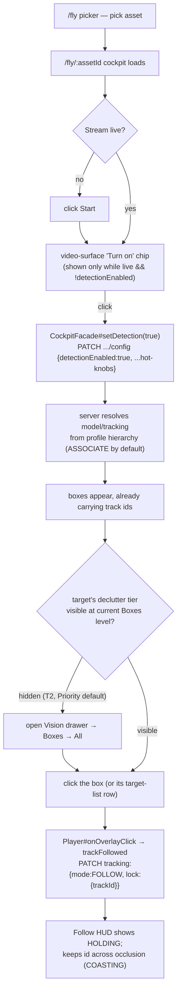

# R1 — Operator click path: `/fly` → "it sees my object and keeps seeing it"

Scope: `station/vision-web` only. Every claim is VERIFIED (cited `file:line` read directly), DOC
(only from a plan doc, not re-checked against source) or INFERRED (reasonable but not read
byte-for-byte, e.g. exact model class list). Base path for all TS citations:
`station/vision-web/src/app/`. Java citations are absolute paths, read by a backend-verification
pass to ground the wire contract this report's tables depend on.

## 1. The flow, end to end

Optional side doors (never required for the above): Vision drawer's own Detect toggle, "Looking
for" model change, class filters, confidence/fps sliders, tracking-mode picker, capability
ceiling/engine, `/vision/profiles`.

## 2. Every control — fly-time surface

### 2a. Video-surface chip + drawer hero (`cv-control-panel` — live per-stream CV)

| UI label | Component | Handler | Store/facade call | Backend | Default | Live? | Required? |
|---|---|---|---|---|---|---|---|
| "Turn on" (video chip) | `cockpit.html:102` | `facade.enableDetection()` | `cockpit-facade.ts:1200-1208` → `setDetection(true)` | `PATCH /api/streams/{id}/config` `detectionEnabled` (+ current confidence/fps/labelDenyFilter, `buildHotKnobPatch`) | shown only while `live && !detectionEnabled` (`fly-logic.ts:216 showDetectionOffChip`) | immediate | **yes** |
| "Detect on this stream" toggle | `cv-control-panel.html:35`, handler `cv-control-panel.ts:243` `onDetectionEnabledToggle` | emits `detectionEnabledChange` → `cockpit.html:451` → `facade.setDetection($event)` | same `setDetection` (`cockpit-facade.ts:1224-1236`) | same PATCH, field `detectionEnabled: Boolean` (`UpdateStreamConfigRequest`, `station/vision-api/.../dto/UpdateStreamConfigRequest.java:39-41`) | server truth (no client draft — H2, wave W7) | immediate; disabled while `!hasStream()` | **yes** (2nd door onto the same act) |
| "Looking for" summary + "Change…" | `cv-control-panel.html:62-73` | opens `CvSetupModal` via `setupRequested` → `cockpit.html:452` → `requestCvSetup()` | n/a (navigation) | n/a | — | — | no (default model resolves from profile hierarchy) |
| Boxes declutter (All / Priority / Locked only / Off), shortcut `B` | `cv-control-panel.html:89-97`, `cycleBoxesMode`, `declutterLevelLabel` (`shared/player/detection-overlay-logic.ts:44-72`) | `boxesModeChange.emit(level)` | `SettingsStore.declutterLevel` (`H12`, wave W7) — **client-only, never PATCHed** | none — round-trips via input/output only | `'priority'` (`DEFAULT_DECLUTTER_LEVEL`, `detection-overlay-logic.ts:35`) | immediate, local | conditionally — only if target's tier is hidden at current level |
| "Following #N" chip + Release | `cv-control-panel.html:106-112` | `releaseLock()` (`cv-control-panel.ts:224-233`) | `fleet.patchStreamConfig` directly | `PATCH .../config` `{tracking:{mode:'ASSOCIATE', lock:{release:true}}}` (`buildReleaseLockPatch`, `cv-control-panel-logic.ts:658-660`) | n/a | immediate | no (undo only) |
| Notices (capability downgraded, detection lag) | `cv-control-panel.html:116-125` | read-only | n/a | n/a | — | — | no |

**Priority declutter tiers** (`DetectionTier = 'T0'|'T1'|'T2'|'T3'`, `detection-overlay-logic.ts:891`),
assigned by `detectionTiers` (`:978-1034`, first match wins):

| Tier | Meaning | Draw style |
|---|---|---|
| T0 | FOLLOW-locked track, or the hovered box | full box+label, never dimmed |
| T1 | tracked-and-moving (`isMovingTrack`: `MOVING_DISPLACEMENT_THRESHOLD=0.02` over `TRAIL_WINDOW_MS=2000ms`, `:912,643`), or top-`NOTABLE_TOP_K=5` by area×confidence (`:901`), or hover-class match | full box+label |
| T2 | everything else (default) | thin box, no label, `T2_ALPHA_PERCENT=55` (`:1043`) |
| T3 | smaller than `SUB_SCALE_PX=12` px on both axes (`:924`) | dot marker only; checked before T1/T2 |

`Boxes` level → visible tiers (`tiersForDeclutterLevel`, `:450-459`): `All`={T0,T1,T2,T3}; `Priority`
(default)={T0,T1,T3} (T2 hidden — this is what hides an un-promoted car in §6); `Locked only`={T0};
`Off`=nothing drawn.

### 2b. `cv-setup-modal` ("Detection setup" — the full picker)

| UI label | file:line | Draft/local field | Wire field | Default / range | Applies |
|---|---|---|---|---|---|
| Intent cards ("Looking for") | `cv-setup-modal.html:19-68`, roster from `GET /api/cv/models` | `onModelChange(m.id)` | **two sequential PATCHes**: model alone, then hot-knob patch re-seeding `labelFilter` (`cv-control-panel-logic.ts` doc, MODULE.md wave W7) | server default `yolo26n.pt` — closed-set COCO-class model (`cv/cv-service/cv_service/config.py:48`); includes a `car` class (INFERRED — standard COCO taxonomy, not read from a live class list) | live, model-change PATCH is exclusive of hot-knob drags |
| "+ People, vehicles & buildings" preset | `cv-setup-modal.html:57-65` | `fillPreset()` | seeds `labelFilter` via hot-knob | shown only for the selected open-vocab card | live |
| Confidence slider ("Fewer false boxes ←→ Find more") | `cv-setup-modal.html:76-90` | `onConfidence` → `applyHotKnob` | `confidenceThreshold: Double` | range 0.05–0.95 step 0.05 | live, debounced (see §6) |
| Classes checklist (merged "Seen now" + "All classes", deny-list) | `cv-setup-modal.html:92-217` | `onLabelToggle`/deny toggle | `labelFilter`/`labelDenyFilter: List<String>` | allow-list defaults to model's own class roster; deny-list empty | live, immediate on toggle |
| Tracking mode (Off / Associate / Follow) | `cv-setup-modal.html:190-237`, `onTrackingMode` | `trackingMode` signal | `tracking.mode: String` (`TrackingConfigRequest`, `.../dto/TrackingConfigRequest.java:61-64`) | **server default `ASSOCIATE`**, not `OFF` (`TrackingConfig.defaults()`, `.../domain/model/TrackingConfig.java:126-138`, wave T8 §5.G) | live |
| Expert — Detector floor (fps) | `cv-setup-modal.html:262-279` | `onFps` | `inferenceFps: Integer` | 1–30 fps, adaptive controller raises above it, never below | live |
| Expert — Capability ceiling | `cv-setup-modal.html:283-296` | `onCapabilityLevel` | `tracking.capabilityLevel` | shown only `trackingMode !== OFF`; a request, not the outcome | live |
| Expert — Engine picker | `cv-setup-modal.html:298-317` | `onTrackingEngine` | `tracking.engineId` | `bytetrack` advertises `["ASSOCIATE"]`, `lk`/`ncc` advertise `["FOLLOW"]` | live |
| Expert — Re-verify every … ms | `cv-setup-modal.html:319-331` | `onVerifyEveryMillis` | `tracking.verifyEveryMillis` | 500–5000 ms, **FOLLOW only** | live |
| Expert — Follow sampling fps | `cv-setup-modal.html:333-347` | `onFollowFps` | `tracking.followFps` | 5–30 fps, default `15` (`DEFAULT_FOLLOW_FPS`, `cv-control-panel-logic.ts:610`), **FOLLOW only** | live |
| Serving / Detection lag readout | `cv-setup-modal.html:356-374` | read-only | reads `tracking.capability`/`detectionLagMillis` from `FrameTracking` | — | — |
| "Save to this asset's profile" | `cv-setup-modal.html:378-391` | `saveToAssetProfile()` | `POST/PUT /api/cv/profiles` + `PUT /api/cv/bindings {scopeKind:'ASSET'}` | `canManageOrg`-gated | explicit only, "applies to next stream start" |

None of §2b is required for "see one car and follow it" if the default model already covers the
class and the default tracking mode is already `ASSOCIATE` (it is). §2b exists entirely for the
cases the owner is actually frustrated by: an out-of-vocabulary class, or a deliberate non-default
choice.

## 3. `/vision/profiles` — the profile hierarchy page

Real hierarchy (VERIFIED, `core/api/models.ts:405,511,525`, `features/vision-profiles/vision-profiles.ts:47`):
`PLATFORM (code default) → ORGANIZATION → CATEGORY → ASSET → SESSION (the live PATCH above, never
written back)`, most-specific-wins, resolved server-side by `GET /api/cv/profiles/effective?assetId=`
(`cockpit-facade.ts:1384-1394`, merged into `resolvedCvConfig` via `resolveCvConfig`,
`cv-control-panel-logic.ts:399-443`). **Correction to how this is often described**: it is one flat
`CvProfile` object *bound* at a scope, not four nested "profile" records.

| Section | Control | Backend |
|---|---|---|
| Profiles | New / Fork / Edit / Delete | `POST`/`PUT`/`DELETE /api/cv/profiles[/{id}]` |
| Editor | name, description, model, confidence, fps, detectionEnabled, labelFilter, labelDenyFilter, tracking.* | one `CvProfileRequest` body |
| Bindings | scope kind (Org/Category/Asset) + target + profile → "Set binding" / "Clear" | `PUT`/`DELETE /api/cv/bindings {scopeKind, scopeId, profileId}` |
| Coverage | read-only fleet table, per-row "Clear" (only for CATEGORY/ASSET rows) | `GET /api/cv/coverage`, `DELETE /api/cv/bindings` |

The cockpit's `effectiveProfileLine()` (`cv-control-panel-logic.ts:467-478`) renders `From profile
"<name>" (<source>)` — the one place the operator sees which hierarchy level produced the running
defaults.

`/settings/detection` is a **dead route kept only as a redirect** to `/vision/profiles`
(`features/settings/settings.routes.ts:19-23`) — the old page and its facade/logic were deleted
outright, not just unrouted.

## 4. Per-asset detection policy (`cv.detection-policy`) — NOT FOUND in UI

Backend: `DetectionPolicy{ON_VIEW, ALWAYS}`, key `cv.detection-policy`
(`contexts/vision-perception/.../domain/model/DetectionPolicy.java:40-54`), stored in the generic
`Asset#attributes` map, writable via the existing `PATCH /api/assets/{id}`. **No dedicated
control exists anywhere in vision-web** — searched `asset-detail/**`, `warehouse/**`,
`inventory/**`, `vision-profiles/**`; zero hits for `cv.detection-policy`/`detection-policy`. The
only theoretical path is the advanced-mode-gated raw key/value "Edit attributes…" editor on
asset-detail (`features/asset-detail/asset-detail.html:683-717`) — an operator would have to
already know the exact key string `cv.detection-policy` and value `always`. **This is a genuine
DOC-vs-UI gap**: `ALWAYS-ON-FLOW-PLAN.md` calls it "editable through the existing PATCH" as if that
settles the UX question; it does not — nothing labeled points at it.

## 5. `/wall` and `/command` — CV demand, no CV control

**Demand mechanism (VERIFIED):** a wall tile becomes CV demand the instant it is both
`visible()` (IntersectionObserver) and `videoUp()` — `wall-tile.ts:150-156` effect calls
`DetectionsStore.track(streamId, assetId)`, which opens either the SSE `detections:<assetId>` topic
or falls back to polling `GET /api/streams/{id}/detections` every 2 s
(`detections-store.ts`). Server-side, **that poll read is itself the demand signal**
(`StreamController.java:444`, `touched(streamId)`), one of the two OR-terms
`LiveAndPollDetectionDemand.detectionWanted()` checks (`.../live/LiveAndPollDetectionDemand.java:126-140`).
There is no separate "I am watching" ping — the same request that fetches boxes is what keeps them
flowing.

**No CV on/off control on either page.** `/wall`'s only detection-adjacent control is a **wall-wide**
declutter cycle (`wall.html:26-29`, `cycleBoxesMode`) — rendering density only, never touches
`detectionEnabled`. The per-tile "Show/Hide video" button (`wall-tile.html:81-88`) is a *combined*
video+CV-demand toggle; there is no way to keep CV warm with the picture hidden or vice versa.
`/command`'s `AssetPanel` video tab mounts `<vision-player>` with **no `[detections]` binding at
all** (`asset-panel.html:158`) — plain boxless video, zero CV demand, confirmed by grep: `DetectionsStore`
is never injected anywhere under `features/command/**`.

**Wall cap:** `MAX_CONCURRENT_WALL_PLAYERS = 6` (`wall-logic.ts:297`, explicitly "reasoned, not
measured"), full-cap behavior **evicts LRU** rather than refusing a click (`requestWallVideo`,
`wall-logic.ts:323-330`). `severity === 'critical'` deliberately never auto-raises video — the plan's
own View-plane-is-demand-only rule. No equivalent cap exists on `/command` (only ever one player).

## 6. (a) Minimal path — "see a car on this stream and keep following it"

Precondition: fresh asset, defaults per CV-DEMAND (`detectionEnabled=false` at stream start), stream
not yet started.

| # | Click | Backend effect |
|---|---|---|
| 1 | Start the stream (`facade.start()`) | opens `AssetUsage`, mediamtx path live |
| 2 | Click "Turn on" chip on the video | `PATCH .../config {detectionEnabled:true}`; server resolves model + `ASSOCIATE` tracking from the profile hierarchy (§3) — **no model or tracking-mode click needed**, because `ASSOCIATE` is `PipelineConfig#defaults()`, not `OFF` |
| 3 | Click the car's box (assuming default closed-set model's class roster includes `car` — INFERRED) | `Player#onOverlayClick → trackFollowed → buildFollowLockPatch(trackId)` → `PATCH .../config {tracking:{mode:'FOLLOW', lock:{trackId}}}` |

**3 clicks**, zero required visits to the Vision drawer or setup modal. One conditional 4th click
exists: if the car isn't in the top-5-by-(area×confidence) among concurrent detections it renders at
tier T2, **hidden** by the default `'priority'` declutter level (`tiersForDeclutterLevel`,
`detection-overlay-logic.ts:450-459`) — nothing tells the operator this is why nothing is clickable;
the fix is one more click, Boxes → All.

This directly contradicts the "many many clicks" framing in the owner's brief: the **required**
path is short. The perceived overload comes from optional knobs (model, classes, confidence,
capability ceiling, engine, verify cadence) sitting in the same modal with no visual distinction
between "decide this" and "never touch this."

## 7. (b) Minimal path — "just show me boxes for everything"

| # | Click | Effect |
|---|---|---|
| 1 | Click "Turn on" chip (or open Vision drawer and toggle Detect) | `detectionEnabled=true` |
| 2 | Open Vision drawer (rail button "Vision", `togglePanel('cv')`) — skip if already open from step 1 | client-only |
| 3 | Boxes segmented control → "All" | `SettingsStore.declutterLevel = 'all'`, **no PATCH** — `tiersForDeclutterLevel('all')` draws T0+T1+T2+T3 |

**2–3 clicks** depending on whether step 1 and 2 can share one drawer visit.

## 8. (c) Per-track fields the UI actually reads

SSE `detections:<assetId>` (`LiveStore`, single `EventSource` at `/api/live?topics=...`,
`live-store.ts:406`, topic dispatch `live-store.ts:448-450`) delivers `DetectionResult`
(`models.ts:1820-1827`); `GET /api/streams/{id}/tracks` delivers `StreamTracksResponse`
(`models.ts:912-921`). Condensed usage (full field-by-field table from the research pass — every
field was individually grepped):

| Type | USED | DECLARED-BUT-UNUSED |
|---|---|---|
| `DetectionResult` | `capturedAt`, `detections`, `tracking` | `streamId`, `frameSequence`, `inferenceMillis` |
| `Detection` | `label`, `confidence`, `box`, `track` | `modelId` (*deliberately* — label-prefix parsed instead, `detection-overlay-logic.ts:539-542`), `modelVersion` |
| `DetectionTrack` | `id`, `state` | `source`, `velocityX`, `velocityY`, `reupdated` |
| `FrameTracking` | `lockedTrackId`, `detectionLagMillis`, `capability` | `detectorRan`, `detectorReason`, `trackerMillis`, `engineId`, `reupdateMillis`, `reupdatedTracks` |
| `StreamTracksResponse` | `lockedTrackId`, `tracks`, `stats`, `rate`, `detectionState`, `follow` | `streamId`, `latency` (doc comment `models.ts:830-834`: *"no reader yet"*, all 8 sub-fields dead) |
| `StreamTrack` (target list only) | `trackId`, `label`, `state`, `lastSeen` | `confidence`, `box`, `source`, `velocityX`, `velocityY`, `ageFrames`, `reupdated`, `firstSeen` |
| `TrackStats` | `mode`, `engineId`, `windowSeconds`, `detectorPasses`, `trackerFrames`, `dutyRatio`, `trackerMillisP50`, `lastDetectorReason` | `trackerMillisP95`, `byState` |
| `DetectionRate` | `windowSeconds`, `submittedFps` | `sourceFps`, `targetFps`, `demandFps`, `submitted`, `droppedInFlight`, `droppedOutage`, `missedDeadlines`, `dropRatio`, `transport`, `decodeMillisP50` |
| `FollowStatus` | `state`, `trackId`, `label`, `lastSeenAt`, `lastBox`, `reacquirable` | `since`, `lastSeenAgeMillis`, `recoveredAfterMillis`, `recoveryConfidence` |

Net: roughly two-thirds of the wire's own richness (velocity, rate breakdowns, latency percentiles,
recovery metrics) reaches the browser and is discarded unread. Several are explicitly commented as
forward-compatible staging, not oversight (`models.ts:807-814`, `:830-834`).

`lockSeq` — the field the CV-ORCHESTRATION brief assumed the client sends — **does not exist in
vision-web at all**, not even read: `TargetLockRequest` (`models.ts:704-709`) has only
`trackId?`/`pointX?`/`pointY?`/`release?`. A doc comment states plainly the server allocates it
(`DefaultStreamService`'s monotonic counter) and a client's own value is always discarded
(`.../dto/TargetLockRequest.java:30`, `TrackingConfigPatchTest.java:106`: *"the client's 0 is
discarded; the server allocates"*).

## 9. (d) CV state/health visibility today

| What | Where shown | Not shown |
|---|---|---|
| `DetectionState` (`OFF`/`IDLE_NO_VIEWERS`/`RUNNING`) | fly hero status line (`detectionStatus`, `cv-control-panel-logic.ts:892-921`); camera-geo pose panel (`camera-geo-logic.ts:95-131`) | fleet-wide list view, wall tiles (no per-tile chip) |
| Measured rate | `submittedFps` → `"12.3/s · 2 classes on screen"` (fly hero line) | histogram/percentile breakdown (`DetectionRate`'s other 10 fields, unread) |
| Flow strip (`DETECT/TRACK/lk` cadence) | Expert disclosure only, `formatFlowStrip` (`cv-control-panel-logic.ts:961-979`) | anywhere outside the setup modal |
| Detection lag / served capability | Expert disclosure readout (`cv-setup-modal.html:356-374`) + a standing notice when over budget | per-stream on `/wall`/`/command` |
| cv-service reachability | **fleet-wide only**, `/manage/system` banner, capped at `'warn'` ("Degraded — CV inference down") never `'danger'` for one subsystem alone (`system-status-logic.ts:176-190`); `PIPELINE_ERROR` events feed the notification bell for a 15 min attention window (`PIPELINE_ERROR_ATTENTION_WINDOW_MS`, `system-events-logic.ts:178`) | no per-stream "cv reachable" badge anywhere; `DetectionState` explicitly documents it "reports gating, never health" — a stalled cv-service still reads `RUNNING` |
| Follow lock lifecycle | Follow HUD: title, tone, "Acquiring/Following/Coasting/Released/Lost — last seen Ns ago" (`follow-hud/follow-logic.ts:49-82`) | speed/heading/kinematics — `FollowStatus` carries none |

**Verified frontend/backend drift**: the Java `DetectionState` enum has **4** values —
`OFF, IDLE_NO_VIEWERS, RUNNING_UNWATCHED, RUNNING`
(`.../domain/model/DetectionState.java:21-42`, `RUNNING_UNWATCHED` added by ALWAYS-ON-FLOW wave D2
for `DetectionPolicy.ALWAYS` assets). The TS mirror has only **3**:
`export type DetectionState = 'OFF' | 'IDLE_NO_VIEWERS' | 'RUNNING'` (`models.ts:805`). Every
frontend `switch` over it (`camera-geo-logic.ts:95-131`, `detectionStatus`,
`cv-control-panel-logic.ts:892-921`) falls through its `default` branch for `RUNNING_UNWATCHED` —
the fly hero line would show the misleading **"On — status not reported by this server yet."**
(`cv-control-panel-logic.ts:920-921`) for a state the server is deliberately, correctly reporting.
Low-impact today only because `RUNNING_UNWATCHED` is unreachable for the default `ON_VIEW` policy
(§4) — and §4 also means no UI path sets `ALWAYS` yet, so the two gaps currently cancel out. They
will not once §4 is fixed.

## 10. (e) Client-side extrapolation (`detection-overlay-logic.ts`)

Ports a deleted-from-the-hot-path server extrapolator client-side because HLS/WHEP glass-to-glass
latency can outrun the detection-batch cadence.

- **`EXTRAPOLATION_MATCH_GATE = 0.15`** (`detection-overlay-logic.ts:211`) — max normalized
  box-center distance for a same-label match between this frame's and the previous batch's
  detections, used only in the *second* matching pass, for **untracked** detections (a tracked
  detection matches by `track.id` alone, ignoring distance entirely, `:249-269`).
- **`EXTRAPOLATION_MAX_MS = 800`** (`:201`) — forward-projection horizon; a box freezes at its
  800 ms-projected position rather than being dropped once the on-screen instant runs further
  ahead (`extrapolateDetections`, `:359-393`).
- Velocity is computed **locally**, per matched pair, as `(selectedCenter − previousCenter) / Δt`
  between two raw detection batches (`extrapolateOne`, `:318-336`).

**The server already ships a real per-track velocity that this logic ignores.** `Detection.track`
carries `velocityX`/`velocityY` (`models.ts:632-639`, mirroring `dto.DetectionResponse.track`) —
confirmed a live field (`TrackRef.java:10-53`), whose one real consumer today is
`DetectionRateController.java:198-201` (adaptive-fps, unrelated to drawing). Neither this file nor
its server-side ancestor uses it for projection: the server's own `DetectionExtrapolator.java:274-279`
independently re-derives velocity the identical way, and — surprising finding — **that class is not
actually deleted** despite this file's header comment claiming so (`detection-overlay-logic.ts:182-183`);
it is still instantiated and fed data per pipeline (`StreamPipeline.java:281,447,1372`), just with
its query method `.at(Instant)` now having **zero call sites**. So both the live client logic and a
still-running-but-orphaned server class reinvent the same velocity math, while the wire's own
`velocityX`/`velocityY` sits unread by either. The wire field could replace this logic for the
matched-and-currently-tracked subset only — untracked detections and a track's first frame still
need local matching, since there is no `track` object (hence no velocity) to read yet.

**A second duplication, same pattern.** `electStickyLabels`/`electFromObservations`
(`:753-825`) re-implements a server-side "L1" label-election algorithm (confidence-weighted tally,
switch margin, switch streak) entirely client-side, explicitly documented as a "stopgap + defense …
mirrors L1's contract" for a cv-service deployment that hasn't (yet) picked it up (`:700-704`). Its
three tuning constants are hand-copies of server config, same drift risk as the extrapolation
constants above: `STICKY_LABEL_VOTE_WINDOW=10` (`:716`), `STICKY_LABEL_SWITCH_MARGIN=1.5` (`:720`),
`STICKY_LABEL_SWITCH_STREAK=3` (`:727`). Between this and the extrapolator, the client currently owns
two independent re-implementations of server "memory"/"prediction" responsibilities — precisely the
un-orchestrated duplication the CV-ORCHESTRATION brief is about.

## Surprises / defects noticed

1. **The required path is 2–3 clicks, not "many many."** Enabling detection and locking follow on a
   car needs no model change, no class filter, no tracking-mode pick — `ASSOCIATE` is already the
   server default (`TrackingConfig.defaults()`). The owner's frustration is real but is about
   *discoverability/IA* (required vs. optional controls sharing one modal), not actual click count.
2. **Click-to-follow only works on already-tracked boxes.** `Player#onOverlayClick` is a no-op on an
   untracked box (`player.ts:2645-2661`) even though the backend's `TargetLockRequest` explicitly
   supports a point-based lock (`pointX`/`pointY`) for exactly this case — that wire form has **zero**
   frontend caller. Low risk only because `ASSOCIATE` is now the default and gives every box an id;
   it would silently break click-to-follow if a deployment or profile ever set `tracking.default-mode=OFF`.
3. **`DetectionState` has drifted between Java (4 values) and TS (3 values)** — `RUNNING_UNWATCHED`
   is invisible to every frontend switch, producing a misleading "not reported by this server yet."
   message for a state the server added on purpose (ALWAYS-ON-FLOW D2).
4. **No UI sets `cv.detection-policy=ALWAYS`.** The one feature `RUNNING_UNWATCHED` exists to
   describe has no operator-facing control — only a blind attributes editor that requires already
   knowing the exact key/value strings.
5. **The default-declutter tier system can silently hide the exact object an operator is trying to
   click**, with no on-screen explanation ("nothing under your cursor" looks identical to "detector
   found nothing" and to "it's there, just tier-2").
6. **A live server-side class (`DetectionExtrapolator`) runs for every pipeline but is fully dead
   weight** — ingests every detection batch, never queried. Its client-side TS port's own header
   comment incorrectly claims it was deleted.
7. **Roughly two-thirds of the wire's richer telemetry is parsed and discarded**: all of
   `PipelineLatency` (8 fields), most of `DetectionRate` (10/12 fields), most of `StreamTrack`
   (8/12), `DetectionTrack.velocityX/Y`. Several are explicitly commented as deliberate
   forward-compatible staging rather than oversight — worth distinguishing "not yet wired" from
   "wired and ignored" when scoping an orchestration/aggregation layer.
8. **Two independent click-to-follow doors and two independent release doors** (video-box click vs.
   target-list row; drawer chip vs. HUD pill) are intentionally duplicated onto one shared PATCH
   builder function per pair, specifically to prevent drift — not accidental redundancy, but worth
   knowing before "orchestrating" this surface, since any redesign that touches one call site must
   touch its twin.
9. **`lockSeq` — named in the original research brief as something the client manages — does not
   exist client-side at all.** It is pure server-side sequencing (`DefaultStreamService`'s monotonic
   counter); the wire contract deliberately excludes it from `TargetLockRequest`.
10. **Label election is duplicated client-side too, same drift pattern as extrapolation.**
    `electStickyLabels` hand-mirrors a server-side "L1" election algorithm with three hand-copied
    tuning constants (`detection-overlay-logic.ts:716,720,727`) — a second, independent client-side
    re-implementation of a "memory" responsibility, self-documented as a stopgap for a server feature
    that may or may not be live in a given deployment.

## Open questions for the architect

1. Should "required" and "optional" CV controls be visually/structurally separated (e.g. the hero +
   video chip stay the only mandatory surface; everything in `cv-setup-modal` is explicitly framed
   as "tuning," never "setup")? Section 6/7 shows the mandatory path is already short — the fix may
   be entirely IA, not a new orchestration layer.
2. Is point/box-based click-to-follow (`TargetLockRequest.pointX/pointY`) worth wiring client-side as
   a fallback for untracked boxes, given tracking-mode `OFF` is still reachable via profile or
   deployment config and would otherwise make click-to-follow silently inert?
3. Should `DetectionState` become a proper shared/generated type (or at minimum a codegen check) so
   Java/TS can't drift again the way `RUNNING_UNWATCHED` did?
4. Given `cv.detection-policy=ALWAYS` has no UI, is it still meant to ship operator-facing, or is it
   presently a config-only/ops lever? If operator-facing, where does it belong — asset-detail, or a
   new field on the `/vision/profiles` asset-scope binding?
5. Is the still-running, zero-consumer server `DetectionExtrapolator` safe to delete outright, or is
   it intentionally kept warm for a near-term caller?
6. If an aggregation/orchestration layer is introduced server-side, should it be the one place that
   computes velocity/prediction once (reusing or replacing `TrackRef.velocityX/Y`), so neither the
   client's `detection-overlay-logic.ts` nor a resurrected server extrapolator has to re-derive it —
   i.e. should "predicted next position" become a first-class wire field the client just draws,
   rather than two independent re-derivations of the same math?
7. Same question for label identity: should `electStickyLabels`' client-side stopgap be retired once
   server-side L1 election is confirmed live everywhere, so "which label wins" has exactly one owner
   instead of a server implementation and a client shadow that only diverges silently?
