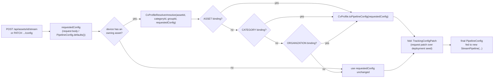
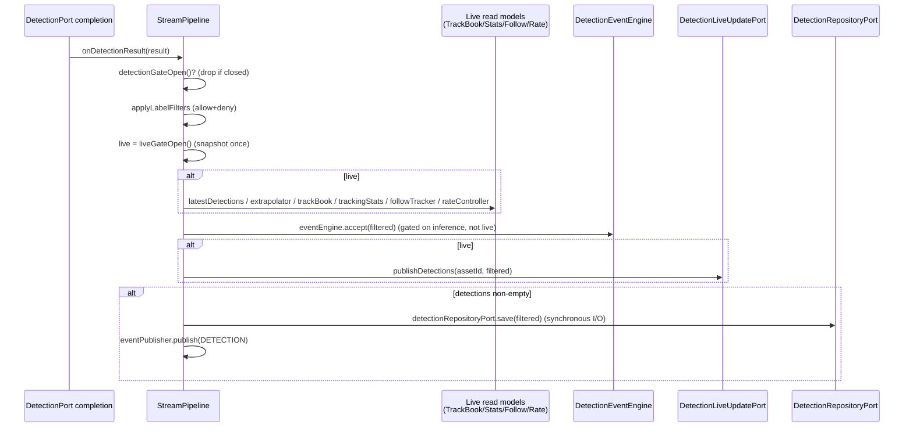

# R2 — Backend control plane: CV settings → gRPC → results

Scope: Java control plane only — `contexts/vision-perception`, `station/vision-api`,
`station/vision-app` wiring, `cv/grpc` (Java side of the gRPC call). Not the Python service, not the
SPA. Every claim is tagged **VERIFIED** (read against source, file:line given) or **DOC** (taken from
a `MODULE.md` and not independently re-derived from source in this pass).

## 1. Config: `PipelineConfig`, `PipelineConfigPatch`, profile hierarchy, registry

`PipelineConfig` — 9-field canonical record, `contexts/vision-perception/src/main/java/com/drones/vision/perception/domain/model/PipelineConfig.java:64-67`. **VERIFIED**.

| Field | Default (`defaults()`, :202-205) | Consumed | Dormant? |
|---|---|---|---|
| `model` (`ModelRef`) | `yolo26n.pt`/`latest` | Sent on wire (`FrameRequest.model_id/model_version`) | no |
| `confidenceThreshold` | 0.4 | Sent on wire | no |
| `inferenceFps` | 10 | Java-side sampling only (`StreamPipeline#targetFps`) — never sent to cv-service as a rate; `FrameRequest` has no fps field, only `PullControl.target_fps` (pull mode) | no (push), wire only in pull |
| `maxInFlightInferences` | 2 | Java-side drop-not-queue bound, `StreamPipeline.java:1184`. **Never PATCH-able** (no field on `PipelineConfigPatch`) and **not in `CvProfile`'s fold** — always `defaults().maxInFlightInferences()` regardless of profile (`CvProfile#toPipelineConfig` per `vision-perception/MODULE.md`, DOC) | fixed constant, not config-surfaced |
| `labelFilter`/`labelDenyFilter` | empty/empty | Java-side drop, `StreamPipeline#applyLabelFilters`, `StreamPipeline.java:1409-1424` | no |
| `eventRule` | `EventRuleConfig.defaults()` | Java-side only (`DetectionEventEngine`) — never sent to cv-service | no |
| `detectionEnabled` | `false` (`DEFAULT_DETECTION_ENABLED`, :79) | Java-side gate input (`detectionGateOpen`/`liveGateOpen`) | no |
| `tracking` (`TrackingConfig`) | `TrackingConfig.defaults()` (ASSOCIATE) | Sent on wire, mostly (see below) | partially |

`PipelineConfigPatch` — 7-field record (`confidenceThreshold, inferenceFps, labelFilter, detectionEnabled, modelId, tracking, labelDenyFilter`), every field nullable = "leave unchanged", `application/stream/PipelineConfigPatch.java:51-53`. **VERIFIED**. `modelId` carries only the checkpoint id, never the version; `maxInFlightInferences` and `eventRule` have **no field at all** — not patchable in v1.

**`TrackingConfig` wire fields never set by the Java codec** — a genuinely dormant part of the wire contract, both directions:
- Outbound (`DetectionFrameCodec.toWireTrackingConfig`, `cv/grpc/.../DetectionFrameCodec.java:319-333`, **VERIFIED**): sets `mode`, `engineId`, `verifyEveryMillis`, `redetectIouThreshold`, `maxAgeFrames`, `minHits`, `capabilityLevel`, `reupdateMaxGapMillis`, and `lock` when present. It **never** sets `motion_engine_id` (proto field 8), `appearance_engine_id` (field 9), or `memory_ttl_millis` (field 10) — the domain `TrackingConfig` record has no fields for any of the three, so they always ride as the proto zero-value ("server default").
- Inbound (`DetectionFrameCodec.decode`, `cv/grpc/.../DetectionFrameCodec.java:256-278`, **VERIFIED**): reads `tracker_engine_id`, `detector_reason`, `capability_level_served`/`_reason` onto `TrackingTelemetry`. It **never** reads `motion_engine_id` (response field 15), `motion_millis` (field 14), or `detector_roi` (field 13) — `TrackingTelemetry` has no field for any of them.

So `motion_engine_id` — named explicitly in the task brief — is decoded **nowhere** in the Java control plane, in either direction; ego-motion compensator identity/cost is invisible to this codebase even though cv-service's proto has carried it since an earlier wave (`proto/vision/v1/cv.proto:112,209`).

### Profile hierarchy (CV-SETTINGS, wave W2)


`DefaultStreamService#start`, `CvProfileResolver#resolve` — asset→category→organization→platform, first match wins (`contexts/vision-perception/MODULE.md` §application.profile, **DOC**, matches the class list read at `application/profile/*.java`). `maxInFlightInferences` is excluded from every fold (host capacity, not a profile concern).

**Known gap (documented in the module doc itself, not re-verified further here):** `requestedConfig` is a single fully-resolved `PipelineConfig`, not a patch — a bound profile's fields replace it *wholesale* except `maxInFlightInferences`. "An explicit per-call override still wins over a bound profile" is not honored end-to-end by `start` alone.

**Model registry** (`DRAFT/CANDIDATE/LIVE/RETIRED`): lives entirely on the cv-service/`ModelRegistryPort` side — `GET /api/cv/models` (`CvModelsController`) serves the live roster when `vision.cv.registry.enabled`, else a static catalogue; `POST /api/cv/registry/models/{id}/promote` and `.../rollback` are `administer`-only (`vision-api/MODULE.md` endpoint table, **DOC**). Nothing in `PipelineConfig`/`CvProfile` encodes registry stage — a profile just names a `ModelRef(id, version)`.

**Presets**: the four seeded built-in `CvProfile` rows (`V29__cv_profiles.sql`, per `vision-app/MODULE.md`'s `CvProfileWiringConfiguration` row, **DOC**) — not independently re-verified against the migration file in this pass.

**Per-asset class filters**: `CvProfile.labelFilter`/`labelDenyFilter` (both `List<String>`, order-preserving, unlike `PipelineConfig`'s `Set<String>`) fold into `PipelineConfig`'s sets via `CvProfile#toPipelineConfig`. Same drop site as a per-stream PATCH: `StreamPipeline#applyLabelFilters`.

**`cv.detection-policy` attribute**: `DetectionPolicy` enum `ON_VIEW | ALWAYS`, stored under `Asset#attributes["cv.detection-policy"]`, plain `Map<String,String>`, no Flyway migration; `DetectionPolicy.fromAttributeValue` fail-closed (unrecognized/blank → `ON_VIEW`), `contexts/vision-perception/.../domain/model/DetectionPolicy.java` (module doc **DOC**, not re-read directly here — text is unambiguous and internally consistent with `DetectionPolicyCache`'s own javadoc, which was read, see §2).

## 2. Gates: "frame arrives → is it sent to cv-service?"

```mermaid
flowchart TD
    F["VideoFrame arrives\nStreamPipeline#onNext (line 793)"] --> CL{closed?}
    CL -- yes --> DROP1[drop]
    CL -- no --> PUB["latestFrame = frame\nstreamPublisherPort.publish (video always flows)"]
    PUB --> MD["maybeDetect (line 1157)"]
    MD --> GATE{"detectionGateOpen()?\ndetectionEnabled && (demand || policyAlwaysOn)\nline 1013-1015"}
    GATE -- "no, or pullDetection != null" --> NOSEND1[no detect() call]
    GATE -- yes --> OUT{"outageDecision()\nline 1206"}
    OUT -- SKIP --> NOSEND2["still backing off / probe in flight"]
    OUT -- PROBE --> SUBMIT["submitDetection(isProbe=true)\nignores sample deadline"]
    OUT -- NORMAL --> SD{"sampleDue(now)?\ndeadline sampler, line 912"}
    SD -- no --> NOSEND3[not this deadline's frame]
    SD -- yes --> INFL{"inFlightInferences >= maxInFlightInferences?\nline 1184"}
    INFL -- yes --> DROPQ["DROPPED_IN_FLIGHT\n(skip, never queue)"]
    INFL -- no --> SUBMIT
    SUBMIT --> ATT["cameraAttitude() computed if hfov configured"]
    ATT --> DP["detectionPort.detect(frame, config[, attitude])"]
    DP --> SUP{"GrpcDetectionPort: supervisor.available()?\nGrpcDetectionPort.java:145-147"}
    SUP -- no --> CVUNAVAIL["CvUnavailableException\n(no encode, no session opened)"]
    SUP -- yes --> ENC["DetectionFrameCodec.encode\n(downscale+JPEG/BGR24)"]
    ENC --> SEND["FrameRequest over DetectStream bidi session\nDetectionStreamSession"]
```

`InferenceGate` is **not a class** — the task brief's name for what is actually two inline checks:
`inFlightInferences` (`AtomicInteger`, `StreamPipeline.java:355`) compared against
`config.maxInFlightInferences()` at `StreamPipeline.java:1184`. **VERIFIED**.

**Pull mode** (`vision.cv.frame-transport=pull`) is a parallel path, not a variant of the above:
`maybeDetect` returns immediately when `pullDetection != null` (line 1158) — the worker samples on
its own schedule; results arrive unsolicited via `PullResultSubscriber#onNext`
(`StreamPipeline.java:1522-1533`), which re-checks `detectionGateOpen()` itself before forwarding to
`onDetectionResult`. **A gated-off pull stream still costs the Python worker full inference** — the
JVM only refuses to *use* the result (`vision-perception/MODULE.md` Gotchas, **DOC**, consistent with
the pull-mode javadoc read at `StreamPipeline.java:1462-1491`, **VERIFIED**).

**`CvChannelSupervisor`** (`cv/grpc/.../CvChannelSupervisor.java`) — sticky-closed gate, **VERIFIED**
state machine comment at :34-52: `OPEN --TRANSIENT_FAILURE--> CLOSED`, `CLOSED
--CONNECTING/IDLE--> CLOSED`, `CLOSED --READY--> OPEN`, `SHUTDOWN` terminal. `available()` (:156) is a
separate sticky flag, not `state()==READY`. `GrpcDetectionPort#detect` consults it **before** `encode()`
(:145-147, **VERIFIED**) — a known outage costs neither CPU (downscale/JPEG) nor a session. Bounded
recovery: `reconnectInitialBackoff` (1s) → doubles → `reconnectMaxBackoff` (10s); combined with the
pipeline's own probe backoff (also capped 10s), worst-case recovery is documented as ~20s
(`cv/grpc/MODULE.md`, **DOC**).

`DetectionDemandPort`'s default production implementation, `LiveAndPollDetectionDemand`
(`station/vision-api/src/main/java/com/drones/vision/api/live/LiveAndPollDetectionDemand.java`,
**VERIFIED**, read in full): `detectionWanted` is **three** OR-terms — (1) an open SSE connection
subscribed to `detections:<assetId>` (`LiveUpdateRegistry#watchingDetections`), (2) the asset has a
calibrated fixed-camera pose (`TrackProjectionRunner#hasCameraPose`, D9, default `false` when that
feature is off), (3) `GET /api/streams/{id}/detections` was called for this stream within `pollTtl`
(`touched(StreamId)`, :120-123). **Fails open** on any internal exception (:131-138) — an unknown
demand state is reported as "wanted," never as "not wanted."

**Durable-vs-live split (ALWAYS-ON-FLOW D1/D2)** — two independently-gated planes, both read from
`StreamPipeline`, **VERIFIED** at :1013-1029:
```java
private boolean detectionGateOpen() {           // inference/durable gate
    return config.detectionEnabled() && (detectionDemand || detectionPolicyAlwaysOn);
}
private boolean liveGateOpen() {                 // live gate — narrower, never widened by policy
    return config.detectionEnabled() && detectionDemand;
}
```
`detectionPolicyAlwaysOn` is fed by `DetectionPolicyCache` (`station/vision-app/.../cv/DetectionPolicyCache.java`,
self-scheduled snapshot of every asset's `DetectionPolicy.ALWAYS` opt-in, default refresh 15s,
`VisionCvProperties.Policy#refreshInterval`, **VERIFIED** class header). An `ALWAYS`-policy asset can
have inference running with nobody watching (`DetectionState.RUNNING_UNWATCHED`) — durable
persistence/events keep writing, live read models (`latestDetections`/`trackBook`/SSE) do not.

`DetectionState` (four values: `OFF | IDLE_NO_VIEWERS | RUNNING_UNWATCHED | RUNNING`) reports which
gate explains the boxes-or-no-boxes state — **gating, never health**: a stalled `DetectionPort`
still reads `RUNNING`/`RUNNING_UNWATCHED` throughout an outage (`StreamPipeline#detectionState`,
`vision-perception/MODULE.md`, **DOC**).

## 3. Result path: `StreamPipeline#onDetectionResult`

**Exact order, VERIFIED at `StreamPipeline.java:1357-1389`:**

```java
private void onDetectionResult(DetectionResult result) {
    if (!detectionGateOpen()) return;                              // 1. leading gate check
    DetectionResult filtered = applyLabelFilters(result);           // 2. allow+deny label drop
    boolean live = liveGateOpen();                                  // 3. live gate snapshot, ONCE
    if (live) {
        latestDetections = filtered.detections();                   // 4a. live read models —
        extrapolator.accept(filtered);                              //     BEFORE the durable write
        trackBook.accept(filtered);
        trackingStats.accept(filtered);
        followTracker.accept(filtered);
        rateController.observeDetections(...);
    }
    if (eventEngine != null) eventEngine.accept(filtered);          // 5. DetectionEvent debounce
    if (live && liveUpdatePublisherPort != null && assetId != null) // 6. SSE fan-out (live gate)
        liveUpdatePublisherPort.publishDetections(assetId, filtered);
    if (!filtered.detections().isEmpty()) {                         // 7. durable save (I/O)
        detectionRepositoryPort.save(filtered);
        eventPublisher.publish(Event.of(streamId, EventType.DETECTION, ...));
    }
}
```



**ALWAYS-ON's lesson is honored** — the comment at :1362-1368 states it directly: durable save
(`detectionRepositoryPort#save`, synchronous I/O) is deliberately placed *after* every live-model
write, because an earlier cut had the durable write first and cost `TrackingAssociateE2ETest` a
detector pass on every full-suite run (a flake that was really an ordering bug). **VERIFIED**.

**Not part of `onDetectionResult` at all — external pollers, not push hooks (VERIFIED):**
- **Fixed-camera geolocation** (`station/vision-app/.../geo/TrackProjectionRunner.java`) polls
  `StreamService#tracks(streamId)` on its own fixed-cadence tick (:182), not a callback from the
  pipeline.
- **Visual geolocation** (`station/vision-app/.../geo/VisualGeoRunner.java`) polls
  `streamService.latestRawFrame(streamId)` (:240) the same way — a separate `LocalizeStream` gRPC
  session, fed frames it pulls itself, not detection results.
- **Training capture** (`LabelingController`, `POST /api/streams/{streamId}/samples`) captures the
  stream's *current frame* on an explicit user action — also a pull, not a push.

The only genuine in-line hook inside `onDetectionResult` is **`followTracker.accept(filtered)`**
(TRACK-FOLLOW), and it runs only under the `live` gate.

**Discrepancy found against the module doc itself** — see "Surprises" below: `vision-perception/MODULE.md`'s
own API-surface section describes a "trailing `if (!liveGateOpen()) return;`" re-check *after* the
durable block; the actual code (and that method's own javadoc, :1348-1352) does the opposite —
both gates are read **once**, together, at the top, specifically to avoid widening the race window
across the database round trip.

## 4. Per-stream JVM state

All of the following are `private final` fields constructed once per `StreamPipeline` instance
(`StreamPipeline.java:271-404`, **VERIFIED** field list), and `StreamPipeline` instances live in
`DefaultStreamService`'s `ConcurrentHashMap<StreamId, RunningStream> activeStreams`
(`contexts/vision-perception/.../DefaultStreamService.java:194`, **VERIFIED**) — pure JVM heap, no
persistence, no cross-JVM replication.

| Class | Holds | Scope | Blocks horizontal scaling? |
|---|---|---|---|
| `TrackBook` | `Map<Long, TrackedObject>`, track id → last-seen object | per-stream | Yes if a stream can be served by more than one vision-app instance — a viewer hitting a different instance sees an empty book. Fine if each stream is pinned to one instance. |
| `TrackingStatsWindow` | rolling counters over `TrackingTelemetry`, capped 4000 samples | per-stream | Same as above (read-model only, cheap to lose on failover, but not shared) |
| `FollowTracker` | `FOLLOW` lock state machine + 30s dormant-recovery memory | per-stream | Same; additionally the *cv-service-side* L4 memory this mirrors is itself per-session, so a failover also loses server-side recovery, not just this read model |
| `PipelineLatencyWindow` | submit→available round-trip timings | per-stream | Metrics-only; loses history on failover, not correctness-critical |
| `DetectionRateWindow` (`DetectionRate`) | sampler outcome counters (submitted/dropped/missed) | per-stream | Metrics-only |
| `DetectionRateController` | association-budget rate math state | per-stream | Recomputes from scratch on reopen; no persistence needed |
| `DetectionExtrapolator` | last two `DetectionResult`s | per-stream | **Dead code** — `.at()` has no production caller since server-side burn-in was removed (`vision-perception/MODULE.md`, **DOC**); `.accept()` still runs every frame for nothing |
| `inFlightInferences` (`AtomicInteger`) | in-flight `detect()` count | per-stream | Must not be shared across instances — it is a local backpressure bound, not a global budget (see §Surprises on `maxInFlightInferences`) |
| `DetectionPolicyCache` (vision-app) | `Set<AssetId>` snapshot of `ALWAYS` policy | **process-wide**, self-refreshing | Each instance re-polls `AssetService` independently — safe to run N copies, no shared state needed |
| `activeStreams` map (`DefaultStreamService`) | `StreamId → RunningStream` | **process-wide** | The actual scaling boundary: a device's stream can only run in one JVM at a time (enforced by "one active stream per device" — `IllegalStateException` on a second `start`), so scaling to N vision-app instances requires sticky per-device routing, not shared state |

**Two cv-service instances**: supported today via `CvTarget`/`CvChannels#forTargets` — an *ordered
failover* list (grpc-java `pick_first`), not load balancing across concurrently-open sessions
(`cv/grpc/MODULE.md`, **DOC**, `.pom`/settings fields checked directly in §1 above). A given
`DetectStream`/`DetectPulled` session still pins to whichever target answered first; failover only
helps when that target goes down.

## 5. Observability today

| Signal | Produced | Exposed | Reader |
|---|---|---|---|
| Track book + duty-cycle stats + follow lock | `TrackBook`/`TrackingStatsWindow`/`FollowTracker` (per-stream) | `GET /api/streams/{streamId}/tracks` → `StreamTracksResponse` — **VERIFIED**, `station/vision-api/.../StreamController.java:371-407`, DTO `.../dto/StreamTracksResponse.java:53-56` (`tracks, stats, latency, rate, detectionState, follow`). Never errors — unknown/stopped stream is `200` with empty `tracks`. | poll-only, `vision-web` |
| Pipeline latency | `PipelineLatencyWindow` | same endpoint, `latency` field, gated on `samples() > 0` | poll-only |
| Detection rate | `DetectionRateWindow` | same endpoint, `rate` field, gated on `due() > 0` | poll-only |
| `DetectionState` | `StreamPipeline#detectionState()` | same endpoint, top-level field | poll-only |
| cv-service reachability | `CvChannelSupervisor` via `CvStatusProvider implements SubsystemStatusPort` (`cv/grpc/.../CvStatusProvider.java`, **VERIFIED**, read in full) | folded into `GET /api/system/status`'s subsystem rollup as row `"cv-service"`/`"CV inference"`, and the `system` SSE topic's sampler payload (same reader, `SystemStatusReader`) | poll or SSE `system` topic |
| Raw per-frame detections | `StreamPipeline#latestDetections()` | `GET /api/streams/{streamId}/detections` and SSE `detections:<assetId>` | poll or SSE (opt-in subscribe) |
| Debounced detection events | `DetectionEventEngine` | `GET /api/events`, `GET /api/streams/{id}/events`, SSE `detection-events` | poll or SSE |
| Micrometer / structured metrics | **none found** — `grep -rl "io.micrometer\|MeterRegistry"` across the whole non-worktree tree returns zero hits outside `spring-boot-starter-actuator` on the classpath (no meter is ever registered) | — | — |
| Logs | plain `System.Logger` (JDK), not SLF4J/structured JSON — `StreamPipeline.java:186`, `cv/grpc` MODULE.md Conventions (**DOC**, consistent with the `LOG` field pattern verified in multiple classes above) | container stdout only | operator tailing logs |
| `motion_engine_id` | **never decoded** (see §1) | — | — (dead wire field) |

**No `GET /api/cv/status` endpoint exists.** The task brief assumed one; the actual mechanism is
`CvStatusProvider` feeding the generic `GET /api/system/status` rollup. **VERIFIED** — grep for
`CvStatusController`/`"cv/status"` returns nothing; `CvStatusProvider` is wired only into
`SystemStatusWiring` (`station/vision-app/.../SystemStatusWiring.java:71`).

## 6. `StreamPipeline` shape

**One canonical constructor** — `StreamPipeline.java:414`, 9 parameters
(`StreamId, Device, PipelineConfig, Flow.Publisher<VideoFrame>, DetectionPort, StreamPublisherPort,
DetectionRepositoryPort, EventPublisherPort, StreamPipelineCollaborators`), the last a settings
record bundling everything else. **VERIFIED — a single constructor exists**, confirming CLAUDE.md
rule 10's collaborator-bundling discipline was actually followed here (contra the rule's own
complaint about *other* classes historically having nine). ~55 `private final`/`volatile` fields
(:191-404), plus three lock objects (`gateLock`, `outageLock`) and 3 `Atomic*` counters.

Public methods, grouped by responsibility (line numbers from the read pass above):

| Group | Methods |
|---|---|
| Lifecycle | `start()` (478), `close()` (1573, idempotent), `onSubscribe`/`onNext`/`onError`/`onComplete` (`Flow.Subscriber`, 787-793, 1546-1554) |
| Config | `config()`/`updateConfig(PipelineConfig)` (491, 551) |
| Gates | `updateDetectionDemand(boolean)`/`detectionDemand()` (591, 602), `updateDetectionPolicy(boolean)`/`detectionPolicyAlwaysOn()` (619, 631), `detectionState()` (650) |
| Stats/read-models | `latestDetections()` (698), `tracks()` (710), `followStatus()` (720), `trackingStats()` (731), `pipelineLatency()` (743), `detectionRate()` (754), `latestFrame()`/`latestRawFrame()` (771, 782), `framesObserved()`/`nanosSinceLastFrame()` (672, 685), `effectiveInferenceFps()` (976, package-private) |

Everything else (sampling deadline math, outage/backoff state machine, gate transition handling,
detection submission, result fan-out) is `private`. The class is 1595 lines — large, but the "nine
constructors" complaint CLAUDE.md rule 10 raises does not currently apply to this class; it applies
historically/elsewhere (`UsageTracker` is the other example named in the rule, and its own
`MODULE.md` confirms one canonical constructor today too).

## 7. SSE topics carrying CV facts

Ten always-on/opt-in `LiveTopicKind`s exist (`station/vision-api/.../live/LiveTopicKind.java`,
**VERIFIED**, read in full). CV-relevant ones:

| Topic | Always-on? | Payload | Carries |
|---|---|---|---|
| `detections:<assetId>` | opt-in, per-asset | `DetectionResultResponse(streamId, frameSequence, capturedAt, inferenceMillis, detections, tracking)` (`.../dto/DetectionResultResponse.java:29-30`, **VERIFIED**) | one stream's raw per-frame detections + `TrackingTelemetry`, live-gated |
| `detection-events` | always-on | `DetectionEventResponse` (same shape as `GET /api/events`) | debounced open/advance/close occurrences |
| `event` | always-on | generic `Event` (device online/offline, stream started/stopped, **`PIPELINE_ERROR`**, **`DETECTION`**) | the platform-event side-channel `onDetectionResult`'s durable block also publishes to |
| `geo:<assetId>` | opt-in, per-asset | visual-geo corrected track (`TrackCorrectionLiveUpdatePort`) | not a raw detection, a post-processed fix |
| `system` | always-on, sampler-driven | `SystemStatusResponse` (includes the `cv-service` subsystem row) | cv-service reachability, on-change only |

**`tracks` has no SSE topic — confirmed poll-only.** `GET /api/streams/{streamId}/tracks` is the
only way to read `TrackBook`/`TrackingStatsWindow`/`FollowTracker`; nothing publishes track deltas
to `LiveUpdateRegistry`. A cockpit watching a `FOLLOW` lock's live state must poll this endpoint.

## Surprises / defects noticed

1. **`vision-perception/MODULE.md` disagrees with its own code on `onDetectionResult`'s gate
   re-check.** The module doc's API-surface prose (the section describing `onDetectionResult`)
   claims a "trailing `if (!liveGateOpen()) return;` (after the durable block already ran)". The
   actual method (`StreamPipeline.java:1357-1389`) and its own javadoc immediately above it
   (:1348-1352, "Both gates are read once, together, at the top rather than re-read around each
   plane") say the opposite, and explain *why*: re-reading after the durable write would widen the
   race window to a whole database round trip, which is exactly the ordering bug D2 had already
   fixed once. The code is almost certainly right (it matches its own detailed reasoning and the
   ALWAYS-ON design doc's stated intent); the module doc's summary sentence is stale/wrong. This is
   the kind of doc drift CLAUDE.md's module-docs workflow exists to catch — worth a one-line fix.

2. **`motion_engine_id` (and its two siblings `appearance_engine_id`/`memory_ttl_millis` outbound,
   `motion_millis`/`detector_roi` inbound) are entirely unrepresented in the Java domain model.**
   The task brief specifically asked about its "decoding status" — the honest answer is "never
   decoded, in either direction." `TrackingConfig`/`TrackingTelemetry` (both frozen domain records)
   have no fields for any of these five proto fields. This is not a bug in the sense of incorrect
   behavior (the proto fields default sanely to "server default"/zero), but it means an operator has
   no way to see which ego-motion compensator ran, or how much it cost, anywhere in this codebase.

3. **No `/api/cv/status` endpoint** — only `GET /api/system/status`'s generic rollup. If the
   architect's mental model expects a dedicated CV status surface, it does not exist; building one
   would be new work, not a documentation gap.

4. **No Micrometer/structured metrics anywhere in the Java control plane.** Every rate/latency/stats
   window (`PipelineLatencyWindow`, `DetectionRateWindow`, `TrackingStatsWindow`) is an in-process
   read model exposed only via REST poll — nothing is exported as a counter/gauge/histogram, nothing
   is scraped. Whatever alerting exists today is purely the `event`/`detection-events` SSE topics
   plus manual log tailing.

5. **`maxInFlightInferences` is a hardcoded per-stream constant (2) with no fleet-wide budget** —
   confirmed both by the domain doc and by the code: it's never on `PipelineConfigPatch`, never in
   `CvProfile`'s fold. An operator can flip many assets to `DetectionPolicy.ALWAYS` and drive
   concurrent inference well past what one `cv-service` instance can sustain, with nothing in this
   module warning or throttling across streams (`ALWAYS-ON-FLOW-PLAN.md` D3, deliberately deferred
   per the module doc). Directly relevant to any horizontal-scaling design — this bound is per-stream
   local, not a shared resource token.

6. **`DetectionExtrapolator` runs every frame for a reader that no longer exists.** `.accept()` is
   called unconditionally inside the live-gate block of `onDetectionResult`, but `.at()` has no
   production caller since server-side burn-in was removed. Cheap, but dead weight worth pruning
   when this class family is next touched.

## Open questions for the architect

1. Given `maxInFlightInferences` is local-per-stream-per-JVM with no fleet budget (finding 5), does
   a future horizontal-scaling design want a shared token bucket (Postgres row? Redis?), or is the
   intended fix "one cv-service instance per vision-app instance, no shared budget needed"?
2. `TrackBook`/`FollowTracker`/tracking-stats state is pure JVM heap, keyed by `StreamId`, inside one
   `ConcurrentHashMap` per vision-app instance (§4). Scaling to N vision-app instances requires
   sticky per-device routing at the load balancer/reverse-proxy layer — is that the intended shape,
   or does DOMAIN-SEPARATION's NATS plan intend to also carry track/follow state cross-instance?
3. Is a dedicated `GET /api/cv/status` (or a `tracks` SSE topic, replacing the current poll-only
   `GET /api/streams/{id}/tracks`) in scope for this initiative, given neither exists today?
4. Should `motion_engine_id`/`motion_millis` get a Java-side home (a new `TrackingTelemetry` field),
   or is ego-motion compensation intentionally kept invisible to the Java control plane for now?
5. Is fixing the `vision-perception/MODULE.md` doc-drift on `onDetectionResult`'s gate re-check
   (finding 1) in scope for this research task's follow-up, or a separate small doc fix?
