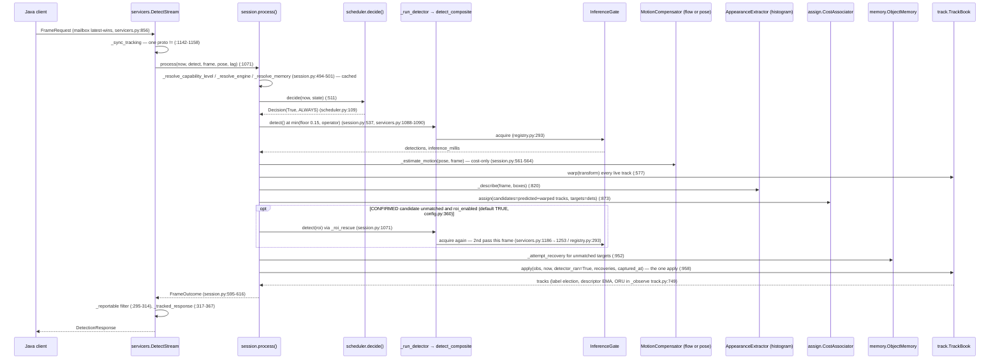
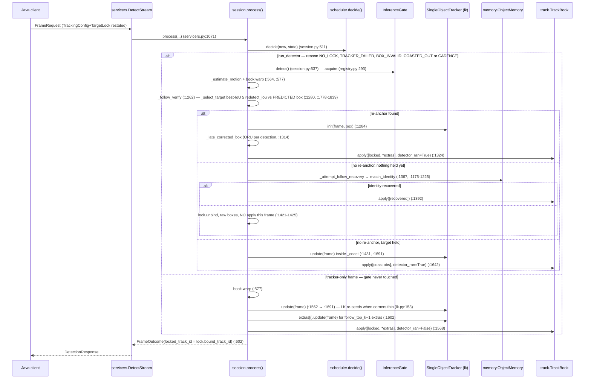

# R3 — cv-service internals: every processing component and how one frame flows through them

**Scope:** `cv/cv-service/cv_service/` (Python) only — not Java, not the SPA. Research date 2026-09-11, branch `master` state at `331a6a77` (feat/tracking-v3 merged).
**Charter checked against:** `docs/extracts/TRACKING-ORCHESTRATION.md` (2026-08-11).
**Convention:** every `file:line` below was read in source during this research — treat as **VERIFIED**. Claims tagged **DOC** come from `MODULE.md`/plan text and were *not* re-measured (mostly timings). Paths are relative to `cv/cv-service/cv_service/` unless prefixed.

---

## 0. Process model in one paragraph

One Python process, `grpc.server(ThreadPoolExecutor(max_workers=CV_GRPC_WORKERS=10))` (`grpc/server.py:169-172`, `config.py:51`). Each `DetectStream` call occupies **one pool thread for the life of the stream** (`grpc/servicers.py:824-863`) plus **one daemon reader thread** per stream (`_StreamReader`, `servicers.py:519-526`) that drains the network into a `LatestOnlyMailbox` (`inference/concurrency.py:36-85`). All streams share **one** `InferenceGate` semaphore (`server.py:184`, default `min(2, cpu//2)`, `config.py:746-764`). So: up to `grpc_workers` streams open, at most `max_concurrent_inferences` inside a detector call at once; the rest block on the semaphore (`concurrency.py:104-110`). Population bound is the gRPC pool, not tracking (`config.py:291-296`). **GIL release during torch/cv2 inference is addressed nowhere in code or comments** — every "GIL" mention (`config.py:58`, `server.py:37`) is about the process-role split (`CV_SERVICE_ROLE`), not intra-inference release. Tracking itself is single-threaded per stream: `session.process()` runs on the stream's pool thread.

`DetectPulled` (`servicers.py:877`) reuses the identical `_handle_request` path; its own reader thread + non-blocking mailbox live in `pull/loop.py:274-275, 154-187`.

---

## 1. Component inventory

Columns: **state** = per-stream (S) / process-global (G) / stateless (–); **config source** = `FrameRequest` field (W), `Settings`/`CV_*` env (E), module constant (C); **plug** = behind a Protocol (P) / hardwired (H).

| # | file:line | class / function | inputs → outputs | state | config (source) | plug | cost |
|---|---|---|---|---|---|---|---|
| 1 | `grpc/server.py:155-217` | `serve()` | Settings → `grpc.Server`; builds ModelRegistry (:181), InferenceGate (:184), TrackerRegistry (:185), role-gated servicers | G | `grpc_workers`, `role`, `port` (E); keepalive :104-109 (C) | H | — |
| 2 | `grpc/servicers.py:824-863` | `InferenceServicer.DetectStream` | FrameRequest iterator → DetectionResponse iterator; first frame claimed sync (:840), session acquired by `stream_id` (:851), reader started (:853), loop `reader.next()` (:856-859), release in `finally` (:861-863) | S (call) | — | H | — |
| 3 | `grpc/servicers.py:490-565` | `_StreamReader` | request iterator → `LatestOnlyMailbox` | S | — | H | drops silently; `.dropped` (`concurrency.py:58,65`) **never reaches the wire** in push mode |
| 4 | `inference/concurrency.py:36-85` | `LatestOnlyMailbox[T]` | `put` (never blocks, replaces), `get` (blocks), `close` | S | — | H | — |
| 5 | `inference/concurrency.py:88-110` | `InferenceGate` | `threading.Semaphore` ctx-mgr | G | `max_concurrent_inferences` (E) | H | — |
| 6 | `inference/concurrency.py:113-138` | `process_gate()` | lazy module-level singleton `_process_gate` — test/bare-servicer fallback only (`servicers.py:769`) | G | E | H | — |
| 7 | `grpc/servicers.py:1047-1131` | `_handle_request` | request, session → response; `_sync_tracking` (:1064) → `session.process(...)` (:1071-1090) → `_tracked_response` (:1097); OFF path `_run_detector` (:1099); any exception → echo (:1102-1109) | – | W | H | — |
| 8 | `grpc/servicers.py:1142-1158` | `_sync_tracking` | one protobuf `!=` vs `session.applied_wire_config`; `apply_config` only on change | S | W | H | O(1)/frame |
| 9 | `grpc/servicers.py:1160-1197` | `_run_detector` | request, roi?, loader?, confidence? → (dets, ms). Routes: roi → `_run_roi_detector` (:1186); registry → `_detect_via_registry` (:1188); pinned detector → **gate acquire :1190** | – | W | H | docstring calls itself "the only place InferenceGate is taken" |
| 10 | `grpc/servicers.py:1199-1263` | `_run_roi_detector` | crop (BGR24, `_crop_for_roi` :411) → same model/threshold; pinned path **gate acquire :1253** | – | W | H | 2nd detector pass/frame, ≤1 |
| 11 | `grpc/servicers.py:1297-1339` | `_detect_via_registry` | `self._registry.resolve(request.model_id)` **every call** (:1327) → `detect_composite(gate=…)` (:1329-1337) | – | W `model_id` | H | resolve is dict lookups on a cached detector |
| 12 | `inference/registry.py:93-254` | `ModelRegistry` | roster → lazy `{model_id → YoloDetector}` under `self._lock` (:117-118); `resolve()` :177-217 (comma-separated composite; unknown ids dropped; default only when nothing resolved) | G | `model_dir`, `model` (E); `active_model.json` marker (DOC) | `detector_factory=` | — |
| 13 | `inference/registry.py:257-309` | `detect_composite` | resolved list, gate, frame → (dets, Σms); **`with gate.acquire()` :293** (production gate site); multi-model labels prefixed `short:label` (:305-307) | – | — | H | — |
| 14 | `inference/detector.py:146-284` | `YoloDetector` | `ultralytics.YOLO(name)`; warmup predict at ctor (:239-243); `detect()` → `(list[Detection], ms)` | G (one per model_id) | `model`, `imgsz`, `device` (E :174-180); `DEFAULT_CONFIDENCE=0.25` (`config.py:256`) | `model=` injectable | DOC: yolo26n ≈230 ms CPU / 135-150 ms OpenVINO on GB4005 |
| 15 | `grpc/servicers.py:1133-1140` | `_detect_floor_for` | `min(settings.detect_floor, operator_threshold)` — detector runs at the *lower* of the two while tracking is active | – | `CV_DETECT_FLOOR=0.15` (`config.py:248,1290-1294`) + W | H | — |
| 16 | `grpc/servicers.py:295-314` | `_reportable` | `box.confidence >= report_threshold` **or** track state ∈ {CONFIRMED, COASTING} | – | W `confidence_threshold` (:247-251) | H | response-side, not detector-side |
| 17 | `tracking/sessions.py:89-208` | `SessionRegistry` | `acquire(stream_id)`/`release`; `_entries` dict (:103) under one lock; opportunistic O(n) eviction (:48-56) | G (per servicer = per process) | `track_session_grace_millis=15000`, `_capacity=64` (`config.py:290,296`) | H | — |
| 18 | `tracking/params.py:147-347, 422-556` | `TrackingParams` (33 fields), `resolve()` | wire `TrackingRequest` + Settings → frozen params; **only** place `<=0` sentinels resolve; `motion/appearance_engine_id` resolved to *which id* only (:468-483) | S | W + E | H | on change only |
| 19 | `tracking/session.py:312-394, 412-466` | `StreamTrackingSession.__init__`, `apply_config` | rebuilds engine iff `mode/engine_id/max_age_frames` changed (:427-437), motion (:438-443), appearance (:444-447), memory (:459) | S | params | H | on change only |
| 20 | `tracking/session.py:470-617` | `StreamTrackingSession.process` | now, `detect` fn, `frame` fn, pose, lag → `FrameOutcome` (:248-300, 15 fields). Order: capability (:494) → engine (:495) → memory (:501) → `decide` (:511) → `detect()` (:537) → ego-motion (:561-564) → `book.warp` (:577) → mode branch (:579-587) → outcome | S | params only | H | `tracker_millis` :588 spans the mode branch incl. ROI |
| 21 | `tracking/scheduler.py:96-135` | `DutyCycleScheduler.decide` | (now, `SchedulerState`) → `Decision(run_detector, reason)`; order: non-FOLLOW→ALWAYS (:105-109) · no lock→NO_LOCK rate-limited by `effective_reacquire_millis` (:111-122) · TRACKER_FAILED (:123) · BOX_INVALID (:125) · COASTED_OUT (:127) · CADENCE (:129-133) · else False (:135) | – | params (verify 2000, reacquire 250, max_age 30; `config.py:98-99`) | H | pure, frame-free |
| 22 | `tracking/lock.py:100-137, 157-236` | `LockArbiter`, `select_by_point`, `select_target`, `best_iou_match` | `apply()` accepts iff `lock_seq > applied_seq` (:107-111); release → `drop()`; INFO on change (:114,119) | S | W `TargetLock` | H | — |
| 23 | `tracking/track.py:133-244, 284-543` | `Track`, `TrackBook` | `apply(obs, now, *, detector_ran, recoveries, captured_at)` (:474-482) books/ages/settles/expires; `warp()` :421-472; `bump_epoch` :359-405; `forget_keys` :407-419; `_retire` → `ObjectMemory.remember` | S | `min_hits`, `max_age_frames`, `max_age_millis` (E/W); `_LOST_RETENTION_MULTIPLIER=2` (C) | H | **at most** once per `process()` — see §Surprises |
| 24 | `tracking/track.py:946-1028` | `_update_label_election` (TRACK-IDENTITY L1) | per-track vote ring; switch needs decayed margin + streak | S | `label_vote_window=10`, `switch_margin=1.5`, `switch_streak=3` (E); `_LABEL_VOTE_DECAY=0.85` (C) | H | — |
| 25 | `tracking/track.py:1031-1054` | `observe_descriptor` | EMA of appearance from detector evidence only | S | `_DESCRIPTOR_SMOOTHING=0.3` (C) | H | — |
| 26 | `tracking/predict.py:66-91` | `predict(track, now)` | constant-velocity extrapolation, elapsed clamped to `_MAX_EXTRAPOLATION_SECONDS=2.0` (:46) | – | C | **H — no Predictor protocol** | — |
| 27 | `tracking/history.py:200-296` | `ObservationRing` | `record` admits only `SOURCE_DETECTOR and not predicted` (:236); `latest`/`before`/`span`; capacity 16 (:120) | S (per track) | C | H | — |
| 28 | `tracking/reupdate.py:513-680, 832-934` | `reupdate()` (ORU), `late_correction()` | bracket-interpolate a coasted gap; 6 refusals: gap≤0 (:597), density (:599-601), no/short/long bracket (:602-615), shape log-ratio (:628-632), motion-centre (:645-658), velocity (:667-671); `late_correction` reuses all (:912-923) | – | `reupdate_*` (E; `max_gap` also W) | H | — |
| 29 | `tracking/assign.py:131-236, 266-345` | `CostAssociator`, `hungarian` | `cost = w_iou·(1−IoU) + w_app·dist + w_label·[label mismatch]`, gates `min_iou`/`max_appearance`/`max_cost` → FORBIDDEN (:153-177); two-stage high/low confidence (:179-220, split :189-198); O(n³) stdlib Hungarian, FORBIDDEN never returned (:341-345) | S (weights/gates only) | `CV_TRACK_COST_*` (E) | P (`Associator`, id `cost`) | — |
| 30 | `tracking/memory.py:59-134, 152-360` | `DormantIdentity`, `ObjectMemory` | stores id, label, box, velocity, lost_at, first_seen, EMA descriptor, gallery ≤4, recoveries (:96-106); gates in `_score` :272-306 — TTL (:281-283), label (:284-285), appearance ≤0.45 (:287-292; **missing descriptor passes**), motion reach (:294-296, :308-332), `confidence=app×motion ≥ 0.35` (:298-301); capacity 32 oldest-first (:353-360); `claim()` = plain `pop` (:245-255) | S | `CV_TRACK_MEMORY_*` (E), `memory_ttl_millis` (W) | H (not in any roster) | — |
| 31 | `tracking/registry.py:125-131, 149-155, 224-390` | `TrackerRegistry` | rosters `{bytetrack,cost}/{lk,ncc}/{flow,pose}/{histogram}`; level floors: cost/pose L1, lk/ncc/flow/histogram L2, bytetrack L3; `probe()` builds each once, drops raisers, logs roster once (:253-262); `_create` calls the factory **fresh every call** (:387) | G (factories only) | `CV_TRACK_*_ENGINE` (E), `engine_id` (W) | the plug point | — |
| 32 | `tracking/levels.py:46-50, 92-193` | capability ladder L1..L5 | `probe()` via `importlib.util.find_spec` only (:92-105) + 512 MiB floor (:78); `resolve(requested, probed)=min` (:165-193) | – | `capability_level` (W/E) | H | — |
| 33 | `tracking/engines/base.py:156-197, 383-436` | `Associator`, `SingleObjectTracker`, `MotionCompensator`, `AppearanceExtractor` (Protocols); `Box`, `Observation`, `TrackerUpdate`, `CameraPose`, `Transform` (prev→current, :241-242), `Descriptor` (Hellinger/cosine :206-207, :340-347) | — | — | — | **these four are the only seams** | — |
| 34 | `engines/bytetrack.py:95-188` | `ByteTrackEngine` (Associator) | wraps ultralytics `BYTETracker`; thresholds hardcoded (:65-69); `track_buffer=max_age_frames` (:105,120); `BaseTrack._count` restored after ctor (:136-140, getattr-guarded) | S (+ **G** counter) | E/W `max_age_frames` | P | DOC ≈0.75 ms/10 dets (:5) |
| 35 | `engines/lk.py:73-213` | `LkFlowEngine` (SOT) | pyramidal LK, forward-backward check ≤2 px (:70,:187-213); re-seed when survivors `< 0.5·initial` (:61,:153) | S | C (:42-70) | P | DOC 0.49 ms (:19-20) |
| 36 | `engines/ncc.py:47-102` | `NccEngine` (SOT) | template match, corr ≥0.3, search margin 0.5 (:38-44) | S | C | P | DOC 0.23 ms (:12) |
| 37 | `engines/flow_gmc.py:105-204` | `FlowMotionCompensator` | whole-frame `goodFeaturesToTrack` **no mask** (:139-144) → RANSAC affine; refuses <12 pts (:145,:156), failed fit (:165), inliers <0.6 (:168), |det−1|>0.5 (:204) | S | C (:71-102) | P | — |
| 38 | `engines/pose_gmc.py:72-146` | `PoseMotionCompensator` | pure trig on `CameraPose` deltas; refuses unknown FOV (:104-106), first pose (:110), gap >2 s (:112,:199-206), step >45° (:119-126), <0.01° (:127) | S | C (:54-69); W `camera_pose` | P | — |
| 39 | `engines/histogram.py:65-120` | `HistogramAppearanceExtractor` | 16×8 H×S hist, V dropped (:100-106); stateless (:68-71, `reset` no-op :113-115); needs ≥64 px | – | C (:54-62) | P | DOC sub-ms |
| 40 | `pull/loop.py:85-146, 231-370` | `DeadlineSampler`, `PullDecodeLoop` | one clock read/iteration (:330), `max(now,…)` debt clamp counting `missed_deadlines` (:136-139); stall → `PullStalledError` (:323-328); **`dropped_frames` counts only overwrites inside the `_awaiting_consumer` window** (:302-308, :362-366) | S | `CV_PULL_*` (E), `target_fps` (W, hot :277-279) | `PullSource` protocol (`pull/source.py`) | — |
| 41 | `grpc/servicers.py:317-367, 254-292` | `_tracked_response`, `_tracked_detection` | `FrameOutcome` → wire, 1:1 (see §5) | – | — | H | — |

Not inventoried (out of the frame path): `TrainingServicer` (`servicers.py:1376-1439`), `GeolocationServicer` (`:2032-2079`), `cv_service/geo/**`, `cv_service/training/**`.

---

## 2. One frame — sequence

### 2a. ASSOCIATE, resolved engine `cost` (the shipped default, `config.py:90`)

### 2b. FOLLOW (engine `lk`)

Lock semantics: `TargetLock` restated on every frame; applied iff `lock_seq > applied_seq` (`lock.py:107-111`); `locked_track_id` echoes `bound_track_id` only once a track resolved (`session.py:601`) — the UI honesty rule holds. Wall-clock LOST: `Track.last_confirmed` + `track_max_age_millis=3000` (`config.py:110`) independent of `max_age_frames` verify-pass count (DOC semantics, `track.py:559-943` machine).

---

## 3. State ownership

| State | Owner (file:line) | Scope | Notes |
|---|---|---|---|
| Track identity, state machine, age, hits/misses, `last_confirmed` | `Track` in `TrackBook._tracks` (`track.py:133-244, 284-298`) | per stream | ids minted by the book, never by an engine |
| Velocity (EMA, evidence-only) | `Track.velocity_x/y`, updated in `_observe` (`track.py:559-943`); read by `predict.py:66-91` | per track | `Observation.predicted` set only by session — coast boxes never feed velocity |
| Label history / elected label | `Track` vote ring, `track.py:946-1028` | per track | re-seeded on `bump_epoch` |
| Appearance signature | `Track.descriptor` (EMA α=0.3, `track.py:1031-1054`); gallery copies in `DormantIdentity` (`memory.py:96-106`) | per track / per dormant id | extractor itself stateless |
| Real-observation history (ORU substrate) | `Track.history: ObservationRing` (`history.py:200-296`) + `history_transform` | per track | warped by `TrackBook.warp` |
| Dormant gallery | `ObjectMemory._dormant` (`memory.py:124-134`) | per stream | resolved unconditionally (`session.py:501, 2128-2154`) |
| Lock target, `applied_seq`, bound id, generation | `LockArbiter` (`lock.py:100-137`) | per stream | |
| Followed track + extras engines | `StreamTrackingSession._followed`, `_extras` (`session.py:1437-1619`) | per stream | one SOT instance per extra |
| Scheduler flags (`_tracker_failed`, `_box_invalid`, `_last_detector_millis`) | session (`session.py:503-513`) | per stream | reset every frame |
| Engine instances (associator/SOT/compensator/extractor) | session, built once per config (`session.py:1924-2117`) | per stream | registry hands out **new** instances (`registry.py:387`) |
| Resolved `TrackingParams`, `applied_wire_config` | session (`session.py:412-466`) | per stream | on change only |
| Session pool | `SessionRegistry._entries` (`sessions.py:103`) | per process | survives reconnect ≤15 s |
| Model cache, roster, promotion marker | `ModelRegistry` (`inference/registry.py:117-118`) | per process | in-memory; promotion reaches a *separate* inference process only on restart (DOC `MODULE.md:31`) |
| Inference concurrency | `InferenceGate` (`server.py:184`) | per process | |
| ByteTrack id counter | `BaseTrack._count` (ultralytics global), guarded `bytetrack.py:136-140` | **per process** | book never publishes engine keys, so a regression cannot leak ids |
| `process_gate()` singleton | `concurrency.py:113-114` | per process | fallback path only |

---

## 4. Hardwired vs pluggable

| Candidate new evidence source | Existing seam? | What it would take | Verdict |
|---|---|---|---|
| **Re-ID embedding** (learned appearance) | `AppearanceExtractor.describe(frame, boxes) → list[Descriptor]` (`base.py:418-436`); `METRIC_COSINE` already implemented (`base.py:207, 340-347`) and **unused by any shipped extractor** | new `engines/reid.py`, one entry in `BUILTIN_APPEARANCES` (`registry.py:131`) + `_APPEARANCE_MIN_LEVEL` (:155, L4); consumed by `assign._appearance_distance` and `memory._score` untouched | **drop-in** — this is TRACKING-V3 wave V7 (`osnet_ov.py`), not yet built |
| **New SOT** (ViT/Nano) | `SingleObjectTracker.init/update/reset` (`base.py:180-197`) | one file + `BUILTIN_FOLLOWERS` (`registry.py:127`) | **drop-in** — V3 wave V8, not built |
| **Camera-motion prior from telemetry** | `MotionCompensator.available(pose)/estimate(frame, pose)` (`base.py:383-415`) | already shipped as `pose` (`pose_gmc.py`) | **exists** |
| **Kalman / any state estimator for object motion** | none — `predict.py:66-91` is a free function; velocity lives in `Track` fields written by `track._observe` | replace `predict()` and `Track`'s velocity fields, touch `TrackBook.warp` (must warp covariance), `_select_target`, `_coast`, ORU (`reupdate.py` assumes CV bracket) | **orchestrator edit** (`track.py`/`predict.py`/`session.py`); V3 decision E1 "no real Kalman filter" |
| **Target-motion / exogenous prior** (e.g. "asset should be here") | none — `Candidate`/`Target` carry only box/label/descriptor/confidence (`assign.py:59-84`); `cost()` has no prior term (:153-177) | widen `Candidate`/`Target`, add a cost term + weight in `params.py`, thread the value through `_run_cost_associate` (`session.py:791-999`) | **orchestrator edit**; `bytetrack` path can never see it |
| **New detector / model** | `ModelRegistry` roster by file drop (`inference/registry.py`), `model_id` per request | none | **drop-in** |
| **New detector *trigger*** (e.g. telemetry-driven verify) | `SchedulerState` is a fixed dataclass (`scheduler.py:47-74`); `decide()` reads only it | edit `scheduler.py` + `SchedulerState` construction (`session.py:503-510`) + proto `DetectorReason` | **orchestrator edit** (by charter design) |
| **New sink** (geo / guidance) | none in Python by design (invariant P3): output is `FrameOutcome` → `DetectionResponse`; center offset etc. are consumer-side (TRACKING-PLAN §3.4) | Java-side consumer | **not a cv-service concern** |

General rule: the four Protocols cover *evidence engines* (pixels/geometry → observation, transform, descriptor). Anything that changes **what reaches the cost function** or **how a track evolves between observations** is above the seam, in `assign.py`/`track.py`/`predict.py`/`session.py`. `bytetrack` sits outside all of it — no warp, no ORU, no history, no appearance (`session.py:13-15`; V3 plan §6b O4).

---

## 5. Debug / introspection surface today

| Tier | What exists | Where |
|---|---|---|
| **Wire, per frame** | `inference_millis` (+ROI ms summed, `session.py:597`), `tracker_millis` (whole mode branch incl. decode + any ROI pass), `detector_ran`, `detector_reason`, `tracker_engine_id`, `locked_track_id`, `detector_roi`, `motion_millis`, `motion_engine_id`, `capability_level_served/_reason`, `reupdate_millis`, `reupdated_tracks`, `detection_lag_millis`; per detection `track_id/state/source/velocity/track_age_frames/identity_confidence/dormant_millis/reupdated` | `servicers.py:317-367, 254-292` ↔ `cv.proto:176-236` |
| **Wire, pull only** | `decode_millis`, `source_fps`, `achieved_fps`, `dropped_frames`, `missed_deadlines`, `capture_skew_millis` | `servicers.py:967`, `pull/loop.py:349-355` |
| **Logs** | INFO once: roster (`registry.py:253-262`), listening (`server.py:215`); INFO on transition: lock apply/release (`lock.py:114,119`), reconnect resume (`sessions.py:139`), gallery recovery (`memory.py:250`); WARNING deduped per id: degradations (`session.py:1250,1883,1975,2012,2182`, `registry.py:246,389`); `LOGGER.exception` only on a caught per-frame failure (`servicers.py:1103`). **No per-frame INFO — charter §7 holds** | — |
| **Health / status RPC / HTTP** | **none** — no `grpc_health.v1`, no reflection, no `/metrics` (`server.py:169-216`); Docker healthcheck is a TCP connect (DOC `MODULE.md:32`) | — |
| **Offline harness** | `tools/trackeval`: 15 synthetic deterministic scenarios (`sequences.py`) replayed through the **real** `StreamTrackingSession` with a seeded synthetic detector (`replay.py`); pixel-free real-footage recorder/replayer (`recording.py`, ASSOCIATE only); scores IDSW, FM, MT/PT/ML, recovery rate, coast ADE/FDE, lifetime, `det/s`, `trk_ms` p95, `implausible_velocity_count` — **not MOTA/HOTA**; `python -m tools.trackeval --scenario … --mode … [--all]` (`__main__.py:156-206`); `BASELINE.md` is the saved `--all` table, diffed by `tests/trackeval/test_baseline_consistency.py` every pytest run | `cv/cv-service/tools/trackeval/` |
| **Absent** | per-stream stats window (Java-side by design, charter §5.4); push-mode drop counter on the wire; any way to ask a running process for its roster/level/sessions | — |

---

## 6. Two cv-service instances behind one address

- **Within one bidi call:** safe. `DetectStream`/`DetectPulled` are single HTTP/2 streams; an L4/DNS balancer picks a backend per *connection*, so every frame of one call lands on the same process. Nothing in `server.py:169-213` sets or needs an affinity option.
- **On any reconnect** (Java outage-backoff, RF blip): the new connection may land on the other replica, whose `SessionRegistry` (`sessions.py:103`) has no entry — track ids restart at 1, gallery empty, `LockArbiter.applied_seq=0`. Because `TargetLock` is restated each frame, the *lock* silently re-establishes (any `lock_seq ≥ 1` passes `lock.py:109`), but a lock by `track_id` points at an id that does not exist → `NO_LOCK` re-acquire. The reconnect-resilience wave (V2 C5b) is defeated silently.
- **Capacity:** each replica has its own `InferenceGate` — fleet concurrency doubles with no coordination. `ModelRegistry` promotion is per process (DOC).
- **Conclusion:** stream→process affinity is a deployment concern (consistent-hash by client, or the Java side's explicit ordered target list `vision.cv.inference.targets` with `pick_first`, DOC `MODULE.md:30`). Nothing in Python shares state across processes; nothing would need to if affinity is guaranteed.

---

## 7. Where "memory" / cached tracking is toggled

| Layer | Knob | Value |
|---|---|---|
| Wire | `TrackingConfig.memory_ttl_millis = 10` — comment: "dormant-gallery TTL for re-acquisition; <=0 = server default" (`cv.proto:114`). **No UI-visible name in the proto** | per stream |
| Env | `CV_TRACK_MEMORY_TTL_MILLIS`, default 30 000 (`config.py:267`); `<=0` is the only fleet-wide off switch | deployment |
| Resolve | `request.memory_ttl_millis if > 0 else settings.track_memory_ttl_millis` (`params.py:496-499`) → gallery built iff `ttl_millis > 0` (`session.py:459, 2151`) | per stream |

**Could it simply always be on?** Assessment (not a cited fact): recovery is already gated four ways (`memory.py:281-301`) and `remember()` is O(1) with a 32-entry cap, so the cost is negligible and the correctness risk is a wrong re-identification, which the gates bound. The one legitimate reason to keep the switch is **reversibility for measurement** (V3 invariant P7) — `tests/trackeval/test_memory_outcome.py` needs "gallery off" to prove the gallery does anything. It could be always-on in product with the off-switch kept as a test/env knob; a per-stream wire field is not needed for that. Note the wire cannot express "off" for one stream at all today (`<=0` means *server default*, not *disabled*).

---

## Deviations from TRACKING-ORCHESTRATION charter

| # | Charter says | Code does | Severity |
|---|---|---|---|
| D1 | §2.1 `session.py` is "composition only, ~80 lines" | 2 362 lines; `StreamTrackingSession` ≈ 2 000 lines owning degradation, capability capping, memory resolution, ROI rescue, extras, late-correction (`session.py:303-2286`) | charter stale; policy has leaked into the composer |
| D2 | §2.1 eight files | 16 files: `levels`, `history`, `reupdate`, `predict`, `memory`, `assign`, `sessions` + `flow_gmc`/`pose_gmc`/`histogram` engines, added by TRACKING-V2/V3 and TRACK-IDENTITY without amending the charter | doc drift |
| D3 | §3.1 `decide()` is the first step | capability/engine/memory resolution runs first every frame (`session.py:494-501`); cached, no pixels, so the *invariant* holds but not the literal order | cosmetic |
| D4 | §3.1 "THE ONLY GATE ACQUISITION", one per frame | three physical `acquire()` sites (`registry.py:293`, `servicers.py:1190`, `:1253`) all routed via `_run_detector`; **ROI rescue makes a second pass per frame the default** (`config.py:360` = True) | real: the "1 in N" duty-cycle story is per-frame ≤2, and `tracker_millis` absorbs the second pass |
| D5 | §3.1 no ego-motion, no warp | `_estimate_motion` (`session.py:561-564`) + `TrackBook.warp` (`:577`) every frame for FOLLOW and ASSOCIATE-cost, decoding the frame | charter predates V2 C3 |
| D6 | §3.1 `book.apply(obs, now)` once per frame | signature grew three kwargs (`track.py:474-482`); called **at most** once — zero times on OFF/no-engine and on FOLLOW re-anchor-fail-with-nothing-held (`session.py:1421-1425`); `MODULE.md` and the class docstring say "exactly once" | doc precision |
| D7 | §2.2 "engine never sees `TrackingParams`" | `CostAssociator.retune(weights, gates)` is fed slices of params each config change (`assign.py:131-236`); engines still never see cadence/locks | acceptable, worth stating |
| D8 | §3.4 degradation `FOLLOW → ASSOCIATE → OFF` | implemented (`session.py:1924-1984`, `_degrade_to`) **plus** a capability ceiling downgrade (`:1852-1884`) the charter has no row for | additive |
| D9 | §4.3 knob table (9 knobs) | 40+ `CV_TRACK_*` knobs (`config.py`), 14 wire fields (`cv.proto:104-123`) | charter's table is the T1 snapshot |
| D10 | §7 wire tier lists 5 response fields | 26-field `DetectionResponse` (`cv.proto:194-236`), all additive | fine, but charter undersells |

The two hard invariants survive: the gate is never touched on the tracker-only path (verified: `_follow_predict`, `_coast`, `engine.update` never reach `_inference_gate`), and `decide()` is frame-free (`scheduler.py:96-135`).

---

## Surprises / defects noticed

1. **`MODULE.md` is wrong on two defaults.** It says associator default `bytetrack` and ROI rescue "ships off"; source: `DEFAULT_TRACK_ASSOCIATE_ENGINE = "cost"` (`config.py:90`, flipped V2 C3) and `DEFAULT_TRACK_ROI_ENABLED = True` (`config.py:360`, flipped V2 C5c). The `config.py` comment block at `:343-351` still argues for `False` two lines above the `True`. Consequence: every default ASSOCIATE stream can spend two detector passes per frame.
2. **`MODULE.md:159` "recovery is `cost`-only" is false** — FOLLOW has `_attempt_follow_recovery` (`session.py:1175-1225`, TRACK-IDENTITY L4).
3. **Push-mode frame drops are invisible on the wire.** `LatestOnlyMailbox.dropped` (`concurrency.py:58,65`) is never reported; only pull mode carries `dropped_frames` (`servicers.py:967`). Java sees a timed-out future, not a count.
4. **`tracker_millis` is not tracker time.** It spans decode + ego-motion + assign + any ROI detector pass (`session.py:579-588`). The charter's "0.4 ms lk" tier on the flow strip cannot be read off this number.
5. **`bytetrack` is a dead-end in the evidence graph** — no warp, ORU, history, appearance, or memory recovery reach it (`session.py:13-15`; V3 §6b O4). It is L3-only and no longer default, but is still advertised in the roster.
6. **Two dormant matches in one frame race on `claim()`** (`memory.py:245-255`, plain `pop`) — documented as intended, but scoring is per-target, not global.
7. **Missing descriptor passes the appearance gate** (`memory.py:287-292`) — a track that never got a descriptor (small box <64 px, `histogram.py`) is recovered on label+motion alone at confidence 0.5×motion.
8. **`ObservationRing.before()` assumes monotone timestamps** (V3 §6b O2) — measured ±15 ms jitter from `pull/clock.py` can hand ORU a non-closest bracket.
9. **FOLLOW re-anchors LK on the *raw* box, then corrects only the reported box** (`session.py:1284` before `:1314`; V3 §6b O1) — pixels followed ≠ number reported.
10. **The wire cannot say "memory off" or "threshold 0"** — both `<=0`/`0.0` sentinels mean *server default* (`cv.proto:114`, `MODULE.md` gotcha on `confidence_threshold`).
11. **No TODO/FIXME anywhere in `tracking/`** — open items live only in plan docs.

---

## Open questions for the architect

1. Is the "one gate acquisition per frame" invariant still the design, given ROI rescue ships on? If yes, should `detector_roi` frames be excluded from the duty-ratio the UI flow strip computes, or should ROI be moved to a lower-cost path (crop on the already-decoded frame at a smaller `imgsz`)?
2. `session.py` at 2 362 lines is the charter's named failure mode. Split candidates that fall out of this inventory: `follow.py` (verify/predict/coast/extras, `:1262-1776`), `associate.py` (`:758-1173`), `resolve.py` (capability/engine/motion/appearance/memory, `:1852-2168`). Is a split wanted before V7/V8 add two more engines?
3. Should the charter be re-issued as v2 to cover the four Protocols (it names two), the capability ladder, ORU, memory, and the 16-file layout — or should `MODULE.md` remain the only current map?
4. Push-mode drop accounting: add `dropped_frames` to the push response (proto field exists, "all zero in push mode") or leave Java's timeout as the signal?
5. Two-replica deployment: is stream→process affinity a stated requirement (compose/k8s doc), or should `SessionRegistry` grow an external backing store? Today nothing prevents the silent identity reset.
6. Memory gallery: make always-on with the env switch kept for P7 measurement, and add a wire value that means *disabled* for one stream?
7. The evidence-fusion seam: V7 (re-ID) is a pure drop-in, but a Kalman predictor or any exogenous prior is an orchestrator edit. Is a fifth Protocol (`Predictor`/`MotionModel` over `Track`) worth defining before V5-style tuning continues, or is decision E1 ("no real Kalman") final?
8. `bytetrack` roster entry: keep as an L3 reference baseline, or retire it so every associator path shares one evidence graph (O4)?
