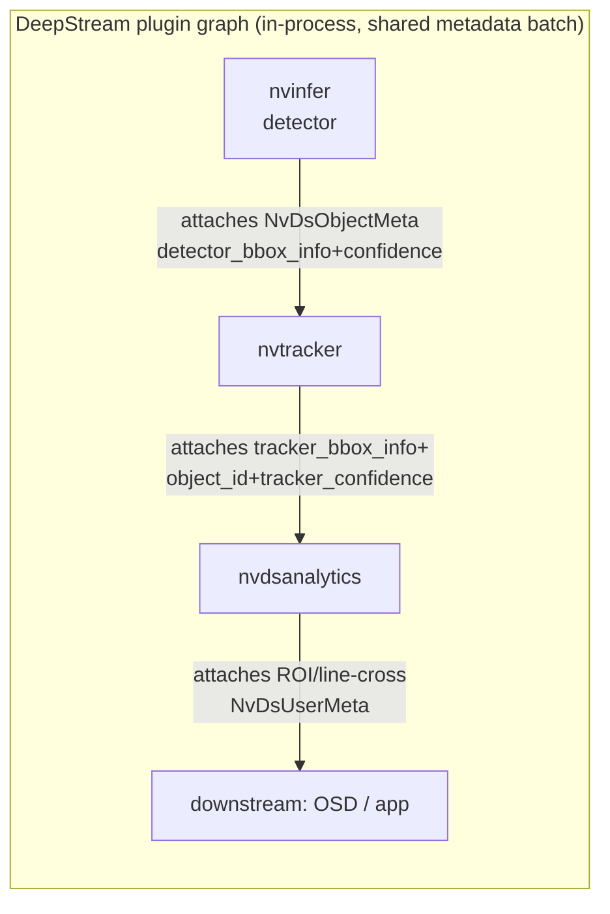

# R5 — Industry analogs: orchestrating detect · track · memory · predict · fuse (web research)

Research wave for the CV orchestration redesign. Web-only survey of mature perception
stacks — robotics message standards, GPU video-analytics SDKs, an open-source NVR, a
defense C2 platform, MOT tracker internals, and NATO/defense tracking-exchange formats —
to extract (1) what a per-object **state record** carries when multiple independent
processes contribute to it, and (2) how those processes are **orchestrated** so each is
independently scalable and debuggable. No product code touched; style follows
`docs/plans/active/asset-flows/R4-industry-practice.md`.

## §1 Object-state schemas in mature systems

**ROS 2 `vision_msgs`.** `Detection2D` = `header` + `results: ObjectHypothesisWithPose[]`
+ `bbox: BoundingBox2D` + `id: string`. The `id` field is explicitly a *tracking* id —
docs note detections of the same real-world object across messages should reuse it, and
it may be empty when no tracker is in the loop (detection-only nodes still speak the same
message). `ObjectHypothesisWithPose` carries **more than one hypothesis** per box: each
hypothesis is a `class_id` + `score` pair plus a 6D `PoseWithCovariance`, i.e. the schema
is multi-hypothesis-for-label by design, not a single flat label string.
[Detection2D.msg](https://github.com/ros-perception/vision_msgs/blob/ros2/vision_msgs/msg/Detection2D.msg),
[ObjectHypothesisWithPose](https://docs.ros.org/en/rolling/p/vision_msgs/msg/ObjectHypothesisWithPose.html)

**NVIDIA DeepStream `NvDsObjectMeta`.** Deliberately keeps **detector output and tracker
output as separate sub-structs on the same object**: `detector_bbox_info` (what the
detector saw this frame) vs. `tracker_bbox_info` (what the tracker currently believes),
plus a third `rect_params` holding whatever the *last* pipeline stage wrote — so a
downstream consumer can always tell "what did detection say" from "what does tracking
say" without recomputing anything. Confidence is likewise split: `confidence` (inference)
vs. `tracker_confidence` (tracker; only NvDCF — the visual correlation tracker — produces
a real value, IOU/SORT/DeepSORT set it to a constant 1.0 because they have no visual
signal to score). `object_id` is `UNTRACKED_OBJECT_ID` when no tracker ran yet.
`unique_component_id` records *which pipeline component* wrote this metadata — the
provenance field. `classifier_meta_list` and `obj_user_meta_list` are open-ended
attachment points so a later stage (secondary classifier, custom analytics) can append
its own evidence without redefining the struct.
[NvDsObjectMeta struct reference](https://docs.nvidia.com/metropolis/deepstream/dev-guide/sdk-api/struct__NvDsObjectMeta.html),
[Gst-nvtracker](https://docs.nvidia.com/metropolis/deepstream/dev-guide/text/DS_plugin_gst-nvtracker.html),
[MetaData in the DeepStream SDK](https://docs.nvidia.com/metropolis/deepstream/dev-guide/text/DS_plugin_metadata.html)

**BoT-SORT / ByteTrack / DeepSORT family (Kalman-filter trackers).** Each track owns a
Kalman `mean`/`covariance` (position + velocity state and its uncertainty — this *is* the
predictor, not a separate module in these libraries), plus lifecycle bookkeeping: `hits`
(consecutive successful associations), `age` (frames since creation), `time_since_update`
(frames since last successful association, reset to 0 on match, incremented every predict
step), and a `state` enum `TENTATIVE → CONFIRMED → DELETED`. A track starts `TENTATIVE`
and needs N consecutive hits to become `CONFIRMED`; once `time_since_update > max_age`
it flips to `DELETED`. This state machine is the formal, reusable answer to "why did this
track die" — every death is one of exactly two causes (never confirmed, or unmatched too
long) and both are counters already on the record.
[SORT/DeepSORT paper](https://arxiv.org/pdf/1703.07402),
[Ultralytics BoT-SORT source](https://github.com/ultralytics/ultralytics/blob/main/ultralytics/trackers/bot_sort.py),
[MOT tracker overview 2026](https://www.forasoft.com/learn/ai-for-video-engineering/articles-ai/multi-object-tracking-deepsort-bytetrack-ocsort)

**Frigate (open-source NVR).** A tracked object's JSON adds operationally-motivated
fields no research tracker bothers with: `stationary` / `motionless_count` (frames in a
near-identical position — a *different* axis from track age, used to suppress "parked
car" spam) and an `active` flag that is the inverse. Frigate explicitly documents using a
Kalman filter "to predict the next location of an object using the historical bounding
boxes" for the frame-to-frame association step — prediction is consumed by association,
not just exposed to the end user. A `path`/trajectory history and a top/median score are
tracked per object for review-worthiness scoring, separate from the live per-frame score.
[Stationary Objects](https://docs.frigate.video/configuration/stationary_objects/),
[Glossary](https://docs.frigate.video/frigate/glossary/)

**Anduril Lattice entity model.** An entity is explicitly "a bag of components you mix
and match," not a fixed struct — `entity_id` (GUID), `is_live`, `expiry_time` (TTL,
≤30 days out — old tracks self-delete rather than accumulate forever), `provenance`
(`integration_name` = which source system asserted this), and `aliases.name`
(human-readable label) are required; a `track` entity then adds location + `milView`
(disposition/environment/nationality — Lattice's label-distribution equivalent for a
military context) as optional components. Change detection is driven by
`provenance.source_update_time`, *not* deep-diffing the payload — cheap staleness/update
logic that the ROS/DeepStream schemas don't need to solve because they're single-process.
Lattice's docs are explicit that "components must not be duplicative," i.e. the schema is
designed so two evidence sources contribute to *different* components of the same entity
rather than overwriting one field.
[Entities overview](https://developer.anduril.com/guides/entities/overview),
[Lattice OS architecture notes](https://philescandon.rbind.io/lattice_os_architecture_guide/)

**STANAG 4676 / AEDP-12 (NATO ISR tracking exchange).** Purpose-built as an
*interoperability* format: a track is a sequence of track-points contributed by possibly
different national/sensor systems, standardized precisely so tracking data can be
exchanged and re-fused across organizational boundaries — the defense-world precedent for
"track is the unit that crosses a process/organization boundary," which is exactly the
Java-app/Python-CV boundary in this platform's case.
[STANAG 4676 overview](https://standards.globalspec.com/std/14474804/stanag-4676),
[NATO ISR tracking standard (IEEE)](https://ieeexplore.ieee.org/document/4567745/)

**MISB ST 0903 (VMTI — Video Moving Target Indicator).** KLV-encoded metadata standard
for what a video analytics stage reports about detected/tracked targets: target count per
frame, per-target pixel bbox, optional geo-location (offset from sensor or full lat/lon),
track id + track history, and confidence. Explicitly scales from "systems producing
thousands of targets" to "systems producing rich detail about a few" and is deliberately
**bandwidth-frugal** — anything the receiver can derive from other fields is left out.
That design principle (derive, don't duplicate, across the wire) is directly relevant to
sizing a per-object wire contract.
[MISB 0903 overview](https://www.impleotv.com/content/misbcore/help/ST903/st903.html)

**ASTERIX Category 062 (Eurocontrol system-track exchange, ATC).** A track record is a
FSPEC-driven set of optional Data Items (e.g. `I062/100` calculated Cartesian position);
only present fields are sent, which is the same "sparse/optional-field wire record"
approach relevant here for evidence that not every object has every fact.
[ASTERIX Cat062 spec](https://www.eurocontrol.int/sites/default/files/service/content/documents/nm/asterix/cat062-asterix-system-track-data-part9-v1.16-20120701.pdf)

### Union table — per-object state fields across systems

| Field | Carried by | Why it exists (consumer need) |
|---|---|---|
| Persistent id (track/entity/object id) | vision_msgs `Detection2D.id`, DeepStream `object_id`, SORT-family track id, Frigate object id, Lattice `entity_id`, STANAG 4676 track id, MISB VMTI track id, ASTERIX track number | The one field every consumer joins on across frames/processes; absence = "not tracked yet" |
| Current bounding box / geometry | all of the above | Where to draw/act now |
| **Separate** detector-bbox vs tracker-bbox | DeepStream (`detector_bbox_info` vs `tracker_bbox_info`) | Lets a debugger see raw evidence vs. filtered belief without recomputation |
| Detection confidence | vision_msgs (`score`), DeepStream `confidence`, MOT trackers (association score), MISB VMTI | Filtering/thresholding, trust weighting |
| Tracker confidence (separate from detector confidence) | DeepStream `tracker_confidence` | Visual trackers (NvDCF) produce independent evidence about association quality; conflating it with detector score hides which stage is uncertain |
| Class/label as **distribution**, not single string | vision_msgs `ObjectHypothesisWithPose[]` (multi-hypothesis), Lattice `milView` classification | Label election is a downstream decision, not a detector fact — keep raw evidence |
| Velocity / motion state | SORT-family Kalman `mean` (incl. velocity terms), Frigate historical-bbox-derived motion, IMM trackers | Needed by prediction and by "is this actually moving" logic (Frigate's stationary flag) |
| Predicted next position/bbox | SORT-family Kalman predict step, Frigate ("predict next location using historical bboxes"), DeepStream past/future frame metadata | Feeds association in the next frame and lets the UI show where the object is *expected* to be if evidence is momentarily missing |
| Kalman mean/covariance (uncertainty) | SORT/BoT-SORT/ByteTrack | Association gating (Mahalanobis distance) and a principled confidence-decay signal, not just a boolean |
| Track lifecycle state (TENTATIVE/CONFIRMED/DELETED) | SORT-family | Turns "why did this track disappear / appear" into a named, queryable state instead of silent array churn |
| hits / age / time_since_update counters | SORT-family | The exact inputs the lifecycle state machine is computed from — debuggable by inspection |
| Stationary / motionless flag + counter | Frigate | Distinguishes "not moving" from "gone," a different concern than track death |
| Path / trajectory history | Frigate `path`, STANAG 4676 track-point sequence, ASTERIX track history | Post-hoc review, "how did it get here," replay |
| Score history (not just current score) | Frigate (median/top score) | Review-worthiness / alerting decisions shouldn't hinge on one noisy frame |
| Geolocation (lat/lon or geo-offset) | MISB VMTI, Lattice `location` component, STANAG 4676 | Fixes the object in world space, not just image space — required once more than one camera/asset can see the same thing |
| Provenance / source identifier | DeepStream `unique_component_id`, Lattice `provenance.integration_name`, STANAG 4676 (multi-sensor exchange) | Attributes each piece of evidence to the process that produced it — mandatory for the "what did each process do" debuggability goal |
| Update/change timestamp | Lattice `provenance.source_update_time`, MISB VMTI, ASTERIX | Cheap staleness check without deep-diffing payloads; also the ordering key for late/out-of-order evidence |
| Expiry / TTL | Lattice `expiry_time`, `is_live` | Self-cleaning record instead of an external reaper needing to know every consumer |
| Extensible/open evidence slot | DeepStream `classifier_meta_list` / `obj_user_meta_list` / `misc_obj_info`, Lattice "components you mix and match" | Lets a new evidence source (e.g. re-identification, geolocation) attach without a schema migration blocking every other producer |
| Mask/segmentation (optional) | DeepStream `mask_params` | Present in systems that support pixel-level evidence beyond a box; optional field, not mandatory |
| Parent/child relationship | DeepStream `parent` pointer | Composite objects (e.g. a detected face inside a detected person) without inventing a second schema |

## §2 Architectural patterns for multi-component perception

| Pattern | Communication | State ownership | Adding a new evidence source | Scaling | Debugging |
|---|---|---|---|---|---|
| **Blackboard** (Hearsay-II lineage) | Shared workspace; producers post partial findings, a control component decides who acts next | Blackboard itself owns state; knowledge sources are stateless readers/writers | Add a new knowledge source that reads/writes the shared board — no other source needs to change | Knowledge sources run independently, but the shared board is a coordination point that must scale with them | Inspect the board's history — every posted partial result is visible, ordered |
| **DeepStream plugin graph** | In-process GStreamer buffer pass-through; each plugin mutates/extends a shared `NvDsBatchMeta` attached to the batch | Metadata batch is shared mutable state, passed by reference through the pipeline | New stage = new plugin inserted in the graph, reading upstream meta and attaching its own `NvDsUserMeta`/`NvDsClassifierMeta` — existing stages untouched | Pipeline scales as one process per stream (or batched across streams); stages inside one pipeline are not independently scaled | `NvDsUserMeta` lists let a probe attached anywhere in the graph read what any upstream stage wrote, per object per frame |
| **Evidence + track-level fusion / multi-hypothesis (MHT/JPDA)** | Each sensor/tracker runs independently and emits *tracks*, not raw detections; a fusion stage associates and merges tracks-to-tracks | Each source owns its own track state; fusion owns only the merged/global track | New evidence source = one more track-producer feeding the fusion stage's association step — no change to existing sources | Sources scale independently (different sensors, different cadences); fusion is the one place that must see all of them | Track-to-track association decisions and per-source contributing tracks are individually inspectable before fusion |
| **ROS 2 node graph (topics) / composition (containers)** | Pub/sub over DDS between processes, *or* intra-process pointer-pass when nodes are composed into one container — a deploy-time choice, not a code choice | Each node owns its own state; nothing is shared except what's published | New node subscribes to existing topics and publishes its own — no existing node changes | Nodes can be separate processes (fault isolation, independent scaling) or composed into one process (near-zero-latency) — same code either way | `ros2 bag record`/replay captures every topic for offline reconstruction of "what did each node see and emit" |
| **Flink/Beam keyed-stream operators** | Message stream partitioned by key (e.g. track id); each parallel operator instance owns exactly the keys routed to it | State is embedded per-key in the operator instance — "state partition = one key," updates are local, no locking | New operator = a new stage in the DAG keyed the same way; existing operators don't change | Scales by adding parallel instances; Flink repartitions keys across them automatically | Per-key state is inspectable/queryable (state backends support point lookups); replay from a checkpoint reproduces exact history |
| **Actor-per-track** | Each track is a long-lived actor with a mailbox; evidence messages are sent to the actor owning that track id | The actor *is* the state owner — no external store needed for hot state | New evidence source just sends messages to existing track actors (or spawns new ones) | Actors distribute across a cluster; a supervisor handles actor lifecycle/failure | Actor mailbox/event log per track id is a natural per-object audit trail |
| **Lattice entity/sensor fusion** | Each integration publishes CREATE/UPDATE/DELETE entity events independently; Lattice does not deep-merge payloads, it processes per-source lifecycle events and composes them via non-duplicative components | Each integration owns its components; the platform owns entity identity/expiry | New integration = new `provenance.integration_name` publishing its own components on an entity | Integrations (sensors) scale independently; local microservices "filter, detect, fuse, prioritize" before only useful artifacts are reported centrally, keeping the fan-in cheap | `provenance.source_update_time` per component tells you which source last touched which fact, when |

Sources: [Blackboard architecture overview](https://callsphere.ai/blog/blackboard-architecture-multi-agent-systems-shared-knowledge-spaces),
[Gst-nvdsanalytics](https://docs.nvidia.com/metropolis/deepstream/dev-guide/text/DS_plugin_gst-nvdsanalytics.html),
[Track-to-track fusion intro](https://www.mathworks.com/help/fusion/ug/introduction-to-track-to-track-fusion.html),
[Multiple hypothesis correlation in track fusion](https://link.springer.com/chapter/10.1007/0-387-32942-0_12),
[ROS 2 Composition docs](https://docs.ros.org/en/rolling/Concepts/Intermediate/About-Composition.html),
[Foxglove on ROS 2 composable nodes](https://foxglove.dev/blog/ros-2-composable-nodes),
[Flink stateful stream processing](https://nightlies.apache.org/flink/flink-docs-stable/docs/concepts/stateful-stream-processing/),
[Actor systems as scalability architecture](https://volodymyrpavlyshyn.medium.com/actors-actor-systems-as-massively-distributed-scalability-architecture-5e40f5ea9e86),
[Distributed object tracking across many-camera network (actor-ish dataflow)](https://arxiv.org/pdf/1902.05577),
[Lattice entities overview](https://developer.anduril.com/guides/entities/overview)

**Kalman/IMM as a separable prediction step.** Research MOT trackers fold prediction
*into* the tracker (the Kalman `mean`/`covariance` above), but IMM (Interacting Multiple
Model) literature treats motion-model selection as its own concern: several motion models
(constant velocity, constant acceleration, constant turn rate) run in parallel, each
producing a prediction, and a separate weighting step combines them by how well each
model's residual matches recent evidence — the architectural point being that "which
motion model applies" is itself a decision made from evidence, not a hardcoded filter
choice, and can live as its own contributing process rather than buried inside
association.
[IMM-MOT paper](https://arxiv.org/pdf/2502.09672),
[MATLAB trackingIMM](https://www.mathworks.com/help/fusion/ref/trackingimm.html)

**Ego-motion compensation as a distinct stage.** Multiple pipelines (mobile-robot and
UAV literature) run ego-motion estimation (visual odometry, optical-flow-based, or
IMU/GNSS-fused) as a stage *before* motion-based object detection/tracking, then warp or
subtract the estimated camera motion so "independently moving" can be computed cleanly —
i.e. ego-motion compensation is evidence contributed by its own process, consumed by
detection/tracking, not an implicit correction inside the tracker.
[Ego-motion compensated moving object detection](https://link.springer.com/chapter/10.1007/978-3-319-07467-2_31),
[Decoupling ego-motion from target dynamics for UAV](https://arxiv.org/html/2605.22605)

## §3 Observability / debug in perception pipelines

- **DeepStream `NvDsUserMeta`** is the SDK's built-in per-object, per-frame provenance
  channel: any plugin can attach arbitrary metadata to `frame_user_meta_list` or
  `obj_user_meta_list`, and a probe placed anywhere downstream iterates that list to see
  exactly what an upstream stage did to a given object in a given frame — this is the
  direct analog of "what did each process do and what was its result," already solved at
  SDK level for a single-process pipeline.
  [MetaData in the DeepStream SDK](https://docs.nvidia.com/metropolis/deepstream/dev-guide/text/DS_plugin_metadata.html)
- **OpenTelemetry per-stage spans** for video/AI pipelines exist as a documented pattern:
  frame-level spans correlated across GPU inference, transport, and rendering stages, with
  per-stage latency broken out rather than one end-to-end number — the general-purpose
  distributed-tracing answer to the same "what did each process do" question when
  processes are genuinely separate (not one shared-memory pipeline).
  [OpenTelemetry for AI video pipelines](https://github.com/arnabdeypolimi/video_ai_telemetry),
  [OpenTelemetry tracing API](https://opentelemetry.io/docs/specs/otel/trace/api/)
- **ROS 2 bag replay** is the standard "reproduce exactly what happened" tool: every
  topic (so every node's inputs and outputs) is recorded and can be replayed through the
  same or a different node graph offline — decouples debugging from live hardware/streams
  entirely.
  [ROS 2 Composition](https://docs.ros.org/en/rolling/Concepts/Intermediate/About-Composition.html)
- **Frigate's live debug view** overlays motion boxes (red) and detection regions
  (green) directly on the live stream, but is explicitly *live-only* — it has no
  after-the-fact replay of a past event's per-stage decisions, a real limitation worth
  noting rather than copying.
  [Frigate glossary / debug view discussion](https://docs.frigate.video/frigate/glossary/)
- **TrackEval / py-motmetrics** formalize "why did this track die/fragment" into named,
  computable metrics rather than free-text explanations: **ID switches** (reported
  identity of a ground-truth track changes — merge or fragmentation), **fragmentation**
  (a track's status flips tracked→untracked without ending), **MOTA** (aggregate of false
  positives/negatives/id-switches), **IDF1** (identity precision/recall harmonic mean),
  **Mostly-Tracked/Mostly-Lost** (percentage of a track's lifespan correctly labeled).
  These aren't live-debugging tools, but they are the standard vocabulary for describing
  tracking failure classes after the fact, and mapping the platform's own "why did this
  track die" explanations onto this vocabulary (rather than inventing new terms) buys
  interoperability with existing MOT tooling if evaluation is ever needed.
  [TrackEval](https://github.com/JonathonLuiten/TrackEval),
  [py-motmetrics](https://github.com/cheind/py-motmetrics),
  [Tracker KPI intro](https://medium.com/digital-engineering-centific/introduction-to-tracker-kpi-6aed380dd688)
- **The SORT-family lifecycle state machine itself is a debug artifact "for free":**
  because `state`/`hits`/`age`/`time_since_update` are explicit fields (not implicit
  control flow), "why did this track die" reduces to reading two counters against two
  thresholds — no separate observability system needed if the wire contract already
  carries them (ties directly into the §1 union table).
  [SORT/DeepSORT paper](https://arxiv.org/pdf/1703.07402)

## §4 Scaling patterns

| Pattern | How it works | Where it fits |
|---|---|---|
| **Shared model server + dynamic batching (Triton)** | Triton's dynamic batcher combines concurrent inference requests from multiple streams into one batch to raise GPU throughput; `max_queue_delay_microseconds` bounds how long it waits to fill a batch; sequence batching keeps per-stream state affinity for stateful models across calls | The detector: stateless per-frame inference scales best behind a shared batching server rather than one model instance per stream |
| **Sequence batching / session affinity for stateful models** | Triton's sequence batcher keeps all requests for a given sequence (stream) routed to the same model instance, with `max_sequence_idle_microseconds` controlling when an idle stream's slot is reclaimed | Anything stateful per-stream (e.g. a tracker that keeps history) that still needs to run *inside* a shared server rather than one instance per stream |
| **Stateless-service / stateful-service split with sticky routing** | Stateless stages (detection, embedding/feature extraction, formatting) scale horizontally behind a plain load balancer; stateful stages (holding a running track set) require session affinity so repeat calls land on the instance holding that state, with an external cache (e.g. Redis) for rehydration if that instance dies | Maps directly onto detector-as-stateless-worker-pool vs. tracker/memory-as-stateful-worker-pinned-per-stream |
| **GPU model server + CPU tracker workers** | Established DeepStream/Triton split: the GPU-bound stage (detection/classification inference) is centralized on GPU hardware; CPU-bound stages (Kalman-filter tracking, association, analytics) run as separate lighter-weight workers that consume the GPU stage's output | Matches "detection is the GPU-expensive stateless stage, everything else is comparatively cheap CPU state" — a natural axis for where to put a process boundary |
| **One process (or GStreamer pipeline) per stream vs. shared server** | DeepStream historically batches multiple streams through one pipeline instance for GPU efficiency; ROS 2 composition makes "one process per node" vs. "many nodes composed into one process" an explicit *deploy-time* choice, not a code-level one | Argues for keeping worker boundaries as a configuration/deployment decision, not something hardcoded into how a component is written |

Sources: [Triton dynamic batching](https://docs.nvidia.com/deeplearning/triton-inference-server/user-guide/docs/user_guide/batcher.html),
[Triton multistream / sequence batching for AR/VFX SDKs](https://docs.nvidia.com/maxine/triton/latest/Design/DesignServer.html),
[Stateless vs stateful worker session affinity](https://www.runpod.io/blog/engineering-realities-production-ai-agents),
[ROS 2 Composition — deploy-time process layout choice](https://docs.ros.org/en/rolling/Concepts/Intermediate/About-Composition.html)

## §5 Operator intent → config simplification

| Product | Operator act | What gets auto-decided |
|---|---|---|
| **DJI ActiveTrack/Spotlight** | Draw a box around the subject once | Which detector class applies, association across frames, camera-yaw-vs-gimbal split (manual yaw is disabled while Spotlight tracks, gimbal stays operator-adjustable for framing) |
| **Skydio Shadow/Scout** | Select "follow this subject" | Continuous visual lock, motion prediction through brief occlusion by "analyzing speed, direction, and visual appearance," obstacle avoidance, flight path — the entire prediction/re-acquisition loop is invisible to the operator |
| **Frigate** | Draw zones + set `required_zones` per object type, pick objects-of-interest list | Which detections become "tracked objects" at all (zone-gated), which become "alerts" vs "detections" review category, false-positive suppression from sky/irrelevant regions |
| **Axis Object Analytics + Genetec** | Pick a scenario template (e.g. "line crossing," "object in area") and rename it something meaningful | Object classification (human/vehicle/bike/etc. via a fixed built-in model), the analytics rule evaluation, event generation wired into the VMS |
| **Anduril Lattice / Sentry** | Supervise a map-centric dashboard; system auto-classifies and tracks "objects of interest" and suggests tasking | Detection, classification, cross-sensor fusion into one entity, threat prioritization, suggested actions — explicit design goal of single operator overseeing many autonomous systems |

Common shape across all five: **the operator names an outcome or region ("track this,"
"alert on that zone," "this class matters"), never a pipeline stage or algorithm choice**
— model selection, association, motion prediction, and re-acquisition are always fully
automatic and invisible.
[DJI Spotlight tracking guide](https://a-drones.com/news/dji-mini-5-pro-focus-track-user-guide-poi-spotlight-and-activetrack/),
[Skydio Shadow/autonomy](https://www.skydio.com/skydio-autonomy),
[Skydio Scout](https://dronedj.com/2022/09/01/skydio-scout-drone-subject-tracking/),
[Frigate zones](https://docs.frigate.video/configuration/zones/),
[Frigate review](https://docs.frigate.video/configuration/review/),
[AXIS Object Analytics manual](https://help.axis.com/en-us/axis-object-analytics),
[Anduril Sentry](https://www.anduril.com/sentry),
[Anduril Lattice C2](https://www.anduril.com/lattice/command-and-control)

## What transfers to a 2-process (Java app + Python CV) platform

1. **Split detector-bbox from tracker-bbox from predicted-bbox as three distinct fields
   on the wire, not one overwritten box** (DeepStream §1). This alone buys most of the
   per-stage debuggability goal without any tracing infrastructure — a consumer can see
   what each stage produced by reading three fields on one record.
2. **Adopt the SORT-family lifecycle state machine verbatim**
   (`TENTATIVE`/`CONFIRMED`/`DELETED` + `hits`/`age`/`time_since_update`) as the identity
   component of the wire contract. "Why did this track die" becomes a pure function of
   two counters instead of a bespoke explanation string per code path (§1, §3).
3. **Carry label as a small distribution (top-N class_id+score pairs), not a single
   string**, mirroring `vision_msgs` — label election then genuinely becomes the
   aggregator's job, and a debugger can see the raw classifier evidence a downstream
   election overrode.
4. **Put a provenance field on every evidence contribution, not just on the aggregated
   record** — `unique_component_id` (DeepStream) / `provenance.integration_name`
   (Lattice). With detection, association, memory/re-ID, prediction, ego-motion, and
   label election as separate contributing processes, "which process asserted this fact"
   is exactly the debuggability the owner asked for, and it's cheap: one string field per
   evidence message.
5. **Make prediction a first-class contributing process, not a hidden step inside
   tracking** — the Kalman `mean`/`covariance` is normally buried inside the tracker, but
   IMM literature and this platform's own goals argue for pulling it out: a
   prediction/motion-model process that reads current+past state and emits a predicted
   next position is independently scalable, testable against ground truth, and swappable
   (constant-velocity today, IMM later) without touching association or memory.
6. **Treat the aggregator as a track-to-track fusion stage, not a per-field merge.**
   Rather than "aggregator picks the newest confidence," model each contributing process
   as emitting its own partial track/evidence, and let the aggregator do explicit
   association + fusion (§2's evidence+fusion pattern) — this is what makes "add a new
   evidence source" (e.g. geolocation, re-ID) additive instead of a change to every
   existing producer, matching CLAUDE.md's ban on ad-hoc collaborators.
7. **Key state by track id and give each contributing process its own owned partition of
   state**, the Flink-keyed-stream / actor-per-track pattern (§2). Concretely: the
   association/tracking process owns Kalman state; the memory/re-ID process owns its own
   embedding history; neither reaches into the other's state — they only exchange
   evidence messages keyed by track id. This is what makes "scale as separate
   workers/processes" real rather than aspirational, since no process needs a lock on
   another's internal state.
8. **Split GPU-bound stateless detection from CPU-bound stateful tracking/memory as the
   primary process boundary** (§4) — detection is the one stage that benefits from a
   shared batching server (Triton-style) across many streams; tracking/memory/prediction
   are comparatively cheap per-stream state that scale better as one worker per stream
   (or per small stream group) with session affinity, not behind a shared batcher.
9. **Give every contributing evidence message a timestamp/update-time field and use it
   for staleness, not deep comparison** (Lattice's `provenance.source_update_time`) — with
   several async processes contributing evidence at different cadences (ego-motion every
   frame, re-ID every few frames, geolocation on demand), the aggregator needs a cheap
   "is this fact still current" check per field, not a full-record diff.
10. **Reduce operator-facing config to intent, and push everything from §5's "auto-decided"
    column onto the orchestration layer.** The current owner ask — detection, association,
    memory, prediction, ego-motion, label election, geolocation as separate parts — should
    stay entirely internal; the operator-visible surface should collapse to something like
    "track this," "alert on this class/zone," matching DJI/Skydio/Frigate/Anduril, not a
    knob per pipeline stage.

## Open questions for the architect

- **Wire cadence:** DeepStream/Frigate/SORT-family all assume the whole record is
  recomputed every frame in one process. Once detection, association, memory, prediction,
  ego-motion, and label election are separate processes with potentially different
  cadences, does the aggregator emit a coalesced record every frame (waiting for whichever
  evidence is fresh), or does it emit-on-any-update and let the Java app do its own
  coalescing? This determines whether `provenance.source_update_time` staleness logic
  lives in Python or Java.
- **Association ownership boundary:** in DeepStream, nvtracker does both association
  *and* state-holding; in the actor/Flink patterns those can be split (one process
  proposes track↔detection matches as evidence, another process is the sole writer of
  track state). Does this platform want tracking/association itself decomposed into two
  processes, or is "association+state" one atomic worker and only detection/memory/
  prediction/ego-motion/label-election/geolocation are pulled out around it?
- **Multi-hypothesis label election policy:** `vision_msgs` and Lattice both carry a
  label *distribution*, but neither standard specifies the election algorithm (max-score,
  temporal voting, confidence-weighted). Should election be a pluggable strategy the
  aggregator runs, or its own contributing process like the others (so its reasoning is
  independently inspectable via provenance)?
- **What counts as "track death" across a multi-process boundary?** The SORT state
  machine (`time_since_update > max_age`) assumes one process observes every frame. If
  association and memory run at different cadences, whose `time_since_update` counter is
  authoritative for the wire contract's lifecycle field — is death a fused decision the
  aggregator computes from multiple processes' opinions, or does one process (association)
  stay the sole owner of lifecycle state with the rest treated as attached evidence?
- **Cross-camera / cross-asset re-identification scope:** none of the single-camera
  patterns above (DeepStream, Frigate, SORT-family) address re-identifying the same
  object across multiple drones/fixed cameras — that's closer to Lattice's multi-source
  entity aggregation or STANAG 4676's multi-sensor track exchange. Is that in scope for
  this orchestration redesign, or deferred (in which case the memory/re-ID process should
  be scoped per-stream now but built so a future cross-stream fusion stage can consume its
  output)?
