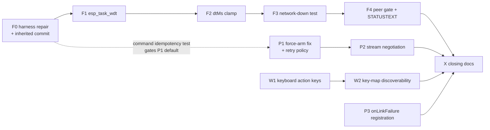

# O1 — MAVLINK-COMMANDS synthesis

**Agent:** Opus (O1, module-level flow) · **Date:** 2026-09-01 · **Branch:** `feat/mavlink-command-control`
**Inputs:** [R1 command catalog](R1-command-catalog.md) · [R2 manual control](R2-manual-control.md) · [R3 codebase inventory](R3-codebase-inventory.md) · [R4 firmware audit](R4-firmware-audit.md) · [task context](../MAVLINK-COMMANDS-CONTEXT.md)
**Status:** decision-ready. Part 2's waves are a *draft* — Fable freezes them into `MAVLINK-COMMANDS-PLAN.md`.

This document decides; it does not implement. Every decision names the report that grounds it and,
where the research was wrong about our own code, says so.

---

## 0. What the research got wrong about us (read first)

Three claims in the brief and the reports do not survive contact with the code. Correcting them
shrinks the effort materially.

| Claim | Reality | Evidence |
|---|---|---|
| "The platform should send the full Rover mode table" | **Already done.** `FlightModes.ARDUPILOT_ROVER` carries all 14 entries (0,1,3,4,5,6,7,8,9,10,11,12,15,16), `customModeFor` resolves name→number, and `selectableModes` already feeds the web mode picker through `FlightCapability`. Nothing to build. One honest trim remains: it offers `Initialising` (16), a boot transient nothing should ever be commanded into. | `FlightModes.java:76-80,143,155+`; `MavlinkFlightCommander.capabilities:279` |
| R3 §1a: "param2 = 21196 (ArduPilot force-**arm** magic)" | **Wrong, and it is a live defect.** `ARM_DISARM_FORCE = 21196f` is used on *both* paths. Per R1 §2.1, 2989 is force-arm and 21196 is force-**dis**arm; ArduPilot mishandles 21196-on-arm as a silent force-arm that bypasses *every* pre-arm check instead of rejecting it (ArduPilot #32996, #26521). Our force-arm therefore works only via a firmware bug, and does so in its most dangerous form. | `MavlinkFlightCommander.java:89,177-179` vs R1 §2.1 |
| The inherited `esc_arm_tune.py` is a live field tool | **Dead.** It drives `EscArmingConfig`, which no longer exists anywhere in the firmware tree (`grep -rl EscArming ~/Arduino/ardupoilot-start/` → empty). It was orphaned by the same TB6612 rewrite that broke `motor_test`. | R3 §5e; verified this pass |

---

## Part 1 — Decisions

### D1 — Keyboard and gamepad both ride the existing `RC_CHANNELS_OVERRIDE` stream. **R2 confirmed.**

No parallel `MANUAL_CONTROL` sender. Keyboard, gamepad and the on-screen pads stay three
`RcSourceKind`s behind one `RcSource` seam, all producing `axes()`/`buttons()` for the same
`ManualControlClient` → `/ws/manual-control` → `DefaultManualControlService` → `ManualControlPort` →
`MavlinkManualControlSender` → mavlink-core `ManualControlService` path, at 33 Hz clamped [10,50],
with the existing 3-frame release burst on disengage.

> **Rationale.** R2 §6 recommends this and R3 §3a shows the seam is not merely available but already
> carrying the keyboard: `KeyboardRcInputService` (281 lines) exists, maps W/S→throttle and
> A/D→yaw-or-steering by *control function* rather than axis index, ramps over `RAMP_MS=250` at
> `TICK_MS=16`, and releases on `blur`/`visibilitychange`. Adding `MANUAL_CONTROL` would buy nothing
> — R2 §1a shows it reaches the same rover channels only *via* ArduPilot's `RCMAP_*` indirection,
> which is strictly less predictable than addressing channel 1 and channel 3 by number — while
> costing a second stream feeding one `RC_OVERRIDE_TIME` clock with precedence ArduPilot does not
> document (R2 §2). It would also strand the release-sentinel asymmetry that mavlink-core's
> `RcChannels.wireValue` already solves (0 releases channels 1–8; 65534 releases 9–18; 0 in the
> extension block means *ignore*) — a defect class FLEET-RADIO F3/F4 already paid for once.

**R2's own open question, answered:** the fixed-rate loop stays **client-side** (send-on-arrival plus
a keepalive backstop bounded by `keepaliveIntervalMs(rateHz)`), not moved to the backend. RC-LATENCY
measured send-on-arrival at ~9 ms against ~39 ms for a polled loop; the server-side deadman watchdog
already exists independently, so the browser tab going quiet between key transitions is a failure the
server catches either way. Moving the loop server-side would trade a measured 30 ms for a theoretical
tidiness gain.

### D2 — One-shot command surface: retry policy, new commands, ack honesty

**D2a — Retries: replace zero-retry with a bounded, configured budget.**
`MavlinkFlightCommander`'s `NO_RETRIES` becomes `vision.mavlink.command-retries` (**default 2**, i.e.
3 attempts), and `vision.mavlink.ack-timeout` is re-scoped from *the* wait to the *per-attempt* wait
at **700 ms**. Worst case 2.1 s — inside today's single 2 s wait, so no operator-visible latency
regression, but three chances on a lossy link instead of one. `CommandService` already increments
`confirmation` per attempt (its javadoc, `sendLong`), so the vehicle can tell a retransmit from a
fresh command; nothing new is needed in mavlink-core.

**Retry eligibility rule (freeze this):** only *absolute-state* commands retry. `COMPONENT_ARM_DISARM`
(param1 is a state, not a toggle), `DO_SET_MODE`, `DO_AUX_FUNCTION` (level is absolute), the Hold-mode
e-stop and, later, `DO_REPOSITION` all qualify — sending any of them twice is indistinguishable from
sending it once. Any future MAV_CMD whose effect is relative or incremental declares itself
non-retryable at its call site. This is the rule, not the list.

> **Rationale.** R1 §1.3: the spec deliberately does not codify numbers, saying only "resend with an
> incremented `confirmation` ... a flight-specific number of times"; the mission protocol's own
> codified 1500 ms / 5 retries is the nearest reference point, and QGC retries. R3 §6 flags zero-retry
> as a gap precisely for this effort's use case: "a missed arm command is a bad experience" when the
> operator triggered it from a key rather than a button they are watching. The zero-retry choice was
> never a safety argument — `MavlinkFlightCommander`'s javadoc says plainly it existed "to preserve
> this class's pre-existing SITL-proven wire behaviour ... byte-for-byte, not to adopt a new retry
> policy as a side effect of the library swap." That preservation goal is discharged; the policy can
> now be chosen on its merits.

**Coupling:** the firmware must be provably idempotent under a repeated `COMMAND_LONG` with a rising
`confirmation` before the default flips above 0. `command_verify.py` does not test this today. F0 adds
that case; P1's default of 2 is gated on it being green. An operator who wants today's behaviour back
sets `command-retries: 0` — the config exists for exactly that.

**D2b — Force-arm magic: `2989` on arm, `21196` on disarm.** Split the single `ARM_DISARM_FORCE`
constant in two. See §0. This is the highest-value single line in the whole effort: today a
"force arm" from this platform reaches the vehicle only through an acknowledged ArduPilot bug, and
lands as the checks-bypassing variant rather than being refused.

**D2c — New commands the platform should send.**

| Command | Verdict | Why |
|---|---|---|
| `DO_SET_MODE` (176), full rover table | **Already shipped.** Trim `Initialising` from `selectableModes` and stop. | §0 |
| `REQUEST_MESSAGE` (512) | **Add a platform caller.** One-shot `AUTOPILOT_VERSION` request on peer claim, replacing `capabilities()`'s "report whatever happened to arrive" with an actual probe. | R1 §3.1 phase 2 (this is what every GCS does at connect); R3 §6 lists the missing caller; R4 §1a proves the firmware answers it, including the honest refusal-before-telemetry-exists case |
| `SET_MESSAGE_INTERVAL` (511) | **Add a platform caller.** Request the streams the cockpit actually reads, at rates from configuration. | Same. R1 §6: refusing to negotiate makes half a GCS's instruments blank with no error — we are currently the GCS that never asks |
| `DO_REPOSITION` (192) — click-to-go | **Defer, out of this effort.** | It needs GUIDED plus a position estimate. The ESP32 rover has no GPS and correctly refuses RTL with "RTL unavailable: no GPS fitted" (R4 §5). R1 §5 also records ArduPilot Rover 4.6.3 answering `DENIED` to `DO_REPOSITION`, so even the real-firmware path wants a `SET_POSITION_TARGET_GLOBAL_INT` fallback designed in. Both are reasons to do this when navigation exists, not now |
| `MISSION_*` family | **Out of scope** — MISSIONS-PLAN owns it | R3 §6 |
| `NAV_TAKEOFF`/`NAV_LAND`/`PREFLIGHT_CALIBRATION` | **Never, for a rover** | R1 §2.4/§2.5 mark them drone-only or interactive-only |

**D2d — How ACK outcomes reach the operator.** The honest-outcome path already exists and works:
`ACCEPTED` green, `NO_ACK` amber ("no response"), `DENIED`/`UNSUPPORTED` as their own tones, wired
through `flight-command-panel-logic.ts`, `readiness-logic.ts` and `ControlActionDispatcher`, which
explicitly refuses to fold `NO_ACK` into success. **The rule this effort adds is therefore a routing
rule, not a new mechanism: every keyboard- or controller-triggered command goes through
`ControlActionDispatcher` → `VisionApi` → toast, exactly as a bound switch does. No key gets a
fire-and-forget path.** A keyboard arm that silently no-acks is then impossible by construction — it
produces the same amber toast a clicked arm would, and the retry budget from D2a makes it rarer.

> **Deliberately deferred:** attaching the vehicle's own `STATUSTEXT` explanation to a `DENIED`
> outcome. The firmware already sends the human-readable reason ("mode unsupported: no navigation
> fitted") and R4 §5 rightly calls it the operator's best diagnostic — but plumbing it costs a domain
> record change in vision-flight, an adapter fill, an API DTO and a web binding: four modules and four
> agents for one string, when the toast already distinguishes *refused* from *unheard*. Recorded as a
> follow-on, not a wave.

### D3 — Controller/keyboard operation contract

**Axes — unchanged, already correct.** W/S throttle, A/D steering-or-yaw (resolved per the vehicle's
own binding, not hardcoded), arrows for pitch/roll on a two-pad layout or as one-pad redundancy;
ramped over 250 ms; per *function* not per key, so W+↑ do not ramp twice as fast and W+S cancel.

**Action keys — new, and they enter the existing dispatcher rather than a new command path.**

| Key | Action | Fire policy |
|---|---|---|
| `Space` | `EMERGENCY_STOP` (→ Hold mode, never disarm) | **Immediate on keydown**, auto-repeat suppressed |
| `Shift`+`Enter` | `TOGGLE_ARM`, resolved against **live telemetry** `armed()`, never remembered client state | **Hold 600 ms** (`DANGEROUS_HOLD_MS`) |
| `1`–`4` | `SET_MODE` to the first four modes the vehicle itself reports in `selectableModes` | Immediate, **unless** the action catalogue already marks that mode dangerous — then hold |

> **Rationale.** E-stop fires instantly because an accidental e-stop *is* the safe outcome — a rover
> that stops when nobody meant it to has failed safe, so friction here buys nothing and costs the one
> reaction time that matters (CLAUDE.md §9). Arm gets the same 600 ms hold a bound switch gets, for
> the reason `control-action-dispatcher.ts` already argues in prose: "long enough that a knocked
> switch does not arm an aircraft, short enough that a deliberate flick-and-hold still feels like a
> control." R2 §6 explicitly rejects copying the RC-world rudder-arm stick gesture — that convention
> exists because a bare transmitter has no spare channel, which is a hardware constraint, not a UX
> target. Mode keys read modes from the vehicle rather than a hardcoded list, so a copter and a rover
> get their own; danger classification reuses `ControlActionRules.dangerous` rather than inventing a
> second taxonomy.

**Held-key-set polling.** Axes stay on the existing 16 ms tick over a held-key `Set` — never off
`keydown` auto-repeat, whose ~500 ms delay and OS-configurable rate would make throttle response
unrepeatable across machines (R2 §3). Action keys are **edge-triggered**, not polled; their 600 ms
hold reuses `ControlActionDispatcher`'s existing `holdKey`/`holdSince` state machine by feeding it
key state as it already consumes switch positions. That inheritance is the point: hold-to-fire,
fire-on-arrival suppression, one-command-in-flight and the outcome toast all come for free, and the
keyboard cannot drift from the switch behaviour later.

**Focus loss is neutral — and now also cancels.** `blur`/`visibilitychange(hidden)` already empty the
axis held-key set. Extend it to **clear any in-progress action-key hold**, closing the case where a
`keyup` is lost to the blur and a re-focus completes a 600 ms arm the operator abandoned. `blur` is
the keyboard's analogue of a joystick unplugging (R2 §3) and is the single most important safety
property of a keyboard control surface. `isTypingTarget()` guards action keys as it already guards
axis keys — `1`–`4` must not switch modes while someone types in a form.

**Expo/deadzone: client-side, once.** Shaping lives in `control-surface-logic.ts`; the firmware does
clamping and slew-limiting only and gains no expo parameter. R2 §5: applying a curve on both sides
compounds into something neither layer predicts, so pick one layer — and the GCS is the layer that
knows what the operator is holding.

### D4 — Firmware hardening order. **R4 §6 confirmed, with one split and one interaction flagged.**

| # | Wave | Why here |
|---|---|---|
| 1 | **Harness repair** — and it is *two* repairs, not one | R4 finding 2 is correct that this is CRITICAL and first, but understates it: `session_test` merely fails to *compile* (a fake overriding removed `armEsc`/`cancelEscArming`), while `motor_test` fails to *build at all* — its Make target names `HBridgeMotorDriver.cpp`, deleted in the TB6612 rewrite, and its 60-line preamble describes a superseded ESC-hybrid architecture. That is a rewrite against the current `IMotorDriver`, not a patch. The module it covers is the one whose bugs burn hardware (the 2026-08-23 L298N death). Nothing else in this track may ship first: any motor or session change before this is unverified by the exact suite built to catch its failure modes. |
| 2 | **`esp_task_wdt`** | R4 finding 1. LEDC PWM and the GPIO direction/STBY registers are autonomous hardware — a hung `loop()` leaves the bridge driving at its last command indefinitely, with no software path back. No amount of state-machine correctness reaches past a stopped CPU. |
| 3 | **`dtMs` clamp** to `2 * controlPeriodMs` | R4 finding 3. One line, and it closes the path by which any stall >0.7 s lets the *next* `apply()` ramp straight to full demand — reachable today on the very first tick after the 13 s boot delay. |
| 4 | **Network-down regression test** | R4 finding 5. Two independently-maintained failsafe clocks currently happen to agree. Converting that from an inference into a proven invariant is only possible once (1) lands, since the test's natural home is `session_test`. |
| 5 | **Learned-peer command gate + TX-failure `STATUSTEXT`** | R4 finding 4's cheap half plus §5's observability gap. Once a peer is learned, refuse *command* frames from a different source address — closing "a second device on the LAN claiming sysid 255 drives the rover" without touching the protocol. Reply/telemetry re-learning stays as-is, because `link_test` asserts a DHCP move must still be followed. Separately, promote both TX-failure escalations from Serial-only to `STATUSTEXT`: "the link looks fine but nothing is getting through" is the state an untethered operator has no other way to see. |

**Interaction R4 did not flag:** finding 1's watchdog and finding 9's 13-second blocking boot collide.
Registering `esp_task_wdt` in `setup()` *before* the `delay(10000)` block would reset the board on every
boot. F1 must register at the **end** of `setup()` (after `network.begin()`/`controller.begin()`) and
feed once per `loop()`, or subsume finding 9. Say so in the plan; a coding agent will otherwise write
the textbook version and brick the boot.

**Cut line — in this effort:** the five above.
**Out, by decision:** MAVLink 2 signing (finding 4's standards-track half — needs the app side too, so
it is its own effort); `String`→`snprintf` heap churn (6); parameter persistence (7 — R4 itself judges
the trade-off defensible, so it earns a comment line, not code); 13 s boot (9, unless F1 subsumes it);
`Serial.println` blocking (10); per-poll datagram flood cap (§2a); wiring WiFi RSSI into
`VehicleTelemetry.linkRssiDbm` as an LQ-analogue trend (R4 §4 — genuinely nearly free and genuinely
useful, and still not safety, so it goes next, not now).

**Not agent-closable:** F1's real verification is deliberately hanging `loop()` with the rover armed and
confirming a reset rather than a freeze. That is bench work on powered hardware — an operator step, and
the plan must say so rather than letting a wave claim green on a host build.

### D5 — The inherited uncommitted wave: commit it, but only behind a green gate

Commit as **two** commits inside F0, in this order:

1. `drone-link/mavlink-core/DefaultPeerDirectory.java` (the address-flap warning) — its own module, its
   own gate `./mvnw -B -pl drone-link/mavlink-core -am test`, already green, unrelated to the harness.
2. The rover-sim set — `command_test.cpp` / `command_fixture.py` / `command_verify.py`, `link_test.cpp`,
   `shim/IPAddress.h`, the Makefile/README/motor/session/wire edits — **together with the harness
   repair**, as one commit, gated on `make check` running all six targets green.

> **Rationale.** Splitting differently was tempting: commit the inherited work first to preserve the
> authorship boundary, repair after. Rejected — it would land a commit that leaves `make check` red,
> and this repo's whole delegation model rests on "every task ends with its scoped build green"
> (CLAUDE.md). A red gate that is known-red stops being a gate. Bundling the repair with the work is
> also more honest about what happened: the command-surface wave was written against a harness that
> did not build, and the commit should read that way.

**And delete `esc_arm_tune.py` rather than committing it.** It tunes `EscArmingConfig`, which no longer
exists in the firmware (§0). Committing it would enshrine a tool that cannot work, and it is the same
tool R3 §5e flags for transiently hijacking the rover's telemetry destination — a hazard we are
otherwise closing in F4. Deleting it removes the hazard and the dead code in one move.

---

## Part 2 — Wave structure draft

**Firmware waves are strictly serial — this is a constraint, not a preference.** The sketch lives at
`~/Arduino/ardupoilot-start/`, **outside the git repo**: no branch, no worktree, no rollback, no way to
isolate two agents editing it. One firmware agent at a time, F0 → F1 → F2 → F3 → F4. Tracks P and W are
inside the repo and parallelise freely against F and against each other, subject to the notes below.

| Wave | Agent | File scope (disjoint) | Build gate | Depends on |
|---|---|---|---|---|
| **F0** Harness repair + inherited commit | general-purpose (firmware) | `infra/rover-sim/{Makefile,motor_test.cpp,session_test.cpp,session_fixture.py,command_verify.py,README.md}`, delete `esc_arm_tune.py`; commit the inherited untracked set; separately commit `drone-link/mavlink-core/.../DefaultPeerDirectory.java` | `cd infra/rover-sim && make check` — **all six** targets build and pass; plus `./mvnw -B -pl drone-link/mavlink-core -am test` for the second commit | — |
| **F1** `esp_task_wdt` | general-purpose (firmware) | `~/Arduino/.../ardupoilot-start.ino`; a host shim for `esp_task_wdt_*` under `infra/rover-sim/shim/` | `make check` | F0 |
| **F2** `dtMs` clamp | general-purpose (firmware) | `~/Arduino/.../VehicleController.cpp`; a new case in `infra/rover-sim/motor_test.cpp` | `make check` | F0 (needs the rewritten motor_test), F1 (serial) |
| **F3** Network-down regression | general-purpose (firmware) | `infra/rover-sim/{session_test.cpp,session_fixture.py}`; one comment at `MavlinkUdpLink.cpp:202` | `make check` | F0, F2 (serial) |
| **F4** Learned-peer command gate + TX `STATUSTEXT` | general-purpose (firmware) | `~/Arduino/.../MavlinkUdpLink.{cpp,h}`; `infra/rover-sim/link_test.cpp`; firmware `README.md` | `make check` | F0, F3 (serial) |
| **P1** Force-arm fix + retry/ack policy + `selectableModes` trim | adapter-builder | `drone-link/mavlink/.../MavlinkFlightCommander.java`, `FlightModes.java`, `MavlinkSettings` (owns any new key), their tests; `station/vision-app/src/main/resources/application.yaml` mavlink block; `drone-link/mavlink/MODULE.md` | `./mvnw -B -pl drone-link/mavlink -am test` | — (default `command-retries: 2` gated on F0's idempotency case) |
| **P2** `REQUEST_MESSAGE`/`SET_MESSAGE_INTERVAL` caller | adapter-builder | new `drone-link/mavlink/.../MavlinkStreamNegotiator.java` + test; the claim/identify wiring point; `drone-link/mavlink/MODULE.md` | `./mvnw -B -pl drone-link/mavlink -am test` | P1 (shares `MavlinkSettings`; P1 owns it) |
| **P3** `onLinkFailure` registration | spring-integrator | `station/vision-app` wiring + test | `./mvnw -B -pl station/vision-app -am test` (**needs Docker**) | — (parallel with everything) |
| **W1** Keyboard action keys | web-ui | `station/vision-web/src/app/core/rc/{keyboard-rc-input.service.ts,control-action-dispatcher.ts,control-action-logic.ts}` + new `keyboard-action-logic.ts` + specs | `npm run test:ci` (**never bare `npx vitest run`**) | — |
| **W2** Key-map discoverability | web-ui | the Controller drawer / transmitter view components + specs | `npm run test:ci` | W1 |
| **X** Closing docs | general-purpose | `docs/plans/README.md` status row, `MAVLINK-COMMANDS-CONTEXT.md`, plan status | none (docs) | F4, P2, W2, P3 |

**Can run in parallel:** F-track (one agent, serial internally) ‖ P1 ‖ W1 ‖ P3. Then P2 after P1, W2
after W1. Nothing in P or W touches `infra/rover-sim/` or the firmware tree; nothing in F touches Java
or TypeScript.

**Per-wave MODULE.md is a gate condition, not a wave.** CLAUDE.md requires the doc update inside the
task that changes the module, so each wave above closes its own `MODULE.md`. Wave X exists only for the
cross-cutting plan-status rows.

**Sizing note for whoever freezes this:** F0 is the largest single wave (a `motor_test` rewrite against
a state machine whose bugs burn hardware). If it needs splitting, split it as F0a `session_test` +
Makefile + inherited commit, F0b `motor_test` rewrite — but F0b must still precede F2.

---

## Part 3 — Open questions for the user

1. **May the keyboard arm the rover at all, or is arm click-only?** D3 proposes `Shift`+`Enter` held
   600 ms. R2 §6 argues a web GCS should prefer an explicit UI control over gesture-arming, and the
   counter-argument is real: an operator whose hands are on WASD should not have to find the mouse to
   arm. This is a safety preference, cheap to reverse, and yours. (If yes: is `Shift`+`Enter` the
   binding you want?)
2. **Should the ESP32 sketch be vendored into this repo** (e.g. `firmware/rover-esp32/`)? Today it lives
   at `~/Arduino/ardupoilot-start/` with no branch, no worktree and no rollback, which is why every
   firmware wave above must run serially and why F1's mistake would be un-revertable. Vendoring it would
   let F1–F4 run like any other track. It also changes where firmware edits happen for every future
   effort, so it is a structural call, not a wave decision.
3. **Confirm the retry default flip.** D2a changes what a real vehicle sees: one `COMMAND_LONG` becomes
   up to three with a rising `confirmation`. F0 proves our own firmware handles that idempotently before
   the default moves off 0, and `command-retries: 0` restores today's behaviour — but this is wire
   behaviour toward hardware, which is your gate by standing rule.

*(Operator-gated real-hardware TX and F1's bench hang-test remain gated as already established — not
re-asked here.)*
