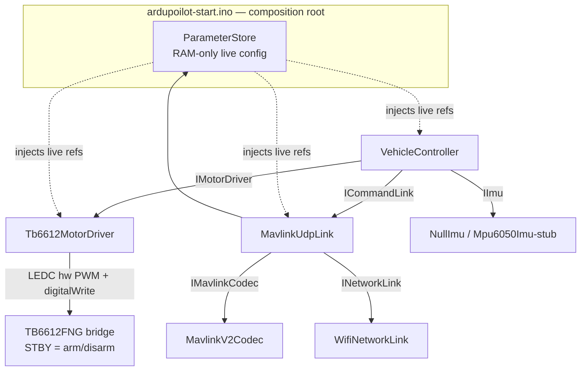

# R4 — ESP32 rover firmware: reliability/safety audit

Scope: `~/Arduino/ardupoilot-start/` (~4.5k lines, read in full), cross-checked against
`infra/rover-sim/` (README + attempted builds of all five `make` targets). Web research on
ArduPilot Rover failsafes, ExpressLRS/EdgeTX RC practice, ESP32 firmware practice, and hobby
ESC/motor safety conventions is cited inline where it grounds a recommendation.

All firmware evidence is `file:line` against the sketch outside this repo; all rover-sim
evidence is `file:line` inside `infra/rover-sim/`.

---

## 1. Architecture



`loop()` (`ardupoilot-start.ino:97-110`) does, every iteration, unthrottled:

1. `network.poll()` — WiFi association/reconnect (event-driven + a timed retry).
2. `controller.loop(nowMs)` (`VehicleController.cpp:75-125`), in order:
   `link_.poll()` → drain the UDP socket byte-by-byte through `MavlinkV2Codec`, dispatch
   `RC_CHANNELS_OVERRIDE` / `COMMAND_LONG` / `PARAM_*` → `imu_.update()` (no-op, no gyro
   fitted) → `link_.takeCommand()` → `evaluateFailsafe()` → on an arm/disarm edge,
   `motors_.enable()`/`disable()` (STBY pin) → every `controlPeriodMs` (20 ms), either
   `motors_.stop()` (failsafe or disarmed) or `motors_.apply(throttle, steering, dtMs)` →
   `link_.publishTelemetry()` (nine unsolicited MAVLink streams, individually rate-limited).
3. Status LED reflects `LinkState` (solid = commands flowing, blink = network-up-no-commands,
   off = no network).

Config is split in two: `Config.cpp` (compiled-in defaults, read-only) and `ParameterStore`
(a **RAM-only** working copy every module binds to; a `PARAM_SET` writes through it and takes
effect on the next tick, with no persistence and no reflash). There is no scheduler, no RTOS
task split visible to the sketch (Arduino core's `loopTask` runs everything on one core), and
no watchdog anywhere in the source tree.

### 1a. `infra/rover-sim/` regression coverage — what actually runs today

Each `make` target compiles **the sketch's own `.cpp` files** for the host (only `Arduino.h`
and `WiFiUDP` are shimmed), so a green run is a real statement about the flashed firmware, not
about a reimplementation of it. Verified live during this audit (commands in the Appendix):

| Target | Checks | Status (this audit) |
|---|---|---|
| `make wire` | Codec + all nine payload builders, byte-for-byte against `pymavlink` (`robust_parsing=False`) | **PASS** — 11 datagrams, 28 assertions, all green |
| `make commands` | Everything the app can *ask for*: param protocol, `REQUEST_MESSAGE`, `SET_MESSAGE_INTERVAL`, `DO_AUX_FUNCTION`, the mode table, `AUTOPILOT_VERSION` | **PASS** — 10 acks, 32 `PARAM_VALUE`s over 32 parameters, all green |
| `make link` | Reply addressing (`learnPeer`), transmit-failure escalation (socket rebind, radio reconnect) | **PASS** — all 9 checks green |
| `make motors` | The reversal state machine's dead-time + speed-scaled coast, against captured LEDC writes — "the only [test] here whose bug burns hardware rather than failing a request" (`infra/rover-sim/README.md:54-55`) | **BUILD FAILURE** — target references `HBridgeMotorDriver.cpp`, which no longer exists in the firmware tree (superseded by `Tb6612MotorDriver`) |
| `make session` | The arm/session watchdog lifecycle: cold arm with no stream, drive, stall, re-arm, RC5 interlock | **BUILD FAILURE** — `FakeMotors` implements `armEsc()`/`cancelEscArming()`, removed from `IMotorDriver` |

Net effect: the wire format, the parameter/command surface, and link-layer recovery are all
under live, passing regression coverage. **The two modules with a documented history of
burning hardware or stranding the operator — the motor state machine and the arm watchdog —
currently have none.** This is a materially larger gap than "session_test.cpp doesn't compile":
`motor_test.cpp` doesn't even reach a compile error, because its build target names a `.cpp`
file that was deleted when the motor stage was rewritten from an ESC-hybrid design to the
current dual-TB6612FNG-channel one. See finding 2.

---

## 2. Findings, ranked

| # | Severity | Area | Evidence | Failure scenario | Fix pattern (established practice) |
|---|---|---|---|---|---|
| 1 | **CRITICAL** | Watchdog / hang recovery | No `esp_task_wdt`/hardware-WDT call anywhere in the tree (grep across every `.cpp`/`.h`/`.ino` found only diagnostic strings for `esp_reset_reason()` in `ardupoilot-start.ino:64-77`, never a WDT init/feed). `Tb6612MotorDriver::setPwm()` (`Tb6612MotorDriver.cpp:41`) drives the motor through `ledcWrite()` — ESP32 LEDC is a free-running hardware peripheral that keeps outputting the last-programmed duty **autonomously of the CPU**; `setDirection()` (`Tb6612MotorDriver.cpp:34-38`) uses `digitalWrite()`, whose GPIO output register likewise holds its level without CPU involvement. | If `loop()` hangs (I2C stall once the IMU is fitted, a wedged lwIP/WiFi internal lock, any future blocking call) while armed and driving, the PWM duty, direction pins **and** the STBY "arm" line all freeze at their last values and the bridge keeps driving at that exact command **indefinitely** — there is no automatic path back to a safe state, only an external power cut. This is the single biggest gap between "the state machine is provably correct" (it is, see §3) and "the vehicle is safe to trust with real current." | ESP-IDF `esp_task_wdt_init()` + `esp_task_wdt_add(NULL)` in `setup()`, one `esp_task_wdt_reset()` per `loop()` iteration, sized so a genuine hang reboots within a few seconds — this is exactly what ESP32 firmware practice recommends the Arduino loop task register for once it does anything beyond trivial polling ("if your main task runs longer than `CONFIG_ESP_TASK_WDT_TIMEOUT_S` (5 s default) without resetting the WDT, add it explicitly"). ArduPilot's own autopilot core carries an equivalent hardware/software watchdog for exactly this class of failure. Verify by deliberately hanging `loop()` behind a debug flag with the rover armed and confirming the reset actually happens and the bridge lands in the boot-safe state (`Config.cpp:29-30`'s pull-down guarantee), not a free-running one. |
| 2 | **CRITICAL** | Test-harness drift on the two safety-critical modules | `make motors` fails to even build: `make: *** Нет правила для сборки цели «/home/vladte/Arduino/ardupoilot-start/HBridgeMotorDriver.cpp»` (target file no longer exists — verified by `ls`/`grep`). `motor_test.cpp:1-60` and `Makefile:44` both reference a **superseded ESC-hybrid** driver (`cfg.esc.frequencyHz`, `cfg.pins.throttleSignal` — "throttle is a single-pin bidirectional ESC, steering is a bare L298N leg") that predates the current firmware's dual-TB6612FNG-channel rewrite. `make session` fails to compile: `session_test.cpp:50: error: 'void {anonymous}::FakeMotors::armEsc(uint32_t)' marked 'override', but does not override` and the same for `cancelEscArming()` at line 51 — `IMotorDriver.h` (current) has no such virtuals. Both failures reproduced live in this audit. `make wire`, `make commands`, `make link` all build and **pass** cleanly (also reproduced live). | The regression suite cannot currently prove the reversal state machine still enforces its one invariant (dead-time + speed-scaled coast, the exact defect that killed the previous L298N on 2026-08-23 per `README.md:49-50`), nor that the arm/session watchdog still holds the two historical bugs it was written to pin down (an arm that cancels itself, an oscillating failsafe/cleared loop — both named in `infra/rover-sim/README.md:81-84`). Any future change to `Tb6612MotorDriver` or `VehicleController`'s session logic ships **unverified** by the harness that exists specifically to catch exactly those two classes of bug. | Rewrite `motor_test.cpp` and `session_test.cpp`'s `FakeMotors`/harness against the current `IMotorDriver` contract (`begin/apply/stop/enable/disable/enabled/appliedThrottle/appliedSteering/estimatedSpeedMps`, no ESC-arm methods) before any further motor-stage or session-logic change ships. Treat `make check` (all five targets) as the merge gate, not the three that happen to still compile. |
| 3 | **HIGH** | Ramp/slew-limit bypass via unbounded `dtMs` | `Tb6612MotorDriver::ramp()` (`Tb6612MotorDriver.cpp:123-136`) computes `maxStep = rate * (dtMs/1000.0f)` with no ceiling on `dtMs`. `VehicleController::loop()` (`VehicleController.cpp:111-113`) derives `dtMs = nowMs - lastControlMs_` with no clamp either. | Any stall longer than ~0.7 s (`1.0f / accelPerSecond`, `Config.cpp:64`) makes the *next* `apply()` call ramp straight to full demand in a single step — precisely the "current into a stalled/slow armature" scenario the ramp exists to prevent (`Config.cpp:61-64`'s own comment). Concretely reachable at: the very first control tick after boot (13 s of `delay()` in `setup()`, `ardupoilot-start.ino:84-93`, inflates the first `dtMs` to ~13000), any future I2C stall once the IMU is wired up, or a near-recovery from the hang in finding 1. | Clamp `dtMs` to a small ceiling (e.g. `2 * controlPeriodMs`) at the one point it is computed, the way a flight-stack bounds its own `dt` before feeding a rate limiter — this is a one-line fix with an outsized payoff given finding 1. |
| 4 | **HIGH** | No source authentication / no replay protection on the control channel | `MavlinkUdpLink::handleFrame()` (`MavlinkUdpLink.cpp:284-286`) accepts any UDP datagram from **any source IP** whose decoded MAVLink `systemId` equals the compile-time constant 255 (`config_.gcsSystemId`) — a public, standard GCS sysid, not a secret. `learnPeer()` (`MavlinkUdpLink.cpp:761-775`) then adopts whichever source *last* sent such a frame as the reply/telemetry destination — so a second device on the same WiFi claiming sysid 255 can both command the rover and hijack where its telemetry goes. `RC_CHANNELS_OVERRIDE` carries no timestamp/sequence the firmware validates for staleness (the codec's `seq` field is only checked for framing continuity, `MavlinkV2Codec.cpp`, never for replay). | A captured "full throttle forward" datagram, replayed onto the same LAN by anything, is processed exactly like a fresh operator command. Deployment-dependent risk: this rover runs on a shared home/venue WiFi, not a dedicated point-to-point RF link the way ExpressLRS/a real RC transmitter does. | This is standard, expected behaviour for **unsigned** MAVLink 2 and matches ArduPilot's own out-of-the-box posture, so it is not a defect relative to the reference implementation — flagged because the deployment (shared WiFi) is a materially different threat model than a dedicated RC link. `MavlinkV2Codec.cpp:194-198` already has the `INCOMPAT_SIGNED` bit wired up, currently only to *reject* signed frames (`README.md:379-381` confirms signing is explicitly unimplemented) — turning it on once the app side supports MAVLink 2 signing is the standards-track fix. A cheaper partial mitigation: once `peerLearned_` is true, stop accepting command frames from a *different* source IP than the learned peer, closing the "second transmitter on the LAN" hijack without touching the protocol. |
| 5 | MEDIUM | Network-down path skips the immediate MAVLink-level failsafe write | `MavlinkUdpLink::poll()` (`MavlinkUdpLink.cpp:202-209`) returns immediately when `!network_.connected()`, **before** reaching the "stream stalled → centre demand, keep arm" block (lines 211-225) — so `pending_`/`hasPending_` are never refreshed while WiFi is down. Traced independently: `VehicleController::evaluateFailsafe()` (`VehicleController.cpp:26-57`) polls `link_.sinceLastCommandMs(nowMs)`, which keeps advancing off `lastCommandMs_` regardless of `poll()`'s early return — so the controller *does* still trip failsafe and call `motors_.stop()` within `commandTimeoutMs` (500 ms) of the last received frame, via its own independent clock. | Not an unguarded gap in practice — verified by tracing both clocks — but it is a fragile invariant: two independently-maintained failsafe signals that happen to agree, with **no automated test exercising the network-down case specifically** (the natural home for such a test, `session_test.cpp`, does not currently compile — finding 2). | Once the harness is repaired, add a regression case for "WiFi drops entirely while armed and driving" so the two-clock agreement becomes a proven invariant rather than an inference from reading the code. Consider a one-line comment at `MavlinkUdpLink.cpp:202` documenting that the *controller's* clock, not this one, is what actually catches a network-down failsafe — the current comments explain the mechanism but not that this specific block is redundant for that case. |
| 6 | MEDIUM | Heap allocation (`String`) on WiFi/UDP diagnostic paths | `WifiNetworkLink::localAddress()` (`WifiNetworkLink.cpp:147`) and `MavlinkUdpLink::peerText()` (`MavlinkUdpLink.cpp:746`) each construct an Arduino `String` from `IPAddress::toString()`. Confirmed to be the *only* heap use in the codebase — every other buffer (`LogThrottle`, `ParameterStore::entries_`, `MavlinkV2Codec::rxBuffer_`, the STATUSTEXT/reply rings) is fixed-size, and `grep` for `new`/`malloc`/`calloc` across the tree returns only comment matches. | Both call sites are throttled/rare in practice (`peerText()` only fires inside `txFailThrottle_`-gated error branches; `localAddress()` is diagnostic logging), so not a hot-path risk — but on a device meant to run unattended for weeks, unbounded-lifetime `String` heap churn with no other allocator activity to characterize it is a slow fragmentation source with no test coverage. | Replace with a fixed-size `snprintf("%u.%u.%u.%u", …)` built from `IPAddress`'s own byte accessors — matches the rigor already applied to every other buffer in the same file (`Notification`/`PendingReply` rings). |
| 7 | MEDIUM | No parameter persistence — confirm as an intentional trade-off, not a silent gap | `ParameterStore` (`ParameterStore.h/.cpp`) holds a pure-RAM working copy of `AppConfig`; zero NVS/`Preferences`/EEPROM usage anywhere (grep-confirmed). Every `PARAM_SET` (including `RVR_MAX_THR` and the reversal timings) is lost on **any** reset, including a BROWNOUT restart the firmware itself explicitly diagnoses (`ardupoilot-start.ino:73`). `README.md:200-203` states this is deliberate: "a bad value is one power cycle from gone." | No flash-wear/corruption class of bug exists here (there is nothing to corrupt) — but an operator who lowers a limit (e.g. `RVR_MAX_THR`) mid-session for safety gets the compiled-in default back, silently, after any reset, including one caused by the very motor current the tuning was meant to tame. | No code change required — the trade-off is defensible and matches "the compiled default is always known-good." Add one line next to `RVR_MAX_THR` et al. in `ParameterStore.cpp` making the operational implication explicit ("a live-lowered ceiling does not survive a reset; lower it in `Config.cpp` if it must persist"), since the current comments explain only the mechanism. |
| 8 | LOW | Doc/code drift on the starting throttle ceiling | `README.md:318` — "Raise `drive.maxThrottle` from its conservative 0.80 once tested" — vs `Config.cpp:53` — `maxThrottle = 0.60f`. | A first-time bench operator following the doc literally is not put at risk (the code ships *more* conservative than the doc claims), but the audit brief specifically asked to check README claims against code, and this one line does not match. | One-line README fix. |
| 9 | LOW | 13-second fully-blocking boot sequence | `ardupoilot-start.ino:84-93` — `delay(10000)` then three more `delay(1000)`s before `network.begin()`/`controller.begin()`. | Not unsafe by itself (nothing is armed yet, STBY is asleep by hardware pull-down per finding-adjacent good-practice item below) but is a long silent window for a battery rover to sit unresponsive, and interacts with finding 3 (huge first `dtMs`). | Shorten or make non-blocking if the boot-to-ready latency ever matters operationally; low priority. |
| 10 | LOW | `Serial.println()` could theoretically block | `SerialLogger.cpp:45` — no heap (`char message[160]`/`char line[224]` are stack buffers, `SerialLogger.cpp:38,41`), but a hardware-UART TX buffer that fills with no host draining it stalls the call. | Low-probability, bounded stall on a hardware UART (not native USB CDC on the classic WROOM-32 this firmware targets) — not elevated to MEDIUM. | No action; noted for completeness per the audit's "blocking calls in the control path" ask. |

---

## 2a. Input-hardening checklist (explicit, per the audit brief)

| Threat | Verdict | Evidence |
|---|---|---|
| Malformed / truncated MAVLink frame | **Handled.** Resync-on-any-byte parser; a truncated or corrupt frame costs at most one dropped frame, no desync. | `MavlinkV2Codec.cpp:98-231`, esp. `finishFrame()` at 186-231 |
| Oversized payload (length byte lying) | **Handled, buffer-exact.** `MAX_PAYLOAD_LEN=255` matches the wire format's own 1-byte length ceiling; `rxBuffer_[255]` cannot overflow for any value the length byte can hold. | `MavlinkProtocol.h:27`, `MavlinkV2Codec.h:52`, `MavlinkV2Codec.cpp:165-172` |
| Packet floods | **Bounded, not defended.** The receive loop drains every queued datagram per `poll()` tick (`MavlinkUdpLink.cpp:229-242`) with no per-tick cap and no rate limiting on inbound processing — a flood would consume CPU proportional to packets received before `drainReplies()`/telemetry get a turn, though outbound queues (`REPLY_QUEUE=32`, `NOTIFY_QUEUE=4`) are bounded so a flood cannot grow memory, only starve the tick. On a WiFi LAN (not a metered RF link) this is a plausible nuisance vector, not presently mitigated. Low priority relative to findings 1-4 given the deployment (trusted local network), but worth a bounded per-poll datagram cap if the rover is ever exposed beyond that. |
| sysid spoofing | **Not defended — matches MAVLink/ArduPilot norm.** Any source claiming `systemId==255` is honoured; no signing, no IP allowlist until a peer is learned. See finding 4. | `MavlinkUdpLink.cpp:284-286` |
| compid spoofing | **N/A as a distinct vector.** Inbound frames are gated on `frame.systemId` only (`handleFrame`, line 286); per-message target-system/target-component checks (`addressedToUs()`, `MavlinkUdpLink.cpp:303-310`) accept component 0 (broadcast) or the exact configured `componentId` — this is the standard MAVLink broadcast convention, not a hole distinct from the sysid-spoofing exposure already covered in finding 4. |
| Replay of a stale command | **Not defended — see finding 4.** No timestamp/monotonic-sequence check on `RC_CHANNELS_OVERRIDE` beyond the codec's own framing `seq` (continuity only, not replay detection). | `MavlinkUdpLink.cpp:344-439` |
| Motors move while disarmed | **Defended twice, independently.** `Tb6612MotorDriver::apply()` (`Tb6612MotorDriver.cpp:310-316`) forces `stop()` whenever `!enabled_`, regardless of what it is asked to do; `VehicleController::loop()` (`VehicleController.cpp:115-119`) separately never calls `apply()` at all unless `!failsafe_ && command_.armed`. Both gates would have to fail for an output to reach the pins while disarmed. |
| Race between arm and first demand | **Defended.** `Tb6612MotorDriver::enable()` (`Tb6612MotorDriver.cpp:80-88`) wakes STBY with both axis state machines already parked at `Idle`/`Coasting` (LOW/LOW, PWM 0) — "nothing moves until the first `apply()` with a real demand." On the MAVLink side, a disarmed vehicle's `pending_` throttle/steering are explicitly zeroed (`MavlinkUdpLink.cpp:418-421`) so a stale stick position cannot be latent behind the arm edge. |
| Boot state — pins defined LOW before `setup()`? | **Defended by hardware, not just firmware order.** Every TB6612FNG logic input (STBY included) carries a 200 kΩ internal pull-down per the datasheet, so ESP32 pins floating during the boot sequence — before `Tb6612MotorDriver::begin()` explicitly drives STBY LOW at `Tb6612MotorDriver.cpp:47-48` — leave the bridge asleep regardless. Firmware order is still correct (STBY forced LOW first, direction pins next, `begin()` lines 44-63) but the pull-down is the actual backstop. | `Config.cpp:29-30` (comment), `Tb6612MotorDriver.cpp:44-63` |
| Brownout restart mid-drive → resulting state | **Falls back to boot-safe, but silently loses any live tuning.** A brownout reset re-runs `setup()` from scratch: STBY forced LOW again before anything else (`Tb6612MotorDriver.cpp:47-48`), `ParameterStore` reseeds from the compiled `Config.cpp` defaults (finding 7) — so the rover comes back disarmed with default limits, never mid-drive. The one operational wrinkle is finding 7: any `PARAM_SET` tuning in effect before the brownout (e.g. a lowered `RVR_MAX_THR`) is gone, not restored. | `ardupoilot-start.ino:73` (reset-reason diagnosis), `ParameterStore.cpp:36-37` |

---

## 3. What's already GOOD — must not regress

- **STBY-as-arm-line hardware interlock.** The TB6612FNG's single STBY pin gates *both*
  channels to Hi-Z; `disable()` calls `stop()` first, then drops STBY
  (`Tb6612MotorDriver.cpp:90-96`). "A disarmed rover has the bridge asleep, and no software
  fault can move it" (`Tb6612MotorDriver.h:15-16`) is verified true given the wiring, not
  just an aspirational comment.
- **The reversal state machine** — Idle → Settling → Driving → Braking → Coasting → DeadTime
  (`Tb6612MotorDriver.cpp:160-282`), with independently-configurable electrical dead-time and
  a speed-scaled mechanical coast. This is the exact mechanism that replaced the design which
  killed the previous L298N (`README.md:49-50, 59`) — and per finding 2, it is currently the
  single highest-priority thing to get back under regression coverage, not to touch blind.
- **Boot-safety reasoning already documented in `Config.cpp:19-30`**: every TB6612FNG logic
  input, STBY included, has a 200 kΩ internal pull-down, so ESP32 pins floating during boot
  leave the bridge asleep regardless of firmware state; every strapping-pin/ADC2/JTAG-burst
  pin was checked individually against the actual pin assignment (e.g. GPIO13, used for
  `steerIn2`, was confirmed clear of the boot-time PWM burst that GPIO14/15 emit).
- **Two-signal failsafe design.** `sinceLastCommandMs()` vs `controlStreamLost()`
  (`ICommandLink.h:27-51`) correctly distinguish "no stream has ever arrived" from "a stream
  that was flowing and died" — a real, non-obvious correctness property (verified by tracing
  through `evaluateFailsafe()` and `handleRcOverride()`'s RELEASE-burst handling) that a naive
  rewrite would likely flatten back into a single timestamp and reintroduce the two historical
  bugs `infra/rover-sim/README.md:81-84` names.
- **MAVLink codec buffer bounds are exactly correct, not merely lucky.**
  `MAX_PAYLOAD_LEN = 255` (`MavlinkProtocol.h:27`) matches the wire format's own 1-byte length
  field maximum, and `rxBuffer_[255]` (`MavlinkV2Codec.h:52`) is sized to match — no overflow
  is reachable for any attacker-controlled length byte (`MavlinkV2Codec.cpp:165-172`).
- **Resync-on-any-byte, CRC-validated, signed-frame-rejecting parser**
  (`MavlinkV2Codec.cpp:98-231`). A corrupt, truncated, or malformed frame costs at most one
  dropped frame and never desyncs the parser; `finishFrame()` drops anything without a known
  `CRC_EXTRA` seed rather than guessing at validity (`MavlinkV2Codec.cpp:200-209`).
- **`LogThrottle` discipline** applied consistently at every hot-path/bursty log site
  (`LogThrottle.h`, six-plus call sites), with suppressed-count reporting rather than silent
  thinning — keeps the 50 Hz control loop off the UART's critical path.
- **Fixed-size, drop-counted reply/notification rings** (`REPLY_QUEUE = 32`,
  `NOTIFY_QUEUE = 4`, `MavlinkUdpLink.h:246-270`) — no unbounded growth, no heap, on the
  actual command/telemetry path.
- **Honest "unknown" telemetry sentinels** rather than fabricated zeros for unfitted sensors
  (GPS, battery, IMU) — directly relevant to the observability question below, and explicitly
  defended in `ParameterStore.cpp:44-53`.
- **Arm-switch power-on interlock + disarm-clears-demand**
  (`README.md:242-253`, `MavlinkUdpLink.cpp:388-404, 415-421`) — mirrors real-transmitter
  behaviour (matches the ExpressLRS/hobby-ESC convention of "the receiver must see a valid
  neutral/arm sequence before output is live," see §4). Covered by the currently-broken
  session harness (finding 2) — must be **re-verified**, not re-derived from scratch, once
  the harness is fixed.

---

## 4. Web research — established practice this firmware should keep stealing from

**ArduPilot Rover failsafes.** `FS_TIMEOUT` (default 1 s) triggers when the RC link is lost;
`FS_ACTION` chooses RTL/Hold/SmartRTL/Disarm; `FS_THR_ENABLE` gates the throttle failsafe on a
PWM threshold; GCS failsafe fires when heartbeats stop for `FS_TIMEOUT` seconds; `FS_CRASH_CHECK`
independently detects an unexpected stop while in an autonomous mode and Holds (optionally
disarms). `ARMING_CHECK` runs a suite of pre-arm checks (sensor health, calibration, parameter
storage integrity) and can be selectively or fully skipped via `ARMING_SKIPCHK`.
([Rover Failsafes](https://ardupilot.org/rover/docs/rover-failsafes.html),
[Pre-Arm Safety Checks](https://ardupilot.org/rover/docs/common-prearm-safety-checks.html))
This firmware's own GCS-failsafe analogue (the 500 ms command-stream watchdog) is faster than
ArduPilot's 1 s default and correctly modelled as "Hold, not Disarm" — matching `FS_ACTION=2`,
the right choice for a vehicle with no position estimate to RTL against (this decision is
already documented in the firmware as deliberate, `README.md:289-302`). What ArduPilot has that
this firmware does not: a pre-arm check suite (finding 1's watchdog absence and finding 2's
harness rot are exactly the kind of thing a "storage/self-test healthy" pre-arm check would
catch before every flight) and `FS_CRASH_CHECK`'s crash detection — not directly portable
without odometry, but worth remembering once the IMU is fitted (a rover that is armed,
commanded to drive, and reports zero yaw-rate/accel change for an extended period is a good
proxy).

**ExpressLRS / EdgeTX RC-link practice.** Failsafe is configured explicitly as either
*last-position/hold* or *cut-to-preset*, and link quality (LQ — percentage of packets actually
received) is treated as the primary at-a-glance health metric, more informative than raw RSSI;
guidance is roughly LQ > 90 = healthy, < 70 = degraded, < 50 = failsafe imminent, and the
protocol adaptively drops packet rate as range increases.
([LQ/RSSI explained](https://oscarliang.com/lq-rssi/)) This firmware's RC path (`RC_CHANNELS_OVERRIDE`
over MAVLink/WiFi rather than a dedicated RF link) has no equivalent graduated-degradation
signal — it is binary (Connected/Stale) rather than reporting a trend the operator could react
to before the 500 ms cliff. `t.linkRssiDbm` (`Types.h:53`) exists in `VehicleTelemetry` but is
hardcoded to 0 in `VehicleController::snapshot()` (`VehicleController.cpp:70`, "filled by the
link adapter, which owns the radio") — Wi-Fi RSSI (`WifiNetworkLink::rssiDbm()` already exists
and is used in `sendRcChannels()`'s `rssiToMavlink()`) is a reasonable stand-in for LQ and is
already computed; wiring it into `VehicleTelemetry.linkRssiDbm` so `HEARTBEAT`/`RC_CHANNELS`
consistently expose it would give the operator the same early-warning trend ExpressLRS provides,
essentially free.

**ESP32 firmware practice.** `esp_task_wdt` should be explicitly registered for any task doing
more than trivial polling (default TWDT timeout 5 s); the brownout detector trips at ~2.43 V
VDD, commonly mitigated with bulk + decoupling capacitance near the module rather than in
firmware; WiFi reconnect should be event-driven with exponential backoff rather than a blocking
loop.
([ESP32 Watchdog Timer](https://zbotic.in/esp32-watchdog-timer-recover-from-crashed-iot-firmware/),
[Brownout troubleshooting](https://zbotic.in/esp32-troubleshooting-boot-loop-brownout-and-flash-fix/))
This firmware already does the WiFi half well — `WifiNetworkLink` is event-driven
(`ARDUINO_EVENT_WIFI_STA_DISCONNECTED`/`GOT_IP`/`LOST_IP`, `WifiNetworkLink.cpp:46-59`) with a
non-blocking timed retry (`WifiNetworkLink.cpp:82-119`), not a blocking loop — but has zero of
the watchdog half (finding 1) and no software mitigation for brownout beyond diagnosing it after
the fact (`ardupoilot-start.ino:73`, which is honest and useful, but reactive).

**Hobby ESC/motor safety conventions.** A well-behaved ESC refuses to spin until it has seen a
valid neutral-throttle signal at power-up (the "arming sequence"), and a lost-signal failsafe
reverts throttle to 0% within a bounded guard time (commonly ~200 ms–1.5 s in modern RC
receivers).
([Betaflight Failsafe](https://betaflight.com/docs/wiki/guides/current/Failsafe)) This
firmware's RC5 arm-switch power-on interlock (§3, "must be seen low once before it can arm") and
500 ms command-stream failsafe both land squarely inside these norms — the interlock is the same
shape as "ESC must see neutral before it accepts throttle," and the failsafe timeout is inside
the commonly-cited guard-time range. Where this firmware differs from a typical ESC by design,
and defensibly so: it centres-and-holds-arm on stream loss rather than cutting to zero-and-disarm
(`README.md:413-430`) — the firmware's own stated reasoning (a dropped packet and a released
stick are indistinguishable, so treating loss as the destructive case trains operators to ignore
the arm state) is a genuine, considered trade-off against the more common convention, not an
oversight.

---

## 5. Observability — can the operator tell WHY the rover stopped?

**Mostly yes.** `STATUSTEXT` (#253) carries: mode refusals with the specific reason ("mode
unsupported: no navigation fitted"), RTL refusal ("RTL unavailable: no GPS fitted"),
emergency-stop ("emergency stop: motors cut"), arm/disarm notices, and — critically — the
control-stream-lost failsafe itself ("control stream lost: neutral, still armed",
`MavlinkUdpLink.cpp:216`). `HEARTBEAT.system_status` flips to `MAV_STATE_CRITICAL` for the whole
duration failsafe is active (`MavlinkUdpLink.cpp:936`), so both a human-readable "why" and a
machine-checkable state are on the wire — this matches the file's own stated philosophy
("silence is never the answer," `MavlinkUdpLink.h:33-37`).

**Gap:** there is no structured failsafe-*reason* distinguishing "control stream stalled" from
"WiFi association lost" from "repeated transmit failures forced a socket rebind/reconnect."
The latter two escalations (`noteTxResult()`, `MavlinkUdpLink.cpp:777-803`,
`TX_FAILS_BEFORE_REOPEN`/`TX_FAILS_BEFORE_RECONNECT`) are logged to Serial only
(`log_.warn`/`log_.error`) and never queued as a `STATUSTEXT` — an operator watching only the
MAVLink stream (i.e. not standing next to the rover with a USB cable attached) cannot tell "the
stick stream stopped" from "the link looks fine but nothing is actually getting through," which
is exactly the state a real operator is most likely to be confused by in the field.
**Recommended:** promote both `noteTxResult()` escalation points to also call `notify()`, since
these are the "link appears healthy but is not" states with no other diagnostic path once the
rover is untethered.

---

## 6. Prerequisite ordering — what has to be true before real motor current is trusted

1. **Fix the regression harness first (finding 2).** Nobody can currently prove the reversal
   state machine or the arm/session watchdog still behave as documented — and both are areas
   with a proven history of burning hardware (`motors`, the 2026-08-23 L298N death) or
   stranding the operator (`session`, the two historical bugs it exists to pin down). Any
   further change to `Tb6612MotorDriver.cpp` or `VehicleController.cpp`'s session logic before
   this is fixed ships unverified by the exact suite built to catch those failure modes.
2. **Add the watchdog (finding 1).** This is the only available mitigation for "PWM keeps
   driving after the CPU stops," because LEDC and GPIO output registers are autonomous hardware
   — no amount of correctness in the state machine helps once the loop that drives it has
   hung. Bench-verify by forcing a hang with the rover armed and confirming an actual reset,
   not a freeze.
3. **Clamp `dtMs` (finding 3).** Cheap, and closes the one path by which a stall (including the
   first tick after boot, or a near-miss with the watchdog) can make the ramp limiter useless
   at the exact moment it matters most.
4. **Re-verify the network-down failsafe path (finding 5)** with an automated test once the
   harness is fixed, converting "two clocks happen to agree" from an inference into a proven
   invariant.
5. Everything else (findings 4, 6, 7, 8, 9, 10, and the observability gap in §5) can follow in
   roughly their assigned severity order — none of them block "is it safe to let this thing
   move under its own power," but the observability fix (STATUSTEXT on TX-failure escalation)
   meaningfully improves an operator's ability to intervene *before* items 1–4 are what stand
   between "it drives" and "it drives safely," and is nearly free to ship alongside them.

---

## Appendix — reproduction commands

```
# finding 2, motors target:
cd infra/rover-sim && make motors
# -> make: *** Нет правила для сборки цели «/home/vladte/Arduino/ardupoilot-start/HBridgeMotorDriver.cpp»,
#    требуемой для «build/motor_test».  Останов.

# finding 2, session target:
cd infra/rover-sim && make session
# -> session_test.cpp:50:8: error: 'void {anonymous}::FakeMotors::armEsc(uint32_t)' marked
#    'override', but does not override
# -> session_test.cpp:51:8: error: 'void {anonymous}::FakeMotors::cancelEscArming()' marked
#    'override', but does not override

# confirmed still green:
cd infra/rover-sim && make wire      # ALL CHECKS PASSED
cd infra/rover-sim && make commands  # ALL COMMAND CHECKS PASSED
cd infra/rover-sim && make link      # ALL LINK CHECKS PASSED

# confirmed no watchdog/persistence anywhere in the firmware tree:
grep -rn "wdt\|watchdog\|esp_task_wdt" --include="*.cpp" --include="*.h" --include="*.ino" .
grep -rn "Preferences\|EEPROM\|nvs_" --include="*.cpp" --include="*.h" --include="*.ino" .
```
