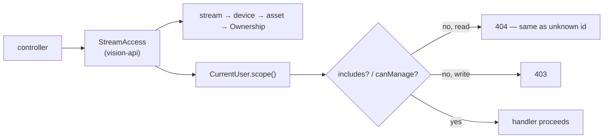

# LIVE-SCOPE — give the live-operations surface an authority model

**Branch** `feat/live-scope` (off master) · closes theme **T1** and the client half **T2** of
[PLATFORM-AUDIT-FINDINGS.md](../active/PLATFORM-AUDIT-FINDINGS.md) · lane evidence in
[PLATFORM-AUDIT-SCOPE.md](../active/PLATFORM-AUDIT-SCOPE.md) and [PLATFORM-AUDIT-UI.md](../active/PLATFORM-AUDIT-UI.md).

## 1. The problem in one paragraph

`VisibilityScope` is real, tested and applied at 80 of 124 endpoints — but only on the **management**
plane. The **live-operations** plane (streams, SSE, HLS, mediamtx) was built in a different wave and
never revisited, so a PILOT scoped to two assets can list, watch, snapshot and reconfigure any of the
fleet's streams, subscribe to any asset's telemetry, and pull any stream's video. There are **zero**
Spring Security role annotations in the repo; every authorization decision is hand-written application
code, so a missing check has no fallback — it is simply absent.

## 2. The frozen contract

**Chosen: (c) an explicit access collaborator per surface, called from the controller, plus a build-time
guard.** Rejected alternatives and why:

| Option | Verdict |
|---|---|
| (a) shared helper only | Doesn't survive: nothing forces a new controller to call it. The 29 holes regrow. |
| (b) `@PreAuthorize` / declarative roles | Authority here is **data-dependent** (who owns the asset behind this stream), not role-static, so every annotation would carry SpEL calling a bean anyway — the same code with worse types and no compile check. Would also pull Spring Security expressions toward context modules, breaking the Spring-only-in-app/api/adapters rule. |
| **(c) access collaborator + ArchUnit guard** | Matches the idiom already proven at 80 sites (`currentUser.scope()`, `canManage`, `canManageOrg`), keeps Spring at the edge, and the guard makes the *absence* of a check a build failure. |

### 2.1 The seam

A per-surface collaborator in `station/vision-api`, because the composition of contexts is vision-api's
job: `StreamService` (perception) knows `DeviceId`/`StreamId` and nothing about assets; the
device↔asset↔owner mapping lives in warehouse. Resolving one from the other in a context module would
add a context→context edge for an authorization concern that is not a domain concept.

> **Correction (W2, 2026-08-21).** §2.2 originally specified `canManage(ownership)` for stream writes.
> That is wrong: `VisibilityScope.canManage` returns `false` for **every** `ASSIGNED_ASSETS` scope
> (`VisibilityScope.java:202`), so it would have 403'd a PILOT starting their own assigned aircraft —
> contradicting this plan's own "a PILOT may still start+stop their own assigned asset" clause. Since
> `canManage` and `includes` agree for `UNBOUNDED` and `GROUPS`, `includes` is the only self-consistent
> gate, and all 8 stream handlers use it uniformly. The read/write split survives only where a
> genuinely org-level action exists (`SimulationController#simulate` → `canManageOrg()`).

**404-not-403 for invisible reads** is not a new idea here — `AssetController:285` already documents it
("an asset outside scope 404s exactly as an unknown id does"). Existence is itself information.

### 2.2 Authority per hole

| Surface | Requires | A PILOT may still |
|---|---|---|
| `GET /api/streams` | filter to visible | see their assigned assets' streams |
| stream config/tracks/detections/snapshot read | `includes(assetId, ownership)` | read their own |
| stream **start / stop / config write** | `includes(...)` — **corrected in W2**, see note | start+stop their own assigned asset |
| SSE `telemetry:<id>` / `detections:<id>` / **`geo:<id>`** | `includes(...)` **per topic, per delivery** | subscribe to their own |
| `PATCH /api/live/{connectionId}/topics` | caller owns the connection | change their own connection |
| `/hls/{streamId}/**` | `includes(...)` via signed path token | watch their own |
| device CRUD | `canManageOrg()` create/delete, `canManage()` edit | read their own devices |
| geofence CRUD | `canAdminister()` for **all** writes — **corrected in W5** | **read every zone** (see note) |

**Stop-authority is deliberately narrow here.** This plan makes stop *scoped*; it does **not** resolve
two authorized operators contending for one aircraft. That is `CREW-CONTROL-PLAN.md` §2.6/§4.5
(`AssignmentRole{PIC,OBSERVER}` + TTL control claim), which stays the owner of multi-operator arbitration.

> **Correction (W5, 2026-08-21).** §2.2 assumed geofence zones carry ownership. They do not —
> `GeofenceZone` has no asset, group or owner field, so every zone is the "global" case and all three
> writes take `canAdminister()` uniformly; a MANAGER's org authority does not extend to a boundary
> every group's aircraft must obey. `list` is deliberately left **open** rather than filtered: with
> nothing to filter on, filtering would be theater, and hiding a no-fly zone from a pilot would create
> the flight-safety hazard the endpoint exists to prevent.

## 3. Waves

Ordered so nothing is half-secured at a commit boundary. **W1 lands the guard first with today's 29
holes listed as `TEMPORARY_UNSCOPED`; every later wave deletes its own entries.** The allowlist shrinks
visibly, and at the end it holds only genuinely open-by-design endpoints.

| W | Goal | File scope | Proves it | Notes |
|---|---|---|---|---|
| **W1** | `@OpenByDesign(reason)` marker + ArchUnit rule: every `@RestController` handler either carries it or **calls** a `CurrentUser`/`*Access` method (ArchUnit `getMethodCallsFromSelf`, a real check, not a doc claim) | `vision-api` (annotation), `vision-app` (ArchUnit test) | rule fails when the marker and the call are both absent | allowlist seeded with the 29, each with a reason string |
| **W2** | `StreamAccess` + scope all 8 stream endpoints | `StreamController`, new `StreamAccess`, its test | test: PILOT gets 404 on a foreign stream, 200 on their own | needs device→asset→owner lookup |
| **W3** | SSE: bind connection→userId, per-topic authorization, replay path included | `LiveController`, `LiveUpdateRegistry`, tests | test: foreign `telemetry:<id>` never delivers; `Last-Event-ID` replay does not leak | scope re-resolved per topic-add, cached per connection with a TTL from `application.yaml` |
| **W4** | HLS + mediamtx: delegate mediamtx auth to the app (`authHTTPAddress`), drop `publish` from the anonymous user, credential the publisher | `HlsProxyController`, `mediamtx.yml`, `docker-compose.yml`, `video-output/publish-hls` | test: unauthenticated HLS 401; publish without creds refused | **highest blast radius — see §4** |
| **W5** | Device + geofence CRUD authority (controller **and** service) | `DeviceController`, `GeofenceController`, their services | test: PILOT cannot create/delete a device or a no-fly zone | service-layer check too — the audit found neither layer had one |
| **W6** | Re-align the 6 drifted SPA gates to server authority | `vision-web` (`models-facade.ts`, `dataset-detail-facade.ts`, 2 routes, rename form, role picker) | web tests; MANAGER no longer sees an enabled Promote | pure honesty fix |

Build per wave: `./mvnw -B -pl station/vision-api -am test` (W1–W5, plus `station/vision-app` for the
guard), `npm test` in `station/vision-web` (W6). Rollback is per-wave revert; no migration, no data change.

## 4. Operator-visible changes (support calls, ranked)

1. **W4 breaks every bookmarked HLS URL and every unauthenticated publisher.** Our own
   `adapter-publish-hls`, the TX simulators and any hand-rolled `ffmpeg` push must carry credentials
   from that commit on. This is the one wave that can take video down; it ships with the credential
   default and override path documented in `docker-compose.yml`.
2. **A PILOT loses the fleet-wide stream list** (they only ever should have seen their own).
3. **A PILOT may lose stop on a shared asset** — narrow by design until CREW-CONTROL lands.
4. **MANAGER's Promote button disappears** (W6) — it never worked; the server has refused it since
   OPS-UX wave C.

## 5. Out of scope — stated plainly

The other 21 unchecked endpoints outside the live surface (audit/activity/reports/training polls),
retention and the DB firehoses (T3), the missing `AssetUsage.pilot` and detection geo columns (T4),
crew/control-claim arbitration (CREW-CONTROL), and all interop work (T5). No secret rotation story
beyond a documented env override; no multi-tenant isolation beyond today's group tree.
