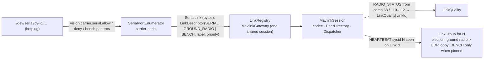

# Ground radio — the wire contract a USB radio dongle must meet

**Status:** contract frozen by LINK-PAIRING (waves L1/L3 shipped on `feat/link-pairing`); the Arduino +
nRF24 sketch itself (wave **R1**) is not written and is gated on the owner's bench measurements
(**A0**, `docs/plans/active/LINK-PAIRING-CONTEXT.md` §5.2). Anything that meets this contract — the
nRF24 dongle, a SiK/RFD900 modem, an ExpressLRS backpack in MAVLink mode, a bare USB cable to a
vehicle — is picked up by `drone-link/carrier-serial` without configuration beyond an allow pattern.

## What the station does with a serial port

| Config key | Meaning | Default |
|---|---|---|
| `vision.carrier.serial.enabled` | master switch | `false` |
| `vision.carrier.serial.poll-interval` | hotplug poll | `2s` |
| `vision.carrier.serial.default-baud-rate` | when no override matches | `57600` (SiK convention) |
| `vision.carrier.serial.allow` / `deny` | patterns on the port descriptor; deny wins | empty / empty |
| `vision.carrier.serial.baud-overrides` | descriptor pattern → baud (ELRS backpack serial is `460800`) | empty |
| `vision.carrier.serial.bench.patterns` | descriptors that are a bench cable: registered at priority 0, never auto-elected | empty |
| `vision.links.soft-timeout` / `hard-timeout` / `dwell-window` | election timing | `3s` / `10s` / `5s` |

Docker: the `serial` compose profile passes `/dev/serial/by-id` through (`docker compose --profile serial
up vision-app-serial --scale vision-app=0`).

## The contract, from the dongle's side (SiK-shaped)

1. **USB CDC serial, MAVLink 2 both directions, transparent.** Whatever the vehicle sends arrives as-is;
   whatever the station sends leaves as-is. The dongle parses MAVLink only to the extent it needs for
   fragmentation on the air side; it never rewrites sysid/compid/seq.
2. **`RADIO_STATUS` (#109) at ~1 Hz from the dongle itself**, source system = the station's (255) or the
   dongle's own, source component `MAV_COMP_ID_TELEMETRY_RADIO` (68) — or 110/111/112
   (`MAV_COMP_ID_RADIO`, `RADIO2`, `RADIO3`) when several dongles are plugged in. Fields: `rssi`,
   `remrssi`, `noise`, `remnoise`, `rxerrors`, `fixed`, `txbuf` — the station keys them by the link they
   arrived on, so two dongles never mix.
3. **A hello on connect and on request:** `AUTOPILOT_VERSION`-style identity is wrong for a radio; use
   the **parameter protocol on the radio component** — `PARAM_REQUEST_LIST` to comp 68 answers at least
   `RADIO_ID` (persistent id from EEPROM, because CH340 clones have no USB serial number),
   `FW_VERSION`, `AIR_PROTO` (0 = MAVLink-over-air with fragment header, 1 = compact native, per A0),
   `BIND_COUNT`. `PARAM_SET` on the same component is how the station pushes a bind record
   (`BIND_n_ADDR`, `BIND_n_HOP`, `BIND_n_SYSID`) — dongles are stateless modems: a lost dongle is
   replaced by plugging another one in and letting the station re-push.
4. **Air side is the dongle's business.** The vehicle is the nRF24 PRX (MultiCeiver, up to 6 dongles);
   each dongle is a PTX addressing one vehicle per packet, so one dongle time-slices several vehicles.
   Bind = a fixed bind address known to firmware, then a random operating address + hop table pushed at
   pairing and persisted both sides; telemetry rides the ack payload. Which framing goes on the air is
   decided by A0 (`LINK-PAIRING-CONTEXT.md` §5.2): MAVLink 2 with a 1-byte fragment header if an
   8-channel `RC_CHANNELS_OVERRIDE` loop holds ≥ 20 Hz with p95 < 60 ms under Wi-Fi load; compact
   native control frames otherwise.
5. **No secrets on the dongle.** Authorization (wave S, MAVLink 2 signing) is done by the station; the
   dongle carries only radio binds.

## Bench before building (A0)

1. Genuine-silicon auto-ack across every nRF24 pair the owner owns (SI24R1 clones invert the ACK bit).
2. Sustained 8-channel loop rate and jitter at 250 kbps under a neighbouring Wi-Fi load, PA+LNA modules
   with a dedicated ≥ 250 mA 3.3 V regulator and 10–100 µF at the module.
3. Walk-away range on channels that avoid Wi-Fi 1/6/11, line-of-sight and through one obstruction.

Sources and numbers: `docs/conclusions/link-research/04-nrf24-ground-radio.md`.
