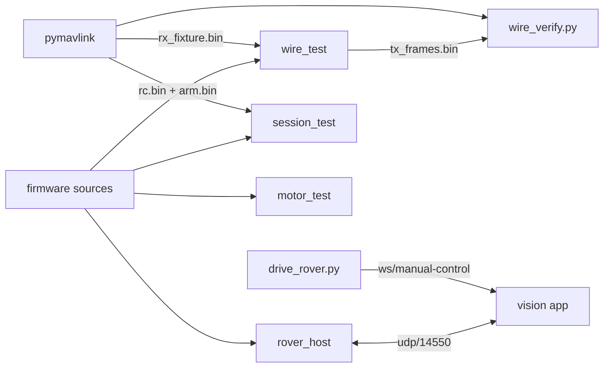

# rover-sim — the ESP32 rover firmware, running on your laptop

Runs the **actual** [`ardupoilot-start`](#where-the-firmware-lives) sketch as a host process, so
the whole add-an-asset-and-drive-it flow can be exercised without an ESP32, a battery, or a
chassis. Everything below the motor pins is the unmodified firmware — the same
`MavlinkUdpLink`, the same `MavlinkV2Codec`, the same `VehicleController`. Only two things are
replaced:

| Shimmed | Why |
|---|---|
| `Arduino.h` | the firmware uses exactly one core function, `millis()` |
| `WiFiUDP` | swapped for a POSIX UDP socket (`shim/`) or an in-memory capture socket (`shim-capture/`) |
| `IMotorDriver` | a bench driver that records the demand and spins nothing |

Because the transport is real, the platform cannot tell this apart from the board: discovery
names it `ArduPilot rover (sysid 1)`, the readiness matrix fills in, and manual control drives it.

## Quick start

```bash
make                      # build all four binaries
make check                # all three regression tests: wire format + session + motors
make run HOST=127.0.0.1   # transmit to a vision instance
```

`make run` binds `14551` locally and pushes to `HOST:14550`, so it can share a machine with the
platform (which binds `14550` itself). On real hardware both are `14550`; see `Config.cpp`.

## What each piece checks



* **`make wire`** is the regression test for the codec and the seven payload builders. pymavlink
  builds the frames the platform would send, `wire_test` feeds them through the real parser, and
  every byte the firmware transmits goes back to pymavlink with `robust_parsing=False` — so a CRC
  slip, a wrong CRC_EXTRA seed, or a field at the wrong offset fails the run rather than being
  skipped. It needs no network and no vision instance.
* **`make motors`** is the regression test for the *bridge driver*, and the only one here whose
  bug burns hardware rather than failing a request. It compiles `HBridgeMotorDriver.cpp` for the
  host against a shimmed LEDC that records duty per pin, then asserts on those recorded writes
  rather than on the driver's own bookkeeping: no reversal may ever leave both inputs of a leg
  energised, and every direction change must hold both low for `drive.reversalDeadTimeMs`.

  It exists because the rover's L298N failed on 2026-08-23 — throttle leg dead, steering leg
  oscillating and hot, which is shoot-through. The old `driveAxis()` zeroed one input and
  energised the other in the same call, which reads as safe but is not: a bipolar bridge holds
  stored charge for microseconds after its input goes low. With the dead-time removed this test
  drops the measured gap from 80 ms to 20 ms and three checks fail, so it is not vacuous.

* **`make session`** is the regression test for the *arm watchdog*, which only means anything
  across a whole session, so this replays one: arm cold with no stream, drive, let the stream
  stall, then arm again. The rule it pins down is that the stream watchdog measures against a
  control session that is **open** — once a session ends, deliberately (`3x RELEASE`) or by
  stalling, a later arm has no stream to be late against and must hold. Both historical failures
  live in here: an arm cancelling itself 500 ms later because a one-shot `COMMAND_LONG` fed the
  continuous-stream clock, and an arm-after-driving oscillating `failsafe cleared`/`FAILSAFE`
  every tick because the ended session was still being measured against.
* **`make run`** is the live rover. Point a vision instance at it and add it as an asset.
* **`drive_rover.py <assetId> [port]`** engages `/ws/manual-control` and holds the sticks for six
  seconds, so `rover_host`'s stdout should print the demand it received. It also prints the control
  profile the server chose — for this rover that must read `ROVER` / `Ground vehicle` with only
  `Steering/CH1` and `Throttle/CH3` bound, both `CENTERED`. Anything else (in particular the
  `UNKNOWN` profile) means the platform did not recognise the heartbeat's `MAV_TYPE`, and the
  throttle will rest at half travel instead of at stop.

## Driving it from the browser

No transmitter needed: open the cockpit's **Controller** drawer, leave the input source on
**On-screen**, and take control. The pads are built from the same engage frame `drive_rover.py`
prints, so a rover shows exactly one steer/drive pad reading 50 at stop — see
[`docs/plans/active/VEHICLE-CONTROL-PROFILES-CONTEXT.md`](../../docs/plans/active/VEHICLE-CONTROL-PROFILES-CONTEXT.md).

## Driving it end to end

```bash
make run &                                        # the rover starts transmitting
curl -X POST localhost:8080/api/devices/probe \
  -H 'Content-Type: application/json' \
  -d '{"protocol":"mavlink","uri":"udp://0.0.0.0:14550"}'
```

Adding the asset is the ordinary wizard flow (`mavlink`, `udp://0.0.0.0:14550`, option
`sysid=1`). **Today the asset also needs a video-capable device before it can be flown** — a
telemetry-only asset cannot open a session, so it never subscribes telemetry and is therefore not
commandable. Pair it with a `sim`/`sim://demo` device until that gap is closed; see
[`docs/plans/active/TELEMETRY-ONLY-ONBOARDING-CONTEXT.md`](../../docs/plans/active/TELEMETRY-ONLY-ONBOARDING-CONTEXT.md)
§5.

## Where the firmware lives

Outside this repo, in the Arduino sketchbook: `~/Arduino/ardupoilot-start`. Override with
`make FIRMWARE=/path/to/sketch`. Nothing here is copied from it — the Makefile compiles the
sketch's own `.cpp` files, so this harness cannot drift from what gets flashed.

## Prerequisites

* a C++23 host compiler (`g++`)
* `pymavlink`, for `make wire` only — auto-detected from `cv/cv-service/.venv`, or pass
  `PYTHON=/path/to/python`
* `websocket-client`, for `drive_rover.py` only
