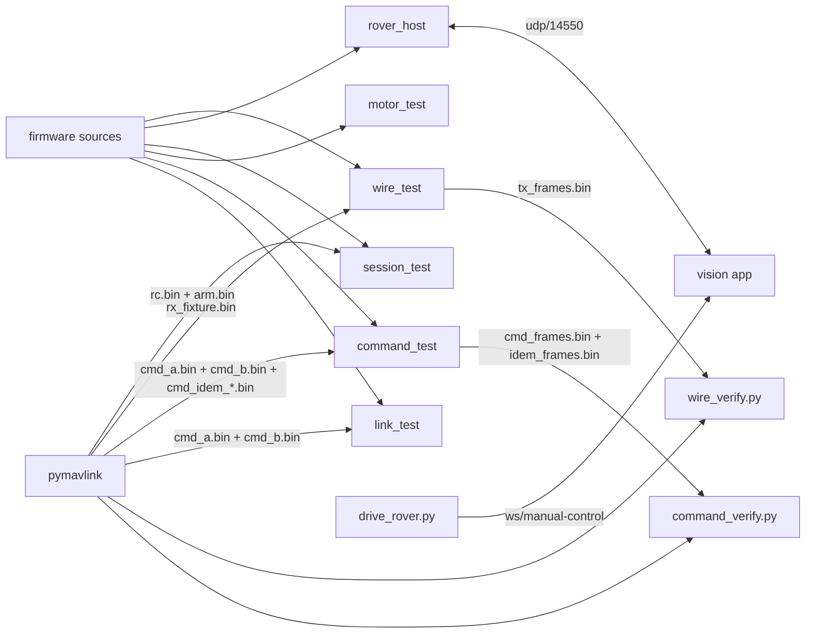

# rover-sim — the ESP32 rover firmware, running on your laptop

Runs the **actual** [`ardupoilot-start`](#where-the-firmware-lives) sketch as a host process, so
the whole add-an-asset-and-drive-it flow can be exercised without an ESP32, a battery, or a
chassis. Everything below the motor pins is the unmodified firmware — the same
`MavlinkUdpLink`, the same `MavlinkV2Codec`, the same `VehicleController`. Only three things are
replaced:

| Shimmed | Why |
|---|---|
| `Arduino.h` | `millis()`, plus `pinMode()`/`digitalWrite()` and LEDC (`ledcAttach`/`ledcWrite`) for the TB6612FNG's direction/STBY pins and PWM |
| `WiFiUDP` | swapped for a POSIX UDP socket (`shim/`) or an in-memory capture socket (`shim-capture/`) |
| `IMotorDriver` | a bench driver that records the demand and spins nothing -- used by `rover_host` and `session_test`. `motor_test` is the one exception: it compiles the real `Tb6612MotorDriver.cpp` for the host and asserts on the GPIO/LEDC writes the shim recorded, not on a fake |

Because the transport is real, the platform cannot tell this apart from the board: discovery
names it `ArduPilot rover (sysid 1)`, the readiness matrix fills in, and manual control drives it.

## Quick start

```bash
make                      # build all six binaries
make check                # all five regression suites: wire + session + motors + commands + link
make run HOST=127.0.0.1   # transmit to a vision instance
```

`make run` binds `14551` locally and pushes to `HOST:14550`, so it can share a machine with the
platform (which binds `14550` itself). On real hardware both are `14550`; see `Config.cpp`.

## What each piece checks



* **`make wire`** is the regression test for the codec and the seven payload builders. pymavlink
  builds the frames the platform would send, `wire_test` feeds them through the real parser, and
  every byte the firmware transmits goes back to pymavlink with `robust_parsing=False` — so a CRC
  slip, a wrong CRC_EXTRA seed, or a field at the wrong offset fails the run rather than being
  skipped. It needs no network and no vision instance.
* **`make motors`** is the regression test for the *bridge driver*, and the only one here whose
  bug burns hardware rather than failing a request. It compiles the real `Tb6612MotorDriver.cpp`
  for the host against a shimmed GPIO/LEDC that records every pin write, then asserts on those
  recorded writes rather than on the driver's own bookkeeping. Both channels are bare TB6612FNG
  outputs running the same state machine — `Idle -> Settling -> Driving -> Braking -> Coasting ->
  DeadTime -> Idle` — there is no ESC hiding the reversal problem on the throttle side any more.

  It exists because the rover's L298N failed on 2026-08-23 — throttle leg dead, steering leg
  oscillating and hot, which is shoot-through. The old `driveAxis()` zeroed one input and
  energised the other in the same call, which reads as safe but is not: a bipolar bridge holds
  stored charge for microseconds after its input goes low.

  It covers **two** hazards, because a reversal has two. Both inputs of a leg must be low for
  `reversalDeadTimeMs` (the electrical gap, protecting the bridge from itself), *and* the output
  must sit at zero for `reversalCoastMs + |speed| * reversalCoastPerUnitMs` before the opposite
  direction is energised (the mechanical gap, protecting the bridge from a still-spinning
  armature whose back-EMF would add to the supply). It measures a full-speed reversal against a
  crawl (the coast must be speed-scaled, not fixed — a fixed delay sized for full speed would make
  a crawl feel dead), that the acceleration/deceleration ramps are asymmetric (current into a
  stalled armature is the expensive direction), abandoning a reversal mid-coast (must resume at
  once, not serve the wait), `stop()` landing inside an already-running coast (must not extend
  it), and that sweeping the stick through centre in a single control tick gets the same gap as
  holding it there. It also pins the definition of "zero": a direction pin may sit HIGH with PWM 0
  only for the one-tick `Settling` preamble before the PWM comes up (plus the one further tick
  that preamble's own exit is observed on — a quirk of the state machine flipping state one tick
  before it writes the pins for the new state) — never as a way of representing rest, which is
  IN1=IN2=LOW.

  Every threshold above is read from `cfg.drive.*` rather than hardcoded, so the checks hold
  whatever the live tuning is — `startSettleMs`/`reversalDeadTimeMs`/`reversalCoastMs` included,
  which have moved during development and are not this harness's to pin down.

* **`make session`** is the regression test for the *arm watchdog*, which only means anything
  across a whole session, so this replays one: arm cold with no stream, drive, let the stream
  stall, then arm again. The rule it pins down is that the stream watchdog measures against a
  control session that is **open** — once a session ends, deliberately (`3x RELEASE`) or by
  stalling, a later arm has no stream to be late against and must hold. Both historical failures
  live in here: an arm cancelling itself 500 ms later because a one-shot `COMMAND_LONG` fed the
  continuous-stream clock, and an arm-after-driving oscillating `failsafe cleared`/`FAILSAFE`
  every tick because the ended session was still being measured against.
* **`make commands`** is the regression test for everything the app can **ask for**, as opposed
  to everything the rover pushes: the parameter protocol (`PARAM_REQUEST_READ` / `_LIST` /
  `PARAM_SET`), `REQUEST_MESSAGE`, `SET_MESSAGE_INTERVAL`, `DO_AUX_FUNCTION`, and the mode table.
  pymavlink builds two fixtures — one against a cold link, one after telemetry exists — and
  decodes every reply, so a wrong `MAV_PARAM_TYPE` or a capability bit claiming something the
  rover cannot do fails the run. It found exactly those two bugs when it was written.

  The parameter count is piped from the test's own log into the verifier, so a table that grows
  cannot quietly stop being checked end to end.

  It also covers command **idempotency** (plan `MAVLINK-COMMANDS-PLAN.md` D2a): the platform may
  retry an absolute-state command up to twice, so the firmware has to see the same
  `COMPONENT_ARM_DISARM` or `DO_SET_MODE` `COMMAND_LONG` up to three times, at a rising
  `confirmation` (0, 1, 2), for one operator intent. Every attempt must still get its own
  `COMMAND_ACK`, but the state change must happen once — three ARM attempts producing three
  `"armed"` `STATUSTEXT` notices would mean the retry budget silently triples every side effect
  instead of just covering a lost packet. Each attempt is fed as its own datagram/poll cycle
  (`cmd_idem_arm{0,1,2}.bin`, `cmd_idem_mode{0,1,2}.bin`), not batched into one, so the test
  observes what the link does with each individual retry.
* **`make link`** is the regression test for *reply addressing and transmit recovery*, reusing
  `command_fixture.py`'s frames rather than minting its own — any valid inbound frame provokes a
  reply, and a reply is all this suite needs. It checks that the rover transmits first to the
  configured host before the app has ever answered, that replies once the app has spoken go to
  wherever the command actually arrived from rather than to a compile-time constant, that a peer
  which moves is followed, that an unattributable datagram does not unlearn a peer that was
  already known, and that a transmit path failing for a sustained run is recovered (socket rebind,
  then one radio re-association — not one per failed send) without tearing the session down or
  narrating every single failure.
* **`make run`** is the live rover. Point a vision instance at it and add it as an asset.
* **`drive_rover.py <assetId> [port]`** engages `/ws/manual-control` and holds the sticks for six
  seconds, so `rover_host`'s stdout should print the demand it received. It also prints the control
  profile the server chose — for this rover that must read `ROVER` / `Ground vehicle` with only
  `Steering/CH1` and `Throttle/CH3` bound, both `CENTERED`. Anything else (in particular the
  `UNKNOWN` profile) means the platform did not recognise the heartbeat's `MAV_TYPE`, and the
  throttle will rest at half travel instead of at stop.

## Driving it from the browser

No transmitter needed: open the cockpit's **Controller** drawer, leave the input source on
**On-screen**, and take control. The pads are built from the same engage frame `drive_rover.py`
prints, so a rover shows exactly one steer/drive pad reading 50 at stop — see
[`docs/plans/active/VEHICLE-CONTROL-PROFILES-CONTEXT.md`](../../docs/plans/active/VEHICLE-CONTROL-PROFILES-CONTEXT.md).

## Driving it end to end

```bash
make run &                                        # the rover starts transmitting
curl -X POST localhost:8080/api/devices/probe \
  -H 'Content-Type: application/json' \
  -d '{"protocol":"mavlink","uri":"udp://0.0.0.0:14550"}'
```

Adding the asset is the ordinary wizard flow (`mavlink`, `udp://0.0.0.0:14550`, option
`sysid=1`). **Today the asset also needs a video-capable device before it can be flown** — a
telemetry-only asset cannot open a session, so it never subscribes telemetry and is therefore not
commandable. Pair it with a `sim`/`sim://demo` device until that gap is closed; see
[`docs/plans/active/TELEMETRY-ONLY-ONBOARDING-CONTEXT.md`](../../docs/plans/active/TELEMETRY-ONLY-ONBOARDING-CONTEXT.md)
§5.

## Where the firmware lives

Outside this repo, in the Arduino sketchbook: `~/Arduino/ardupoilot-start`. Override with
`make FIRMWARE=/path/to/sketch`. Nothing here is copied from it — the Makefile compiles the
sketch's own `.cpp` files, so this harness cannot drift from what gets flashed.

## Prerequisites

* a C++23 host compiler (`g++`)
* `pymavlink`, for `make wire`, `make session`, `make commands` and `make link` — auto-detected
  from `cv/cv-service/.venv`, or pass `PYTHON=/path/to/python`
* `websocket-client`, for `drive_rover.py` only
